# SAS 中使用样条、偏最小二乘法、惩罚、交叉验证和模型平均的预测回归

> 原文：<https://blog.devgenius.io/predictive-regression-using-splines-partial-least-squares-penalization-cross-validation-and-339b74a7e108?source=collection_archive---------0----------------------->

L 线性模型，广义线性模型&混合模型都是模型。他们都试图用数据来描述一个真实的现象或过程，方法是确定该过程中每个单独部分的特定角色。统计模型是由参数和随机成分组成的模型，用于:

1.  描述我们观察到的情况
2.  解释为什么我们观察到了我们观察到的现象

你的工作是建立一个尽可能简单的模型，但仍然能够描述这个世界，因此你创建的每个(统计)模型都有两个目的:

1.  拟合模型来解释数据
2.  使用拟合的模型来预测看不见的情况

尽管这两个目的共存于一个模型中，但是如果您希望其中一个目的高于另一个目的，那么您应该使用不同的模型。例如，回归模型不一定要有可靠的外部有效性，预测模型不一定要有可靠的内部有效性。

最广为人知、经常使用且仍非常适用的模型是线性回归，它由截距、参数和误差或随机噪声组成。线性回归的目的是找到最适合数据的直线，以提供预测值ŷ.

响应=截距+参数*预测值+误差

使用最大似然法，寻找“最佳”线路的努力是一个迭代过程。

也许另一个最广为人知的统计程序是 ANOVA，它是一个比较工具。

方差分析与回归。在方差分析中，你主要是比较观察到的数据。在线性回归中，您构建了一个模型来导出可能用于新数据的函数。当然，这两种方法的区分不是非黑即白的。

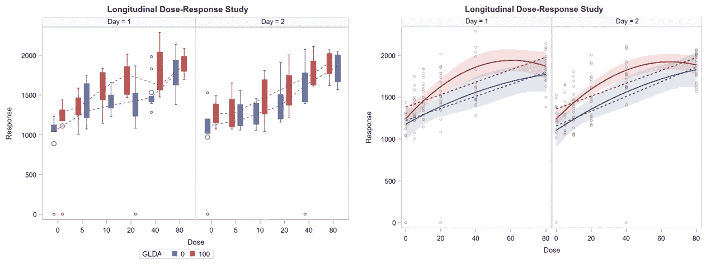

左边是 ANOVA 比较，右边是回归。使用相同的数据。

在下面的例子中，我将使用线性回归来找出体重、淀粉、蛋白质和天数之间关系的最佳解释。这些分析很容易进行。

我使用 PROC MIXED 和 PROC PLM 来拟合线性回归，并为我提供图形输出来评估我制作的模型的拟合度。

BW = 4.8514 +日* 0.5728/BW _ 30 = 4.8514+30 * 0.5728→**22**

估算同一天不同蛋白质组分 BW 的公式。

线性回归可以很容易地完成，但需要在方差分析中采用一些变通方法——这几乎不值得，因为这两个过程共享一个共同的统计基础——就是为变量添加幂函数。最著名的是多项式——日、日、日等等。下面，你会看到一些例子和它们的结果。

日的幂函数——日复一日，日复一日。

现在，我发现了下面这张图片，我认为它充分描述了制作预测模型的最大问题之一，我将在这篇文章中花相当多的时间来讨论它。过度拟合的问题。

过度拟合的模型。

过度拟合意味着模型建立的函数过于接近手头的数据，失去了外部有效性。因此，它如此相信它所训练的数据，以至于新数据会导致虚假的结果。对一个模型来说，新数据就像文化冲击。让我们举个例子。

模型符合数据。

扩展数据的模型。不是你真正想看到的，但是对于统计模型来说外推是困难的。

因此，需要为回归(解释)或预测目的建立模型。为两者建立一个模型意味着妥协，这是大多数时候发生的事情。一个回归模型不是为预测而构建的，而是以任何方式使用的，当你将它扩展到它的边界之外时，它将很容易遇到问题。

当分析响应(y)和解释变量(x)之间的关系时，很明显，对于 x 的不同范围，出现不同的线性关系。在这些情况下，单一线性模型可能无法提供充分的描述，非线性模型也可能不合适。分段线性回归(折线样条)是一种回归形式，允许**多个线性模型**拟合不同 x 范围的数据

一条分段回归线，由在断点 c 处分开的两个公式组成。

**断点**是线性函数斜率变化处的 x 值。在分析之前，断点的值可能是或**可能是未知的**。最佳切割点可以通过参数变化 c 找到，以找到给出最低残差平方和的值。下面你会看到一个覆盖多个断点的回归线的例子。

安西娅、我、H.H .斯坦、M.R .墨菲和 J.K .德拉克利。2019.技术说明:在断奶前小牛中建立回肠插管技术，并使用分段回归方法评估对回肠食糜生长和 pH 波动的影响。乳品科学杂志。102:11061–11066.doi:10.3168/jds . 2019–16788。

BW = [b1 ×最大值(0，年龄 c1)] + [a0 + (b2 ) ×最小值(年龄 c2)]

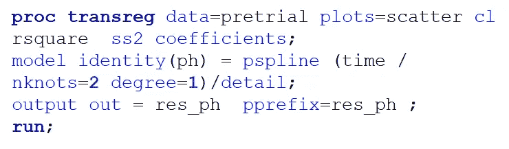

使用 **PROC TRANSREG** 进行分段回归，这真的很简单。这里，一个有两个节点的 pb 样条被调用。

并且提供了具有两个结的分段回归。因为指定了 degree=1，所以曲线是线性的。

两个节——一个在五点，一个在九点。

使用 PROC NLMIXED 也可以更自由地对上述内容进行建模。在这里，您可以看到 pH 的多个部分被建模并通过+符号连接起来。

同上，除了曲线是平滑的-这不是因为 NLMIXED，而是因为要求用惩罚 b 样条拟合数据。

为了比较治疗方法，通常使用虚拟变量。这些虚拟变量只不过是标识符——对于 2 级因子，您需要一个包含两个级别(0 & 1)的虚拟变量。在 PROC NLMIXED 中，这就变成:*参数+(虚拟*测试变量)*。

在这里，虚拟是治疗，在周实施。

现在我们建立曲线模型，每种治疗一条曲线。

控件的公式。

治疗的配方。

以及整个模型的完整代码行。

和治疗组的结果。

正如你所看到的，分段回归是完全可定制的，PROC NLMIXED 可能是 SAS 中最强大的建模过程。然而，SAS 有一些内置的程序，可以以更简单的方式适应更高级的算法，比如 MARS，我将在下面讨论。

多元自适应回归样条(MARS)是 Jerome H. Friedman 在 1991 年提出的一种回归分析形式。该方法是一种结合回归样条和模型选择方法的非参数回归技术。[**PROC adapter eg**](https://documentation.sas.com/doc/en/pgmsascdc/9.4_3.4/statug/statug_odsgraph_sect109.htm)**适合 MARS，支持带分类变量的模型，并提供提高建模速度的选项。它首先用快速更新算法创建一个过拟合模型；然后用反向选择技术修剪它。简而言之，PROC ADAPTIVEREG:**

1.  **支持**分类**变量和排序选项**
2.  **使您能够在最终模型中**强制效果**或在**线性**形式中限制变量**
3.  **支持响应变量分布在**指数**族中的数据**
4.  **支持将**数据划分为**培训、验证和测试角色**
5.  **提供留一和 **K 倍交叉验证****
6.  **生成包含预测值和残差的输出数据集**
7.  **产生一个输出数据集，包含已形成的**基函数**的设计矩阵**
8.  **支持多个分数语句**

**下面你会看到一个 NIR 饲料数据库的概要，它将被用来显示**PROC adapter eg**是如何工作的。**

********

**在这里，您可以看到在**PROC adapter eg**中使用的代码。一般来说，你只需要指定预测值、节点数以及模型是加法还是乘法。自动使用交叉验证等方法。**

******

Fit 统计数据、控制数据和观察值的读取和使用数量。在左边的表格中，训练、验证和测试的平均平方误差的变化是最重要的，因为这些是过度拟合的明显暗示。** ******

在初始设置中拟合样条线，然后修剪会导致变量被包括在内，并且曲线在几个节点处被分割。** ********

**这里你可以看到逆向选择正在进行。左侧提供了可变重要性表。**

****

**不回头，虽然残差远非正常。然而，它们看起来确实有些相似，这让我更感兴趣。**

****

**以及每个变量的结。**

****

**另一个没有最大基的模型。随机交叉验证和测试与验证分别设置为 20%和 10%。**

************

**另一个具有不同结果的模型，显示了模型的拟合和样条的构成。**

**下面，您会看到不同的代码，其中从外部包含了一个验证集。您也可以对测试集进行同样的操作。一般来说，这比内部验证更强。还要注意，您仍然需要指定验证集和测试集的使用容量(%)。**

************

**和组件**

**这只是对火星模型和样条函数的一个小小的介绍，但是它们应该显示出它们是多么容易以一种强大的方式应用。样条的真正优势在于，它们试图以非线性方式寻找变量的线性组合，这种组合最适合模型，而不会过度拟合。不利的一面是，样条往往会失去一些解释能力，这可以通过绘制它们所做的事情来部分恢复。**

**让我们继续偏最小二乘法。**

**T 何[**PROC PLS**](https://documentation.sas.com/doc/en/pgmsascdc/9.4_3.4/statug/statug_pls_syntax01.htm) 过程通过使用多种线性预测方法中的任何一种来拟合模型，包括[偏最小二乘法(PLS)](https://medium.com/@marc.jacobs012/partial-least-squares-in-r-extending-towards-a-hosted-api-via-plumber-and-docker-7c445b9fa382) 。在 PLS 程序中实施的技术具有额外的目标，即考虑到预测值的变化，假设当预测值高度相关时，充分采样的预测值空间中的方向应该为*新*观察值提供更好的预测。**

**PLS 与另一种专门分解数据的算法，即主成分(PC)高度相关。事实上，PC 是 PLS 回归的一个组成部分。**

**PLS 的真正优势是它的多元程序。您可以包括尽可能多的结果，甚至导致样本量(N)小于预测数(P)的情况。分解的自然使这成为可能。在这样的模型中，互相关实际上不是缺点，而是建模过程中的优点。因此，任何时候你有来自多元正态分布的数据，考虑 PLS。**

************

**SAS 中 PLS 程序的一个例子。你可以用 PLS 做很多事情。在这里，一个单一的结果是符合众多潜在的预测因素。交叉验证方法使用的是留一法，这意味着模型被改装 N-1 次。**

********

**左边的图显示了 PLS 模型的双重目的——解释数据和预测数据。在右边，您可以看到交叉验证在工作，选择用于最终模型的因子数量，以获得最大的解释/预测比率。如果愿意的话，PLS 算法可以被改变以获得最大的可解释性或预测性。**

****

**带有基准水平线的可变重要性图。**

****

**预测器或响应模型的有影响的观察值。**

****

**和响应模型的组合图中的有影响的观察值。**

****

**左边是模型中的参数，右边是校准图。**

********

**预测残差图**

****

**预测残差图**

**总之，PLS 模型是分析具有许多交叉相关变量的大型数据集的一种重要但可靠的方法。互相关水平必须被视为一种资产，而不是一种限制。**

**现在，让我们进一步讨论另一个专门为创建预测模型而设计的过程。**

**T 他的部分将处理 SAS 已经提供的最先进的预测程序，[PROC glm select，这是一个关于模型选择的发电站。这并不意味着它的一部分不能在其他程序中找到，如线性或逻辑回归。在这里，我们将深入探讨与以下相关的主题:](https://documentation.sas.com/doc/en/pgmsascdc/9.4_3.4/statug/statug_glmselect_toc.htm)**

1.  **过度拟合**
2.  **型号选择**
3.  **模型评估**
4.  **模型评分**

**如果您想从大量预测值中建立一个预测模型， **PROC GLMSELECT** 程序是您可以在 SAS/STAT 中使用的最高级程序。 **PROC GLMSELECT** 在一般线性模型的框架内执行高级模型选择。但是，您只能选择服从正态分布的变量。 **GLMSELECT** 程序通过提供多种选择和停止标准，包括基于显著性水平和基于有效性的标准，为定制模型选择提供了广泛的能力。然而，它不像 **MIXED** 和 **GLIMMIX** 那样包含随机效果。话说回来， **MIXED** 和 **GLIMMIX** 不能做自动选型。不幸的是，你永远不可能拥有一切。**

****PROC GLMSELECT** 与 **PROC REG** 和 **PROC GLM 最接近。****

1.  **PROC REG 支持多种模型选择方法，但不提供 CLASS 语句。**
2.  ****PROC GLM** 提供了类语句，但没有提供模型选择方法。**
3.  **PROC GLMSELECT 填补了这一空白。**

**预测模型是非常善变的算法。首先，它们往往通过使用许多变量表现得很好，但在新数据上表现得很糟糕**(过度拟合)**。第二，像所有模型一样，它们没有考虑生物学。经验预测模型看**偏差**、**方差**、**(交叉)-相关性**。因此，很容易滥用它们的能力，最终导致无法解释的垃圾，无法很好地预测。**

**下面我将带你使用 SAS Studio 完成 PROC GLMSELECT 的点击式版本。这将自动创建代码，我稍后将解开。**

****

**输入单个结果和多个预测因子的屏幕。**

******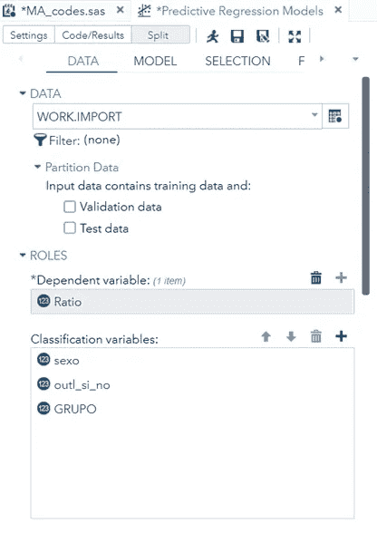******

**您可以添加分类和连续变量，并指定使用哪种类型的变量选择方法。我将在后面讨论这些。**

********

**如你所见，为一个预测非常糟糕的模型创建一大段代码并不困难。**

**前面的代码源自使用 **PROC GLMSELECT** 方法，没有经过太多思考:**

1.  **选择结果变量**
2.  **选择所有可能的解释变量**
3.  **使用非常复杂的选择方法**

**从情节和代码中可以看出，模型很容易制作，但结果却毫无用处。**

***权力越大，责任越大***

**所以，在你开始建模之前，开始绘制数据，看看你在处理什么。这应该是显而易见的，但是现在很容易忘记。不同类型的图的例子可以在下面看到。**

**************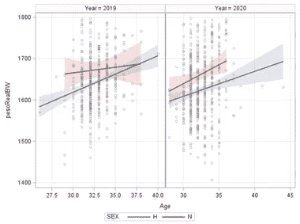****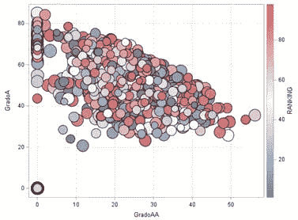******************************************

**表格也不可低估——它们可以让您非常清楚地了解异常情况，例如大量缺失或异常值。**

****

**SAS 选项来表征数据。**

****

**用于汇总统计的 SAS 选项。**

****

**描述缺失数据的 SAS 选项。**

****

**SAS 选项用于标准化数据**

**那么，如果将这一过程的一部分应用于一个新的数据集，观察不同胎次奶牛的产奶量和产奶量的潜在预测因素，会怎么样呢？下面你可以看到一些样条图和交叉相关图，以寻找模式，并获得一些数据的感觉。**

********

**通过关联绘制和分析数据**

**接下来是一个 MARS 模型，使用 **PROC ADAPTIVEREG** 来观察两个潜在的预测器在样条模型中的表现。**

************

**对于曲线结果的两个预测者来说，这是一个不错的结果。**

****

**当然，我们需要一种不同的平价拟合，尽管这种差异会随着时间的推移而缩小。**

********

**让我们尝试一个具有多个连续预测值的新模型。在左边，你可以清楚地看到断点。**

********

**在左侧和右侧，您可以看到等高线图试图使用样条来辨别两个或多个变量之间的关系。**

**现在，使用火星模型作为预模型，让我们开始在模型中添加额外的因素。通过点击，这很容易做到，但我们只是为了可视化的目的展示它。**

****

**选择预测值和多项式、交叉或嵌套因子的设置。**

****

**选择模型选择算法。**

******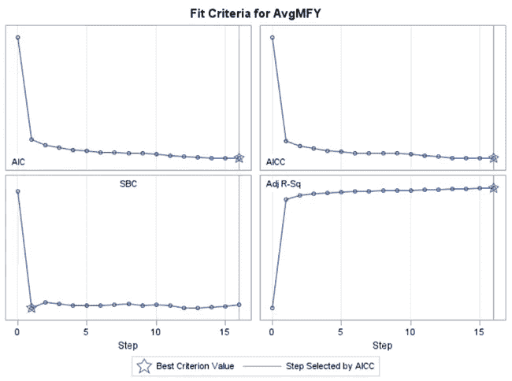**

**结果通过逐步选择。通过 AICC 选择的步骤。**

********

**模型参数和校准图。没那么糟。**

********

**不同的结果不同的选择方法。**

********

**预测相当不错。儿戏。**

**使用今天的软件，建立一个预测模型是极其容易的。因此，很容易构建一个不能在培训部分之外使用的模型。和往常一样，先看看生物学和图，然后描述、总结和描述(缺失的)数据。使用回归模型和某种形式的选择方法作为第一个指征是可以的，但这只是第一步**

**L ets 继续讨论建模中最重要的话题之一:过度拟合。这些名字与它所暗示的完全相关，这是一个好得令人难以置信的模型，并且在它被训练的环境中表现得非常好。一旦释放到野外，它往往会失败，这是一个自然的结果，当一个模型如此努力地模拟噪音，而不仅仅是信号。**

**下面是一些例子。**

********

**只要看看包含的预测因子的数量就知道了。难怪 R 几乎等于 1。如果这事发生在你身上，不要高兴，但要警惕。**

****

**你不会想看到这个的。**

************

**误用模型的一个很好的例子，模型只是拟合噪声，而不是寻找信号。**

**当应用于新数据时，过度拟合会导致较差的预测性能，因为它们模拟了噪声。这在训练数据集中看不到，但在验证和测试数据集中非常明显。在这一部分，我将更多地谈论**训练**、**验证**和**测试**集合的实际含义以及它们为什么重要。我们还将深入探讨**交叉验证**，这是一种特殊类型的内部验证。**

**正如您在下面看到的，数据集可以拆分为训练和测试数据集。事实上，它经常在培训、验证和测试中被拆分。现在，你可以做一次，也可以做多次。这就是交叉验证的用武之地。作为一种非常好的内部验证技术，交叉验证多次重用数据，其中不同的部分用于训练和验证。测试集是保留集，只使用一次。**

****

**培训/测试分割和培训/验证/测试分割的交叉验证。**

**培训/验证/测试没有固定的划分，尽管一个可行的选项可能是 60/20/20。**

****训练数据** *(原始数据的 60%)***

*   **用于查找参数估计值。**
*   **也可用于选择效果、停止选择和选择最终模型。**

****验证数据** *(原始数据的 20%)***

*   **在选择过程中发挥作用。**
*   **常用于交叉验证。**

****测试数据** *(原始数据的 20%)***

*   **用于评估模型在选择过程中的预测性能。**
*   **对训练模型没有作用。纯粹验证。**

**训练集、验证集和测试集有助于掌握手头的数据集。然而，所有这三种方法都是**内部验证**的一部分，这意味着你仍然没有包括新的外部机制。因此，要真正了解您的模型是否具有良好的预测性能，您需要一个外部数据集。这往往会导致非常令人失望的结果。**

**一个[荟萃分析](https://medium.com/@marc.jacobs012/introduction-to-meta-analysis-in-r-468e9b33925c)就是一个很好的例子。**

****

**荟萃分析显示结果的可变性。**

**使用 SAS Studio 中的**分区数据**选项，可以轻松实现数据的拆分，也可以通过多种方式实现。在这里，我要求数据按性别分层，并希望 80/15/5 的分裂。然后我要求制作一个包含这些名字的数据集。**

********

**我对数据进行分割。**

********

**我在 **PROC GLMSELECT** 中加载分割数据。**

****

**不同数据集上的不同分割。**

****

**你可以检查一下拆分是否有意义。**

****

**来自基于分割数据集的模型的结果。**

********

**通过分割数据集获得的结果。理想情况下，培训、验证和测试结果之间不应有太多差异。如果有，而且经常有，那么这是一个很好的过度拟合的暗示。**

**下面的不同示例使用了不同的数据集。**

********

**图表来寻找关联和探索数据。**

********

**模型代码转置数据，只包括那些没有太多遗漏的数据。**

****

**这里，我使用内部分区选项将数据集分成 30%验证和 20%测试(它会自动填充其余部分)。但是，如果使用内部方法，则不能分层，也不能按不同分区出图。**

****

**检查数字是否有意义。**

****

**结果。**

**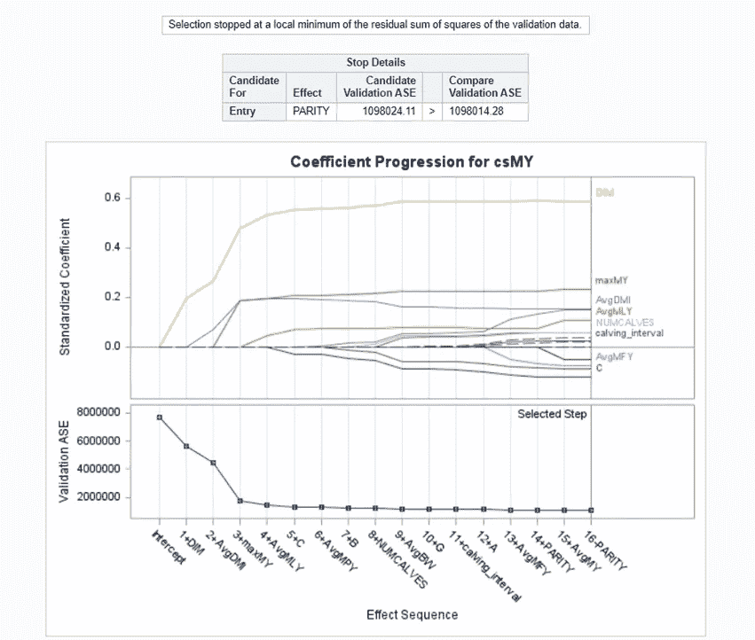**

**通过套索获得的选择方法。**

**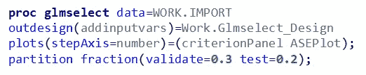**

**通过结果变量的分割查看均方差级数的附加代码。**

****

**传统上，测试集表现最差。在这里，培训、验证和测试之间的距离在各个步骤中似乎是不明确的。**

********

**对某些值的预测有点偏差。**

******

让我们使用数据分区方法。你可以看到确实发生了过度拟合，ASE 测试/训练比大约为 13。** ******

测试误差之所以这么大，是因为只有三个样本。** ********

**增加测试集后，ASE 测试/训练比率没有改善。现在是 24 倍。因此，使用一个验证和测试集是非常令人羞愧的**

**总之，如果您想从大量的预测值中建立一个预测模型， **PROC GLMSELECT** 过程是您可以在 SAS/STAT 中使用的最先进的过程。有许多选择方法来防止过度拟合，这些方法试图使用偏差-方差权衡来找到最佳模型。将您的数据分成**训练**、**验证**和**测试**数据，以获得最大的洞察力和预测能力。误用 **PROC GLMSELECT** 是非常容易的，因为它让你认为你有一个可靠的模型，结果却是无法解释的垃圾，甚至无法很好地预测。**

**让我们继续选择型号。**

**顾名思义，PROC GLMSELECT 最大也是最基本的部分是它提供的选择方法。模型选择的目标是:**

1.  **获得一个简单且可解释的模型。**
2.  **生成准确的预测**
3.  **在偏差和方差之间建立一个稳固的平衡。**

****PROC GLMSELECT** 和 **PROC REG** 都可以进行逐步回归。选择**PROC glm 选择**用于“大 p”问题，选择 **PROC REG** 用于较小数量的预测值，例如 k < 30(并非一成不变)。**

**选择方法都侧重于偏差/方差的权衡。默认情况下，大多数模型都希望减少方差。在每次迭代步骤后，它们被连接以减少残差，直到找到最小残差。这是一个可能导致过度拟合的过程。**

**偏差是指一个模型经常出错。你可以用体重秤来比较，体重秤总是告诉你比实际体重多 10 公斤。不值得信任，但在某种意义上是可以预测的。现在，我很快会谈到的惩罚回归方法，实际上在模型中包含了一些偏差，使它在新的数据集上更可预测。他们吃得更少。**

********

**最先进的选择方法通过引入一点偏差来减少方差。正是在偏差、方差和模型复杂性的交叉点上做出了最佳模型的选择！**

**PROC GLMSELECT 有很多可供选择模型的选项，有很多选择最佳模型的选项，有很多停止添加/移除效果的选项。实际上，很多组合都是可能的，而且很容易让人迷失。**

**********

人们很容易迷失在无数可用的选择方法中。你可以区分传统的&惩罚选择方法。** 

**因此，也许最好开始将选择方法分为传统的和惩罚的选择方法。以下是传统方法:**

1.  ****正向选择**:从截距开始，在每一步添加对模型贡献最大的效果。**
2.  ****反向消除**:从完整模型开始，在每一步删除对模型贡献最小的效果。**
3.  ****逐步选择**:对前向选择技术的修改，不同之处在于模型中已经存在的效果不一定停留在那里。**

**这些传统模式**贪**。他们每一步都在改变，不管未来的步骤。因此，当涉及许多相关变量时，预测是不稳定的。此外，传统方法对变量选择问题产生一个**单一答案**，尽管几个不同的子集可能同样适合回归目的。最后但并非最不重要的一点是，由于选择是基于互相关而非生物学**进行的，因此存在选择偏差的空间。****

**很多年前我读到过一个有趣的比较:如果你不得不在寒冷中不穿衣服冒险，让一个模特来挑选，你可能会得到一双靴子，一条围巾和一顶帽子。所有的统计选择方法都有这些局限性。**

**下面您可以看到在同一数据集上向前、向后和逐步选择的示例。**

****************

**选择方法会影响你的结果。传统的选择方法只对一个变量说“是”或“否”,但不惩罚系数，尽管图可能显示不同。在这一点上，落后就大错特错了。**

**接下来是惩罚方法。要完全理解和欣赏这些 next 选择方法，您首先需要了解:**

1.  **[**惩罚**:【惩罚】系数](https://towardsdatascience.com/l1-and-l2-regularization-methods-ce25e7fc831c)**
2.  **[**收缩**:【减员】系数](https://medium.com/@marc.jacobs012/blups-and-shrinkage-in-mixed-models-sas-3fbc6662fa6b)**

**这两种方法都通过增加偏差来减少方差，从而减少预测误差，这是前面提到的以预测为主要目标的偏差-方差权衡的一部分。**

****

**所有的惩罚选择方法所做的就是找到一个最佳点，在这个点上一个模型被充分地训练来处理一个新的环境。**

**事实上，惩罚选择方法已经有几年的历史了，但它们仍然是最先进的，并且被广泛使用。以下是 SAS 为您提供的一些可能性描述。**

****岭回归** (L2 处罚)**

1.  **引入偏差以减少估计的方差(惩罚)。**
2.  **估计值向零收缩，但永远不会达到零。**
3.  **实际上不执行模型选择，只影响系数。**
4.  **存在多重共线性时最有用。**
5.  **在 PROC REG 中可用。**

****套索** ( *最小绝对收缩和选择算子* — L1 惩罚)**

1.  **引入偏差以减少估计的方差(惩罚)。**
2.  **估计值可以缩小到零。**
3.  **选择方法。**

****自适应套索****

1.  **通过对零系数给予相对较高的惩罚，对非零系数给予较低的惩罚，产生无偏估计。**
2.  **可能不会产生最佳的预测性能。你需要换成套索。**

****弹性网**:结合了套索和脊线回归方法。理论上应该结合两个世界的优点——L1&L2。**

****LAR** :生成一系列回归模型，其中每一步添加一个参数。**

**这是比较套索、适应性套索和弹性网的结果。**

************************

**选择方法的选择会严重影响您最终得到的模型。这就是为什么模型选择不应该仅仅依赖于统计学，还需要依赖于生物学。事实上，生物选择应该构成任何选择模型的基础。**

**表格和图表显示了哪些变量进入了模型，包含变量后模型的性能如何变化，以及每一步后系数发生了什么变化。如你所见，为了使模型更具预测性，他们通过包含偏差来改变系数。这都是为了防止过度合身！**

**在前面的部分中，我们讨论了过度拟合的危险。模型选择是有帮助的，但最好的方法是使用外部数据。通常我们只有内部数据。内部验证技术(交叉验证)包括:**

1.  **选择一个简洁的变量列表**
2.  **系数被扣分**
3.  **该模型被保护免于过度拟合**

**这种工作方式重复了无数次。决定何时停止选择至关重要。在某些情况下，将数据划分为训练、测试和验证是一种方法，但您可能没有足够的数据来完成这项工作。在这些情况下，交叉验证是估计预测误差的一种有吸引力的替代方法。**

**下面你可以看到一个 K 倍交叉验证和留一交叉验证的例子。**

********

**左:K 倍交叉验证。Richt:留一个交叉验证。**

**在 K 倍交叉验证中，您可以:**

1.  **将数据分成 k 个大小大致相等的部分**
2.  **保留一部分数据进行验证，并将模型拟合到剩余的 k1 部分数据。**
3.  **使用此模型计算数据保留部分的预测误差。**
4.  **对所有 k 个部分都这样做，并组合预测误差的 k 个估计值。**

******

k 倍交叉验证。** 

**留一交叉验证是 k 重交叉验证的特殊情况，其中 k = n，n 是训练数据集中的观察总数。这里:**

1.  **每个省略的部分由一个观察值组成。**
2.  **预测的残差平方和可以有效地获得，而不需要重新调整模型 n 次。**
3.  **对于真实的预测误差，估计值是近似无偏的，但是可能具有很高的方差，因为 n 个“训练集”彼此非常相似。**

****

**留一交叉验证。**

**在 **PROC GLMSELECT** 中，很容易选择使用哪种交叉验证方法。**

****

**在 **PROC GLMSELECT** 中，有多种方法可以使用交叉验证*(K-fold 和留一法)***

**在 **PROC GLMSELECT** 的任务和实用程序部分，如果您使用弹性网络程序，您可以选择交叉验证。这里，我指定 K=5 K 倍交叉验证。**

**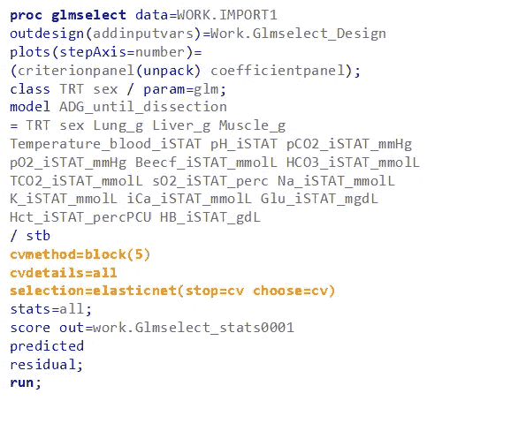**

**橙色突出显示的代码显示了交叉验证部分。我还选择了交叉验证作为停止和选择规则。**

************

**模型的结果。**

**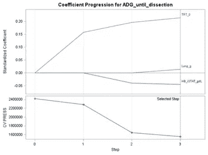**

**选拔程序的结果。注意系数是如何跨步骤变化的。惩罚选择不仅选择，它改变系数。**

****

**结合五重交叉验证的弹性网选择方法的选择代码。**

**在 *k* 折叠交叉验证中，数据被分割成 *k* 个大小大致相等的部分。这些部件中的一个被拿出来进行验证，而模型适合其余的部件。该拟合模型用于计算省略部分的预测残差平方和，并且对每个 *k* 部分重复该过程。如此获得的 *k* 预测残差平方和是由 CVPRESS 表示的预测误差的估计值。**

****

**在这里，您可以看到每个块的结果。**

****

**留一交叉验证示例。可能需要相当长的时间来运行。记住模型运行 N-1 次。**

****

**模型的结果。**

****

**套索**

**如果你有很多变量要考虑，并且计算时间很长，你也可以向 SAS 请求筛选方法。这是辨别哪些变量最有可能值得你花费时间的快速方法。**

************

**选择=套索(屏幕=萨斯维)。一开始还不错。**

**总之，型号选择是 **PROC GLMSELECT** 程序的核心。这也是最棘手的部分——从统计学的角度来看非常强大，但没有考虑到真正的生物学。然而，当面对大量的变量时，这些方法已经被尝试和测试过了。交叉验证&惩罚选择方法对防止过度拟合非常有帮助。**

**让我们进入这篇博客的最后一部分，模型平均。**

**因此，在 **PROC GLMSELECT** 中，有一个额外的过拟合保护措施。这就是所谓的模型平均。模型平均基于**自举**原理，是另一种形式的内部验证。最后，模型平均应该为您提供一个更加简洁和可靠的模型。**

********

**自举。自举的思想是通过替换对样本数据进行重采样，可以从样本中导出总体(而不是从总体中导出样本)。**

******

对样本进行简单的 t 检验。** ****

**自举差异图。在这里，每次对样本进行重新取样并进行 T 检验。重复这个过程 100 次，你就可以绘制数据来得到两组之间差异的自举分布。使用 bootstrap，您可以轻松获得 95%的置信区间，因为它们直接来自 bootstrap 分布。**

****

**自举结果。通过-4.9840 — -4.99448 获得-0.010478 的偏差。**

**简而言之，模型平均程序知道以下步骤:**

1.  **数据重采样，替换。**
2.  **数据分为训练、测试和验证。**
3.  **基于数据分割和选择方法的变量选择。**
4.  **模型评估。**
5.  **步骤 1-4 将重复 N 次。**
6.  **最终模型将包含基于 N 次%选择的变量、具有平均系数的变量和单个最终评估。**

**通过 **PROC GLMSELECT** ，很容易请求模型平均程序。**

****

**模型平均代码**

****

**选择预测值的次数。**

****

**平均参数估计。**

****

**型号选择频率。**

********

**和参数估计分布。**

****

**用平均系数重新调整数据的代码。**

********

**模型结果。**

****

**不同数据集的选择过程。**

********

**初始参数和改装估计分布。您正在寻找正态分布估计。这里，你有一个中心极限定理的很好的例子。**

********

**改装模型性能**

********

**正常(左)和平均模型(右)的残差**

******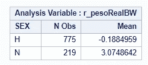

正常(左)和平均模型(右)的残差** 

**总之，模型平均看起来像一个奇异的附加步骤，但事实上它永远不应该被忘记。平均或引导模型将为您提供一个更稳定的模型，在新的外部数据集上具有更好的性能。在 SAS 中，模型平均和改装的过程非常简单。虽然它的计算量很大！**

**最后，模型评估。**

**模型评估是任何建模过程中不可或缺的一部分，你可以从下面的例子中看到这一点。当然，我也已经在上面展示了各种例子。**

**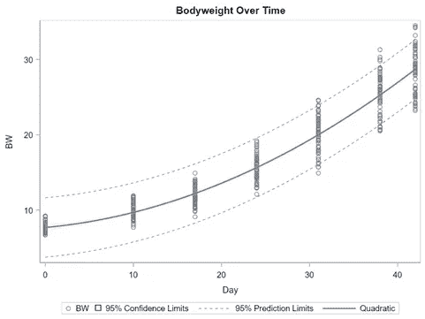**********************

**模特评价不是 R！！！！！**

**R 统计告诉你模型解释了总方差的多少。我们努力达到很高的解释率，但是只看 R，你只能看到一部分。即使预测完全错误，你仍然可以得到一个合理的高%方差解释。尤其是在合身的线的尾部，正如你在上面的图片中看到的。**

**通常，评估模型的度量标准是 AIC——**AK aike 信息标准**。这是一个对评估单个模型没有用的度量，但是对比较模型很有帮助。不要说它是结果相关的——你不能将一个模型和它的对数变换变量与 AIC 进行比较。**

******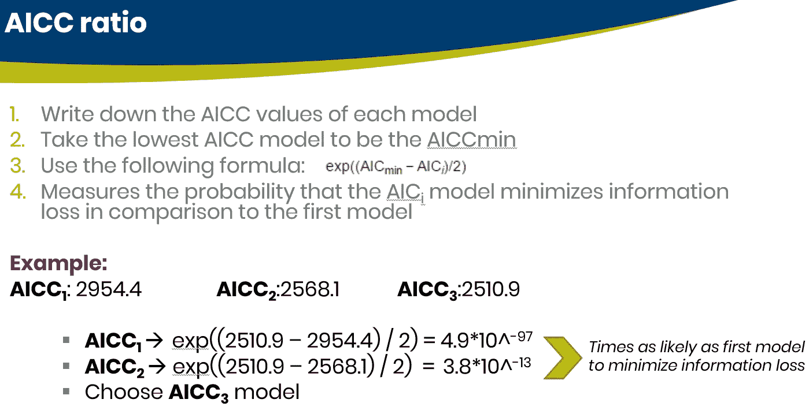**

**如果你想深入评估天堂(或地狱，取决于你如何看待它)，SAS 在这里也有大量的选项等着你，通过 **PROC GLMSELECT** 轻松提供。**

****

**有这么多指标可供选择**

****

**如此多的指标很容易获得。**

**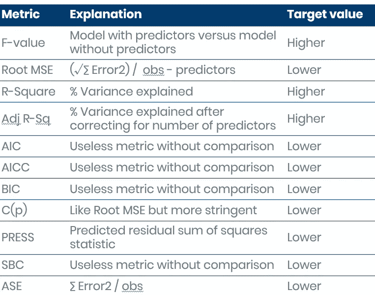**

**他们的意思是。请注意，您不需要全部使用它们。使用一个，并坚持使用它，只要它不是 R 或其调整后的变体。**

**良好的建模实践要求您:**

**1.不要构建一个模型。**

**2.不要使用一种度量标准。**

**3.让自己被剧情和生物引导。**

**一个好的开始选择是:**

**1.RMSE →预测因子数量的平方误差。**

**2.C(p) →像 RMSE，但更严格。**

**3.AICC →模型的实体比较器。**

********

**模型评估表和模型校准图。**

********

**由预测值绘制的残差。**

**模型评估并不是什么新东西，但它是(预测)模型中最重要的部分。模型评估不是在最终结束时进行，而是在每次迭代结束时进行(交叉验证，模型平均)。通常在评估阶段，您会看到模型中需要更改的内容。大多数选择方法都具有自动模型评估功能，这意味着在构建模型时可能会发生数百次。**

**如果您真的想了解模型的表现，请使用新的数据集和您的模型对该新数据集进行评分。因为到目前为止，我还没有真正向你们展示如何使用你们制作的模型。你唯一要做的就是收集数据，分割数据，选择变量，重复这个过程，评估你的模型。然而，真正到了这个阶段，你才能对你的模型的可用性有一个初步的了解，来预测这个场景:**

1.  **训练数据的插值**
2.  **推断**

********

**记住，如果不是不可能的话，推断可能是一种真正的痛苦！**

****************

**内部推断。**

****************

**如果你想测试你的模型，你需要制作一个包含所有变量的模型。**

****

**然后，创建数据集，将数据集应用于模型，并获得结果。你要做的第一件事是检查生物合理性，因为你不再有剩余的度量标准可以使用。这是一次令人羞愧的经历。**

********

**模型评估的真正测试是当您输入不在定型集中的值时，查看模型的行为。正是在这里，一个模型可以开始预测奇怪。用于构建模型的模型评估参数在这个阶段并不真正起作用。在这里，一切都与生物学有关。这个预测有意义吗？！**

**我希望你喜欢这篇相当长的帖子。如果有什么遗漏或错误，请告诉我！**

**尽情享受吧！**