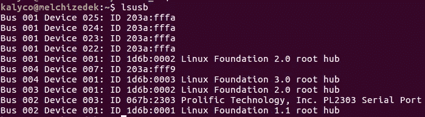
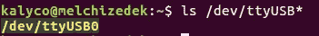
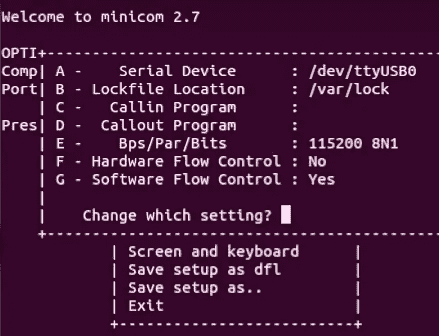

# 准备用于闪存的 TX2 板

> 原文：<https://blog.devgenius.io/preparing-a-tx2-board-for-flashing-through-linux-parallels-c6eb6452f68c?source=collection_archive---------18----------------------->

## *注意:这也适用于 TX1，因为它们使用相同的载板*


马库斯·斯皮斯克在 [Unsplash](https://unsplash.com?utm_source=medium&utm_medium=referral) 上拍摄的照片

***先决条件***

*   Linux 16.0.4 操作系统或 Parallels Desktop 15 for Mac
*   NVIDIA Jetson TX2 板
*   [串行电缆](https://www.adafruit.com/product/954)
*   19V 电源:NVDA 输入

这是一个为你的开发或生产版本设置 TX2 板的教程。你可以看到初始接线步骤也讨论过 [**这里**](https://www.jetsonhacks.com/2017/03/24/serial-console-nvidia-jetson-tx2/)

# 1.接线

**在连接好电线串行电缆并设置好配置之前，不要打开电源**

从标有白色箭头“J21”的大头针开始，数字垂直递增:


串行端口上的彩色母接头应按如下方式连接，红色接头省略:

*杰特森 TX2 J21 第 8 针(UART 1 TXD)→RXD 电缆(白色电线)
杰特森 TX2 J21 第 10 针(UART 1 RXD)→TXD 电缆(绿色电线)
杰特森 TX2 J21 第 9 针(GND)→GND 电缆(黑色电线)*

应该是这样的:


# 2.将设备连接到 Linux

在您的 linux 终端中:

`$ lsusb`

应列出设备，名称取决于 USB-TTL 电缆使用的芯片

您应该看到 PL2303 串行端口:



然后，您需要找到设备映射到的 USB 端口。

`$ ls /dev/ttyUSB*`

这将列出 USB 端口:



在这台机器上，只有一个设备。其他机器可能有更多，你得弄清楚哪个是哪个。

在这种情况下，记住`/dev/ttyUSB0`是稍后要进入终端仿真器的设备。

# 3.迷你通讯

现在使用`minicom`，一个调制解调器控制和终端仿真程序。我们将使用它来配置我们的设置，以与 Jetson 通信。

> `$ sudo apt install minicom`
> 
> `$ sudo minicom`
> 
> `CTL-A + Z`
> 
> 点击`O`进入`cOnfigure Minicom`
> 
> 选择`Serial port setup`
> 
> `Hit A to change serial device: Set`至`/dev/ttyUSB0`
> 
> 如果您需要更改`Bps/Par/Bits` : `115200 8N1`，请点击 E
> 
> 按 F 键将硬件流控制改为:否
> 
> 按 G 键进行软件流控制:是

您的最终设置应该如下所示:



> 退出并选择`Save setup as dfl`将其保存为我们的默认设置。
> 
> 然后退出。
> 
> 也退出 minicom: `CTL-A + Z + Q`
> 
> 并重新启动:`sudo minicom`

然后我们接上电源，按下面板上的`POWER BTN`(右边第四个红色按钮)启动飞机

此时，您的 minicom 输出应该是活动的，它将在安装过程中运行几分钟。

你可能会看到这个 wifi 在这一点上，所以它可能并不罕见，看到的东西和输出如下

```
failed to set WNM info, ret=-2
```

全输出:

```
[  130.453630] dhd_set_mac_addr_handler: interface info not available/down      
[  130.560616]                                                                  
[  130.560616] Dongle Host Driver, version 1.201.82 (r)                         
[  130.560616] Compiled in drivers/net/wireless/bcmdhd on Mar 11 2019 at 12:26:7
[  130.574257] wl_android_wifi_on in                                            
[  130.577597] wifi_platform_set_power = 1                                      
[  130.853683] mmc1: queuing unknown CIS tuple 0x80 (5 bytes)                   
[  130.924724] sdhci-tegra 3440000.sdhci: Tuning already done, restoring the be3
[  130.933620] F1 signature read @0x18000000=0x17214354                         
[  130.942007] F1 signature OK, socitype:0x1 chip:0x4354 rev:0x1 pkg:0x2        
[  130.948923] DHD: dongle ram size is set to 786432(orig 786432) at 0x180000   
[  131.001534] dhdsdio_write_vars: Download, Upload and compare of NVRAM succee.
[  131.051109] dhd_bus_init: enable 0x06, ready 0x06 (waited 0us)               
[  131.057154] Enabling wake69                                                  
[  131.061072] wifi_platform_get_mac_addr                                       
[  131.066517] Firmware up: op_mode=0x0005, MAC=00:04:4b:8c:be:82               
[  131.077708] dhd_preinit_ioctls pspretend_threshold for HostAPD failed  -23   
[  131.088766] Firmware version = wl0: Dec 12 2017 15:09:35 version 7.35.221.349
[  131.101556] dhd_interworking_enable: failed to set WNM info, ret=-23         
[  131.108086] tegra_sysfs_on
```

所以我们将进入下一步

# 4.将 TX2 板连接到 WiFi 进行远程工作

首先，您需要检查您引用的主要网络是什么:

```
$ lshw -class network
```

您将看到一个示例输出，如下所示

```
 *-network DISABLED 
     description: Wireless interface
     product: Ultimate N WiFi Link 5300
     vendor: Intel Corporation
     physical id: 0
     bus info: pci@0000:0c:00.0
     logical name: wlan0
     version: 00
     serial: 00:21:6a:ca:9b:10
     width: 64 bits
     clock: 33MHz
     capabilities: pm msi pciexpress bus_master cap_list ethernet     physical wireless
 configuration: broadcast=yes driver=iwlwifi driverversion=3.2.0–0.bpo.1-amd64 firmware=8.83.5.1 build 33692 latency=0 link=no multicast=yes wireless=IEEE 802.11abgn
 resources: irq:46 memory:f1ffe000-f1ffffff

*-network
   description: Ethernet interface
   product: NetXtreme BCM5761e Gigabit Ethernet PCIe
   vendor: Broadcom Corporation
   physical id: 0
   bus info: pci@0000:09:00.0
   logical name: eth0
   version: 10
   serial: b8:ac:6f:65:31:e5
   size: 1GB/s
   capacity: 1GB/s
   width: 64 bits
   clock: 33MHz
   capabilities: pm vpd msi pciexpress bus_master cap_list ethernet   physical tp 10bt 10bt-fd 100bt 100bt-fd 1000bt 1000bt-fd autonegotiation
 configuration: autonegotiation=on broadcast=yes driver=tg3 driverversion=3.121 duplex=full firmware=5761e-v3.71 ip=192.168.1.5 latency=0 link=yes multicast=yes port=twisted pair speed=1GB/s
 r
```

引用网络*的逻辑名称，

# **使用**[**nmcli**](https://developer.gnome.org/NetworkManager/stable/nmcli.html)**更新 wifi 配置**

要求:

`$ sudo apt-get install network-manager`

# nmcli 参数引用:

`d[evice] - devices managed by NetworkManager`

`r[adio] - NetworkManager radio switches`

`-f[ields] <field1,field2,...>|all|common specify fields to output`

# 第 1 部分:[连接](https://docs.ubuntu.com/core/en/stacks/network/network-manager/docs/configure-wifi-connections)

打开 wifi 无线电

```
nmcli r wifi on
```

获取 wifi 选项列表

```
nmcli d wifi list
*  SSID           MODE   CHAN  RATE       SIGNAL  BARS  SECURITY
   ...
   my_wifi      Infra  5     54 Mbit/s  89      ▂▄▆█  WPA2
```

连接

```
nmcli d wifi connect my_wifi password <password>
```

找到联系，把它作为一个优先事项

`sudo nmcli connection show <NAME> | grep autoconnect`

```
connection.autoconnect:                 yes
connection.autoconnect-priority:        -1
connection.autoconnect-slaves:          -1 (**default**)
```

如果尚未设置为最高(0)

```
sudo nmcli connection modify <NAME> connection.autoconnect-priority 0
```

# **5。闪烁**

实际的闪光步骤非常简单，这个视频教程是最好的参考之一。

如果您喜欢文档参考[,请使用本用户工具包文档](https://developer.download.nvidia.com/embedded/L4T/r27_Release_v1.0/Docs/Jetson_X2_Developer_Kit_User_Guide.pdf?fnLDq2EZfuG51H0YeVjMy9P2i2Fsdg1rZuKklkIf7vErYvecef9QNa_D4A-osy13bedMbnlT7cGDpJO88S9IFA1Z36Y7i2JG-Fwt_uM9OHNU4I6e_aB4s65Ou9oK2bY6LkyEC3rM6HzW_4ygAsYE3ZlDPba3_iCCTzjO2zENwbZfMamJJfxGbA)。

# 解决纷争

**— WiFi Ap 模式不工作**

> `[ 131.041870] dhd_interworking_enable: failed to set WNM info, ret=-23`
> 
> `[ 131.048402] tegra_sysfs_on`
> 
> `[ 165.612358] tegradc 15210000.nvdisplay: blank - powerdown`

这应该没问题。这是一个常见的错误，但在这一点上，你应该可以使用 SSH 和/或插入 HDMI。否则你可能需要重启几次，因为通常需要一次或两次完全启动才能在闪烁后获得所有 GRM 的东西。

**不要像我一样，寻找一堆设置接入点的方法。**在查找错误后，我认为我需要将我的电脑设置在一个 WLAN 基站上，以允许 TX2 将其用作 WiFi 接入点，因为我当时在 Parallels 上，使用它联网很时髦。这几乎肯定不是事实。

但是如果你在连接上有问题，试着将以太网电缆直接连接到主板上。这可能仍需要重启。

## `**--Debug 1: Check if wlan0 is up**`

`check the output of-- $ sudo ifconfig wlan0 up`

`If you see wlan0: ERROR while getting interface flags: No such device`

`This means there is something wrong with your OS settings`

## 无法读取文件 resin-image-flasher

> `** Unable to read file resin-image-flasher **`
> 
> `** Bad device mmc 1`
> 
> `** Bad device mmc 2`
> 
> `** Bad device usb 0`
> 
> `** Bad device usb 1`
> 
> `** Bad device usb 2` `**`

这些应该不成问题。

## — minicom:无法打开/dev/ttyUSB0:没有这样的文件或目录

很可能是 tx2 没有连接。用`$ sudo lsusb`检查:

> `Prolific Technology, Inc. PL2303 Serial Port`还是那个
> 
> `or the Intel Corp. TX2` 装置。

如果这些没有出现，你只需断开并重新连接串行设备，它应该会重新连接。