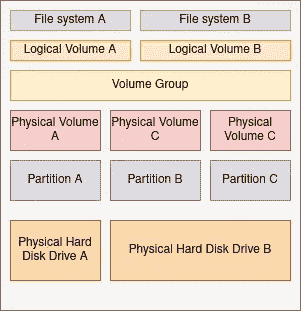

# 为 Glusterfs 准备砖块

> 原文：<https://blog.devgenius.io/preparing-bricks-for-glusterfs-5602bdf8191c?source=collection_archive---------2----------------------->

在这个故事中，我将介绍如何创建一个供您的卷使用的 xfs 块。


照片由 [Unsplash](https://unsplash.com?utm_source=medium&utm_medium=referral) 上的 [Halacious](https://unsplash.com/@halacious?utm_source=medium&utm_medium=referral) 拍摄:嗯，不是那些物理性质的…更像是逻辑性质的！！！

现在，我的虚拟机中添加了一个 10 GB 的磁盘，我将使用它来实现这一目的。

```
[root@dhcp41-206 ~]# lsblk
NAME                        MAJ:MIN RM  SIZE RO TYPE MOUNTPOINT
sda                           8:0    0   20G  0 disk 
├─sda1                        8:1    0    1G  0 part /boot
└─sda2                        8:2    0   19G  0 part 
  ├─fedora_dhcp41--206-root 253:0    0   17G  0 lvm  /
  └─fedora_dhcp41--206-swap 253:1    0    2G  0 lvm  [SWAP]
sdb                           8:16   0   10G  0 disk 
sr0                          11:0    1 1024M  0 rom
```

对我来说，这就是 vdb。可以使用 lsblk 命令来查找他们是否有主磁盘之外的磁盘。(不要尝试主盘上的步骤！！添加第二张磁盘，然后继续执行以下步骤。)

## 我们要做什么？

在继续进行并遵循这些步骤之前，为什么不理解我们在这里试图实现的目标呢？或者，如果你只是想按照步骤，请跳到下一部分。

因此，我们将创建精简配置的逻辑卷。这需要创建一个物理卷，然后是卷组，然后是 LV，最后在 xfs 配置中格式化磁盘。这意味着这里发生了很多事情，如果有人知道我们在这里到底在做什么，那将会更加有趣和有意义。

让我们从一个磁盘开始。现在，当你听到磁盘的时候，想象那些旋转的磁盘包含数据或者更确切地说是存储数据的能力。


照片由[丹尼·米勒](https://unsplash.com/@redaquamedia?utm_source=medium&utm_medium=referral)在 [Unsplash](https://unsplash.com?utm_source=medium&utm_medium=referral) 拍摄

以上通常被称为 HDD(硬盘驱动器)。当人们说硬盘和硬盘驱动器时，有时似乎会混淆。嗯，从技术上来说，任何设备要运行并与设备通信，特别是像磁盘这样只包含磁性排列的原子的设备，你需要一些中介来翻译数据，也就是驱动器(对于那些了解基本电气的人来说，可以考虑电机驱动器)。

所以我们有一个硬盘，它是驱动程序。完整的单元称为硬盘驱动器，我们现在已经改变了这些术语。(因为它通常发生在所有术语中)。

回到讨论，这些不是唯一的存储介质。我们还有固态设备(SSD)和闪存。

但是根据我们的理解，让我们继续讨论磁盘存储。

在上面一层，我们有隔板。在物理磁盘上创建分区，以便可以使用多个操作系统(例如 nix 用于工作，windows 用于游戏..)并且每个分区都有自己的文件系统。

上一层是在分区上创建的物理卷。现在，顾名思义，一个物理卷将被限制在一个物理设备上，但是如果有人希望他们的文件系统跨多个存储设备呢？

这就是我们的逻辑卷。可以创建包含多个物理卷的逻辑卷组。现在，再往上一层，我们终于到了逻辑卷。

现在，这些卷可以进行精简资源调配或密集资源调配。一个精简配置的 LV 将不会被分配到它应该包含的所有内存。理论上，它确实分配了上述内存，但实际上，随着内存需求的增加，它被分配了内存。厚卷则相反。如果我说 X GB 的密集卷，它将被分配 X GB，用户可以预期会发现它完全相同。

此外，在精简卷的情况下，也可能会发生过度分配。就像航空票务系统，允许预订超过航班实际容量的机票，因为他们知道有人最终会取消(是的…他们确实有算法来确定他们必须允许的最佳超额预订数量)。

下图可以帮助你理解我之前提到的 PV、LV 和 VG。



存储配置

现在我们已经有了我们要做的事情的蓝图，让我们从步骤开始。

## 实际步骤

现在，让我们直接进入步骤。

我们要做的是，

1.  创建物理卷
2.  使用物理卷创建卷组。
3.  创建一个精简池，然后从该精简池创建一个 LV。
4.  在 LV 上创建一个 xfs 文件系统，然后挂载它。

在使用 lsblk 命令时，我得到我的磁盘是/dev/sdb(你的可能被命名为别的什么……请检查它并使用那个特定的磁盘而不是任何其他的磁盘！！)

```
[root@dhcp41-206 ~]# pvcreate /dev/sd
```

运行命令 **pvs，**

```
[root@dhcp41-206 ~]# pvs
  PV         VG                Fmt  Attr PSize   PFree 
  /dev/sda2  fedora_dhcp41-206 lvm2 a--  <19.00g     0 
  /dev/sdb                     lvm2 ---   10.00g 10.00g
```

我们创建了一个物理卷，下一步是使用该物理卷创建一个卷组。

```
[root@dhcp41-206 ~]# vgcreate vg_gluster /dev/sdb
  Volume group "vg_gluster" successfully created
```

**pvs** 现在显示

```
[root@dhcp41-206 ~]# pvs
  PV         VG                Fmt  Attr PSize   PFree  
  /dev/sda2  fedora_dhcp41-206 lvm2 a--  <19.00g      0 
  /dev/sdb   vg_gluster        lvm2 a--  <10.00g <10.00g
```

卷组准备就绪后，我们可以使用该卷创建一个精简池。

```
[root@dhcp41-206 ~]# lvcreate -L 9G --thinpool gluster_thin_pool vg_gluster
  Thin pool volume with chunk size 64.00 KiB can address at most 15.81 TiB of data.
  Logical volume "gluster_thin_pool" created.
```

使用 **lvdisplay** ，我们可以看到

```
--- Logical volume ---
  LV Name                gluster_thin_pool
  VG Name                vg_gluster
  LV UUID                n9Cr5D-acVx-IoNY-xsnj-zsUK-3qPz-0RqhI5
  LV Write Access        read/write
  LV Creation host, time dhcp41-206.lab.eng.blr.redhat.com, 2021-06-18 20:52:21 +0530
  LV Pool metadata       gluster_thin_pool_tmeta
  LV Pool data           gluster_thin_pool_tdata
  LV Status              available
  # open                 0
  LV Size                9.00 GiB
  Allocated pool data    0.00%
  Allocated metadata     10.58%
  Current LE             2304
  Segments               1
  Allocation             inherit
  Read ahead sectors     auto
  - currently set to     256
  Block device           253:4
```

这是薄池。我们还可以为卷组中的数据创建 LV，为元数据创建 LV，然后使用 lvconvert 创建一个精简池。但是在这里，出于演示目的，我直接使用 lvcreate 创建了一个精简池。

现在，我们可以继续从这个精简池创建一个精简 LV，

```
[root@dhcp41-206 ~]# lvcreate -V 9G -T vg_gluster/gluster_thin_pool -n lv_gluster
  Logical volume "lv_gluster" created.
```

通过 **lvdisplay** ，我们可以看到这个逻辑卷的路径

```
[root@dhcp41-206 ~]# lvdisplay
  --- Logical volume ---
  LV Name                gluster_thin_pool
  VG Name                vg_gluster
  LV UUID                n9Cr5D-acVx-IoNY-xsnj-zsUK-3qPz-0RqhI5
  LV Write Access        read/write (activated read only)
  LV Creation host, time dhcp41-206.lab.eng.blr.redhat.com, 2021-06-18 20:52:21 +0530
  LV Pool metadata       gluster_thin_pool_tmeta
  LV Pool data           gluster_thin_pool_tdata
  LV Status              available
  # open                 2
  LV Size                9.00 GiB
  Allocated pool data    0.00%
  Allocated metadata     10.61%
  Current LE             2304
  Segments               1
  Allocation             inherit
  Read ahead sectors     auto
  - currently set to     256
  Block device           253:4

  --- Logical volume ---
  LV Path                /dev/vg_gluster/lv_gluster
  LV Name                lv_gluster
  VG Name                vg_gluster
  LV UUID                aXWfWo-uRYO-PVXo-dg15-juyF-EQ7n-kv5NWL
  LV Write Access        read/write
  LV Creation host, time dhcp41-206.lab.eng.blr.redhat.com, 2021-06-18 21:05:26 +0530
  LV Pool name           gluster_thin_pool
  LV Status              available
  # open                 0
  LV Size                9.00 GiB
  Mapped size            0.00%
  Current LE             2304
  Segments               1
  Allocation             inherit
  Read ahead sectors     auto
  - currently set to     256
  Block device           253:6
```

下一步是在这个逻辑卷上创建 xfs 文件系统。为了让命令 **mkfs.xfs** 工作，我们需要首先安装软件包 **xfsprogs** (这里，我使用 fedora。软件包名称可能因发行版的不同而不同)。

一旦软件包安装完毕，我们就可以创建 XFS 文件系统了。

```
[root@dhcp41-206 ~]# mkfs.xfs /dev/vg_gluster/lv_gluster 
meta-data=/dev/vg_gluster/lv_gluster isize=512    agcount=16, agsize=147456 blks
         =                       sectsz=512   attr=2, projid32bit=1
         =                       crc=1        finobt=1, sparse=1, rmapbt=0
         =                       reflink=1
data     =                       bsize=4096   blocks=2359296, imaxpct=25
         =                       sunit=16     swidth=16 blks
naming   =version 2              bsize=4096   ascii-ci=0, ftype=1
log      =internal log           bsize=4096   blocks=2560, version=2
         =                       sectsz=512   sunit=16 blks, lazy-count=1
realtime =none                   extsz=4096   blocks=0, rtextents=0
Discarding blocks...Done.
```

同样，这里需要注意的是，条带输入不是由我给出的，因为我将该决定委托给被调用的命令，但是人们也可以提供条带和每个条带的单位。

现在，我们已经准备好了砖块的基本框架。我们只需要通过在 fstab 中添加一个条目来挂载这个设备。

我添加的条目是，

```
/dev/vg_gluster/lv_gluster /glusterfs/brick   xfs rw,inode64,noatime,nouuid 1 2
```

这是什么意思…

1.  字段 1:设备
2.  字段 2:安装目录。我创建了一个名为/glusterfs/brick 的目录来安装这个设备。
3.  字段 3:文件系统类型。在我们的例子中是 xfs
4.  字段 4:选项:rw 对于读写访问，inode64 意味着 inode 将由 64 位表示。我们实际上可以使用 inode32，但是如果砖块很大，并且添加了大量的 inode 条目，将会妨碍操作，这将导致……没有新的 inode 可分配，因为所有的 inode 都已被使用，从而导致“没有可用空间”的问题。因此索引号为 64。下一个选项是 noatime，它消除了系统向文件系统写入只是被读取的文件的需要。这可以提高一些性能，因为我们正在保存对设备进行的写入。我们给出的最后一个选项是 nouuid，它禁止使用文件系统 uuid 检查双重挂载的文件系统。这对装载 LVM 快照卷很有用。
5.  字段 5:文件系统转储。指定转储程序需要使用的选项。非零值意味着将备份文件系统。
6.  字段 6: fsck。非零值意味着检查 fsck。根分区将这个标记为 1，我将它标记为 2，表示第二个运行 fsck。

在为我们的文件系统添加了选项之后，我们只需要运行 **mount -a** 来进行修改。之后，我们可以使用 df 实用程序来查看

```
[root@dhcp41-206 ~]# df -Th
Filesystem                          Type      Size  Used Avail Use% Mounted on
devtmpfs                            devtmpfs  942M     0  942M   0% /dev
tmpfs                               tmpfs     955M     0  955M   0% /dev/shm
tmpfs                               tmpfs     955M  792K  954M   1% /run
/dev/mapper/fedora_dhcp41--206-root ext4       17G  1.5G   15G  10% /
tmpfs                               tmpfs     955M  4.0K  955M   1% /tmp
/dev/sda1                           ext4      976M  141M  769M  16% /boot
tmpfs                               tmpfs     191M     0  191M   0% /run/user/0
/dev/mapper/vg_gluster-lv_gluster   xfs       9.0G   98M  8.9G   2% /glusterfs/brick
```

现在，这个砖块已经准备好用于创建 glusterfs 卷。