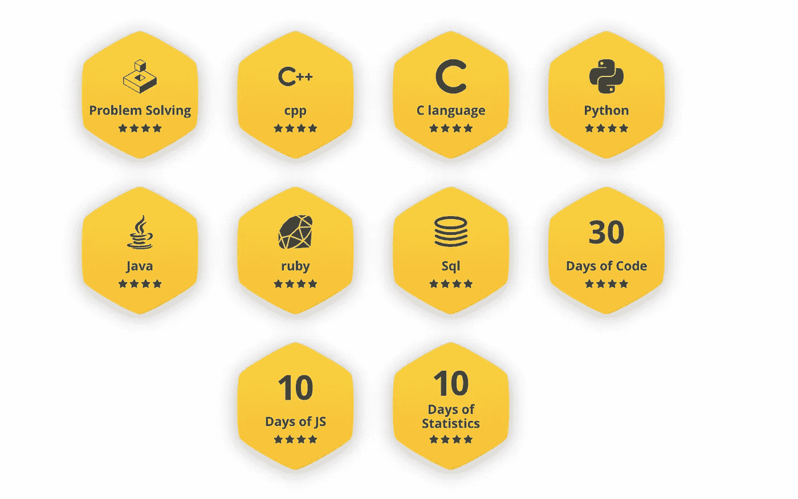
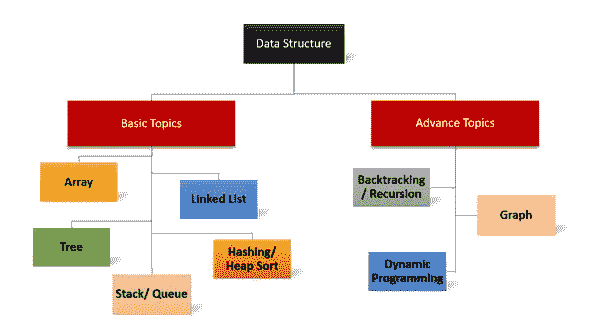
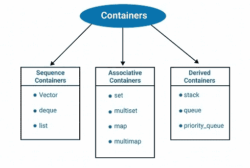
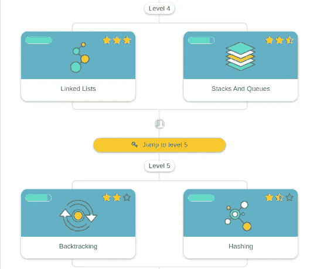

# 为安置准备 DSA:分步指南，第 1 部分，共 2 部分

> 原文：<https://blog.devgenius.io/preparing-dsa-for-placements-step-by-step-guide-part-1-of-2-b372a4d9b416?source=collection_archive---------0----------------------->

涵盖必要的数据结构和算法的详细指南。

潘卡杰·帕特尔在 [Unsplash](https://unsplash.com?utm_source=medium&utm_medium=referral) 上的照片

嘿，伙计们，如果你的安置季节快到了，你正在寻找一种方式开始编码，或者你需要一个方向来继续你离开的地方…这可能就是你要的文章。

我叫 Tanish，是 IIIT 阿拉哈巴德大学的一名大四学生，是的，我也是那些寻找在 2-3 个月内完成 DSA 的指南的人之一。幸运的是，我从我的同龄人和前辈那里得到了很多帮助，所以我决定在这里分享这些知识。所以让我们开始吧！

> **旁注:**如果您已经完成了一些编码工作，了解了数据结构，并且您可能打开这篇文章是为了了解更多关于如何实践它们或者从您离开的地方获得一些前进的方向，那么您可以跳到本文的第 2 部分。

第一步:选择你的语言

那些已经用任何语言编写过一些基本代码的人可以跳到下一节。在整篇文章中，我解释了我提到的事情，因为对一些人来说可能是新的，请随意跳过您已经知道的内容。

有许多种语言可供你选择来练习 DSA，面试官和编码回合是灵活的，你可以选择你喜欢的任何一种语言。大多数情况下可以使用 **C、C++、JAVA 或者 Python** 。大多数人使用 C++，然而，他们中的许多人也用 Java 编码。这是因为，JAVA 和 C++提供了最佳的时间/空间优化，而且你们大多数人还需要准备低级设计(LLD)回合/面向对象的编程问题，这是你们需要用 Java 或 C++编码的地方。Python 可用于编写简单的小代码，但它比 java 和 C++都慢，这使得时间优化很困难，因此，就个人而言，我不建议使用 python，除非你需要使用像 Pandas 或 MatPlotLib 这样的库，这对于你的布局来说是不太可能(但不是不可能)的情况。C 类似于 C++，但是它不提供像 STL 和额外库这样的工具，而且写起来很冗长。除了这几点，选择哪种语言完全取决于你。

选择你的编码语言

在你选择了一门语言之后，下一个*子步骤*(如果那是一个单词的话)，就是学习这门语言的基础。练习语法，一些基本问题，不是数据结构，而是如何写简单的循环之类的。你可以通过 [**Hackerrank**](https://www.hackerrank.com/skills-directory) 来练习，它为**语言能力**提供了一套非常好且相对简单的问题。你可以参考任何基本的 YouTube 视频或直接从 [**GeeksForGeeeks**](https://www.geeksforgeeks.org/) 中的理论。

精通 Hackerrank 中的语言以获得星级

现在你知道了！你已经选择了一门语言，现在已经很好地掌握了。现在终于可以开始做数据结构和算法了。

> **补充说明:**由于我是用 C++完成我的 DSA 的，所以本指南可能看起来更面向 C++，尽管我将尽最大努力包括 JAVA 和 C++的信息和资源，如果可能的话，还包括其他语言的信息和资源。

*第二步:阅读关于数据结构的内容，做一些基本问题*

同样，如果您已经阅读了一两遍关于数据结构的内容，那么您可以进入下一节，以获得如何实践它们的指导。

现在，我们需要知道我们需要哪些数据结构，并且在前进的路上我们会遇到一些算法。最广泛可用的编码知识来源是 Geeks for Geeks，这也是您应该学习 DSA 的地方。

DSA 中需要涵盖的主题

这里有一个列表，列出了你可能需要的所有主题:-

1.  时间复杂性分析
2.  数组(显然还有向量)
3.  堆
4.  队列
5.  基于数学的编码问题
6.  位操作(位幂运算、位屏蔽)
7.  链表(双向链表)
8.  排序算法
9.  用线串
10.  递归
11.  追踪
12.  哈希映射、集合、堆(优先级队列)、多重集合
13.  二进位检索
14.  贪婪的方法
15.  双指针方法
16.  二叉树(二叉查找树)
17.  动态编程(*boss 音乐播放*)
18.  图表(*boss 音乐继续*)
19.  不相交集合并集
20.  特里

> **旁注:**有些话题不一定需要涉及。只有像谷歌和 Directi 这样的公司可能会问这类问题。我会把它们列在下面，但是请在你对上面列出的主题做了充分的练习后再看它们。主题包括:段树、分域树、AVL 树、红黑树、DP +位屏蔽、森林、基数排序、哈密尔顿路径(图)、连接点和桥(图)、堆实现。

好吧，这可能看起来很多，但是让我给你分解一下。

**时间复杂度分析**——最初你不需要花很多时间，当你学习写代码时，你会自己掌握分析时间复杂度的要点。你可以从 [**这里**](https://www.hackerearth.com/practice/basic-programming/complexity-analysis/time-and-space-complexity/tutorial/) **学习一些时间复杂度分析的基础知识。**

**数组、向量、字符串、堆栈、队列、数学—** 这些主题不需要花太多时间。这些主题确实有一些很好的常见问题，但没有太多的概念需要学习。

> **边注:**在 DSA 中你不能给每个题目同等的时间，因为随着你越走越远，题目越来越详细，你会花更多的时间来完成后面的题目。高效管理您的时间！

**排序—** 如果说排序中有一件最重要的事情，那就是**合并排序**。您绝对需要知道如何编写和理解合并排序代码来解决一组特殊的问题。除此之外，你还需要知道**快速排序、插入排序、选择排序和冒泡排序。**

**二分搜索法、位操作、链表—** 这些都很重要，我指的是*真正*重要的话题。二分搜索法是许多进一步主题的基础，掌握它将会使你在 DSA 中走很长的路。位操作是一个令人头疼的问题，但是通过大量的练习，你应该能够做大多数问题，如果不是所有问题的话。链表有一些特殊的问题，从这些问题中，你能想出的变化并不多。

**递归，回溯——**递归是树、动态规划、回溯和一些图算法的基础。如果一个人已经掌握了递归，那么很多这些话题对他们来说都会变得容易，这是一个很大的优势。尽你所能练习递归。回溯并不是一个比较麻烦的话题，至少对我来说是这样，所以我建议你只要浏览一两次，然后你就能得到直觉，当然，通过有规律的练习。

**双指针法，贪婪法—**DSA 的两个简单话题(但依然重要)。这些话题会让你觉得 DSA 好像很轻松。我会建议你在做了很多重题，只是暂时需要做些轻松的事情的时候，再去做这些题目。

**映射、集合、堆—** 一旦你学会了 STL 数据结构—映射、集合和优先级队列，这 3 个就会被处理。地图和布景会为你解决很多问题，在设计回合的时候会有帮助(如果你现在还不明白这个就不用担心了)。学习 heap 需要你知道**优先级队列**的概念，一旦你知道了，你就会对自己的问题有了直觉。

**二叉树—** 这是面试中最重要的话题之一。面试官可以从二叉树中问你很多类型的问题。根据我的观点，理解 tree 的关键是要很好地掌握**链表**和**递归**几乎所有的二叉树问题都是用递归来解决的。二叉树一直是我很擅长的一个话题，我坚信如果你努力学习它，你一定能解决几乎所有的问题。

**动态编程—** 在这个话题上，你将需要大量的时间。DP 和 DP 有时候可以单独帮你破解一轮。这是一个巨大的话题，在我看来无疑是 DSA 中最重要的话题。你绝对需要在 DP 上花大量的时间来培养对它的直觉。我在文章中进一步解释了一种接近 DP 的简单方法，然后进一步深入到它以涵盖所有的变化。

**图—** 这是一个可以无止境探索的话题。所以你需要知道什么时候够了。事实是，你应该研究多少图表并没有明确的界限。有播放列表和一些文章确实说它们涵盖了在位置中被问到的图表主题，但事实是这些主题中的许多并没有被经常问到。所以，我的建议是，浏览所有这些话题，解决过去被问到的问题，观察你们自己经常出现的话题。我将在后面的文章中提供更多资源，列出图形主题和常见问题。

**Trie，Disjoint Set Union —** 这是两个听起来很吓人的话题，但是一旦你解决了这两个话题上的大约 4-5 个问题，它们实际上是非常容易的。许多学生在准备接近尾声时会跳过这些话题，但我认为你绝对应该尝试一下，把它们加入到你的武器库中。

现在，既然我已经向您提供了所有主题的要点，让我们深入了解一些步骤，以便开始 DSA 理论和基本的实践操作。

*A .了解 STL*

你需要做的第一件事就是了解 **STL(标准模板库)**。STL 基本上是一些预定义的数据结构和函数的集合，可以节省你反复编写相同函数的时间。学习一些必要的 STL 就像获得一套好的武器，它将在整个旅程中帮助你。

STL 数据结构

你需要了解的一些必要的 STL 数据结构是**向量、映射(无序和有序)、集合(有序和无序)、多重集合、堆栈、队列、队列和优先级队列**。使用这些数据结构的知识将是你 DSA 之旅中的一大步。你可以参考 [**黑客地球**](https://www.hackerearth.com/practice/data-structures/arrays/1-d/tutorial/) 来阅读一些关于这些数据结构以及如何使用它们的理论。你也可以参考几个教授这些数据结构的 **YouTube 频道**。我向我大学的一位校友推荐了一个 YouTube 频道。除此之外，我将在本文第二部分的结尾提供一个 YouTube 频道列表(希望在整篇文章的其他几个地方也有)，这将帮助你解决疑惑，加强你的理论和明确概念。

*B .覆盖剩余理论*

所以，你已经对 STL 数据结构有了一定的了解。现在剩下的部分，你有两种方法可以接近主题——阅读或观看视频(或两者都有)。

如果你是一个阅读爱好者，那么你可以去读《极客的极客》(Geeks For Geeks)和《黑客世界》(hackere earth)。黑客地球主题教程是一个很好的学习资源，特别是在高级数据结构的情况下，如特里和 DSU(不相交集合并)。然而，黑客地球上的问题并非每个人都喜欢。

geeks forgeeks——互联网上 DSA 理论的最佳来源之一

如果你比较习惯看解说视频，那么可以参考 [**阿迪雅维尔马**](https://www.youtube.com/c/AdityaVermaTheProgrammingLord) **(DP 神，相当字面，只讲解伪代码，不全代码，堆播放列表也很有帮助)**， [**Pepcoding**](https://www.youtube.com/c/Pepcoding) **(很棒的解说但代码用 Java)** ， [**Luv**](https://www.youtube.com/c/LuvIsMe) **(很棒的播放列表还有更棒的解说，代码用 C++)** ，**还有更多这样的渠道，但这些是我认为对我的 DSA 知识的主要贡献者。**

*C .练习基础题*

现在，当我们阅读这些主题时，解决一些问题以获得要点也很重要。为此，你可以开始在极客上为极客和 Interviewbit 解决问题。

尽管 GFG 没有 Interviewbit 那么好地组织问题，但有一个名为“ [**450dsa**](https://450dsa.com/) ”的开源网站，它按主题汇编问题，帮助你系统地回答问题。除此之外，还有很多人跟着 [**Love Babbar**](https://practice.geeksforgeeks.org/explore?page=1&curated[]=7&sortBy=submissions&curated_names[]=Love%20Babbar%20Sheet) 编的 450 题。

采访片段及其系统分布的话题流

[**面试 bit**](https://www.interviewbit.com/courses/programming/) 有一套结构非常好的问题，分布在不同的层次。计分系统通过在计时器下更快地解决问题并每天保持至少给定数量的分数来创造保持连胜和收集分数的激励。然而，就约束条件和整体问题难度而言，interviewbit 上的问题**比 geeks for geeks** 更难。但我认为这是一个很好的方式，可以帮助你进入 DSA，并真正了解在安置过程中实际被问到的问题。最初看起来可能有点困难，但是随着你不断学习这些主题，你会发现你的编码技能在提高。建议**完全解决 interviewbit 至少 2 次**，因此至少尝试这样做是一个很好的练习，因为它是一些最好的 DSA 问题的汇编。

> **旁注:**在查看解决方案或讨论部分之前，尝试自己解决问题。但是，如果你在实习前 2-3 个月就开始准备，在寻找解决方案之前，最多给问题**15-20 分钟。依靠讨论或解决方案只会让你得到更多的分数，而不是概念。记住积分只是激励你更加努力的一种形式。**

还记得我们如何阅读 STL 数据结构吗？现在，随着你进一步练习不同主题的一些问题，你会遇到像*寻找下一个排列*这样的问题，这些问题也可以使用一些 **STL 函数**来解决。没有单一的方法可以在一个地方阅读或学习所有这些，所以这将是一个稳定的过程，当你发现这些问题时，你会发现它们。

好了，你现在对 DSA 中的每个主题都有了基本的了解，并且至少对每个主题的基本问题有所掌握。到目前为止，你们中的一些人已经很好地掌握了 DSA，甚至可能不需要更进一步，但是我们还没有尝试任何竞赛。

因为，这篇文章已经够长了，让我们在这里休息一下，我们在下一部分再见，我们将讨论 DSA 准备的最后 2 个步骤。您还可以在那篇文章中找到所有资源和有用链接的列表。那里见！