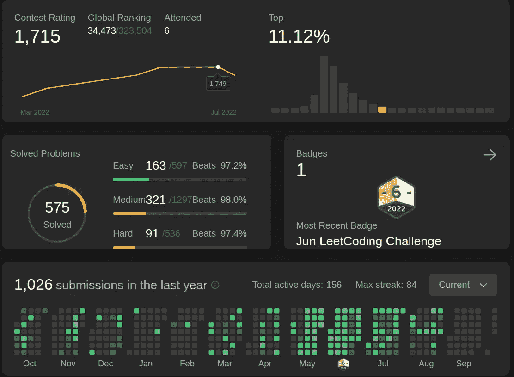
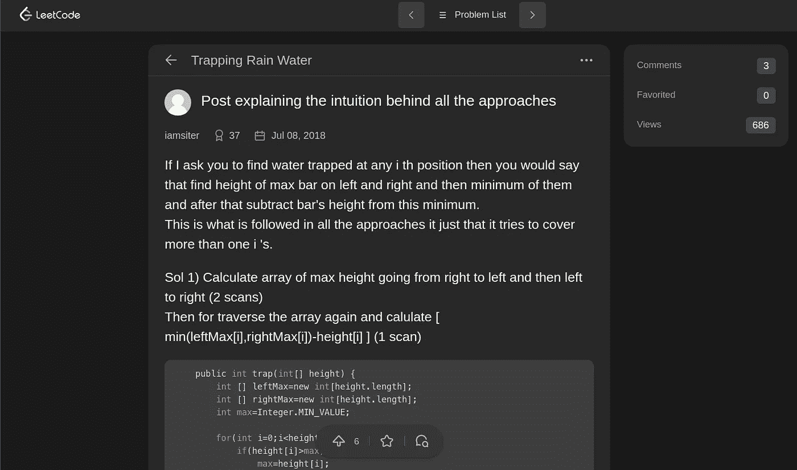
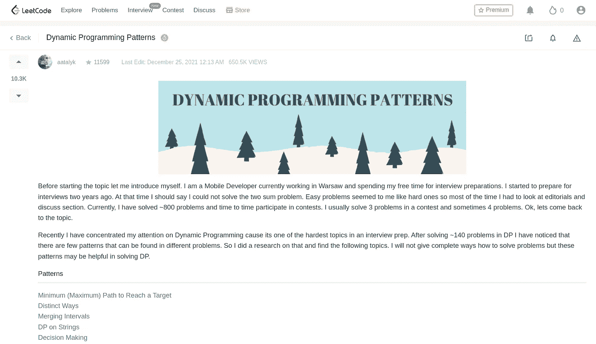
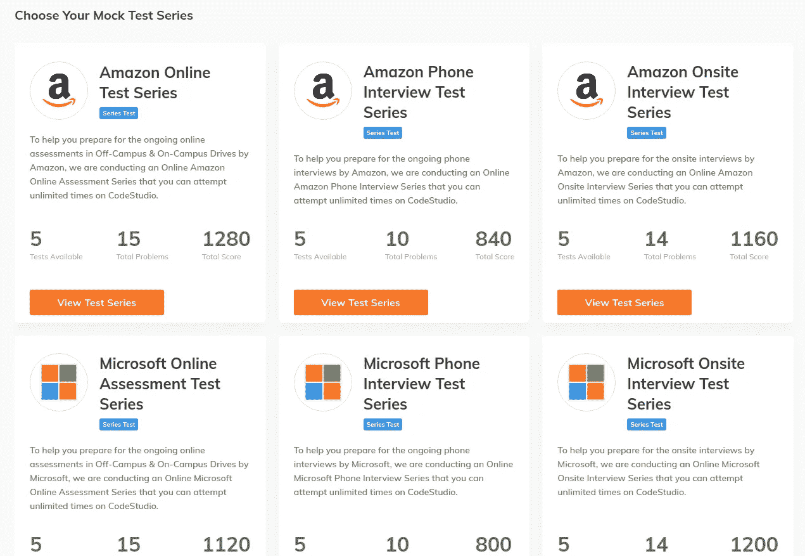

# 为安置准备 DSA:分步指南，第 2 部分，共 2 部分

> 原文：<https://blog.devgenius.io/preparing-dsa-for-placements-step-by-step-guide-part-2-of-2-2d1e6692a443?source=collection_archive---------2----------------------->

为你的位置练习数据结构和算法指南。

嘿伙计们！我们又回到了 DSA 马拉松，我们已经跑了一半了。所以，让我们继续我们停下来的地方，直接进入下一步。如果你没有看过第一篇文章，这里有一个 [**链接**](https://tanishagarwal81201.medium.com/preparing-dsa-for-placements-step-by-step-guide-part-1-of-2-b372a4d9b416) 到它。

*第三步:吃饭、睡觉、练习、重复*

所以，既然我们已经学了一门语言，并且至少演练了一次 DSA 的所有主题，我们需要做的就是练习、练习、再练习。听起来很简单，对吧？嗯，这都是关于**一致性**。你可以从很多网站入手。我们已经讨论过 interviewbit，但是它有一个相当小的题库。

[**【leet code】**](https://leetcode.com/)，有一个巨大的题库，它与所有其他平台的区别在于它有一个*优秀的*讨论区，当你解决更多的问题时，你会注意到问题开始看起来更加熟悉。所以让我们来看看如何接近 Leetcode 的一些要点。

*一、多少题？*

在 leetcode 上解答大约 300 个问题，让你有足够的把握清楚地理解所有的概念。在大约 500 个问题的某个地方，你会开始从不同的途径看到一个问题，不仅仅是解决它，而是最佳地解决它。而**以上的 500 个**问题就是你准备安置 DSA 所需要做的一切。

在一个网站上提 500 个问题可能听起来太多了，但是一旦你开始做并设定了一个常规，数字会在你注意到之前增加，你的技能与以前完全不同。

目标应该是大约 70 个难题和 250 个中等问题。

*二。定时器和使用讨论部分*

同样，在依赖讨论部分之前，尝试自己解决问题是至关重要的，因为 leetcode 没有练习问题的计时器，你可以在手机或手表上单独设置它，或者使用不同的标签。但是做这些题的全部意义在于训练你的思维能够以一个宽广的角度看待问题，并且磨砺你的思维过程。

> **旁注:**leet code 讨论区有几个主题的一些最精彩的解释。一旦我在讨论页面上阅读了《最佳直觉的强力》,对我来说似乎很难的大多数话题都变得清晰了。如果你用得好，这是一个巨大的资源。

解决问题后，看看讨论部分，你很可能会找到对一个问题的所有不同方法的讨论。不仅如此，你很可能会在你使用的任何编码语言中找到**的解释。在面试中，你需要从最小解到最优解开始解释一个问题，并知道从前者到后者的直觉。因此，看一看解决这个问题的所有方法是至关重要的。**

Leetcode 讨论页面的片段

你可以做的另一件有趣的事情是**在讨论区**添加你自己对问题的解决方案，如果你真的清楚问题的概念。通过这种方式，你可以练习用你向面试官解释的方式来写解释。

*三世。选择问题*

有时候，你会遇到一些问题，这些问题解释得很差，或者有错误的测试用例，或者只是不适合练习，这些问题通常是 leetcode 上的许多用户不喜欢的问题，如果你遇到这样的问题，建议你继续做下一个问题，不要在这个问题上浪费时间，也不要在这个过程中感到沮丧，特别是如果你离实习季节只有几个月的话。

所以，现在你知道了什么是 leetcode 和一些重要的注意事项，问题就来了。*这么大的题库我实际是怎么练的？我从哪里开始？*

有关于 leetcode 的讨论文章。试着谷歌一下“leetcode dp 模式”,你会发现关于 leetcode 的**大量文章，其中**列出了经常被问到的问题**,或者问题被分成更进一步的子主题，而**不同的问题模式**被组合在一起。我会附上一些我在准备过程中练习过的重要列表的链接。请随意克隆它们！**

DP 模式文章(你会在文章末尾找到这篇文章的链接)

除了 leetcode，你还可以在 [**BinarySearch**](https://binarysearch.com/) 上一试身手，这是另一个很棒的平台，有很大的题库，甚至还有一个最近问的面试问题的论坛。它有一个论坛，你可以在那里提出你的疑问，还有一个巨大的社区。

第四步:练习竞赛、解题、复习和模拟面试

竞赛、升级、修改、模拟面试更多的是一个循环而不是一个步骤。你需要保持这个循环来维持你的 DSA 流。现在，让我们来看一下这些子部分，以了解我们需要如何始终如一地完成这个周期。

*一、竞赛*

完成几个列表肯定会让你很好地掌握 DSA，但我们的第一个目标是能够在 1.5 小时内解决 3 个问题(这是标准编码回合的结构，尽管公司会随着时间的推移改变他们的模式)。为了克服这一点，我们需要做**练习竞赛**。Leetcode 有**每周**和**两周一次的竞赛**，每个竞赛有 4 个问题要在 1.5 小时内解决。这些竞赛可以虚拟或实时进行。实时解决这些会给你一些评级，类似于 codechef 和 codeforces。在这些竞赛中能够解决 3-4 个问题表明你对 DSA 有很好的理解。

如果你想看看过去公司问的一些问题，想像比赛一样练习一下，可以从 [**编码忍者**](https://www.codingninjas.com/codestudio/test-series) 开始做。他们有一份具体公司的清单，并根据之前提出的问题进行评估。然而，其中的一个缺陷是他们的测试用例非常宽松，这意味着你不能练习编写最优解。

编码忍者模拟测试系列

你也可以和来自 **BinarySearch** 的朋友一起练习竞赛。它提供了一个平台，你可以**和你的朋友一起创建一个房间**并进行竞赛。这只是比单独进行虚拟竞赛多一点乐趣，并给你一种竞争精神。

*二。向上求解*

另一件在你的技能发展中起巨大作用的事情是**提高解决能力**。向上解决基本上意味着回到竞赛中尝试过的问题，再试一次，用不同的方法看它们，如果你不能阅读和理解它们，使用解决方案/讨论。这是每个准备实习或做竞争性编码的学生都应该养成的习惯。

*三。版本*

记得重温一些你已经有一段时间没有看到的话题。编码需要一致性。一旦你放松了心流，当你回来的时候，你可能不会记得很多。继续标记那些对你来说很重要的问题，或者开始把它们保存在一个单独的列表中。偶尔重温一下这些问题，让心流保持下去。

*四。模拟面试*

从技术上来说，你现在已经准备好解决你遇到的问题了。尽管，面试的环境可能会让你惊慌失措，停止思考。所以，最好尝试一些模拟面试，**练习现场思考**，**尝试在一个人面前解决一个完全新的问题**，带他们通过**蛮力找到解决问题的最佳方法**。

你可以在几个平台上给你的朋友或一个随机的人进行模拟面试。Interviewbit 有一个同行面试平台，你可以广播一个面试请求，直到另一个随机用户接受它，然后你俩可以轮流参加对方的模拟面试。问题由 interviewbit 自己选择。 **Leetcode** 也有一个采访功能，你可以向你的朋友发送邀请链接并接受采访，但这里它只为你提供与共享 IDE 平台集成的视频聊天。但是我的建议是**做一个简单的 google meet/ zoom 会议，并通过共享的 google doc 进行采访**。原因是谷歌文档相对来说更难编写代码，因为我们习惯于在 ide 上编码，ide 会自动完成括号并自动提供缩进，而且因为大多数在线面试都是以这种格式完成的，所以我们需要准备在谷歌文档这样的东西上编写可执行代码。

模拟面试是不需要一次又一次进行的事情，所以它不是真正的循环的一部分，只要继续做下去，直到你对面试有足够的信心。

最后，我们已经涵盖了 DSA 准备的所有步骤。现在你需要做的就是开始行动，努力不要失去动力。记住，即使你*已经*完成了不错的编码，很多时候，布局都是靠运气。所以绝对有必要永远不要失去信心，让自己保持动力。下面是一个共享资源列表，可能对你的准备有所帮助。

**资源列表:-**

*YouTube 参考频道—*

*   [Luv](https://www.youtube.com/c/LuvIsMe)
*   阿迪雅·维尔马
*   [Pepcoding](https://www.youtube.com/c/pepcoding)
*   [奋斗者](https://www.youtube.com/c/takeUforward)
*   [我的描述](https://www.youtube.com/user/mycodeschool)(奇妙的树的解释)

*一些重要的 Leetcode 讨论—*

*   [动态编程模式](https://leetcode.com/discuss/interview-question/2069641/the-only-lists-you-need-for-your-interview-preparation)
*   [面向初学者的 DP 问题或模式或示例解决方案](https://leetcode.com/discuss/general-discussion/662866/DP-for-Beginners-Problems-or-Patterns-or-Sample-Solutions)
*   [图为初学者问题模式示例解答](https://leetcode.com/discuss/general-discussion/655708/graph-for-beginners-problems-pattern-sample-solutions/)
*   [编码面试图算法列表](https://leetcode.com/discuss/interview-question/753236/List-of-graph-algorithms-for-coding-interview)
*   [面试重要图算法注意事项](https://leetcode.com/discuss/general-discussion/1122034/important-graph-algorithm-notes-for-interview)
*   [面试准备杂事](https://leetcode.com/discuss/interview-question/2069641/the-only-lists-you-need-for-your-interview-preparation)

*链接到 leetcode 上的练习列表—*

*   [二分搜索法](https://leetcode.com/list/eow9kvr6)
*   [经典 Dp 问题](https://leetcode.com/list/epdb5wrh)
*   [基于数字的 DP](https://leetcode.com/list/epdbrxh7)
*   [DP(决策)](https://leetcode.com/list/erts99hh)
*   [DP(截然不同的方式)](https://leetcode.com/list/ertzjirj)
*   [DP(最大-最小)](https://leetcode.com/list/ervsuwrs)
*   [面向初学者的 DP](https://leetcode.com/list/e03diyb1)
*   [数学上的 DP](https://leetcode.com/list/epdbhums)
*   [琴弦上的差压](https://leetcode.com/list/ertshver)
*   [树上的 DP 和图形](https://leetcode.com/list/epdcimht)
*   [DP on 位操作](https://leetcode.com/list/epdcjknt)
*   [带间隔的差压](https://leetcode.com/list/epdbmzc2)
*   [DP(合并间隔)](https://leetcode.com/list/ertzf0ot)
*   [图表相关问题](https://leetcode.com/list/ervso3z3)
*   [基于电网的 DP](https://leetcode.com/list/epdbep9m)
*   [滑动窗口问题](https://leetcode.com/list/eowkm1i2)
*   [琴弦](https://leetcode.com/list/eengh2ir)
*   [树木](https://leetcode.com/list/eejt9f0g)
*   [二叉索引树(芬威克树)](https://leetcode.com/list/e0ra491v)

> **附注:**这些列表中可能会重复出现许多问题。这只是我在准备过程中从几个资源中克隆的所有列表的汇编。

*练习单—*

*   [斯特里弗·SDE 表格](https://takeuforward.org/interviews/strivers-sde-sheet-top-coding-interview-problems/)(非常有用，表格中的所有问题都是必答题)
*   [爱巴巴尔 DSA 单](https://docs.google.com/spreadsheets/d/1dmZuOUtFXRQJoz1phP7rTdq7GmBbt_g-/edit?usp=sharing&ouid=111250535751087226524&rtpof=true&sd=true)
*   [450DSA](https://450dsa.com/)

> **最后补充说明:)**这篇文章是写给那些即使做了大量 DSA 检查后仍感到停滞不前的人的。如果你在解决了很多问题之后仍然不能获得问题的直觉，那么你可能需要训练你的大脑，也就是说，扔给它更多的逻辑思维问题。在这种情况下，我做的是从 [Codeforces](https://codeforces.com/) 和 [Codechef](https://www.codechef.com/) 开始做一些竞争性编程。虽然 CP 能让你思维敏捷，但如果你得到了不错的评价，这也是一个制作简历的好机会。然而，如果你开始竞争编程，记得继续做 DSA，因为 CP 不同于 DSA，你越深入 CP，你就离 DSA 越远。

差不多就是这样！我希望这一系列文章对你有所帮助，并祝你就业季一切顺利。干杯！