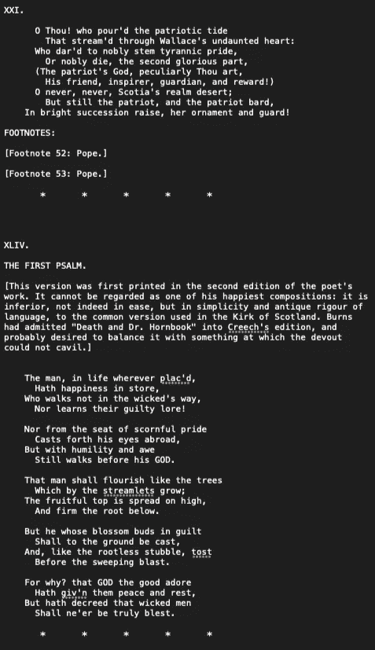
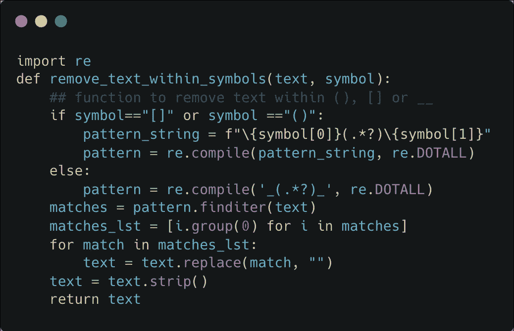

# 基于正则表达式的 GPT Neo 语言建模预处理

> 原文：<https://blog.devgenius.io/preprocessing-project-gutenberg-book-for-language-modeling-lm-using-gpt-neo-7425eed5c392?source=collection_archive---------8----------------------->

## 使用正则表达式对古腾堡计划书籍进行预处理，并使用清理后的文本来构建 gpt-neo 语言模型。

## 介绍

简单来说，语言模型就是一系列单词出现的概率。使用这样的模型，我们可以找到遵循给定单词序列的概率最高的单词，从而为文本生成模型铺平道路。这个博客打算在古腾堡计划中随机选择的一本书上使用快乐变形金刚建立一个语言模型。通过展示如何构建这样的模型，这篇博客揭示了正则表达式在清理模型训练不需要的文本中的使用。

古腾堡计划是一个超过 60k 免费电子书的集合。假设你想用这些书中的一本或多本来微调一个语言模型。电子书本身有很多不需要的文本，必须过滤掉。这篇文章的重点是清理和过滤电子书，使其格式可以用于微调像 GPT-2，GPT-尼奥或 GPT-J 这样的拥抱脸语言模型

*   基于正则表达式的文本数据清洗和处理。
*   一种预处理原始文本数据的方法。
*   使用快乐变形金刚训练和测试一个简单的语言模型。

## 基于正则表达式的文本预处理

出于这个博客的目的，我们将对《罗伯特·彭斯全集》进行预处理:包括他的诗歌、歌曲和通信。 这本电子书将是一个演示许多预处理工具的完美例子，因为它有许多不需要的文本，如前面的注释和几乎每首诗、歌曲和信件的脚注，如下图所示。我们将只对诗歌进行预处理。



书中的文字

从上图中可以看出，任何带有完整大写字母的行要么是诗的标题，要么是对 LM 模型无用的东西。我们可以使用下面的代码删除这些。此外，所有的文本都需要左对齐，这也是使用 strip()在同一个函数中处理的。


函数删除大写句子。

所有的标题注释和脚注都在方括号内。同样，方括号和下划线中的任何文本也需要删除。我们可以利用正则表达式来查找这些特殊字符中的文本模式，并删除它们。下面的函数使用 regex 移除给定符号之间的任何文本。目前，它适用于符号()、[]和 _。下面的函数搜索由*表示的任何文本的模式。*?)*介于给定符号之间。如果是问题中的 _ symbol，要搜索的模式是 *_(。*?)_* 而如果是[]，那么模式就是 *\[(。*?)\]* 因为在[]和()的情况下，我们不得不使用转义符。[和]是元字符，如果要逐字匹配，需要进行转义。



正则表达式并移除给定符号内的文本

需要完成的最后一个预处理是删除包含数字的行，同时删除不包含任何字母的行。一旦完成，因为我们将逐行训练 Langauge 模型，所以用双倍空格替换节中的每一个新行字符，然后将节列表加入到一个大的文本块中是很有用的。下面的代码实现了这一点，并将字符串转换成一个 stanzas 列表。


最后的预处理，删除没有任何字母的行或有数字的行。用双倍行距替换一节中的换行符。

一旦所有的预处理步骤都完成了，文件就变成了这样的格式，每一行都是诗的一个单独的节，可以很容易地输入到语言模型中。


最终预处理数据集的每一行都是一个单独的节，该节中的每一行都用双空格分隔。

## 使用快乐变形金刚的语言建模

使用上述数据，我使用快乐变形金刚库训练了一个简单的 gpt-neo 模型。下面的代码显示了使用的训练代码。


使用快乐变形金刚训练一个简单的语言模型

《论结婚戒指》是罗伯特·彭斯的一首著名的诗，其中有这样的诗句。

```
She asked why wedding rings are made of gold;
I ventured this to instruct her;
Why, madam, love and lightning are the same,
On earth they glance, from Heaven they came.
Love is the soul’s electric flame,
And gold its best conductor.
```

我们可以使用上面这首诗的第一行，并将其输入到训练好的模型中，然后看看模型使用这些行作为上下文会生成什么。用于推理的代码如下所示。


对训练模型的推断

上面的代码生成了下面这首诗。

```
*She asked why wedding rings are made of gold;* **And why they are worn with a gold ring
But why the rings were made with gold,
Or why a ring was made by a man
To wear a diamond, or a pear, and a pair
That was worn by the bride**
```

正如你所看到的，生成的诗在每一行都很流畅。

## 结论

这个博客简要地解释了如何将古腾堡计划的书清理和预处理成一种可用于训练语言模型的格式。这包括利用正则表达式在文本中查找需要删除的模式。最后，在所有预处理完成后，在预处理的数据上训练 GPT-尼奥语言模型。

## 参考

快乐变形金刚文档:([https://happytransformer.com/](https://happytransformer.com/))

Regex 教程:[https://towardsdatascience . com/the-ultimate-guide-to-use-the-python-regex-module-69 aad 9 e 9 ba 56？gi=b185eb3375d1](https://towardsdatascience.com/the-ultimate-guide-to-using-the-python-regex-module-69aad9e9ba56?gi=b185eb3375d1)