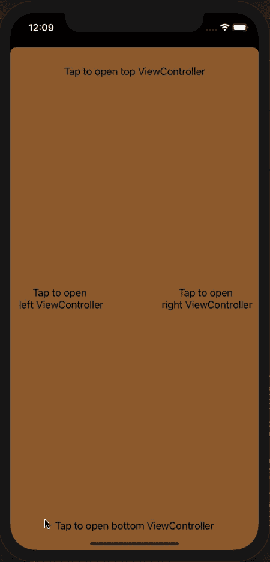

# 使用 Swift 为 ViewControllers 提供自定义过渡

> 原文：<https://blog.devgenius.io/presenting-viewcontrollers-with-custom-transitions-using-swift-fbbc26c91912?source=collection_archive---------10----------------------->

最近，在我的 iOS 项目中，我需要显示类似“汉堡菜单”的东西，所以我开始寻找一种方法来呈现从屏幕一侧滑入视图的 ViewController。

我发现了一些使用`CATransition`来获得理想效果的方法，所以我创建了一个小的扩展来呈现和消除 ViewController 以及过渡。

# 如何使用

这个扩展可以像下面这样非常容易地使用:
下面的要点展示了如何显示一个名为:)`MyViewController`的 ViewController，就像一个标准的“汉堡包菜单”从左边进入屏幕，从右边退出屏幕。

## **演示**

使用上面的扩展，我们可以创建这样的东西。

凯莉·西克玛在 [Unsplash](https://unsplash.com?utm_source=medium&utm_medium=referral) 上的照片