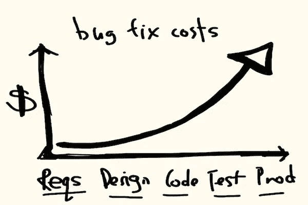
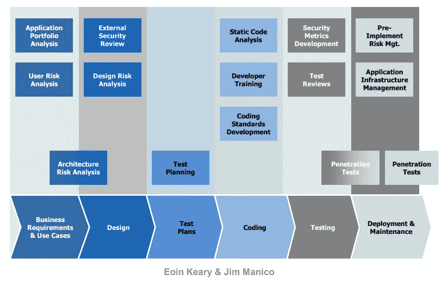
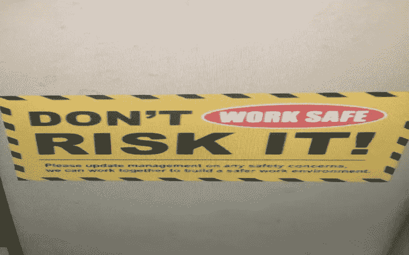
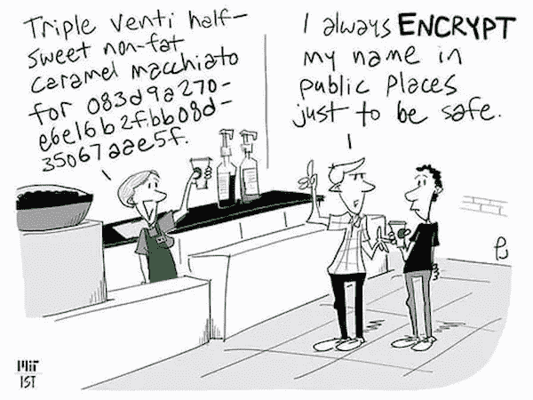

# 保存、保护和捍卫您的代码

> 原文：<https://blog.devgenius.io/preserve-protect-defend-your-code-9fbc03020fbc?source=collection_archive---------14----------------------->

马库斯·斯皮斯克在 [Unsplash](https://unsplash.com?utm_source=medium&utm_medium=referral) 上的照片

## 在开发阶段考虑安全措施

软件开发是一项平衡商业和技术需求的复杂任务。此外，组织必须确保产品符合法律、法规和客户的要求，同时根据客户的风险承担意愿提供对网络攻击的鲁棒性。

因此，我发现这比以往任何时候都更重要和相关，因为在你头脑中安全的同时发展的风险越来越大。如今，公认的方法是在不同阶段的所有产品开发中集成安全措施。

它使我们能够及时了解新的威胁，快速解决问题，减少后期发现问题的成本和时间，整体降低可能损害产品质量的重大缺陷的概率。因此，安全性被集成到软件开发生命周期(SDLC)的每个步骤中。

不同产品生命周期的 bug 成本— [src](https://alisterbscott.com/2013/05/17/fixing-bugs-in-production-is-it-that-expensive-any-more/)

下面，作为 SDLC 开发阶段的一部分，我将尝试概述与该主题相关的各种来源和我自己的经验，假设在前面的步骤(需求收集和设计)中进行了涉及安全性的深入工作，最终从 SDLC 转向 Secure-SDLC。

固态 DLC — [src](https://owasp.org/www-pdf-archive/Jim_Manico_(Hamburg)_-_Securiing_the_SDLC.pdf)

## 定义质量把关人

有人忘记关门了— [src](https://9gag.com/gag/aoP9zRn)

基于规划步骤(包括威胁建模、安全需求和安全设计等主动步骤)，定义有效识别和阻止各种故障的质量关。它可能会阻止向产品添加外部开源代码，直到获得批准或没有发现弱点。也应该考虑由第三方安全专家进行审计。自动化是必须的。一些众所周知的安全和控制措施是:

*   脆弱性评估，以识别、量化和优先处理持续风险
*   依赖跟踪监控其产品组合中每个应用程序的所有版本的组件使用情况，以主动识别整个组织的风险。
*   林挺将确定任何违反编码标准的情况，并实施众所周知的最佳实践。有很多工具可以满足每种编程语言的需求( [Coverity](https://www.synopsys.com/software-integrity/security-testing/static-analysis-sast.html) 、 [TICS](https://www.tiobe.com/) 、 [FxCop](https://docs.microsoft.com/en-us/previous-versions/dotnet/netframework-3.0/bb429476%28v=vs.80%29?redirectedfrom=MSDN) 、 [CodeScene](https://empear.com/) ，甚至各种 ide——[Visual Studio](https://visualstudio.microsoft.com/)、 [Pycharm](https://www.jetbrains.com/pycharm/) 、 [IntelliJ、](https://www.jetbrains.com/idea/)等等)
*   软件组成分析，以更高的准确率检测开源漏洞，例如 Synopsys 的 [Blackduck](https://www.synopsys.com/software-integrity/security-testing/software-composition-analysis.html) 工具。
*   SAST(静态应用程序安全测试)，它扫描代码的安全缺陷，也称为静态代码分析。业内知名的工具之一是 [Fortify](https://www.microfocus.com/en-us/products/static-code-analysis-sast/overview)
*   据我所知，DAST(动态应用程序安全测试)主要应用于 web 应用程序，在前端使用黑盒测试，通过攻击用户界面来发现潜在的安全漏洞。注意，不像 SAST，它不能访问源代码(例如怀特哈特安全公司的[哨兵动态](https://www.whitehatsec.com/platform/dynamic-application-security-testing/)
*   IAST 结合了 SAST 和 DATS 方法的优点
*   运行时应用程序自我保护(RASP ),该活动跟踪(通过记录)应用程序的操作并确定攻击(例如防病毒软件
*   验证用户输入，例如，应用保护基于 XML 的接口(如 REST)的 XML 防火墙。它扫描进出流量以过滤内容、限制请求数量等。作为经验之谈，使用 [OWASP 最佳实践](https://cheatsheetseries.owasp.org/cheatsheets/Input_Validation_Cheat_Sheet.html)。

除了以上几点，让自己保持最新和补丁(工具，恶意软件扫描器，IDE)。用旧的 AV 测试或者用易受攻击的 OS 运行是没有用的。

## 工作环境的分离

完美分离— [src](https://9gag.com/gag/an5WYNq)

一个常见的原则是应用分段和隔离实践来验证“活动”数据只在生产环境中可用，这意味着开发人员专门处理虚拟数据。这使他们能够建立一个屏障，防止任何弱点进入产品。

此外，使用 JIT admin 和恰到好处的管理方法仔细定义每个用户所需的权限。监控不同环境的活动(CI\CD、devs、云存储等)；权限的任何变化、未知代码、新用户帐户、不熟悉的 IDE 插件等等，只是组织为了降低风险而选择的一些监控活动。

## 培训软件团队进行安全编码

目的是双重的；获取知识，提高意识(老实说，这是这篇博文的目标之一)。将安全学习材料作为每个团队成员发展计划的一部分，并确保它是入职流程的一部分。

## 编码最佳实践

不知道它是做什么的，但是我害怕删除它— [src](https://imgflip.com/memetemplate/106502254/Balcony-fail-programming)

根据合适的编码标准开发，使用工具来验证它。申请相互代码评审，并使用涵盖安全问题的专用单元测试。这样，每个软件工程师都要对他的代码的弱点负责。

最后，团队的安全受托人必须根据需求批准代码。还应该进行内部审计以识别风险，并且应该与所有不同的成员协调设计审查。

## bug 文档

记录 bug 更多的是一种最佳实践，对于安全问题也是如此。记录发现的错误，包括调查结论、截图、日志和任何其他支持信息。将来遇到类似问题时，这可能会有所帮助。

## 防篡改

如果配置文件中发生任何不受控制的更改，自动将信息发送给安全代表，并关闭受感染的系统，直到获得批准。维护系统中所有文件的列表；它有助于检查不熟悉的变化。另一种选择是应用 [AAA](https://en.wikipedia.org/wiki/AAA_(computer_security)) 协议来管理访问控制和应用控制(例如[允许列表](https://www.ncsc.gov.uk/blog-post/terminology-its-not-black-and-white))。

## 风险管理

所有成功企业的座右铭— [src](https://9gag.com/gag/an4YbnL)

定义一个委员会来审查系统中的频繁变更，包括 bug 分类。在诸如敏捷这样的高速软件开发方法中，很难跟上修改的步伐，而一个专门的权威可以减轻这一点。此外，应该执行度量趋势和异常的指标(KPI)来分析风险，从而更好地进行根本原因分析。

## 防逆转技术

复制源代码或对其进行逆向工程是窃取产品的常用技术。因此，为了防止这种滥用，可以在不损害功能的情况下使用以下方法:

*   混淆是创建人类难以理解的源代码的过程。请注意，虽然可能需要一些时间来恢复这个动作，但也不是不可能。
*   反反汇编利用了反汇编器的假设。它使用专用代码(跳转表)或数据片段来导致反汇编分析工具产生不正确的源代码。
*   使用各种方法阻止调试应用程序代码的反调试，例如，利用系统 API 来识别调试器的存在或通过调试器的断点和许多其他[方法](https://en.wikipedia.org/wiki/Debugging#Anti-debugging)来识别代码变化。
*   打包是压缩组件以使其难以逆向工程的过程。

最后，它主要用于 IP 保护，人们不应该仅仅依靠这些技术来隐藏一些秘密(如加密密钥)。

## 跟踪配置

配置可能会随着时间而变化。记录各种规格并验证要求和需求。有很多自动化工具可以帮助完成这项任务。

## 加密通信

为了安全起见— [src](https://9gag.com/gag/aL06VE5)

使用标准协议和库。不要“重新发明”轮子(安全性)—使用控制来保护传输中的数据和静态数据。
做备份！而且，经常做，测试。

## 全部的

以上是一些建议，整合了安全领域的一些已知实践。在这里，我决定主要触及(SDLC 的)开发阶段，但是进一步的行动可以在生命周期的每个部分中完成。最终，降低被渗透的风险，并让人们认识到在开发过程中考虑安全性的重要性。

作为结束语，我强烈建议将你能做到的一切自动化，并使之成为过程的一部分(持续改进)，记住手动测试容易出现人为错误。

注:以上信息和更多信息可以在开放 Web 应用程序安全项目( [OWASP](https://owasp.org/) )找到，这是一个致力于提高软件安全性的非营利性基金会，请参见以下链接:

 [## 介绍

### OWASP 备忘单系列的创建是为了提供关于特定领域的高价值信息的简明集合

cheatsheetseries.owasp.org](https://cheatsheetseries.owasp.org/)