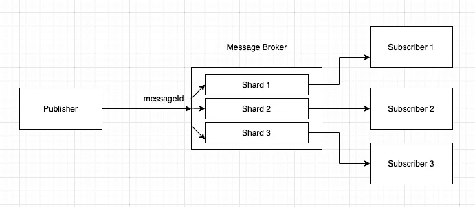

# 在基于微服务的架构中保持事件顺序

> 原文：<https://blog.devgenius.io/preserving-event-order-in-a-microservices-based-architecture-7679723312aa?source=collection_archive---------13----------------------->

马文·迈耶在 [Unsplash](https://unsplash.com?utm_source=medium&utm_medium=referral) 上的照片

本文描述了我们如何在基于微服务的架构中保存事件。基于微服务的模式的一个主要好处是，当负载增加时，可以增加接收器的数量，从而有助于提高应用程序的吞吐量。然而，这也会带来挑战。这种模式的主要挑战之一是保持事件的顺序。

假设我们有 3 个接收者和 1 个生产者。生产者按顺序发送 3 个事件——创建事件、更新事件、删除事件。一旦所有 3 个事件都被推送到消息代理，所有 3 个事件都可以由 3 个独立的接收者处理。在某些情况下，删除的事件比创建的事件处理得更快，这将导致系统不一致。像卡夫卡这样的现代信息经纪人通过使用分片通道解决了这个问题。这意味着通道由多个分区组成，到达特定分区的消息将到达特定的接收者。消息的发布者将在消息头中指定一个分片密钥。消息代理对碎片键进行哈希运算，以找到特定的分区。对于所有 3 个事件，分片密钥将是相同的，因此，所有这些消息都将到达代理中的特定分片。这确保了与同一个键相关的所有这些消息最终都被传递到同一个接收者，因此，与同一个对象相关的事件得到保留。

使用碎片保持秩序

这不是一个新概念，但我觉得很多开发人员会从了解这一点中受益。