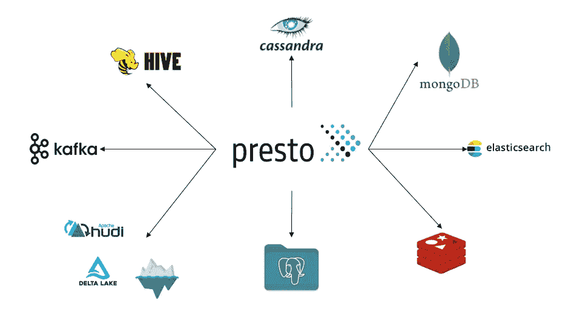
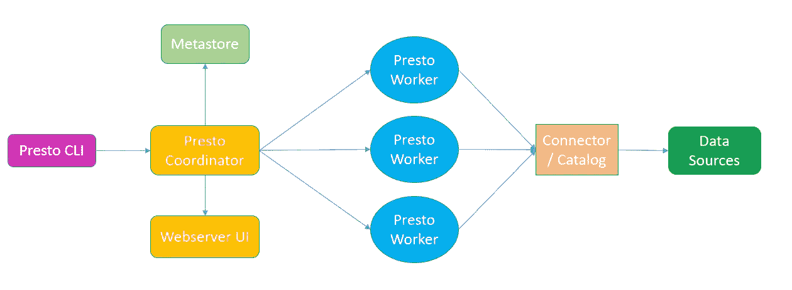
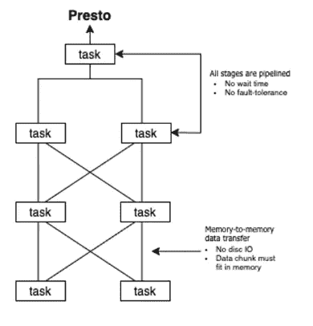
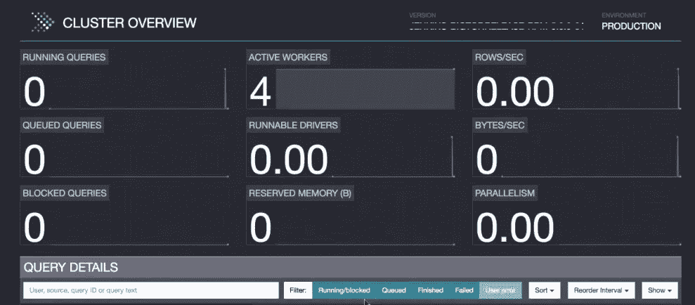
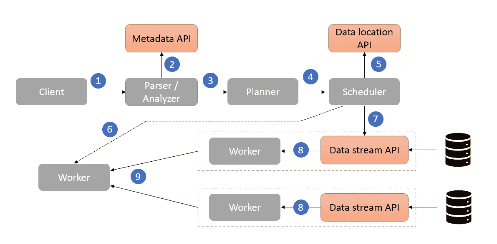
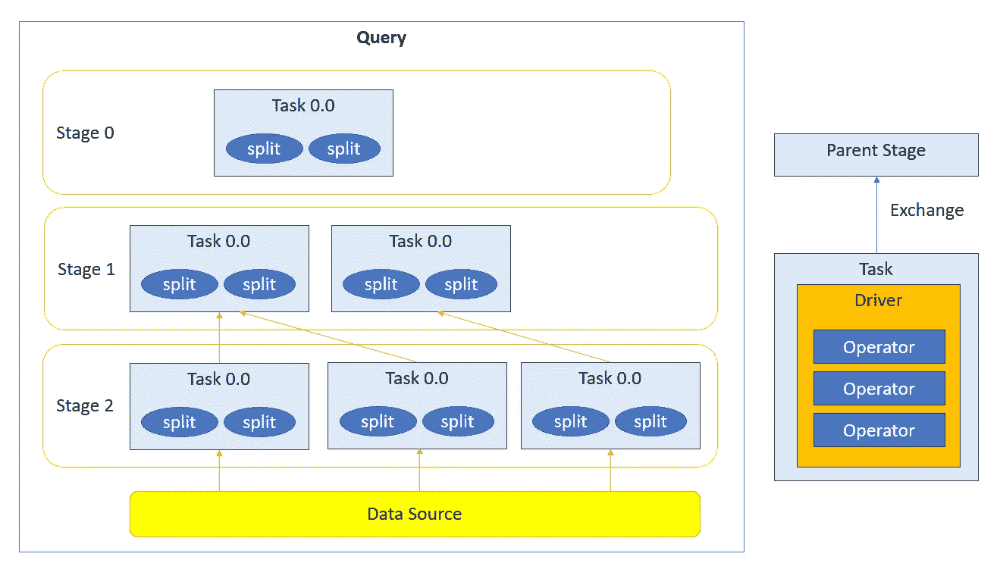
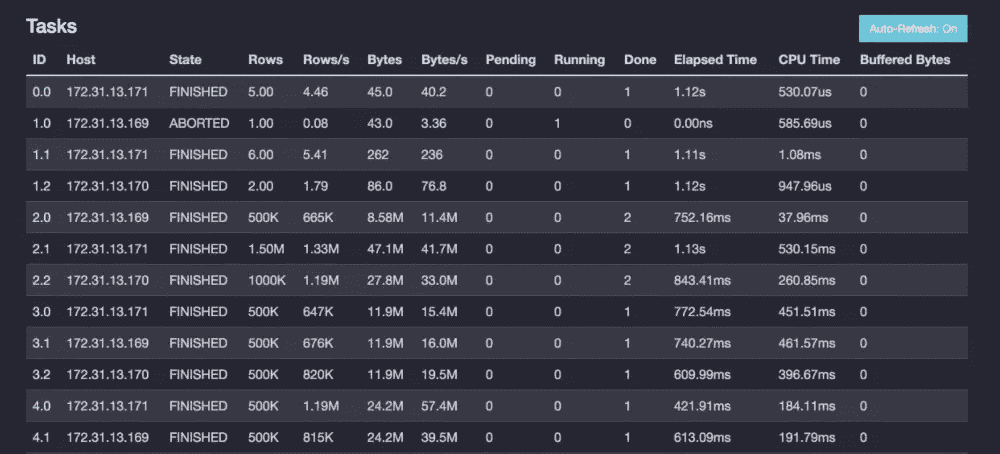
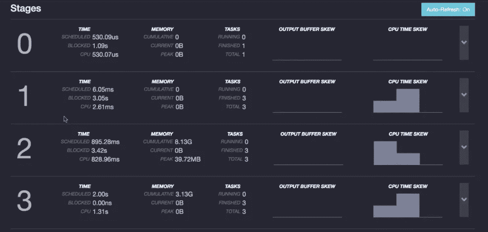

# 很快——简介

> 原文：<https://blog.devgenius.io/presto-introduction-10b3ba5020e8?source=collection_archive---------0----------------------->


针对大规模数据的快速分析查询

Presto 是一个开源的分布式查询引擎，它提供了一个统一的 SQL 接口来访问不同的数据源。该引擎使用内存计算来避免磁盘 i/o 开销。它利用分布式计算。分布式特性允许并行数据拉取。Presto 将存储和计算分离，允许两者独立扩展。



## 普雷斯托的特点

*   互动和联合
*   组合不同数据源的能力
*   统一的 SQL 界面(2011 SQL)，学习曲线更短
*   后端的可扩展插件
*   在不需要接收的地方查询数据
*   运行时字节码生成
*   矢量化列处理
*   优化的 ORC 和拼花阅读器

## 什么不是呢？

*   Presto 与 Hadoop、YARN 或 SPARK 无关
*   Presto 不是数据库
*   Presto 不是为 OLTP 工作负载设计的

## Presto 的使用案例

*   交互式查询
*   报告和仪表板
*   跨数据库的联合查询
*   莱克豪斯

## Presto 的组件



## 客户

*   CLI (prestocli.jar)
*   JDBC (presto-python-client)
*   PyHive

## 协调者

*   解析、分析、计划和安排
*   通过心跳监控员工
*   主机 web 服务器/ UI
*   调度器—调度器是协调器的一部分，负责将命令传递给工作器。它根据协调器创建的计划监控命令的正确执行。

## 发现服务

*   Worker 在启动时注册自己，协调器使用它来查找 worker 和其他服务

## 工人

*   负责并行性
*   执行任务
*   向协调者注册



## 连接器

*   特定数据库/存储引擎的驱动程序
*   元数据 API(由解析器/分析器使用)
*   数据位置 API(由调度程序使用)
*   数据流 API(由工作人员使用)
*   数据统计 API(由协调者使用)
*   插件是用 Java 写的

## Metastore

*   蜂巢还是胶水

## Presto Web 用户界面



*   8889(电子病历)，8080，8081
*   集群概述和查询详细信息
*   显示、实时计划、舞台表演和其他查询统计

## 管理工具

*   prestoadmin (python 包)
*   安巴里-普雷斯托-服务
*   预存储查询预测器
*   预存储查询分析器
*   预丝整合滑块

## 配置设置

```
└───presto
    └───etc
        └───catalog
        |   └───hive.properties
        |   └───postgresql.properties
        └───config.properties
        |───jvm.config
        |───log.properties
        |───node.properties
```

**节点属性**

> 节点.环境
> 节点. id
> 节点.数据-目录
> 目录.配置-目录
> 插件.目录

**log.properties**

> com.facebook.presto

**jvm.config**

> -Xmx(高达节点内存的 80%)

**配置属性**

> 协调器
> 节点-调度器.包含-协调器
> http-server.http.port
> 发现-服务器.启用
> 发现. uri

**postgresql.properties**

> connector.name
> 连接-url
> 连接-用户
> 连接-密码

**其他配置道具**

> query . max-memory-per-node
> query . max-memory
> 分布式连接-禁用

## 询问



presto 中的查询步骤

*   客户端向协调器发送 SQL 查询
*   首先，解析查询并生成 AST。
*   优化器/分析器使用元数据 API 获取分区信息
*   根据生成的 AST，生成一个逻辑计划。
*   计划由一个或多个片段组成
*   一个片段由一个物理阶段表示
*   任务具有管道，这是执行驱动程序的模板
*   执行驱动程序对数据分割进行操作
*   分割是实际数据处理的一部分
*   驱动程序包含运算符
*   调度程序负责负载平衡，并将工作分配给工作进程
*   工作人员扫描远程存储中的文件和数据块
*   工作人员合并结果并将其发送回客户端



在 presto 中访问数据的模式如下所示

> 目录.架构.表



## 贮藏

Presto 将任务期间的中间数据存储在其缓冲区缓存中。但是这不是用作缓存层。有像 [Alluxio](https://www.alluxio.io/presto/) 这样的第三方解决方案为 Presto 缓存提供了一个多层层。

*注意:使用 RaptorX 可以将分层缓存添加到 presto 中。*

## 部署选项

*   [Kubernetes Presto 操作员](https://github.com/prestodb/presto-kubernetes-operator)

## 安全性

*   认证到 presto(无，Kerberos，LDAP)
*   对连接器的身份验证(取决于实现)
*   快速授权
*   连接器系统中的授权(服务用户)
*   支持兰杰和 HTTPS
*   未来管道(认证 presto web UI、Knox、Sentry)

## 限制

*   不容错(失败时必须重新启动查询)
*   内存约束聚合、连接和窗口
*   不完全支持 SQL
*   协调器是单点故障

## 需要考虑的事项

*   运行后台作业以终止/清除长时间运行的作业
*   通过使用 Presto 的 [JMX 连接器](https://prestodb.io/docs/current/connector/jmx.html)、 [Presto Rest API](https://github.com/prestodb/presto/wiki/HTTP-Protocol) 或 [presto-metrics](https://github.com/xerial/presto-metrics) 将缩放与 Presto 指标集成。
*   对于非常高的流量要求，使用位于路由器/网关后面的多个集群。[从 Lyft](https://github.com/lyft/presto-gateway) 查这个。Twitter 利用 presto 路由器的智能调度。同样，优步使用 Prism 来路由流量。

# 托管产品:

*   EMR 上的 Presto
*   AWS 雅典娜
*   星爆急变
*   阿哈纳云为急变

## 使用 Presto 的公司

*   Slack、Atlassian、脸书、Airbnb、网飞、沃尔玛、优步、Linkedin

快乐的数据查询！！