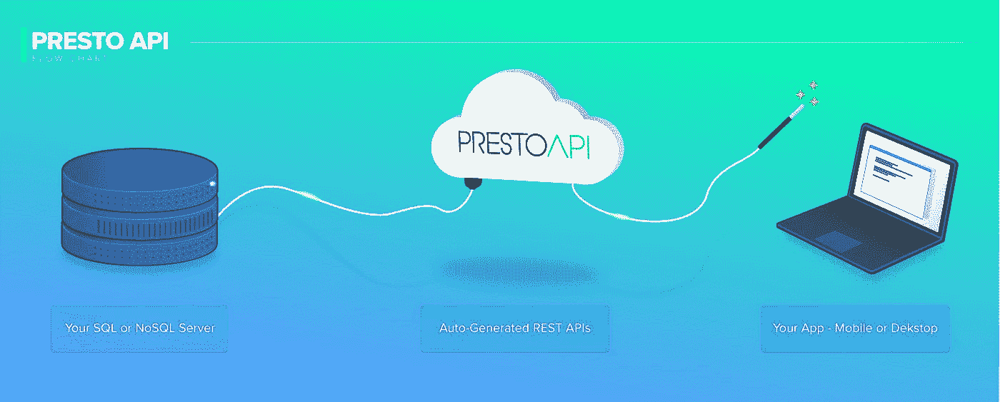

# PrestoAPI 是新的无代码工具，用于生成 RestAPI

> 原文：<https://blog.devgenius.io/prestoapi-is-the-new-no-code-tool-to-generate-restapis-24607717d28f?source=collection_archive---------33----------------------->

照片由 [XPS](https://unsplash.com/@xps?utm_source=medium&utm_medium=referral) 在 [Unsplash](https://unsplash.com?utm_source=medium&utm_medium=referral) 上拍摄

未来的代码工具！[**PrestoAPI**](https://www.prestoapi.com)**是唯一一款无需代码，基于云，生成 REST API 的工具。它允许开发人员和编码人员从任何数据源即时生成 RESTful APIs，消除了现代移动、web 和物联网应用程序的后端开发。这意味着您有更多的时间进行前端开发，而花在后端的时间更少。**

**PrestoAPI 实际上是由开发人员为他们自己的项目开发的，他们需要一个像这样的工具。他们发现自己花太多时间在后端工作，而没有足够的时间在前端工作，导致压力很大的通宵和大量咖啡。**

**Presto 的愿景是为所有级别的编码人员和开发人员提供一个自动化工具，让他们有时间开发其他重要领域的技能。**

**如果您还没有在不到 30 秒的时间内为任何东西生成一个完整的文档化的、标准化的、实时的和安全的 REST API，那么就试试 PrestoAPI 免费版吧。**

> **就像 1，2，3 一样简单！**
> 
> ****连接****
> 
> **使用连接字符串或服务器地址轻松连接到您的数据库。**
> 
> ****自定义****
> 
> **通过选择要创建、读取、更新或删除的数据来自定义您的 API 方法。**
> 
> ****构建****
> 
> **转眼间。您的 API 已经可供前端开发团队使用。不需要后端。**

**[PrestoAPI](https://www.prestoapi.com) 目前允许您从任何流行的数据库系统中进行选择，如 SQL Server、MySQL、PostgreSQL、MongoDB 和 Oracle 数据库系统。**

****

**预托阿皮**

**社交媒体@ presto API | Support@PrestoAPI.com |[https://www.prestoapi.com](https://www.prestoapi.com/)**