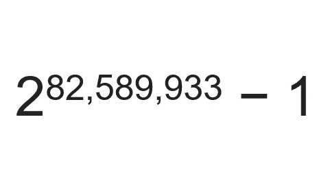

# 素数和厄拉多塞筛

> 原文：<https://blog.devgenius.io/prime-numbers-and-the-sieve-of-eratosthenes-47f192568c8?source=collection_archive---------6----------------------->

## 有趣的讨论质数和厄拉多塞筛变得容易！


照片由[拍摄，于是](https://unsplash.com/@hencetheboom?utm_source=medium&utm_medium=referral)[上的吊杆](https://unsplash.com?utm_source=medium&utm_medium=referral)被卸下

自古以来，质数就引起了人类的兴趣，几个世纪以来，质数一直是研究的主题。这是人类遇到的最有趣的话题之一。

> 质数是一个大于 1 的数，它不是两个较小自然数的乘积。

人们仍在试图发现新的质数，截至 2020 年 1 月发现的最大质数是一个以 10 为基数的 24，862，048 位数字。



截至 2020 年 1 月已知的最大素数。

你可能想知道为什么我用了一张显示 73 的图片。关于 73 的有趣事实:

1.  这是第 21 个质数(*)没那么好玩吧！继续阅读*。
2.  它的镜像 37 是第 12 个质数，是 21 的镜像。
3.  21 是*挂在帽子上的产品*，7 和 3。
4.  73 写的二进制格式是 1001001 这是一个回文。意思是 1001001 的镜像也是 1001001。

我从电视连续剧《生活大爆炸》第 73 集了解到这个事实。

> 唯一的偶数质数是 2

# 厄拉多塞的筛子

如果你正在准备编码面试，那么这个算法可能对你有用。

厄拉多塞筛是一种在 1 到 n 的范围内寻找素数的算法

这种算法在竞争性编程或面试中可能会派上用场。

当 N 小于 1000 万左右时，这种寻找素数的方法是寻找小于 *N* 的素数的最有效方法之一。

> 筛选方法---->生成一个包含素数的数组。

你曾经试图在前 50 个数字中寻找质数吗？*哎呀，我在骗谁呢？*

让我们用这种方法找到他们。

首先把它们写下来👀。我已经做了，别担心😄。

```
1  2  3  4  5  6  7  8  9  10
11 12 13 14 15 16 17 18 19 20
21 22 23 24 25 26 27 28 29 30
31 32 33 34 35 36 37 38 39 40
41 42 43 44 45 46 47 48 49 50
```

现在擦掉 2 的倍数，除了 2。

```
1  2  3     5     7     9
11    13    15    17    19
21    23    25    27    29
31    33    35    37    39
41    43    45    47    49
```

现在擦掉 3 的倍数，除了 3。

```
1  2  3     5     7     
11    13          17    19
      23    25          29
31          35    37
41    43          47    49
```

现在擦掉 5 的倍数，除了 5。

```
1  2  3     5     7     
11    13          17    19
      23                29
31                37
41    43          47    49
```

现在擦掉 7 的倍数，除了 7。

```
1  2  3     5     7     
11    13          17    19
      23                29
31                37
41    43          47
```

现在擦掉 1，因为它不是质数。

```
 2  3     5     7     
11    13          17    19
      23                29
31                37
41    43          47
```

这就是了。前 50 个数字中的所有质数。

那么我们做了什么？

1.  写下所有数字直到 50。
2.  删除所有偶数，因为它们是偶数😜。因为它们不是质数。
3.  从 3 开始移除剩余数字的倍数。
4.  请注意，我们不计算 4、6 等的倍数，因为当我们删除偶数时，它们已经被删除了。
5.  同样，在这个例子中，我们只需要计算到 7 的倍数。因为 7 的平方是 49，如果在下一次迭代中，我们取数字 11，它的平方是 121 大于 50，所以不需要计算它的倍数。
6.  关于倍数的计算，我们只计算一个数的倍数，如果它的平方小于我们需要寻找素数的范围中的最后一个数。

下面的代码是厄拉多塞筛子的一个功能，在前 N 个自然数中寻找素数。

我希望你好好阅读了这篇文章，它是有帮助的。感谢阅读。祝你愉快！