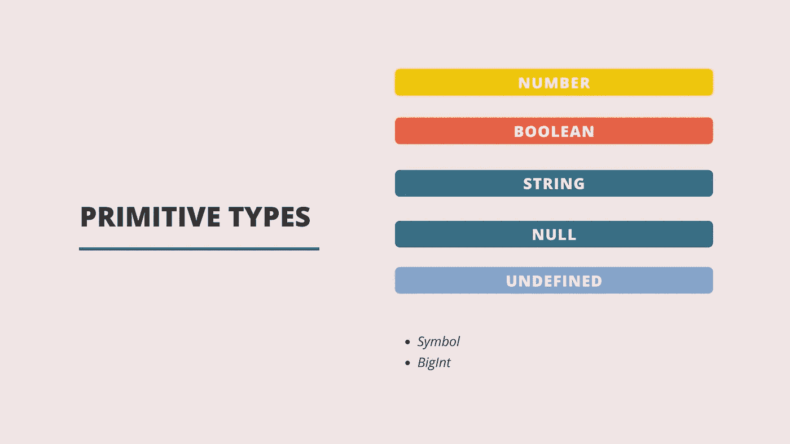

# JavaScript 中的原始数据类型

> 原文：<https://blog.devgenius.io/primitive-data-types-in-javascript-b1efca0610f7?source=collection_archive---------8----------------------->



## 什么是原始类型？

数据可以有各种形状和大小。我们使用术语数据类型来指定特定值的类型。

在我们的日常语言使用中，我们区分字母和数字，通常，我们会出于不同的目的使用它们。在编程上，也没什么不同。我们称最基本的数据类型为原语。

基本数据类型的主要特征是:

*   它不是一个对象(键和值的集合)
*   它没有自己的方法(作为函数的对象的属性)
*   它是不可变的(它不能被改变并且是只读的)。

## JavaScript 中的原始数据类型

JavaScript 中的基本数据类型有:

*   **号**
*   **布尔**
*   **弦乐**
*   **空值**
*   **未定义**
*   **符号**
*   **BigInt**

让我们简单看一下这些类型中的每一种！

## 数字

在 JavaScript 中，只有一种类型的数字，可以是任何带或不带小数的数值。我们可以用整数，正数和负数。我们也可以使用小数(也称为浮点值)。

```
50
//Whole number1
//Positive number-1
//Negative number0.1
//Decimal
```

## 布尔代数学体系的

两个值之一 true 或 false(未用引号括起来)。有点像说是或不是。

```
truefalse
```

## 线

字符串数据类型是指任何一组用单引号或双引号括起来的字符。以下都是字符串的示例:

```
"I am a string";'I am a string';
```

## 空

不表示任何内容或非值，但这通常是有意设置的。您可以创建一个变量，并有意将该变量的值设置为 null。例如:

```
let myEmptyVariable = null;
```

## 不明确的

Undefined 也表示没有值。与 null 相反，没有定义值的变量或没有声明(根本没有创建)的变量将被赋予 undefined 值。

```
let a;
console.log(a);// ---> Returns undefined
```

未定义常常以错误的形式给我们。如果没有设置返回值，函数将返回 undefined。

## 标志

JavaScript 的 ES6 版本中引入了符号。它们是唯一的标识符，不能改变，可以使用函数符号()创建。

```
const firstSymbol = Symbol();
const secondSymbol = Symbol();console.log(firstSymbol === secondSymbol);// ---> Returns false
```

## BigInt

适用于表示大数值，特别是超过 15 位数的数值。您可以通过将 n 放在文字数字的末尾来创建它。它也可以通过使用 BigInt 构造函数并将值传递给参数来创建。

```
const ourInteger = 1118998854361892n;const ourSecondInteger = BigInt(1118998854361892);console.log(ourSecondInteger);// ---> Returns 1118998854361892n
```

如果您想观看本文的视频版本，请访问此处的。

请随时张贴任何意见，问题或反馈！

在 Instagram 上关注我[这里](https://www.instagram.com/codecup_dev/)。

我还有一门关于这个话题以及更多内容的课程。

下次见！