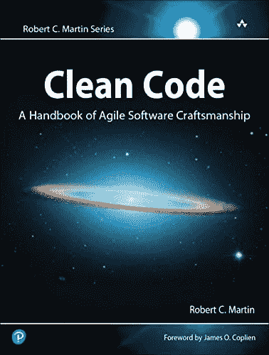

# 原始执念反模式

> 原文：<https://blog.devgenius.io/primitive-obsession-anti-pattern-83fb5dcd5cc2?source=collection_archive---------5----------------------->

## 通过减少来自应用程序核心的代码味道来改进您的代码

丹尼尔·伊德里在 [Unsplash](https://unsplash.com?utm_source=medium&utm_medium=referral) 上的照片

原始的痴迷是一种表明代码质量差的气味。我们认为 *boolean、string、int、*和 *float* 是 PHP 中的原始类型。它们是不可避免的构建块，但是它们可以被安排到有意义的领域对象中。考虑以下对象:

## 购物者实体

## 订单实体

这些不再是合适的对象，而仅仅是没有任何有意义的行为的值持有者。处理如此大量的属性很容易出错。想象以下业务操作:

*   更改用户的家庭地址
*   更改用户的帐单地址
*   分配订单的交货地址

每个地址包含相同简单原始类型的五个独立属性，当从一个地方复制值到另一个地方时很容易出错，例如，您可以很容易地将 *addressLine2* 分配给 *addressLine1。*由于**所有属性都是相互独立的**，因此也有可能只有部分地址会改变，而其余部分会保持不变。

如果您碰巧有一些关于地址的额外逻辑，您必须在每个实体之间复制这个逻辑，或者将这个逻辑移动到一个单独的服务。

购物者的名字也有同样的历史。目前有可能错误地只设置了名字，但是姓氏将会消失。

从长远来看，拥有有意义的值对象对你有帮助。不变性是你能在代码中引入的最好的东西。

让我们重构购物者和订单实体。很容易发现值对象的候选对象，它们通常共享名称的某个部分。

## 重构后的购物者实体

## 重构后的订单实体

前面提到的值对象现在可以引入一些有趣且易于测试的行为。它们被视为一个整体，因此不可能只改变一部分。如果你想改变值对象的任何一点，你应该创建一个新的。

一名购物者是女性，并且与另一名购物者结婚？当然，我想这是常有的事。这只是一个夸张的例子来证明不变性。

有意义的对象而不是日期时间可能会引入方便的行为。传递当前日期允许简单的单元测试。

给对象分配地址现在变得轻而易举:

由于值对象是不可变的，并且不暴露任何设置器，所以它们可以在整个应用程序中安全地共享。如果您出于某种原因需要在值对象中使用 setter，请确保实体 getter 返回值对象的克隆(以防止状态在实体外部被修改)。)

货币对象是价值对象教程的典型场景:

不可变货币对象允许安全的数学运算:

对值对象的持久性有很好的支持。

*   对于教义，有[个可嵌入的](https://www.doctrine-project.org/projects/doctrine-orm/en/2.13/tutorials/embeddables.html)
*   对于拉勒维尔的雄辩有[价值对象铸造](https://laravel.com/docs/8.x/eloquent-mutators#value-object-casting)

值对象很棒，但不是每个应用程序都需要它们。如果是一个简单的没有任何逻辑的 CRUD app，很可能会过度工程化。对于富应用程序，它们被证明是最有用的，因为你可以免费获得优秀的验证。

也就是说，你应该先问问自己，处理这些额外课程的成本是否超过了它们带来的好处。

像往常一样，我也想推荐我读过的关于干净代码的最好的书。任何人书架上的必备——著名马丁大叔的[《干净的代码】 :](https://amzn.to/3wAVePw)

资料来源:Amazon.com

有什么疑问吗？想法？请给我留下你的看法。让我们一起让我们的代码变得美丽。订阅我的出版物，获取更多类似的文章，成为更好的开发人员。

这个故事对你有价值吗？请留言支持我的工作👏鼓掌表示感谢你知道你可以不止一次鼓掌吗？🥰 *谢谢你。*