# 用 Python 实现主成分分析

> 原文：<https://blog.devgenius.io/principal-component-analysis-with-python-ddeb284fd1d4?source=collection_archive---------15----------------------->

## 什么是主成分分析，它的用途是什么，分析是如何进行的？


照片由[泰沛](https://unsplash.com/@agforl24?utm_source=medium&utm_medium=referral)拍摄

# 主成分分析

主成分分析(PCA)是一种数据挖掘方法，是一种解释数据集中变量之间关系的方法。

*   主成分分析用于消除依赖结构或降低数据集的维数。
*   如果数据集中的度量和方差彼此接近，可以使用原始数据矩阵，而如果度量单位不同且相距较远(年龄、工资等)，则建议使用标准化数据矩阵。).
*   主成分分析的目的是找到在最大水平上代表观察变量方差的成分。
*   它通过将数据从高维空间减少到低维空间，使得检查更容易。
*   这是一种消除不必要(低优先级)数据的方法。
*   PCA 之后，我们拥有的数据变得独立。
*   我们有多少变量，就有多少分量，但解释实际意义上的方差的分量是主分量。

# 如何进行主成分分析？

## 1-准备数据集

首先，让我们看看我们的数据集。如果我们的变量的单位和度量彼此相差甚远，我们就需要将其标准化。

```
import pandas as pd 
import numpy as np 

path = '../dataset.csv'
df = pd.read_csv(path)
df = df.drop_duplicates()
df.head()
```

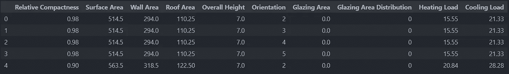

原始数据

如果你在理解数据集方面有困难，你可以点击这里获取元数据。

我们需要将数据标准化，以便能够比较苹果和梨。

```
df_origin = df
for col in df.columns:
    df[col] = (df[col] - df[col].mean()) / df[col].std()
df_st_backup = df
df.head()
```

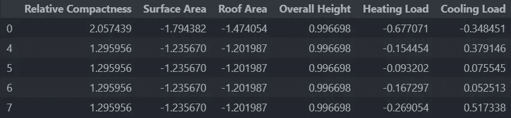

标准化数据

我们来看一下数据，有自变量吗？

```
R = df.corr()
np.round(R,2)
```

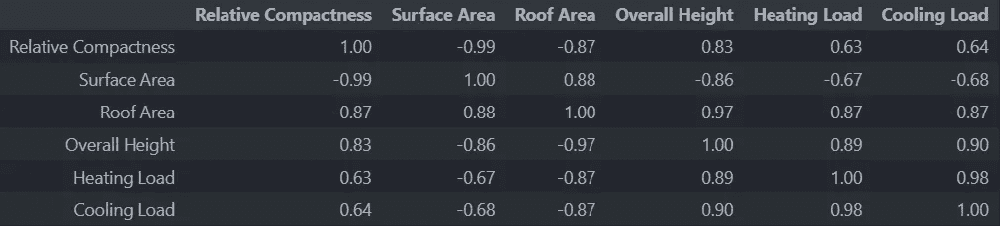

相关矩阵

将它形象化，以获得更多的见解。

```
import seaborn as sns
import matplotlib.pyplot as plt 

fig, ax = plt.subplots(figsize=(16,9))
ax = sns.heatmap(np.round(R,3), annot=True)
plt.show()
```

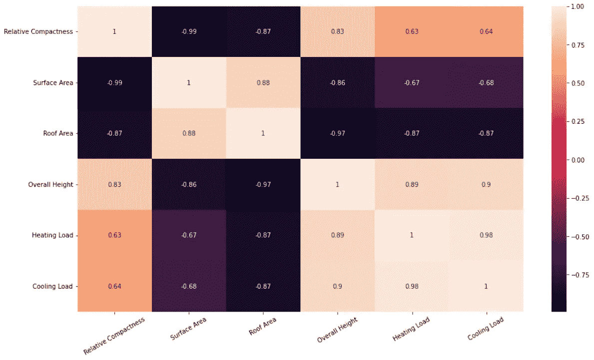

相关矩阵的可视化

是的，乍一看我们可以说有因变量，但我们也需要从统计上检验这一点。

## 2-可以应用主成分分析吗？

为了应用主成分分析，我们需要执行球度测试:

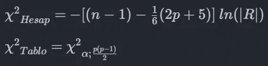

球形度试验

我们需要找到如上所述的计算和表格值。我们将使用这些计算和表格值进行测试的假设如下:

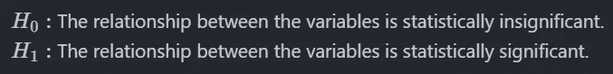

假设

如果卡方计算值大于卡方表值，这意味着我们拒绝零假设，我们可以执行主成分分析。

```
import math

R_det = np.linalg.det(np.array(R))

chi_H = -(((len(df)-1) - 1/6*(2*(len(df.columns)+5)))*math.log(R_det))
chi_H == 10585.965872060862
```

如果我们计算上面的公式，我们会发现卡方计算的结果是 10552060862。

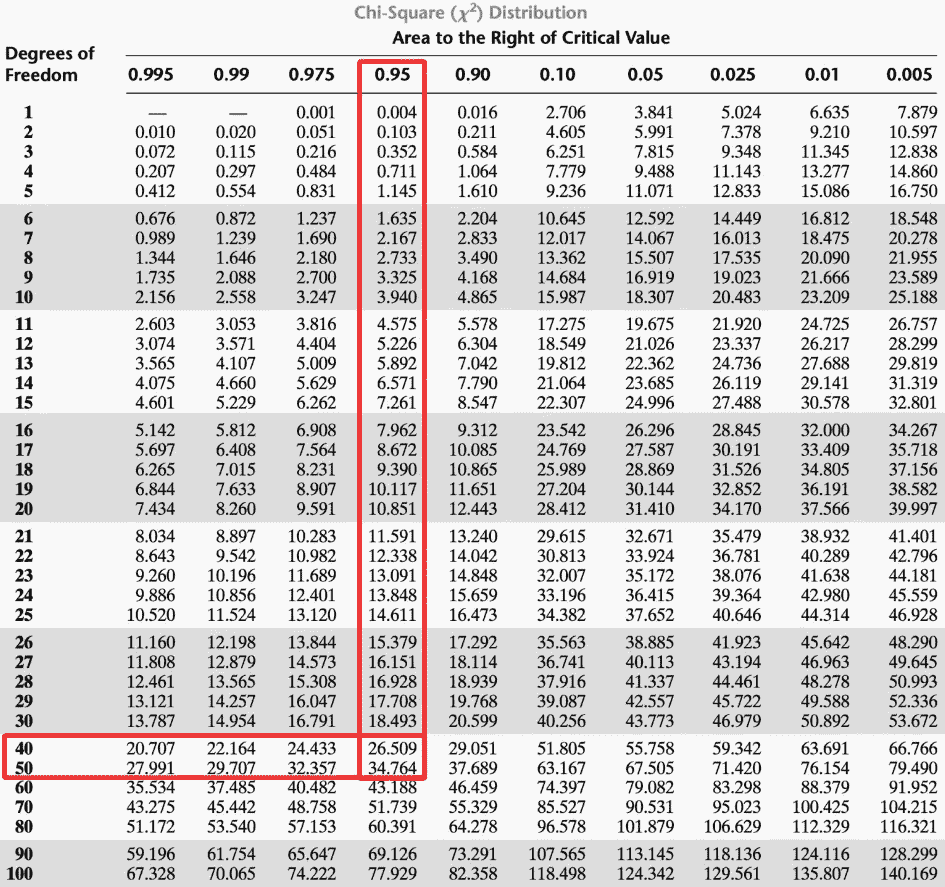

卡方表

在卡方表中有 5%的误差，我们的 45 度自由度值落在 29.051-34.764 之间。

由于计算值大于本节中的表值，我们可以得出结论，我们可以拒绝零假设。

因此，我们可以有 95%的把握说，我们的数据集中变量之间的关系在统计学上是显著的，并且可以进行主成分分析。

## 组件得分矩阵

我们使用下面的公式找到的λ值将是我们的特征值。

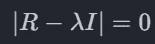

特征值公式

```
from numpy import linalg as LA

lambdas, T = LA.eig(np.array(R))
pd.DataFrame(lambdas).T
```

使用上面的代码，我们可以从 R(相关矩阵)中获得特征值和特征向量(T)矩阵。

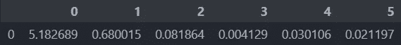

特征值

我们得到如上所示的熊猫系列输出。

*   可以说，对于λ≥1，有效维数为 1。但也可以评论为，对于 Lambda ≥ 0.80 (0.80 为可定制水平)，显著维度为 X。
*   检查 Lambda 值时要考虑的另一个问题是，如果第一个值超过阈值，我们只考虑其他值——阈值取决于您希望主成分在多大程度上代表原始数据集，它可以在 0–1 的范围内以百分比值的形式增加。
*   目标是找到尽可能少的重要维度。

```
count = 0 
for i in lambdas:
    if i >= 0.8:
        count+=1
        break
count == 1
```

我们可以这样计算我们的 Lambda 值有多少通过了阈值，结果是 1。这意味着我们的第一个λ值已经超过了阈值。我使用 break 命令在满足条件时停止，以便达到阈值。

在特征向量标题下面的代码中，我们找到了用 T 表示的特征向量矩阵；

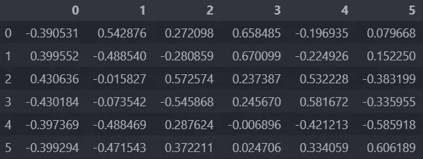

特征向量矩阵

这里我们需要注意的是，特征向量矩阵是一个方阵， *pxp 是*变量的个数。

## 主成分矩阵(V):

主成分矩阵(成分得分矩阵)是根据特征值和特征向量重构数据集得到的矩阵。该矩阵显示数据集的重要方向，通常用于数据分析。

组成矩阵。

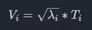

主成分矩阵公式(五)

可以使用上面的公式获得主分量矩阵。

```
V = pd.DataFrame()
for i in T:
    V[f"V{i+1}"] = np.sqrt(lambdas[i])*T[i]
V
```

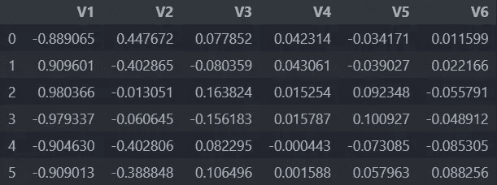

主成分分析矩阵

*   分量矩阵应该用它的绝对值来解释。
*   根据有效分量的数量选择最佳向量。最佳向量是指最能解释我们的变量的向量。
*   所选向量将是变量权重最大的向量。

```
V = V.abs()
pd.DataFrame(np.round(V.mean(),2)).T
```

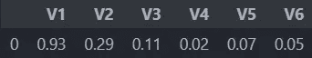

平均分数特征向量

V1 向量解释了我们的数据集更多，所以我们可以考虑 V1 向量作为一个重要的主成分。然而，让我们仍然检查 V1:V1 向量来解释我们的数据集更多，所以我们可以考虑 V1 向量作为一个重要的主成分。然而，让我们还是来考察一下 V1:

```
v1 = V.iloc[:,0]
pd.DataFrame(v1).T
```

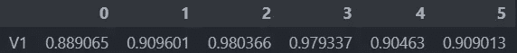

每个变量的特征向量分数

由 V1 重要主成分向量解释的变量的百分比，从上到下依次为:

*   X1(相对紧密度)%88.90
*   X2(表面积)%90.96
*   …

然而，一些变量没有得到足够好的表示，因此我们可以将这个向量用于它足够好地表示的变量，而不是将整个数据集分配给单个向量。

## 累积矩阵(W)

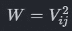

累积量公式

通过取分量矩阵(V)的每个变量的平方，获得平方载荷矩阵(W)。

*   列 sum 表示由主成分解释的变量的总变化的百分比。
*   行和给出了由主成分解释的变量的百分比。

例如，W 矩阵的行和表示由主成分解释的总数据集的百分比，而列和表示由主成分解释的变量的总变化的百分比

```
W = V**2
W
```

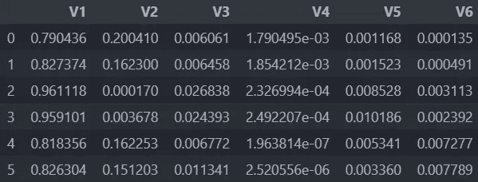

累积矩阵(W)

我们之前选择了 V1 作为最能代表我们数据集的主成分向量，因此将 V1 列的总数除以 p(变量的数量)可以显示出由我们的主成分解释的总变化的百分比:

```
W['V1'].sum()/len(W.columns) == 0.8637815009306168
```

在这一部分，我们可以说 V1 向量的主成分可以解释数据集中变量总变化的 86.37%。

在这一部分，我们可以说 V1 向量的主成分能够解释数据集变量总变化的 86.37%。这意味着我们可以使用主成分创建一个新的数据集，该主成分以%86.37 的比率表示变量的总变化，并使用它来代替我们的具有较少列的原始数据集。

## 主成分对数据集的调整:

让我们想象一个有 3 个变量(X1，X2，X3)的数据集。让用主成分创建的向量是(Y)来代替这些变量。在这种情况下，这个 Y 变量创建如下:

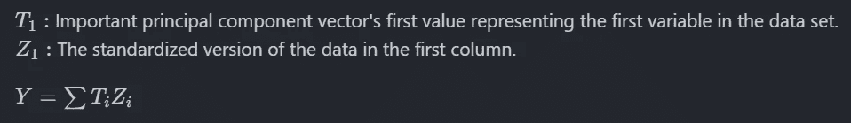

建模公式

```
for col in df.columns:
    df[col] = T[0][df.columns.get_loc(col)]*df[col]
df
```

如上式所示，我们应该将每一列中的每个标准化值乘以所选特征向量的相应索引。然后，我们应该按列将这些乘法的结果相加，并将每一行的结果写入 Y 列。

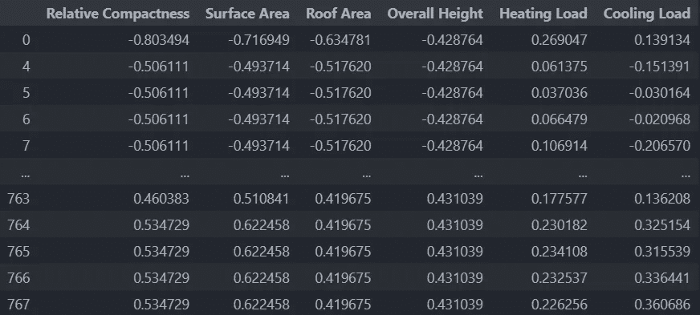

标准化原始数据

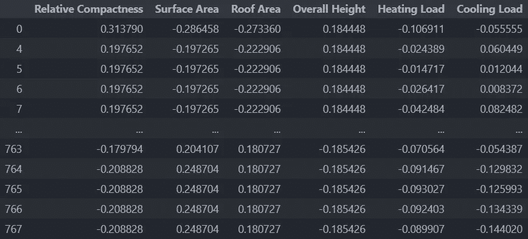

用特征向量加权的数据

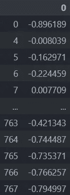

y 数据集

## 报道想法

如上所述，我们的原始数据集总共有 6 个变量，但我们用主成分分析将其减少到一个变量。这使我们能够更容易地处理较小的数据集。

在此过程中，我们是否丢失了数据/信息？

当然，我们做到了。如上所述，我们的模型可以解释原始数据集中总变化的 86.37%。通过在 13.63%的信息损失的情况下将数据集减少到原来的六分之一，我们使它更易于使用。然而，虽然 PCA 将数据集减少到更少的列，但是所选择的重要主成分向量显示了数据集中最能代表变化的方向，因此丢失数据集中重要信息的风险更小。

## [计]元数据

*   [能效数据集](https://archive.ics.uci.edu/ml/datasets/Energy+efficiency#)