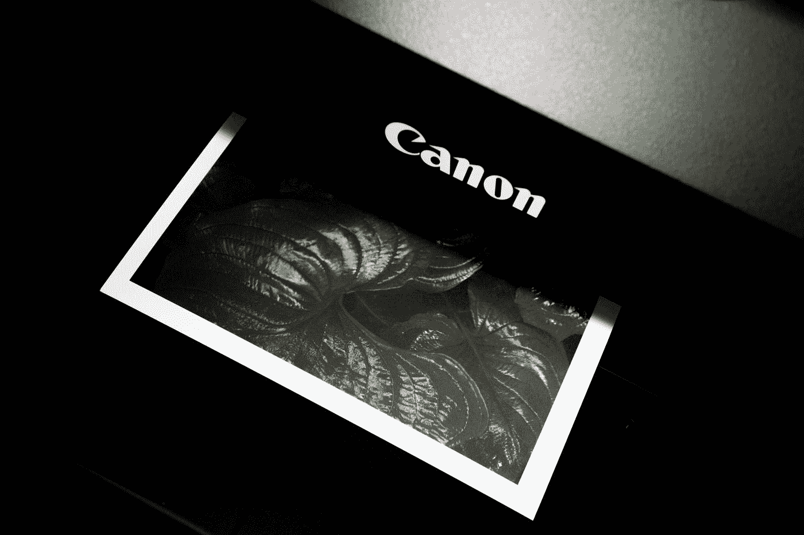

# 仅打印网站的样式表

> 原文：<https://blog.devgenius.io/print-only-style-sheets-for-your-website-16f2822fe5df?source=collection_archive---------39----------------------->



由[约书亚·富勒](https://unsplash.com/@joshuafuller?utm_source=medium&utm_medium=referral)在 [Unsplash](https://unsplash.com?utm_source=medium&utm_medium=referral) 拍摄的照片

当想到网站时，我们通常最关心的是它们在浏览者的任何设备上看起来是什么样子。我们致力于确保网站在移动设备以及笔记本电脑或台式机上的外观和功能。

但是有一点经常被忽略，那就是页面打印出来后的样子。

您知道可以创建仅适用于打印的样式表吗？真实的故事。使用这个打印样式表选项，我们可以在打印时隐藏我们不希望看到的内容，或者我们可以在打印页面时添加我们希望看到的内容。

例如，您可以在打印页面时隐藏表单或按钮，或者您可以添加一个徽标并链接回您的网站，它们只显示在打印文档的底部。

# 我们如何添加一个只打印的样式表？

添加只打印样式表就像添加任何其他样式表一样简单。唯一的区别是我们将媒体属性设置为什么。

```
<link rel="stylesheet" media="print" href="print.css">
```

您可以在示例中看到，我们将媒体属性设置为 print。这将告诉浏览器仅在打印页面时应用该样式表。简单。

但是，如果我不想要一个单独的样式表，而是希望它包含在我当前已有的样式表中，该怎么办呢？

那是可能的。在当前样式表中，可以使用媒体块添加打印样式。

```
@media print {

}
```

该媒体块中定义的任何样式将仅适用于打印。不错！

**打印时隐藏内容**

我们经常使用打印样式来隐藏打印时不相关的内容，比如按钮。您可以使用 display 属性来隐藏它，就像您通常所做的那样。

`button { display: none; }`

**用 CSS 生成的内容添加内容**

我们也可以使用只打印样式表来添加内容。您可以通过在屏幕样式表中设置一个隐藏它的样式，并在打印样式表中设置另一个显示它的样式来做到这一点。或者，您可以使用 CSS 生成的内容来添加内容。

例如，您可能想要在打印文档的底部添加一个网站链接。假设您的页面内容包含在一个具有 content 类的元素中。将以下内容添加到您的打印样式表中会将一个简单的文本引用添加回您的站点，该文本引用仅在页面打印时添加到内容之后。

```
.content::after {
  content: "Visit www.mysite.com for more.";
}
```

您还可以添加 CSS 来扩展页面中的任何链接，以便在打印时显示它们的 URL。否则，链接在打印文档上就没有用了。这样，至少在打印时，可以为任何链接提供 URL。(请注意，您可能需要小心不要弄乱任何格式)

```
a[href]:after {
  content: " (" attr(href) ")";
}
```

当您进入只打印样式表时，您可以做更多的事情。比如配置页边距之类的事情。

如果你有一个用户打印内容的网站，那么就值得研究一下只打印样式表，并利用其中的一些功能为你和你的用户带来最大的好处。

为了更深入地了解打印样式表的可用选项，你可以[访问这个网站](http://edutechwiki.unige.ch/en/CSS_for_print_tutorial)。