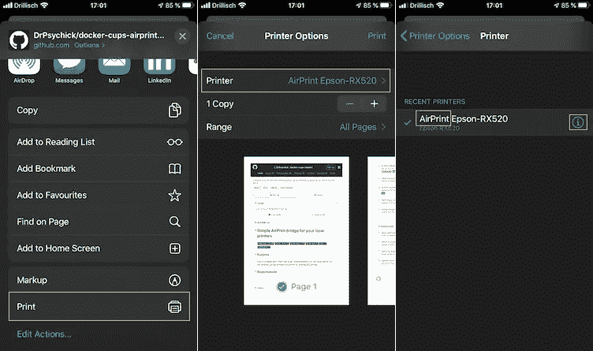

# 在旧打印机上无线打印

> 原文：<https://blog.devgenius.io/print-over-the-air-with-docker-7146d7d41272?source=collection_archive---------3----------------------->


照片由[阿诺德·弗朗西斯卡](https://unsplash.com/@clark_fransa?utm_source=unsplash&utm_medium=referral&utm_content=creditCopyText)在 [Unsplash](https://unsplash.com/s/photos/print-laptop?utm_source=unsplash&utm_medium=referral&utm_content=creditCopyText) 拍摄

## air Print | Docker | CUPS | Print | Google 云打印| Multi-Arch

## 你有一台旧打印机仍然可以工作，但不支持 AirPrint？你在本地网络中也有一个 linux 盒子，你可以在那里运行 docker 容器？那么这本指南是给你的。

> **更新**:由于反馈，docker 镜像现在可以用于多种架构
> 
> **更新:**感谢更多反馈，Avahi 打印机名称可以配置为使用打印机的“描述”和“位置”。
> 
> **更新:**谷歌云打印不再包含在图片中，因为它已停产。
> 
> **支持我**:通过我的推荐链接加入 Medium[https://drpsychick.org/membership](https://drpsychick.org/membership)

这个解决方案和这个指南的起因是我的懒惰和我孩子的方便。我只是不想在他们需要打印东西的时候总是跑着去，因为现在——一切都是通过手机完成的……

长话短说，这就是你如何在你的本地网络中安装一个本地专用的 AirPrint 桥。它甚至支持添加你自己的 SSL 证书——全部通过环境变量，因为我相信[https://12factor.net/config](https://12factor.net/config)

## T 何棘手的部分

关于这个设置，我们将要运行的 CUPS 不喜欢 docker 的端口转发。此外，这个 docker 映像还运行一个 avahi 守护程序(Bonjour)来通告网络上的打印机，这很可能会与您的主机操作系统的端口发生冲突。

好消息是 linux 上的 docker 附带了`macvlan`驱动程序，并允许您在本地子网上为 docker 分配一个专用 IP，就像它是一台真实的机器一样。但稍后会有更多内容…

# 1.首先让我们玩 Docker 图像

并查看您的打印机是否受支持。毕竟，当 CUPS 不能很好地支持您的打印机时，您不想在设置上投入时间。

以下命令启动一个名为`cups-setup`的容器，并允许远程访问。`lpinfo, lpadmin`和`lpoptions`允许您在控制台的容器内搜索打印机的驱动程序。您也可以跟随 URL 并通过 web 界面设置您的打印机进行测试。

一个可以玩的容器

有了这个设置，您可以进入 CUPS web 界面并打印一个测试页面，看看结果是否正确。如果一切顺利，现在您已经为本地网络配置了您的专用容器。

# 2.准备桥接网络，

因此，我们可以创建一个 docker 网络，它可以使用您本地网络的 IP 地址，从而将 docker 容器“直接”暴露给本地网络。

我们为 docker 网络创建一个`macvlan`网桥接口，并将其连接到父网络接口——您的默认网络接口。这里棘手的部分是，我们还希望主机能够与 docker 容器对话，反之亦然，因此我们需要以下额外步骤。

如果不需要主机与容器对话，**可以跳过这个！**

(关于`macvlan`的教程，见[https://docs.docker.com/network/network-tutorial-macvlan/](https://docs.docker.com/network/network-tutorial-macvlan/)

我们要做的是:用`mac0`替换`eth1`，并将 DHCP IP 移动到`mac0`

> **重要**:用你的接口替换`eth1`，用你的接口的 MAC 替换`00:1d:60:1d:ea:46`。

```
# enable promicious mode, required for multiple MACs
sudo ifconfig eth1 promisc
# change MAC of eth1 (both interfaces must have different MACs)
sudo ip link set eth1 address 00:1d:60:1d:ea:47# bridge mac0 interface to eth1 with original MAC
# -> we want to keep our DHCP address
sudo ip link add mac0 link eth1 address 00:1d:60:1d:ea:46 \
  type macvlan mode bridge# make sure the following runs in one command as 
# it disconnects from the network shortly
sudo -- bash -c '(
dhclient -r eth1 && ip addr flush dev eth1 && ip neigh flush all;
dhclient mac0 && service resolvconf restart || dhclient eth1
)'
```

## 这些命令的详细功能:

*   `sudo ip link set eth1 address 00:1d:60:1d:ea:47`

在物理设备上设置稍有不同的 MAC。如果(比如在 ubuntu 上)你的桌面保持 dhclient 运行，它会在某个时候为接口获取一个新的 IP。这应该不会干扰我们的`mac0`接口。

*   `sudo ip link add mac0 link eth1 address 00:1d:60:1d:ea:46 type macvlan mode bridge`

这将一个接口`mac0`链接到父接口`eth1`，其 MAC 与`eth1`原来的 MAC 相同(这样 DHCP 将再次获得相同的地址)。这里有更多关于`macvlan`的信息:[https://docs.docker.com/network/macvlan/](https://docs.docker.com/network/macvlan/)

*   `dhclient -r eth1 && ip addr flush dev eth1 && ip neigh flush all`

首先，它会丢弃`eth1`的 DHCP 租约，然后删除与接口相关的所有地址，最后刷新整个 ARP 和 NDISC 缓存。

*   `dhclient mac0 && service resolvconf restart || dhclient eth1`

这将为 mac0 启动一个 DHCP 客户端，如果成功，它将重启 resolvconf，如果失败，它将尝试让`eth1`重新联机。

> 如果您希望**在主机**上保持这一点，将以下内容放入`/etc/network/interfaces`并重启。**尽管**小心，这将使接口从 Ubuntu 网络管理器中消失，因为它们是预先配置的。

```
auto eth1
iface eth1 inet manualauto mac0
iface mac0 inet dhcp
  pre-up   ip link add mac0 link eth1 address 00:1d:60:1d:ea:46 type macvlan mode bridge
  pre-down ip link del mac0 link eth1 type macvlan mode bridge
```

## 取消

此外，如果你对刚刚发生的事情不满意，这里有命令来撤销一切:

```
# reset MAC
sudo ip link set eth1 address 00:1d:60:1d:ea:46# get eth1 up again
sudo -- bash -c '(
dhclient -r mac0 && ip addr flush dev mac0 && ip neigh flush all
dhclient eth1 && service resolvconf restart
)'# delete mac0
sudo ip link del mac0 link eth1 type macvlan mode bridge# disable promiscious mode on eth1
sudo ifconfig eth1 -promisc
```

# 3.现在网络设置已经就绪，

我们创建了一个名为`localnet`的 docker 网络，它与我们的本地网络具有相同的子网。作为父节点，我们必须使用`mac0`，否则我们将无法从主机与容器对话。(如果你跳过了第 2 步，那么把这里的`eth1`作为父接口)。

```
docker network create --driver macvlan --subnet 192.168.1.0/24 --gateway 192.168.1.1 -o parent=mac0 localnet
```

…然后我们推出了一个有自己知识产权的容器，只是为了好玩

```
docker run --rm -d --net localnet --ip 192.168.1.205 \
  --name echo adfinissygroup/nginx-echocurl [http://192.168.1.205](http://192.168.1.205)docker stop echo
```

很好，现在我们有了一个网络，在这个网络中，我们可以在本地网络上启动容器。所以让我们用它来做我们的`airprint-bridge`。

# 4.配置并启动 Airprint-Bridge

让我们创建一个名为`cups.env`的配置文件(环境)。这只是一个例子，所有可用的变量都记录在回购协议中:[https://github.com/DrPsychick/docker-cups-airprint/](https://github.com/DrPsychick/docker-cups-airprint/)

当我们玩容器的时候，一定要用你在第一步**中发现的东西替换`CUPS_LPADMIN_PRINTERx`变量。这种设置最好的一点是，您可以简单地更改 ENV 并重新运行容器来应用它。**

cups.env

现在让我们看看我们配置好的`airprint-bridge`的运行情况:

```
docker run -d --name cups-home --net localnet --ip 192.168.1.205 \
  -p 137:137/udp -p 139:139/tcp -p 445:445/tcp \
  -p 631:631/tcp -p 5353:5353/udp \
  --hostname cups.home --env-file cups.env \
  drpsychick/airprint-bridge
```

如果您启用了 web 界面，请通过[http://192 . 168 . 1 . 205:631/](http://192.168.1.205:631/)访问您的容器

一旦你设置了一台打印机，并将其连接到网络上的一台真正的打印机上，avahi-daemon 将花费几秒钟的时间挑选新的打印机，并在本地网络上将其作为 AirPrint 打印机进行广告。

## 如果你来这里是为了谷歌云打印，

不幸的是，谷歌云打印已经停止，所以它被从 docker 图像中删除。

# 5.看着集装箱

下面是一些方便的命令，看看是否一切顺利:

`docker logs --tail 100 -f cups-home`

连接到 stdout/stderr，查看 cups 正在记录什么。

`docker exec -it cups-home cupsctl`

打印配置。

`docker exec -it cups-home cupsctl --[no-]debug-logging`

打开或关闭调试日志记录。

```
docker exec -it cups-home cupsctl AccessLogLevel=access
docker exec -it cups-home cupsctl LogLevel=debug
```

更改访问或常规日志级别。

# 为您的 CUPS 设置有效的 SSL 证书

是的，这是可能的，也很简单:

就是这样！把你的`RootCA.crt`放在一个安全的地方，这样就没有人能欺骗你，让你相信`google.com`是他自己偷偷摸摸的主机的有效域名…

容器启动脚本`start-cups.sh`会注意到你已经通过`ENV`提供了自己的证书，并在 CUPS 配置中禁用`CreateSelfSignedCerts`。

# 在活动

我不能给你看打印出来的，但我可以给你看它在我手机上的样子:



# 关闭

好了，话不多说"**感谢您的阅读！**”。我真的很感激你花了这么多时间。请不要犹豫给我关于文章或 github 的反馈。

来源:[https://github.com/DrPsychick/docker-cups-airprint/](https://github.com/DrPsychick/docker-cups-airprint/)

[](https://github.com/DrPsychick/docker-cups-airprint/) [## DrPsychick/docker-cups-air print

### 运行一个带有 CUPS 和 Avahi (mDNS/Bonjour)的容器，以便网络上的本地打印机可以通过 AirPrint 暴露给…

github.com](https://github.com/DrPsychick/docker-cups-airprint/) 

https://hub.docker.com/r/drpsychick/airprint-bridge