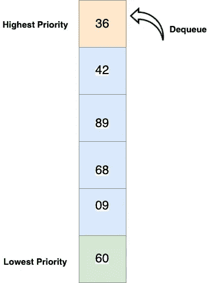
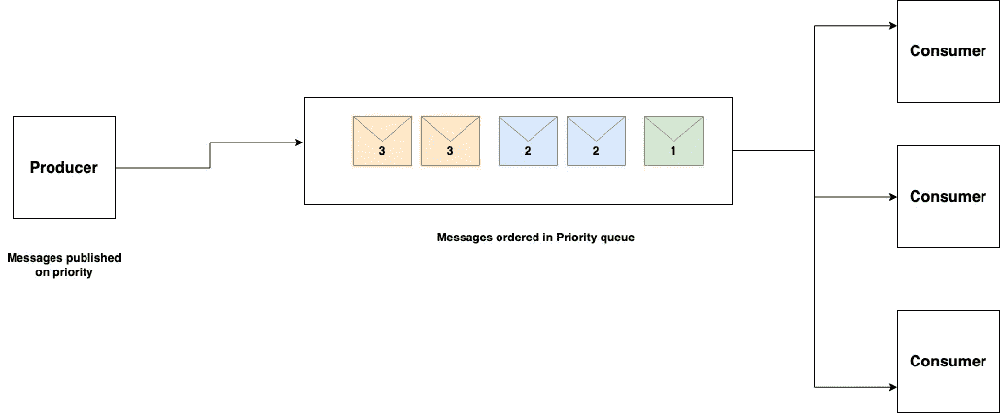
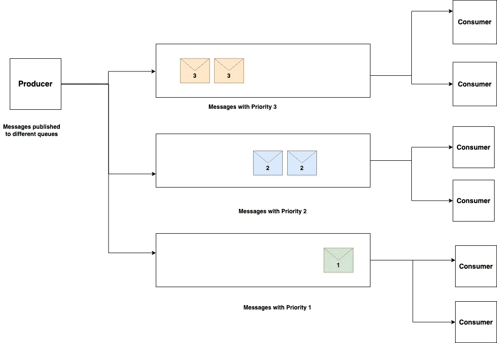

# 优先级队列— 101

> 原文：<https://blog.devgenius.io/priority-queues-101-40eb4f6f5ee9?source=collection_archive---------7----------------------->

这篇博客是我们从零开始讨论 101 个概念的系列文章的一部分，读者的入门知识有限。本文属于 ***中级*** 系列，因为它涉及到理解**优先级队列**——主要用于处理基于租户/业务用例的不同优先级的异步消息。

101 系列中的一些早期博客如下:

[**API 101**](/api-101-773ec501b485) [**异步通信 101**](/async-communication-101-b04d5c95333a)[**数据库 101**](/database-101-13d593ec4078)[**数据库设计 101**](/database-design-101-7c019d69b97f) **[**部署策略 101**](/deployment-strategies-101-ee2badd60799)**

# 什么是优先级队列？

优先级队列是默认 [**队列**](https://www.programiz.com/dsa/queue) 数据结构的扩展，通过利用与发布消息相关的被称为 ***优先级*** 的附加属性。与 [**FIFO(先入先出)**](https://www.geeksforgeeks.org/fifo-first-in-first-out-approach-in-programming/) 出列语义不同，这种抽象队列数据结构使用高优先级覆盖来消费来自指定队列的消息。对于单个消息传递代理平台需要根据分布式架构需求的 on board***客户机/租户*** 的优先级来满足多个 SLA 的用例，该模式非常有用。

# 履行

诸如 [**ActiveMQ**](https://activemq.apache.org/) 之类的消息平台支持优先级队列作为生产者端的一个特性。然而，同时也有消息代理基础设施，如 [**Kafka**](https://kafka.apache.org/) ，其中这种支持并不添加在生产者端，因此基于优先级的多个队列被设置用于发布和消费设置优先级的事件。

## 单队列

在多个租户使用**单优先级队列**的情况下，生产者在交付时设置优先级，消息队列根据优先级基数重新排列这些消息。基于优化的总体 ***运营*** 成本，单队列方法有其优点。然而， ***性能*** 和 ***可伸缩性*** 可能成为瓶颈，以防较低优先级的消息为较高优先级的消息造成容量瓶颈。

## 多个队列

在这种情况下，每个队列用于发布和消费一个 ***单租户/给定优先级*** 的事件，不需要额外的特定消息属性。由于队列是基于优先级进行隔离的，因此这种方法优化了*和 ***的性能和*** 的可扩展性，但是在 ***的运营*** 和云成本上却很高。*

**

# *用例*

*   ***租户内-** 如果给定租户内有多个具有不同业务优先级的任务，则优先级队列优先。*
*   ***Inter Tenant —** 如果有业务需求/基数竞争的业务租户，优先级队列是一个很好的选择。*

# *优势*

*   *使用通用平台层( ***后端服务+基础设施*** )帮助交付多种业务**SLA**。因此将可重用性提升为核心设计原则。*
*   *使用单队列方法最大限度地降低运营成本，并动态扩展消费者，以增加竞争基础架构组件的灵活性。*
*   *多队列方法有助于优化性能和可伸缩性需求。*

# *摘要*

*我们讨论了优先级队列的基础知识，这是基于异步消息的分布式应用程序的流行设计模式。使用不同的消息总线技术，如 AWS SQS、Azure 服务总线、Apache Kafka 等，可以根据特定的应用需求进一步定制模式。我们将在未来的高级博客中讨论客户端(生产者/消费者)的低级设计。*

**如需反馈，请留言至****Amit[dot]894【at】Gmail[dot]com****或联系*[*【https://about.me/amit_raj】*](https://about.me/amit_raj)*的任何链接。**