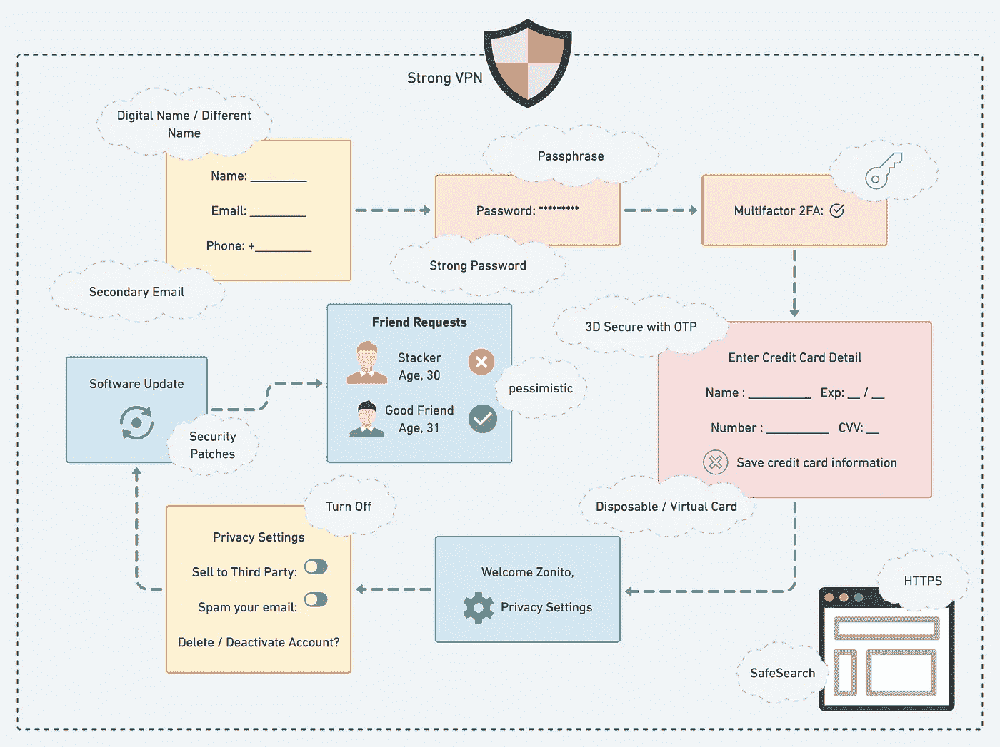

# 四类人的隐私考虑

> 原文：<https://blog.devgenius.io/privacy-settings-for-4-types-of-people-85634446440a?source=collection_archive---------2----------------------->

截至 2022 年 4 月，全球互联网用户超过 50 亿，占全球人口的 63.1%。其中，47 亿人(占世界人口的 59%)是社交媒体用户。随着互联网的使用越来越多，像出售用户私人信息、敲诈勒索等非法活动也越来越多。从大规模数据泄露到在线跟踪，过“私人”在线生活比以往任何时候都难。一旦我们的数据出现在互联网上，就几乎不可能对其进行控制。但也不是不可能。

这篇文章将帮助你，从青少年到极客到父母，如何处理你的私人数据，**为你的互联网使用提供一把瑞士刀**。只需几个简单的步骤，您就可以保护您的隐私，确保您的身份安全，并减少公司在线收集的您的数据。学习如何保护你的在线隐私是一项无价的技能。以下是我对网络隐私的深入指导，它的意义，以及如何拯救它。

互联网用户分为四类:极客(技术人员)、专业人士/企业主、青少年以及父母。我相信你会属于其中一类。

# 互联网上的信息类型:

## 账户:

每当我们打开任何网站或安装任何应用程序时，我们都非常想使用该服务提供的内容。同样绝望的是，我们通过提供姓名、电子邮件、电话、生日、信用卡等私人信息来创建账户。这些在科技界也被称为 PII(个人身份信息)；当单独使用或与其他相关数据一起使用时，它们是可以识别个人的信息。我们很容易地与网站或应用程序分享这些重要的私人信息，却不知道这样做的后果；有些是:

*   他们可以将你免费提供的私人信息出售给不同的机构，这些机构可能会向你的电子邮件发送不必要的营销信息。
*   有没有想过一家不知名的银行是如何得到你的电话号码并开始打电话给你推销他们的信用卡的？

除非不可避免，否则不要分享你的个人信息，比如开一个新的电子邮件账户、银行账户等。我还建议在一些应用中保留 1-2 个第二电子邮件地址作为试用。

> 对于青少年来说，互联网账户的数量应该在父母或监护人的监督下根据需要进行限制。

## 密码:

另一个重要的信息是密码。同样，不要假设没人知道你的密码；网站主/app 主如果愿意，可以获取你的密码；并不是世界上每个网站都使用加密技术将你的密码存储在数据库中。

建议:

*   使用密码管理器，如 Bitwarden、Dashline、1Password 等。
*   不要对每个帐户使用相同的密码；如果其中一个受到威胁，其他账户也会受到影响。
*   使用强而唯一的密码。同样，您可以使用密码管理器的生成密码功能。
*   如果您总是难以记住随机字符串，请使用长密码。
*   你可以让你知道加密算法。我见过一些人用符号或数字替换一些字母，所以“密码”会变成“p@55w0rd”或“p@$$w0^d".”
*   定期更改密码，从每季度一次改为每两年一次。

## 多因素 2FA:

2FA 是下一个安全级别，即使密码泄露，也能确保您的帐户更加安全。2FA(双因素认证)将要求您输入六位数字代码或 OTP 来解锁您的帐户。如果你选择 2FA 来处理你所有的基本服务，比如电子邮件、文件存储、社交网络等，那会很有帮助。

建议:

*   对于极客，我推荐 OTP 用 Yubikey / Some stick。
*   选择电话或电子邮件生成动态口令。
*   现在很多密码管理器在 app 本身也支持 OTP 生成。你也可以利用这一点。

## 信用卡:

信用卡应该是高度安全的信息，因为它处理你的钱。绝不应该与任何未知的服务共享。大多数网络诈骗只在这个实体上进行。如果这受到损害，收回你的钱是非常漫长的，有时是不可能的。而你需要把你的卡封死，等下一张。完成不必要的过程，所以要格外小心。

建议:

*   始终选择 3D 安全 PIN，即，对于每笔交易，都应通过电话询问 OTP。
*   如今，许多银行/数字银行已经开始提供虚拟卡。如果受到损害，阻止和重新生成新卡是完全数字化的，即速度非常快。我还建议每季度重新生成您的虚拟卡，以增加额外的安全性。
*   不要在旅游、钱包等网站上保存信用卡信息。网站可能会被黑客攻击，并且随时都有可能发生数据泄露([https://haveibeenpwned.com/](https://haveibeenpwned.com/))，甚至 [Okta](https://techcrunch.com/2022/03/23/okta-breach-sykes-sitel/) 。
*   一些数字银行还提供一次性卡(一次性使用卡)。尽量增加它的使用。
*   对于套餐要格外小心，这很容易忘记，而且你会不知不觉地被收取月费/年费。

> 以上是关于如何控制个人信息共享的建议；现在，我们将详细讨论如何控制共享知识。

## 数据共享:

有时不提供我们的个人信息很难使用任何服务；即使是试用，我们也需要分享。以下是一些建议:

*   创建备用电子邮件以供试用；您可以随时停止使用该服务，而不必担心它会开始向您的主帐户发送垃圾邮件。一旦它成为你日常使用的一部分，就把电子邮件改成主要的。
*   大多数服务还提供“删除帐户”或“停用帐户”，并在必要时使用它。限制使用不必要的服务总是好的。
*   重新访问他们的帐户设置，很可能他们已经自动选择你的数据共享给第三方或营销电子邮件订阅，关闭它。
*   一些应用程序使用您的社交帐户登录来访问他们的资源/应用程序，因此请及时访问社交应用程序设置，并撤销对那些现在没有必要的应用程序的访问。
*   IP 地址也是 PII 之一；只用你的 IP 地址就能很容易找到你的位置。所以利用可靠的 VPN 服务。
*   如果您不再使用移动应用程序/浏览器扩展/桌面软件，请将其卸载。有时这些应用程序会从后台收集数据。

## 软件更新:

技术世界在不断发展。所以问题/有害的 bug 总是他们软件的一部分，不管是有意还是无意，他们会及时以软件更新的形式发布安全补丁。我强烈建议不断更新你的操作系统、应用程序和软件。

## 电话设置:

2022 年，包括智能手机和功能手机在内，目前的手机用户数量为**72.6 亿**，这使得全球 91.00%的人拥有手机。所有的手机都包含对个人和黑客/骗子有价值的信息。如果你也能保护它，那将是最好的。

建议:

*   键盘锁
*   5-30 秒后屏幕锁定。
*   禁用锁屏通知。
*   启用谷歌或 iPhone 内置支持的手机位置跟踪。如果你失去了对手机的访问，你可以跟踪它，或者在极端情况下，你可以远程锁定或擦除手机中的数据。
*   记下某个地方的 IMEI 号码，如果有人偷了你的手机，就和网络警察分享。

## 社交网络的使用:

如前所述，47 亿或 59%的世界人口是社交媒体用户。因此，这里有一些确保你的安全区的提示:

*   及时访问你的好友列表；如果那个朋友不再相关，取消好友关系。你永远不知道这个人是朋友还是堆叠者。
*   仅向朋友更新您的个人资料可见性，不公开。与个人照片或封面照片相同。
*   接受陌生人或刚认识的人的好友请求时要格外小心。你可以采取悲观的方式，没有人可以向你发送好友请求，只有你可以发送邀请，或者采取乐观的方式，任何人都可以向你发送好友请求，而你会小心地接受他们。我建议前者适合青少年，后者适合成年人。
*   定期使用他们的安全工具或隐私向导来控制你的社交活动。

## 浏览:

当我们上网时，浏览是我们做的第一件事，我们谷歌并开始从搜索结果中打开一些网站。在这里，你也需要在安全浏览方面付出额外的努力:

*   在共享个人信息之前，请在地址栏中查找“HTTPS”。
*   即使你看到的是 HTTPS，看看其余的网址，网址和网站上的内容匹配吗？否则，不要与该服务共享任何内容。这可能是一个钓鱼网站。
*   如果提示使用 cookie，总是选择“仅必要”或“拒绝所有”，因为没有人有时间通读他们关于数据跟踪的条款和条件；最好采取悲观的态度。

## 结论:

我见过许多给他们带来麻烦的数字事件，无论他们是青少年、技术极客还是安全专家。很难总是注意到上面的建议，但是一旦你开始遵循它们，我相信对你来说会很自然。

我错过了什么吗？如果是，请在评论中分享你的想法来丰富这篇文章。

就这样，我结束了这次学习；我希望你今天学到了一些新东西。如果你觉得这篇文章对你有帮助，请与你的朋友和家人分享。让我们用心上网。最后，考虑成为[中等会员](https://zonito.medium.com/membership)。谢谢大家！