# JavaScript 的基本问题解决模式

> 原文：<https://blog.devgenius.io/problem-solving-patterns-to-know-javascript-d91da5ae6fde?source=collection_archive---------8----------------------->

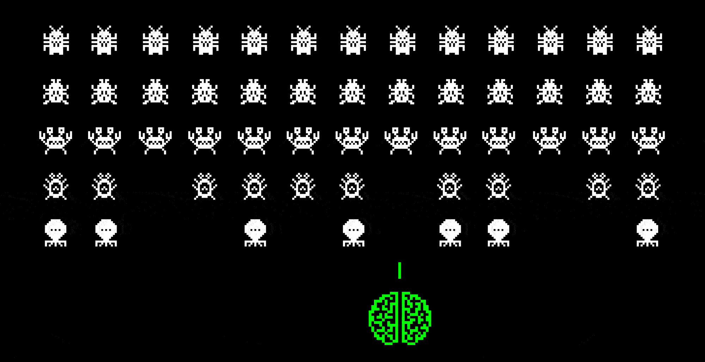

在过去的几周里，我在做项目和为面试而学习的同时，一直在努力提高算法水平。一路走来，我遇到了一些有用的策略，想和全世界分享一下！

以下是我见过的一些大的:

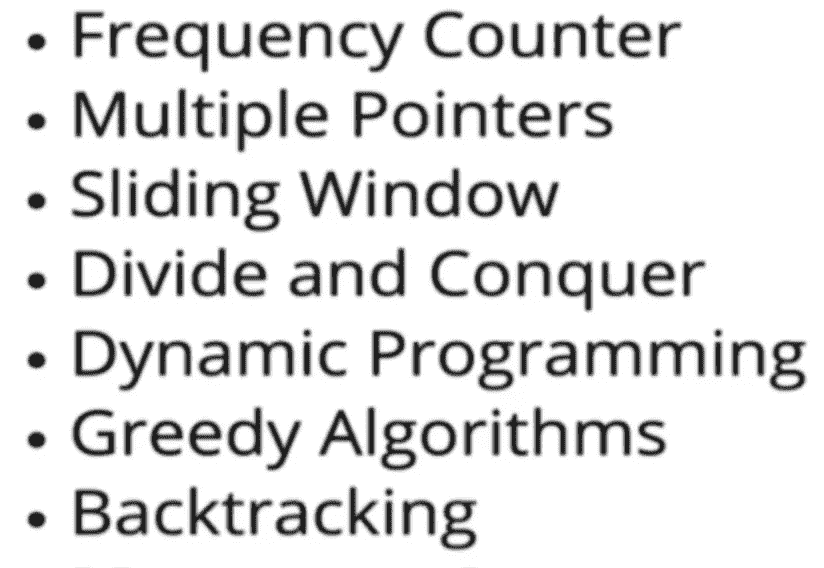

这些模式不会帮助你解决你将面临的每一个问题，但它们可以大大提高你的机会。本文将讨论前三个:频率计数器、多指针和滑动窗口。首先，我们来谈谈…

# **频率计数器模式**

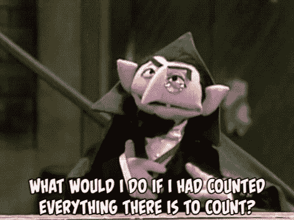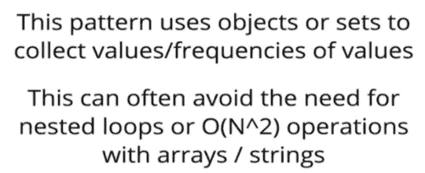

频率计数器模式在需要比较多条数据/输入的问题中最有用。例如，您可能会尝试查看两个输入是否由相似的值组成，是否是彼此的变位组合，或者一个值是否包含在另一个值中。**频率计数器模式可以将算法的时间复杂度降低到 O(n)而不是 O(n )** 。

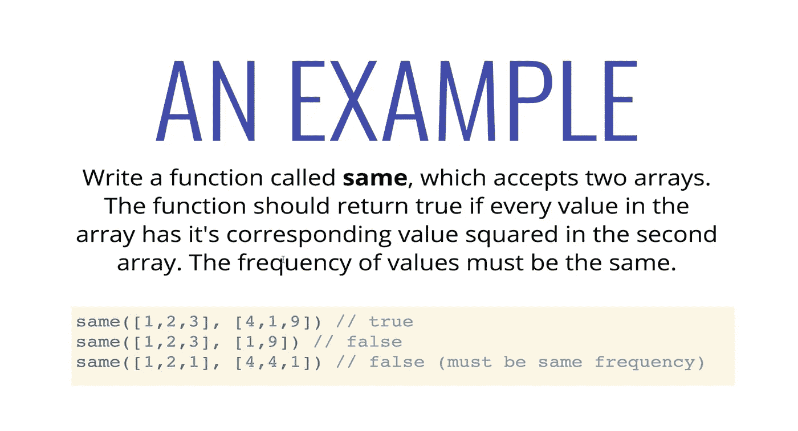

一种不使用频率计数器模式的方法涉及如下所示的嵌套循环:

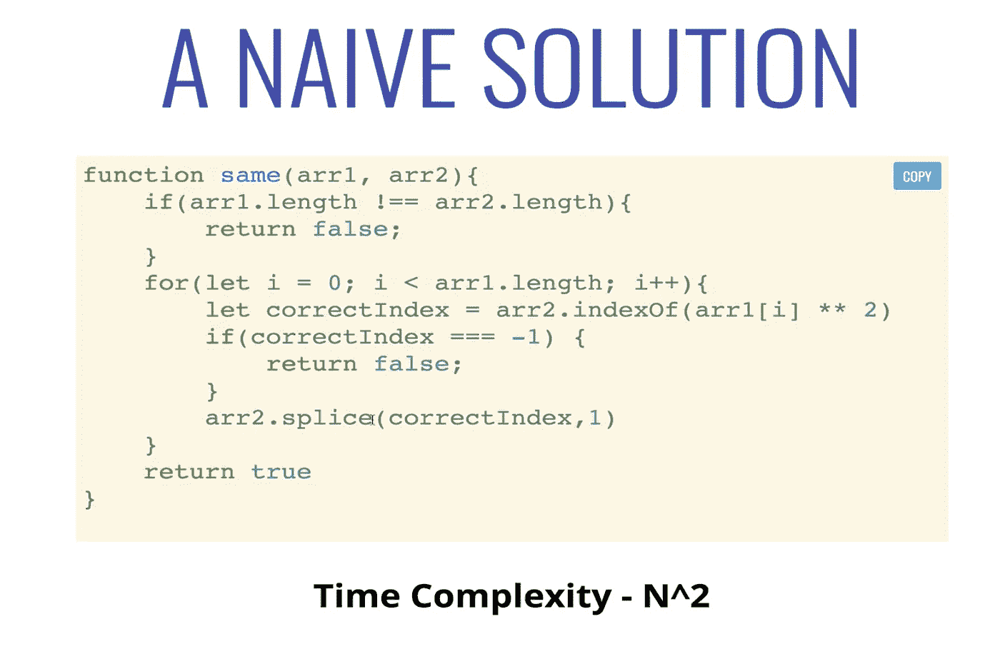

但是由于两个独立的循环比嵌套循环好，我们可以通过应用频率计数器模式来进一步优化我们的解决方案。这看起来像是:

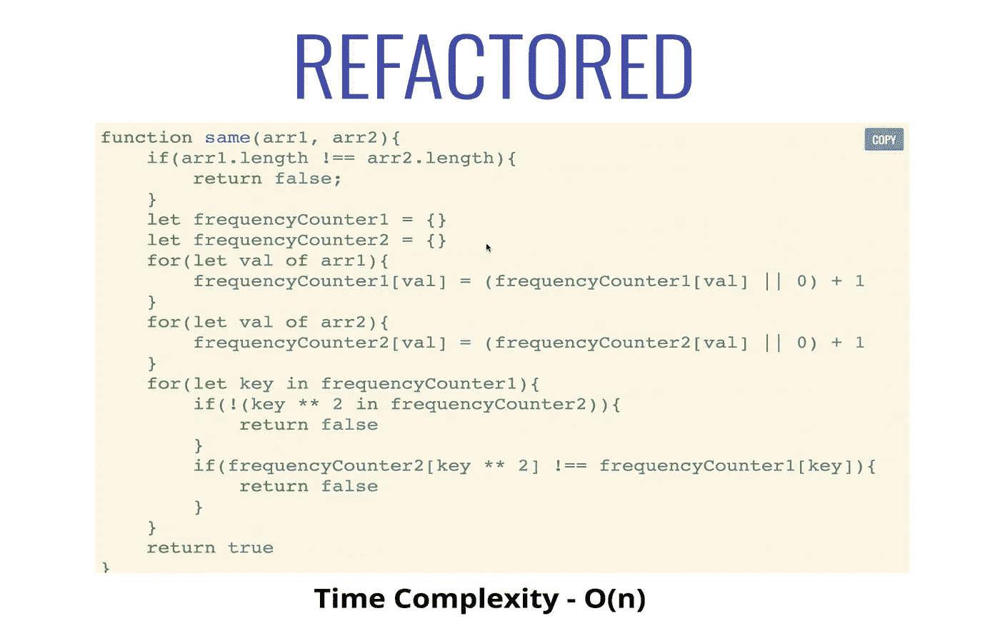

上面的代码遍历每个数组，并为每个数组创建一个对象。该对象的键是每个数组的元素，并映射到表示原始数组中每个元素的频率的值。

然后我们遍历第一个对象，检查它的每个平方键是否出现在第二个对象中。我们还检查相应的频率是否相等。如果满足上述所有条件，我们返回 true，否则，我们返回 false。接下来，让我们把注意力转移到多指针模式上。

# **多指针模式**

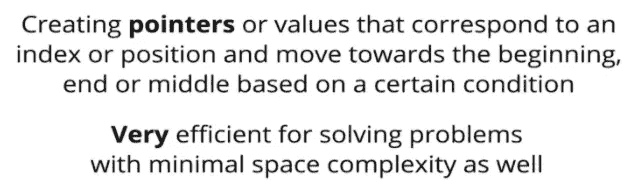

多指针模式是避免嵌套循环的另一个好方法。这种模式通常以排序的输入为条件。在给定一个字符串或数组，并要求你根据某种条件找到一对的问题中，这很有用。它也有助于在排序列表中查找唯一值。

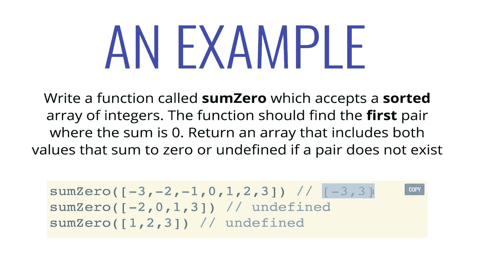

同样，一个简单的解决方案包含一个嵌套循环，看起来像这样:

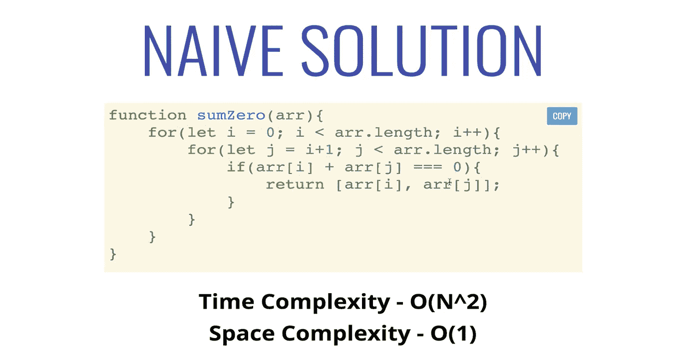

上面的代码从外部循环中的第 0 个元素开始，比较内部循环中从第 1 个元素开始的所有其他元素，然后返回总和为零的元素。

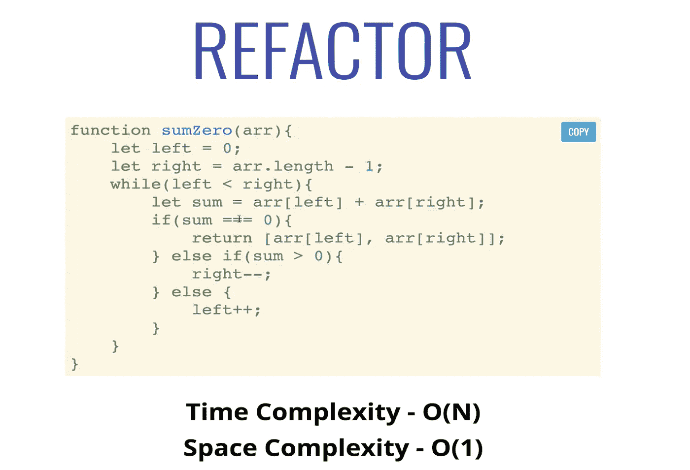

在上面，我们的循环只继续 while ( *左<右*)，而不是 while ( *左≤右*)。这是因为我们不想在到达输入数组的最中心元素时返回一个误报。

让我们把注意力转向第三种也是最后一种模式，滑动窗口模式。

# **滑动窗口模式**

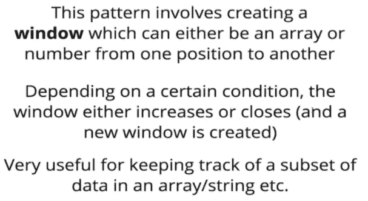

窗口通常从左向右移动。一个常见的应用是从列表的开始移动到末尾。

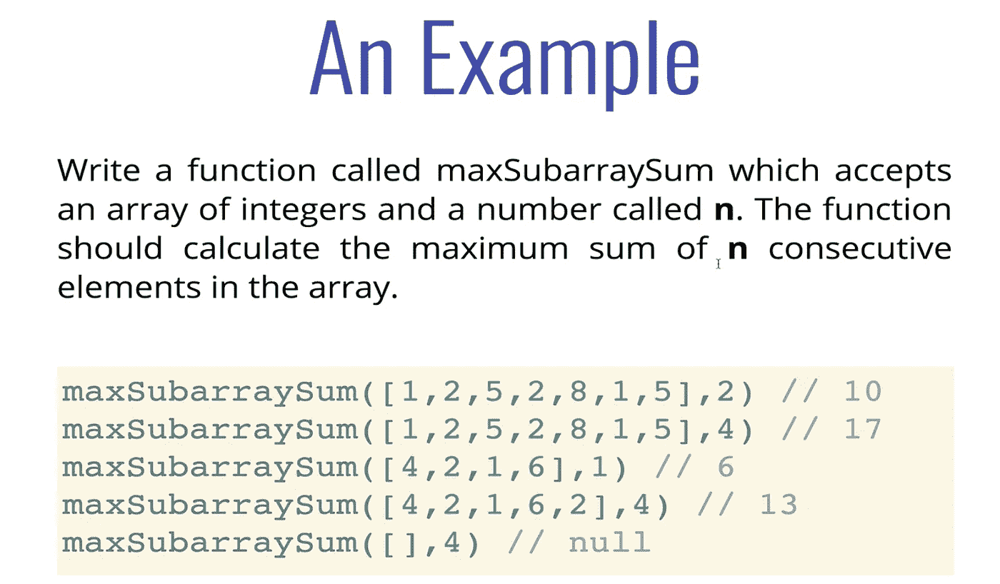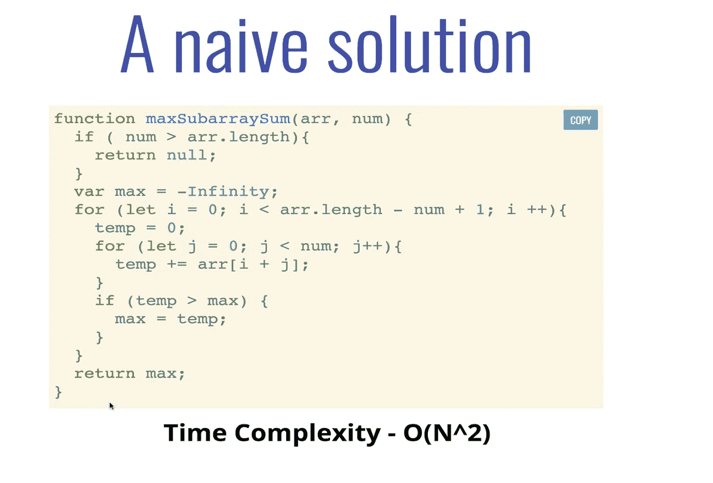

上面，简单的解决方案包括一个嵌套循环，从外层循环的第 0 个元素开始。您滑动到第二个(内部)循环中长度为 *num* 的窗口，并将外部循环的索引向前移动一位。

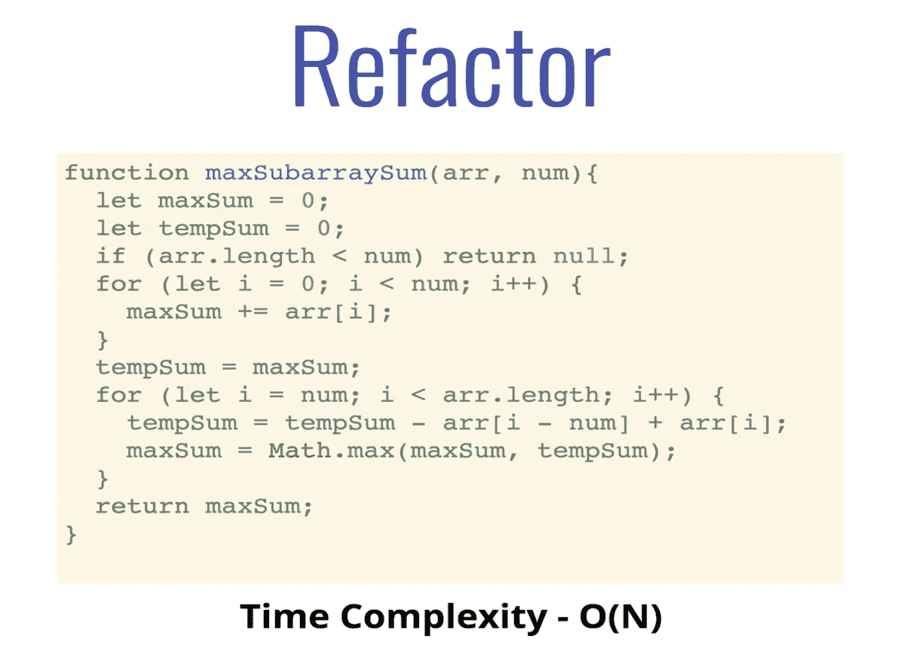

重构解决方案的一个明显的好处是我们只对整个数组**循环一次**。让我更详细地解释一下这是如何工作的:假设你在寻找一个数组中任意三个元素的最大和。首先，从第 0 个索引开始，对前三个元素求和，然后保存总和。然后，不是开始一个新的循环，从第一个索引开始对接下来的三个元素求和，而是减去第零个元素，然后加上第四个元素。您检查该金额是否大于您之前保存的金额。如果是的话，你就用新的总和代替以前的总和。如果没有，你继续前进。滑窗就是这个意思！

希望这能帮助你踏上自己的算法之旅。如果你有任何问题或反馈，你可以给我留言[这里](https://iamraq.github.io/)！