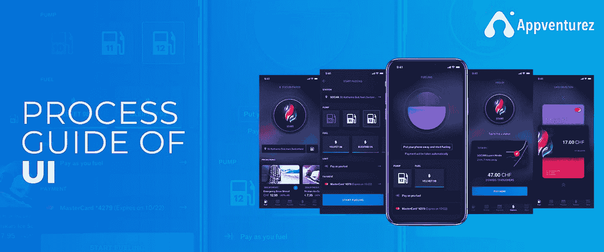

# 用户界面的过程指南

> 原文：<https://blog.devgenius.io/process-guide-of-ui-bcd9f4565fe6?source=collection_archive---------18----------------------->

> 设计不仅仅是它的外观和感觉。设计就是它的工作方式。— **史蒂夫·乔布斯**

著名设计师唐纳德·诺曼和认知心理学家在 20 世纪 90 年代末创造了“UI/UX 设计过程”这个短语。自那以后，其他部门对这一主题进行了大量研究，以便加以利用。

设计良好的用户界面不仅能有效地展示你的商品，还能增加客户对你业务的信任。当顾客需要与你相关的商品或服务时，他们会找你。反过来，它增加了客户的乐趣和信任。因此，用户体验设计对于实现您的业务目标至关重要。

当创建一个有效的 UI/UX 系统时，简单性或用户友好性是最重要的考虑因素。

“简单是最复杂的，”他说。这是你的公司在竞争中脱颖而出的原因。

# UI/UX 设计流程的 5 个步骤

[***UI/UX 设计过程***](https://www.appventurez.com/services/ui-ux-design) 是一个打磨用户界面的过程，如果你遵循这个过程，就能使用户界面为你的业务发挥最大作用。如果不遵循这个技巧，我们可能会发现自己不得不经常修改自己！

# 1#产品定义

负责收集用户需求的团队将根据他们的业务环境来收集用户需求。

这一点至关重要，因为正是在这一阶段，产品及其存在的真正范围才得以实现。

很简单:在开始工作之前，通知你的 UI/UX 设计师关于需求的信息！

在这个阶段，设计团队、业务经理和产品经理都在一起工作。客户环境中的所有员工都应该与他们协商。在你公司的背景下审视他们的需求。

# 2#研究

对设计师来说，最重要的因素是研究。设计团队评估当前系统如何适用于当前的客户提案。此阶段的三个基本功能如下:

1.  知道竞争是怎么回事。
2.  彻底检查你当前的域名。
3.  审视竞争对手的策略，看看会发生什么。

了解最新的 UI/UX 趋势、设计概念和指导方针也应该是研究过程的一部分。

# 3#分析

在此步骤中，利用研究阶段收集的信息。根据你收集的事实制作虚构的人物角色和体验图。

1-人物角色假设:创造假设的情境可以让设计师更多地了解使用你产品的各种类型的人。它能够准确描绘最终产品。交付后，设计团队可以设计出它将如何出现。

**2-体验图:**整个成品的用户流都是用体验图来描绘的。所有这些都是通过在整个产品定义过程中使用视觉表现和与客户的正确互动来完成的。

# 4#设计

在整个设计过程中，我们根据前三个过程中收集的概念来完成养育生命。现在是开始制作最终视觉效果的时候了。在这一步中，

以下是设计阶段的一些最重要的输出:

1- **草绘:**草绘是设计过程的第一步。设计师通常会创建手绘图纸，以基本方式将概念可视化。

**2-创建线框:**线框是产品页面层次和组件的图形表示。

3-创建原型:原型关注正在设计的 UI/UX 产品的外观和感觉。这一切都归结于与他人交往的经历。原型的效果可与模拟器相媲美。

**4-** **创建设计规格:**用户流程和任务流程图包含在设计规格中。它描述了 UI/UX 产品的整体操作和风格要求。它解释了如何通过描述相关的过程和图形方面来构建优秀的用户体验。

# 5#验证或测试

测试是确定最终产品整体质量的过程。测试人员产生一个需要改进的项目列表，并将其提交给相关团队进行修正。

在回顾你的期末作业时，有几件事需要考虑。以下是详细情况:

1.  这个系统简单易用吗？
2.  适应性强，使用简单吗？
3.  它对解决客户的问题是否有效？
4.  它值得信赖吗？它是否能吸引人们在每次需要你的服务时再次光顾？

# 结论

要创建好的 UX/用户界面，一个系统的、有计划的方法是必不可少的。UI/UX 设计过程策略可以帮助你做到这一点。

整个设计团队都将参与这一过程。在当今竞争激烈的行业中，这是留住现有客户和吸引新客户的最成功策略之一。

要开展下一个项目，请联系 Appventurez，这是一家知名的 UI/UX 设计移动应用开发公司。这将是一生只有一次的机会。