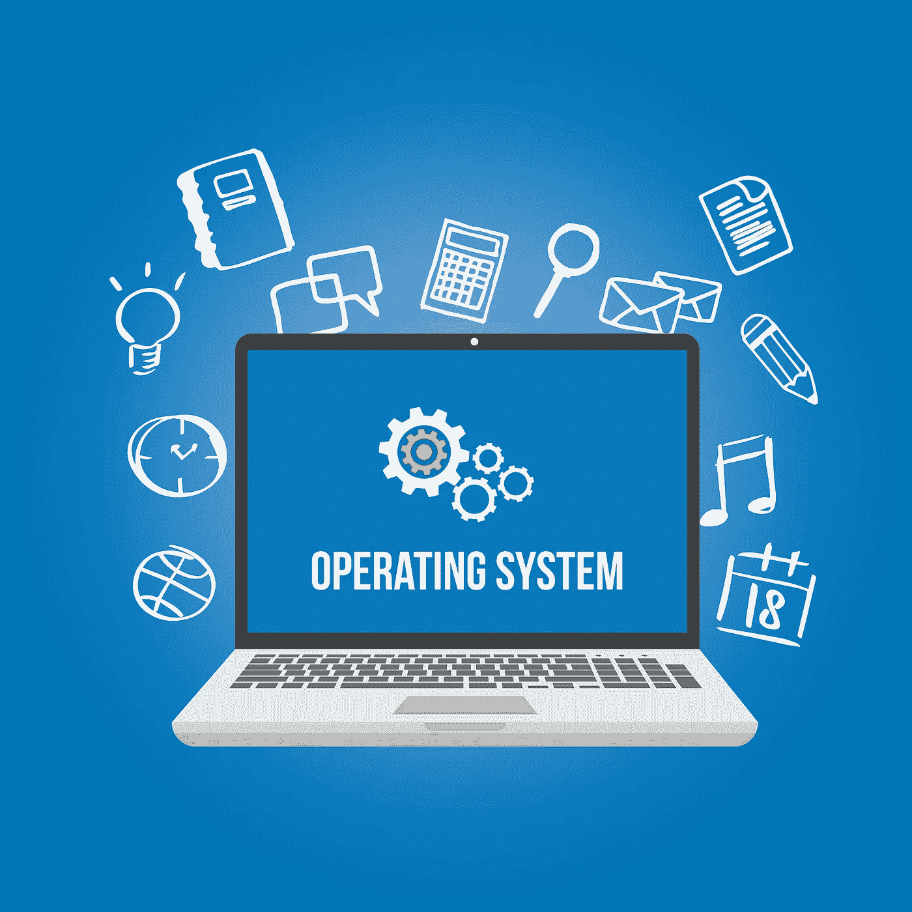

# 操作系统中的进程调度

> 原文：<https://blog.devgenius.io/process-scheduling-in-operating-system-os-d925290439e0?source=collection_archive---------3----------------------->

https://www . theschoolrun . com/what-is-hardware-software-and-operating-systems

进程调度也称为作业调度或处理器调度。

我们先来看看什么是进程，
在一个操作系统中，一个程序的执行叫做进程。它是一个活动的或动态的实体，它还包含程序代码以及用于执行程序的当前信息。

现在回到进程调度—
它由进程管理器完成，进程管理器处理从 CPU 中删除正在运行的进程，并根据特定标准选择另一个进程。
在多道程序操作系统中，进程调度起着重要的作用，因为在这种类型的操作系统中，它允许一个以上的进程同时装入内存，并且这个装入的进程使用分时共享 CPU。

调度队列用于进程调度。
所以调度队列就是进程或设备的队列。当系统中有一个新进程时，它被放入作业队列中。因此，作业队列由系统中的所有进程组成。除了作业队列之外，设备队列还维护着进程正在等待的设备队列。

现在，必须有人能够选择必须由系统执行的作业或流程，并决定运行哪个流程。所以这一切都是由调度程序来完成的。

调度程序是处理进程调度的系统软件。它的重要任务是选择必须提交给系统的作业，并根据一些标准决定运行哪个流程。
有三种类型的调度程序，

1.  长期调度程序:
    也称为作业调度程序，它决定哪些程序应该交给系统处理。它从队列中选择进程，并将它们放入内存中执行。主要目标是提供作业的平衡，即基于 I/O 和处理器的作业。
2.  短期调度程序:
    短期调度程序也称为 CPU 调度程序或调度程序，其任务是根据一定的标准提高系统的性能。它的主要任务是执行最频繁，并决定执行哪个进程。它比长期调度程序更快。
3.  中期调度程序:
    它从内存中移除进程，它是交换的一部分，处理被交换出的进程。
    交换:当一个正在运行的进程发出一个 I/O 请求时，它被挂起。这些挂起的进程无法完成，因此要将该进程从内存中删除，以便另一个进程可以进入，挂起的进程将被带到辅助存储，这一过程称为交换。该流程被称为推出或换出。