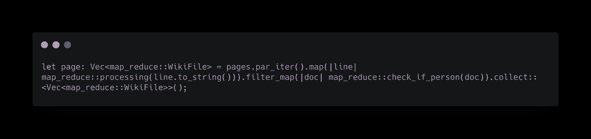
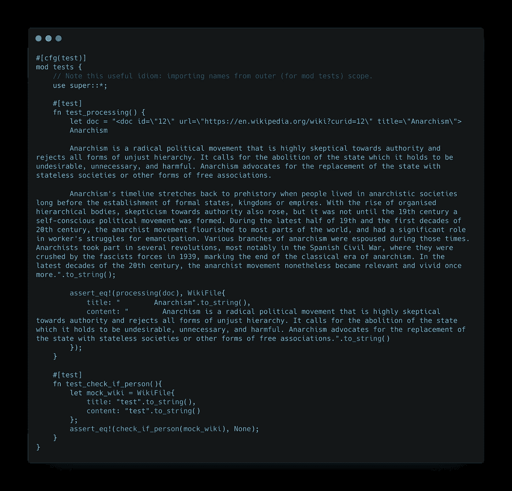
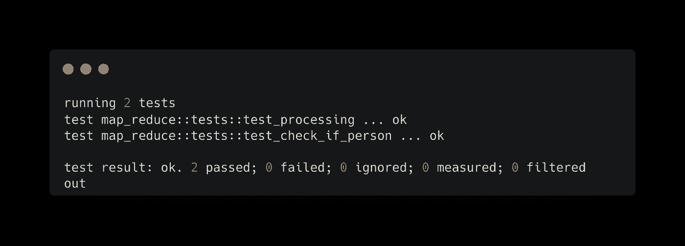
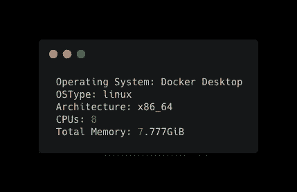
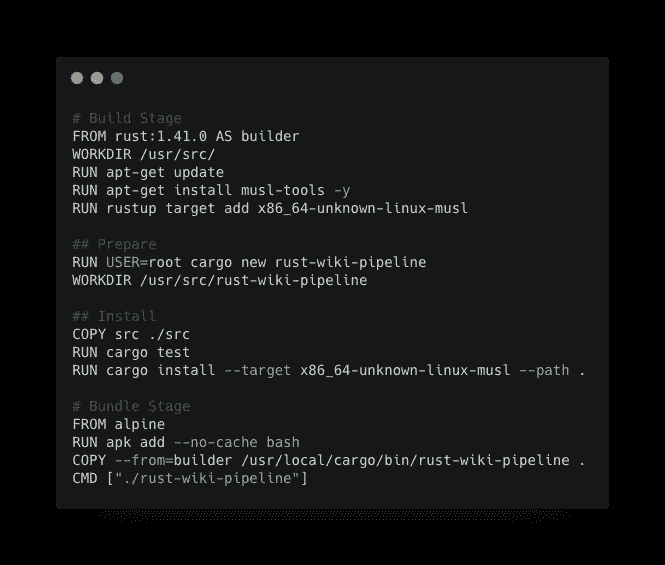
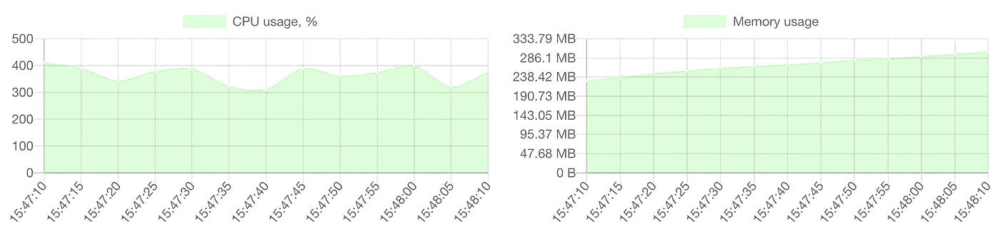

# 使用 Rust 处理 14 GB 文件—第 2 部分— Docker 和测试

> 原文：<https://blog.devgenius.io/processing-14-gb-files-with-rust-part-2-docker-testing-ad8fa2652cbd?source=collection_archive---------0----------------------->

周末编码和写作

周末咖啡馆和代码

> “对于我们在做之前必须学习的东西，我们通过做来学习。”——亚里士多德

边做边学。总是让我朝着新的编程语言/技能前进。在上一篇文章中，我们从背景——为什么，到代码——如何开始。没机会看的话可以看这里的文章。

 [## 用 Rust 处理 14 GB 文件—第 1 部分

### 周末建设和学习

medium.com](https://medium.com/@jayhuang75/processing-14-gb-files-with-rust-part-1-3b7b1458fc37) 

在第 2 部分中，我将关注如何利用 Docker 来执行本地测试。

我想阐明的一个关键要素是我们应该如何最大化我们的本地机器来覆盖开发周期的大部分，主要原因是成本。假设您或您的公司需要限制使用模拟数据/仅屏蔽数据。

你可能会和我争论，本地机器并不是全马力的，所以我们需要利用云。但是，你应该知道:

1.  在这一天，你现在的本地机器应该足够强大，有时，在我以前的文章中，我甚至使用 surface pro 6，它只有 4 个内核。我也相信，大多数数据工程师的笔记本电脑或 mac 电脑应该拥有最高端的规格。:)
2.  对于云来说，总是有相关的成本，甚至你只是打印 HelloWorld。

## 单位测试

其中一个关于 Rust 的有趣部分，真的是模拟的像 Golang 一样，很容易写单元测试。

单元测试不仅写起来有趣，而且让你思考如何以一种有效的方式组织你的代码。对于这个用例，MapReduce part-key 函数可以重用，我将在第 3 部分中讨论这一点，我们将使用 Azure stacks 部署它，因此这两个函数 **processing** 和 **check_if_person** 需要编写测试代码。

重用 MapReduce

单元测试

单元测试结果

## 构建 dockerfile 文件

我不想在这里花太多时间解释 docker，尤其是它对 SDLC 的好处。然而，对于这个用例，我想使用 docker 并围绕运行基于容器的作业进行测试，看看它的性能如何。

此外，我将在第 3 部分解释我们如何将容器部署到云容器服务，比如 AKS。不过，还是先从本地码头工人说起吧。在大多数情况下，我通常如下设置我的本地 docker env:

docker 系统信息

dockerfile 文件

一旦 docker-compose 启动，我们可以看到作业正在运行，我使用 [dockerStation](https://dockstation.io/) 来捕获 CPU 和内存使用情况，以便很好地理解作业将在基于容器的 env 中运行。

码头站

在处理上下文的 15 GB 数据量上，使用情况似乎符合预期。

> 未完待续…

在第 3 部分中，我将着重于构建 CI/CD 管道并部署到 AK。

 [## 使用 Rust 处理 14 GB 文件—第 3 部分— Azure 堆栈

### 周末编码和写作

medium.com](https://medium.com/@jayhuang75/processing-14-gb-files-with-rust-part-3-azure-stacks-13dcf9dde014) 

再次，保持安全和健康。关于我的其他文章，请查看下面的链接。

[https://medium.com/@jayhuang75](https://medium.com/@jayhuang75)