# 使用 Rust 处理 14 GB 文件—第 3 部分— Azure 堆栈

> 原文：<https://blog.devgenius.io/processing-14-gb-files-with-rust-part-3-azure-stacks-13dcf9dde014?source=collection_archive---------3----------------------->

周末编码和写作

> 前情提要…

我们利用本地 docker 进行开发和测试；然而，为了完成整个 SDLC，我们仍然需要构建一个 CI/CD 管道。如果你刚刚看到这篇文章，下面的链接可以帮助你获得更多关于这一系列周末代码和写作的内容。

 [## 用 Rust 处理 14 GB 文件—第 1 部分

### 周末建设和学习

medium.com](https://medium.com/@jayhuang75/processing-14-gb-files-with-rust-part-1-3b7b1458fc37)  [## 使用 Rust 处理 14 GB 文件—第 2 部分— Docker 和测试

### 周末编码和写作

medium.com](https://medium.com/@jayhuang75/processing-14-gb-files-with-rust-part-2-docker-testing-ad8fa2652cbd) 

对于第 3 部分，我们将重点关注:

1.  将数据移动到 Azure ADLS gen2 blob 存储。
2.  添加新代码，从 blob 存储中读取和处理数据。
3.  Azure 管道构建和发布代码。
4.  创建一个 AKS 集群并将其部署到生产环境中。

我在这里使用 Azure Stacks 的原因是，我以前在生产作业/应用程序中使用过 GKE 和 EKS，所以我决定在这里使用 Azure Stacks。正如我在第 2 部分中提到的。

> 做着做着，比光看对比文章强多了。

## 高级工作流

1.创建资源组

2.通过 azcopy 将数据移动到 ADLS gen2

3.添加新代码来处理来自 Azure ADLS gen2 的文件

4.创建 Azure 容器注册

5.创建 Azure 管道

6.创建 AKS

7.kubectl 应用秘密和应用部署。

## 1.天蓝色资源集团

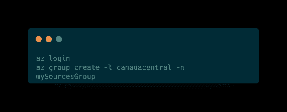

az 创建资源

## 2.Azure ADLS Gen2 Blob 存储容器和移动

首先，创建一个 Blob 存储容器。

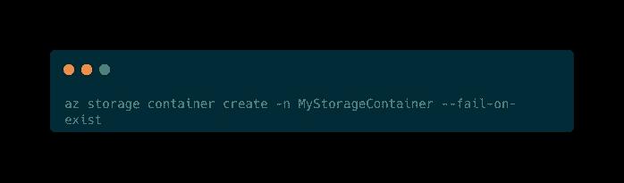

创建存储容器

一旦它产生了。我们开始将数据移动到 gen 2 容器中。移动大约 15 GB 的数据需要大约 42 分钟，本地网络速度大约为 58 Mbps。

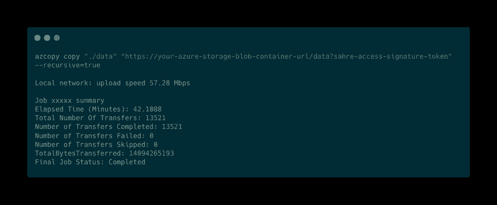

azcopy 状态

## 3.添加新代码

当你密切关注我的文章时，你会发现我的大部分代码都遵循**单一** - **责任原则** (SRP)。它不仅可以帮助我编写单元测试代码，还可以帮助我轻松地用不同的集成服务/端点扩展/切换代码。

在这个项目中，当前文件系统是本地的。现在我们需要从 ADLS 第二代 Azure 云存储中读取数据。

在第 2 部分中，我们已经重构了代码并抽象了 map-reduce，这将使我们更容易编写不同的函数，从而打破现有的代码。

我们将使用 Tokio 包，它将处理 Rust 的异步特性。

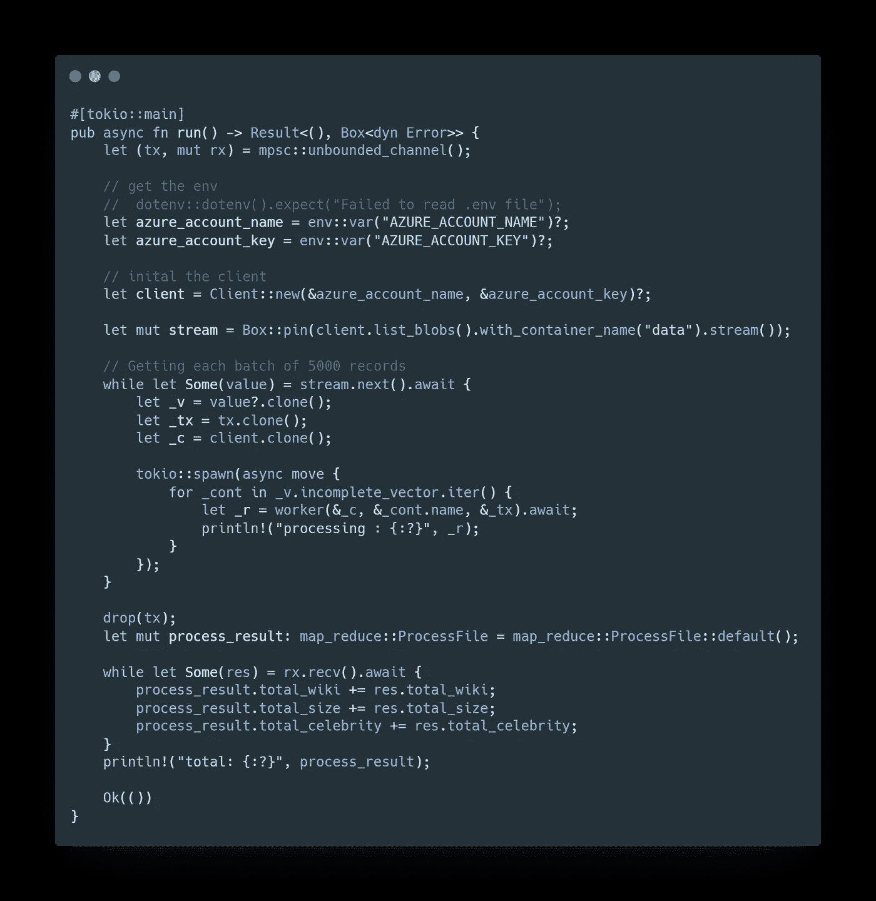

唯一的区别在于 worker 函数，如何从 worker 中的不同文件系统读取文件。

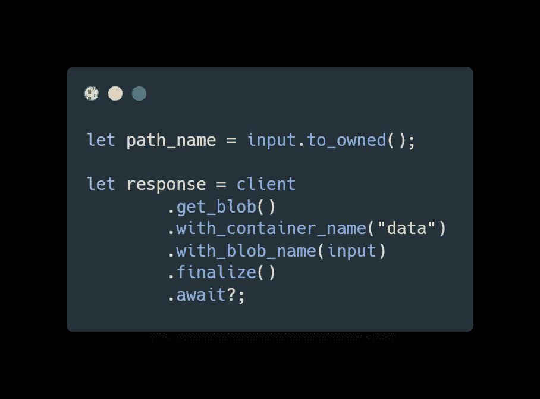

从 Azure ADLS gen2 blob 容器中读取

## 4.创建 Azure 容器注册

现在是时候构建映像并推送到 Azure 容器注册中心了。与 GCR 和 ECR 相同，但是为了简化工具和 Azure 栈的实验，我们使用 ACR。

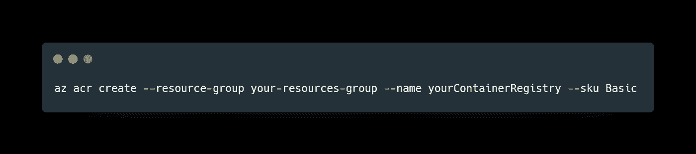

通过 az CLI 创建 ACR

构建由主分支触发，一旦构建完成，带有标签的图像将被推送到 ACR。

## 5.创建 Azure 管道

Jenkins 是开发人员世界中最流行的 CI/CD 工具；然而，Jenkins 面临的挑战是，无论您是在本地还是在云中，都需要构建 Jenkins 服务器:

1.  需要管理服务器，哪些亲戚会有专门的团队来管理和支持它。
2.  由于团队和职责分离的性质，业务工作流过程也需要定义和管理。

为了完全支持开发，并确保他们能够专注于代码和应用本身的价值，托管 CI/CD 或我们称之为管道即服务的技术最近变得非常流行，如 CircleCI、Github Action 和 Bitbucket Pipeline 等。

本质上，概念是相同的，即托管服务。就我个人而言，我在大多数个人项目中都经常使用 CircleCI，不仅从用户体验的角度，也从定价的角度。CircleCI 的荣誉。

因为 Azure Pipeline 是相同的概念，它的设置很简单，一旦你用 Azure 凭证登录，在连接你的 repo 之后，在我的例子中，是它的 bitbucket。点击几次后，管道设置和管道 YAML 也将提交您的回购。

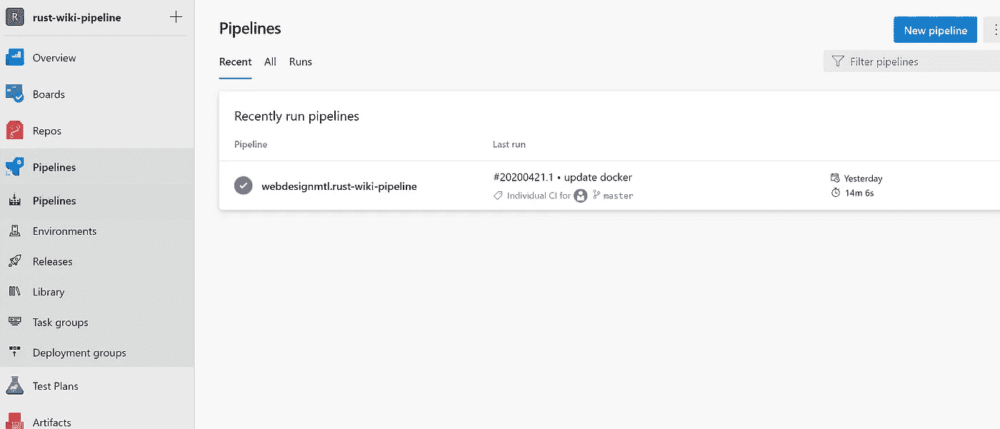

Azure 管道用户界面

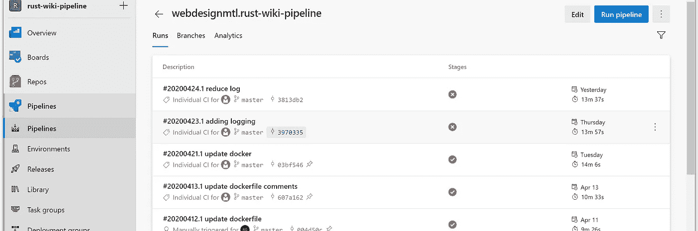

构建状态

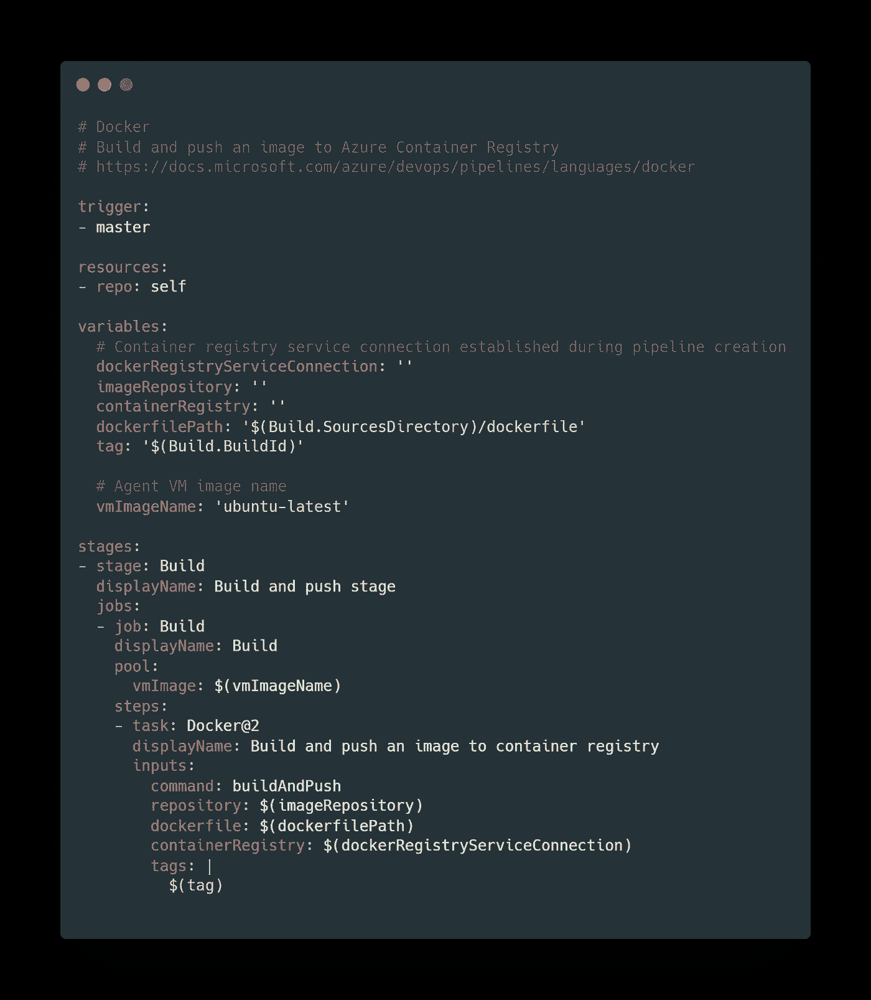

管道 YAML 文件

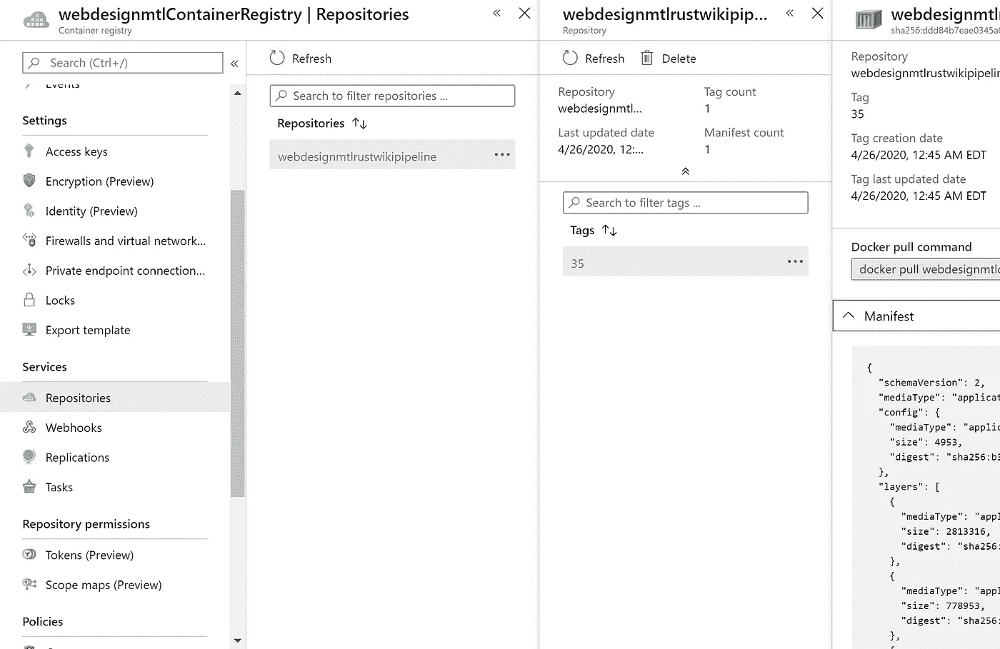

一个新的建筑形象已经推向了 ACR。

## 6.问

Azure Kubernetes 服务，与 ACR 一样，市场上有很多竞争对手，EKS、GKE 等。如果你感兴趣，这里有一个[比较列表](https://www.stackrox.com/post/2020/02/eks-vs-gke-vs-aks/)。不过，我这里就不加入这个话题了。让我们把重点放在 AK 上。

让我们创建集群并连接到 AKS。

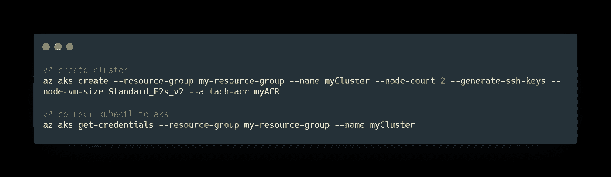

创建集群并连接

让我们部署这个秘密，它保存了有价值的 env，比如 az 帐户名和 az 帐户密钥。然后部署到 AK。

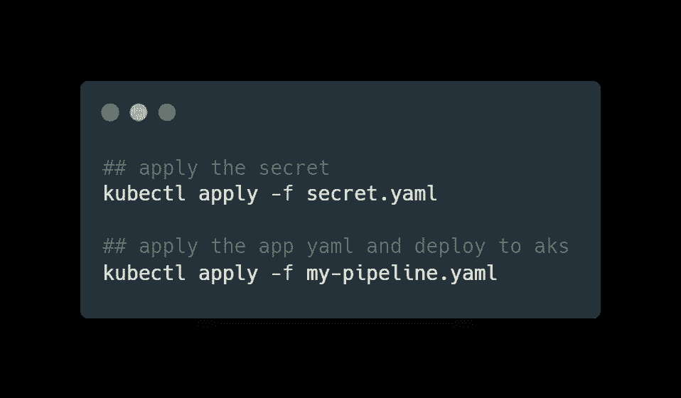

现在，您可以看到已经创建了群集，并且 pod 一直在运行。

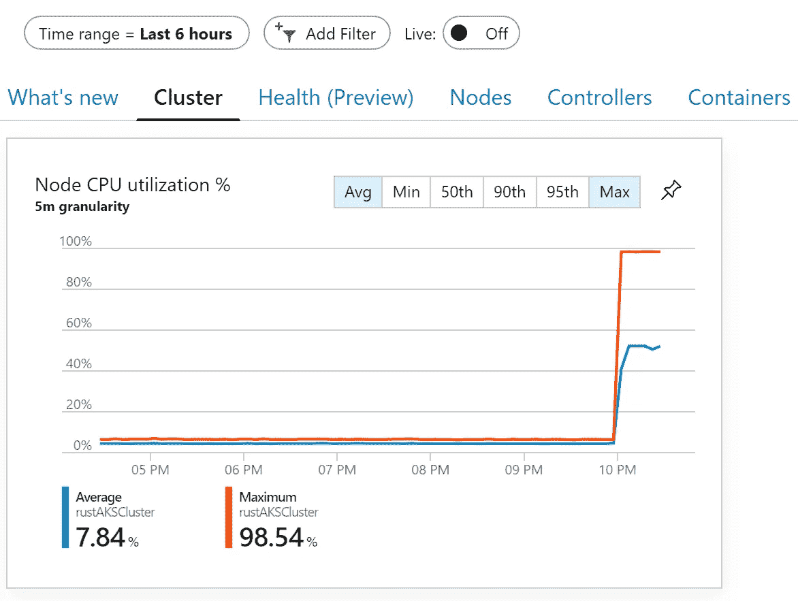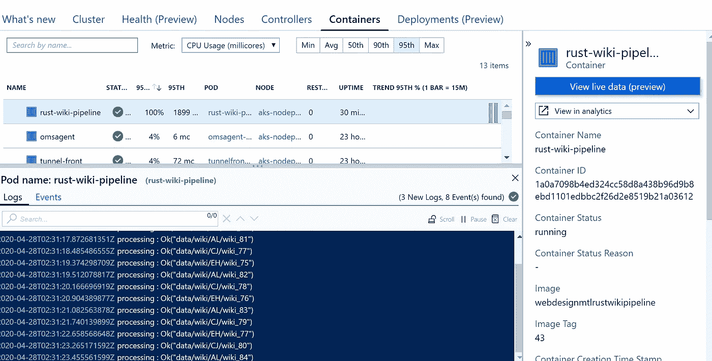

## 费用

如您所见，当我创建群集时，虚拟机大小为 Standard_F2s_v2，即 2 个内核、4 GB RAM 和 8 GB 临时存储。而且时间和我们在本地 docker 模拟的时候差不多，1 小时 10 分钟左右。

计算:AKS 大约花了我 0.15 美元**(现收现付)**

存储:15gb ~ 1.07 美元 1 个月热存储。

然而，这里唯一的抱怨是 ACR 成本:我有大约 50-70 个构建。这个月花了我 9 美元，甚至我一直删除这个版本，只保留最近的版本。

也许一些 azure 专家可以解释更多关于成本的细节，就我个人而言，即使我阅读了所有关于 Azure 定价的文件，我仍然不明白 Azure 如何在这方面向我收费。

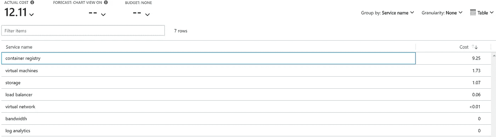

我需要理解为什么 ACR 这么贵。

## **结论**

第 3 部分是一篇相当长的文章，因为它涵盖了 Azure 堆栈的端到端部署。总的来说，我的 azure 体验还不错。文档清晰易找，在整个项目中不会有太多问题。

我唯一担心的是 Azure Container Register 的定价，但是，似乎我在 Azure Pipeline 或 Circle CI 中拥有的 CI/CD 功能，我可以部署到 ECR 或 GCR，基于它们有更多的定价优势。

感谢您的阅读，代码强大。

在最后的第 4 部分中，我将添加操作数据存储层，并将其作为 API 公开，作为该数据管道的最后一部分。敬请关注。

 [## 使用 Rust 处理 14 GB 文件—第 4 部分—API(Rust VS . Go)

### 周末建设和学习

medium.com](https://medium.com/analytics-vidhya/processing-14-gb-files-with-rust-part-4-api-rust-vs-go-87c62d129c0c)  [## 魏黄-中号

### 在媒介上阅读黄炜的作品。我喜欢学习。学会成功。Linkedin…

medium.com](https://medium.com/@jayhuang75)