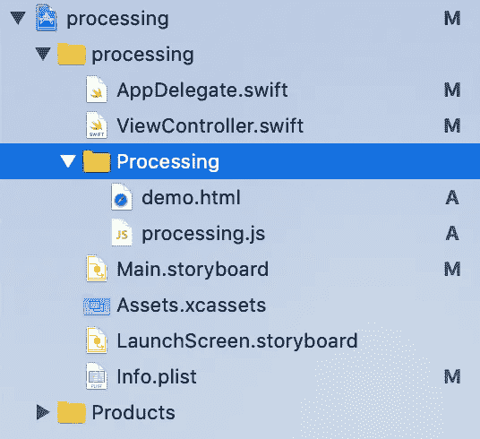
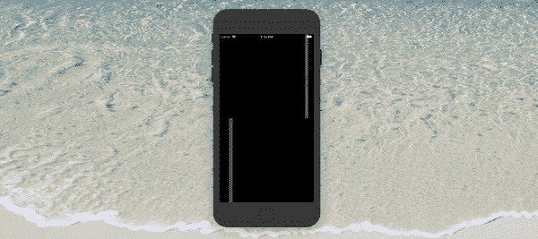

# 在 iOS 设备上运行处理的简单解决方案

> 原文：<https://blog.devgenius.io/processing-ios-swift-f08116f8a405?source=collection_archive---------7----------------------->

## # iOS # Xcode # Swift # wk webview # HTML # processing . js


胡尔基·奥莰·塔巴克在 [Unsplash](https://unsplash.com?utm_source=medium&utm_medium=referral) 上拍摄的照片

## 第一步。在这里下载 processing . js。

 [## Processing.js

### 加工可视化语言的一个端口下载最新的 Processing.js，包括完整的和缩小的…

processingjs.org](http://processingjs.org/download/) 

其实 *processing.js* 或者 *processing.min.js* 都是可以接受的。

## 第二步。创建一个 HTML 文件。

像这样…
如果你在步骤 1 下载了 processing.min.js，请在第一行用 processing.min.js o 替换 *processing.js。*

```
**<script** src**=**"processing.js"**></script>****<style** type**=**"text/css"**>*** {**-webkit-touch-callout**: **none**;**-webkit-user-select**: **none**; /* Disable selection/copy in WKWebView */}**</style>****<script** type**=**"application/processing"data-processing-target**=**"pjs"**>**//#**TODO: Write your processing code here. For example...**//http://www.dainf.ct.utfpr.edu.br/~merkle/processing/learning/examples/distance1d.htmlfloat xpos1;float xpos2;float xpos3;float xpos4;int thin = 8;int thick = 36;**void** setup(){size(window.innerWidth, window.innerHeight);noStroke();xpos1 = width/2;xpos2 = width/2;xpos3 = width/2;xpos4 = width/2;}**void** draw(){background(0);float mx = mouseX * 0.4 - width/5.0;fill(102);rect(xpos2, 0, thick, height/2);fill(204);rect(xpos1, 0, thin, height/2);fill(102);rect(xpos4, height/2, thick, height/2);fill(204);rect(xpos3, height/2, thin, height/2);xpos1 += mx/16;xpos2 += mx/64;xpos3 -= mx/16;xpos4 -= mx/64;**if**(xpos1 < -thin)  { xpos1 =  width; }**if**(xpos1 >  width) { xpos1 = -thin; }**if**(xpos2 < -thick) { xpos2 =  width; }**if**(xpos2 >  width) { xpos2 = -thick; }**if**(xpos3 < -thin)  { xpos3 =  width; }**if**(xpos3 >  width) { xpos3 = -thin; }**if**(xpos4 < -thick) { xpos4 =  width; }**if**(xpos4 >  width) { xpos4 = -thick; }}**</script>****<canvas** id**=**"pjs"**>** **</canvas>**
```

## 第三步。将 processing.js 和 HTML 文件移动到项目中。



将文件移动到项目中

## 第四步。编辑 ViewController.swift

```
**import** UIKit**import** WebKit**class** ViewController: UIViewController {**@IBOutlet** **weak** **var** webView: WKWebView!**override** **func** viewDidLoad() {**super**.viewDidLoad()**let** localFilePath = Bundle.main.url(forResource: "demo", withExtension: "html")**let** request = URLRequest(url: localFilePath!)webView.scrollView.isScrollEnabled = **false**webView.scrollView.contentInsetAdjustmentBehavior = .neverwebView.load(request)}}
```

别忘了在故事板里链接 WKWebView。

## 5.运行它！



这不是很容易吗？如果你成功了，让我知道！

**下载代码:**

[](https://github.com/YICHINGOFFICIAL/Processing-on-iOS) [## yiching official/在 iOS 上处理

### GitHub 是超过 5000 万开发人员的家园，他们一起工作来托管和审查代码、管理项目和构建…

github.com](https://github.com/YICHINGOFFICIAL/Processing-on-iOS) 

**联系我:**

yichingbusiness@gmail.com