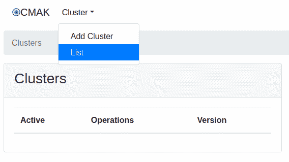
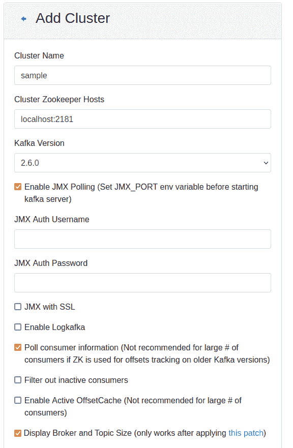
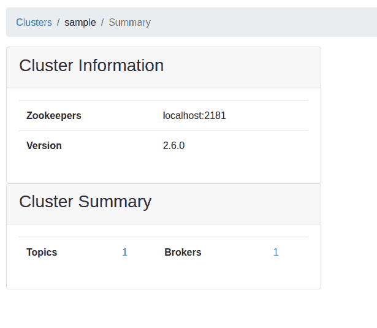
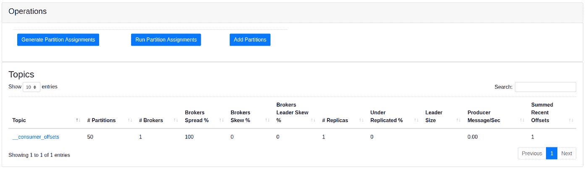
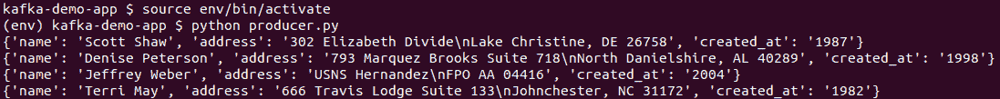
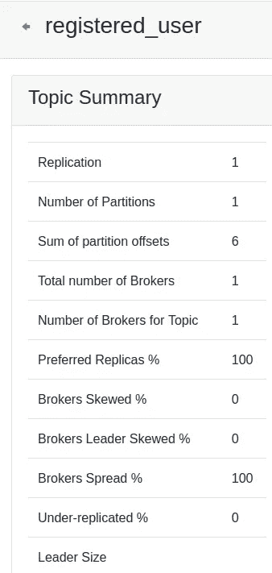
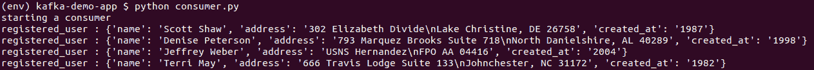

# 阿帕奇卡夫卡的生产者和消费者样本

> 原文：<https://blog.devgenius.io/producer-and-consumer-samples-for-apache-kafka-74a560abe803?source=collection_archive---------15----------------------->

为 Kafka 服务器创建生产者和消费者的指南


由 [Mira Kemppainen](https://unsplash.com/@mirakemppainen?utm_source=medium&utm_medium=referral) 在 [Unsplash](https://unsplash.com?utm_source=medium&utm_medium=referral) 拍摄的照片

如果您还没有在本地机器上安装 Apache Kafka，请在继续之前阅读下面的文章。

[](/apache-kafka-set-up-on-a-local-system-890c48202e64) [## Apache Kafka 在本地系统上的设置

### 在 ubuntu 系统上安装 Kafka 的分步指南

blog.devgenius.io](/apache-kafka-set-up-on-a-local-system-890c48202e64) 

嗯，如果你已经安装了它；我们继续吧！

使用三个不同的终端运行以下命令；

动物园管理员:`bin/zookeeper-server-start.sh config/zookeeper.properties`

卡夫卡-服务器:`bin/kafka-server-start.sh config/server.properties`

集群管理器:`bin/cmak -Dconfig.file=conf/application.conf -Dhttp.port=8080`

现在，在浏览器上打开集群管理器:`localhost:8080/`



集群管理器主页

选择选项`Add Cluster`；您将看到下面的屏幕。



添加您喜欢的任何集群名称(即样本)，我们的 zookeeper 主机正在`localhost:2181`上运行。(如果您在不同的端口上配置了它，请提供该端口。)选择您想要检查的所有其他选项。保存配置，它将引导您进入下面的屏幕。



请注意，在群集摘要中，我们有主题 1 和经纪人 1。最初，当我们创建一个集群时，它将拥有默认的 1 个主题和 1 个代理。

如果检查主题，默认主题是`__consumer_offsets`



现在，让我们编写一个生成数据的示例程序，将数据发送到 Kafka 服务器，并通过消费者检索数据。(注意:代码是用 Python 写的)

必需的库:

```
Faker==8.10.1
kafka-python==2.0.2
python-dateutil==2.8.1
text-unidecode==1.3
```

你可以按照下面的代码或者克隆它:`[kafka-demo-app](https://github.com/harmishpatel21/kafka-demo-app.git)`

生成假数据:

制片人:

消费者

克隆一个 repo/code 后，打开两个终端；

端子 1: `python producer.py`



当您运行生成器时，请注意集群管理器。创建了一个名为`registered_user`的新主题(这是我们在 producer.py 代码中提供的名称。)打开主题，你会看到，随着生产者生成假数据，‘分区偏移量之和’增加，意味着我们的 Kafka 服务器通过我们的生产者接收数据。



端子 2: `python consumer.py`



当您运行消费者时，它将从 Kafka 服务器读取所有数据。如果我们想要更多的消费者，我们可以打开另一个终端并运行 python consumer.py

有许多选项来划分主题、进行分区以及在不同的端口检索产生的数据。使用官方文档进行更多的实验。

*Ping me on*[*LinkedIn*](https://www.linkedin.com/in/harmish2111patel/)*如果你需要 Kafka 的更详细的解释以及如何运行和配置它，或者如果你有任何建议，请在下面留下评论。*

感谢你的时间，我希望你能学到一些东西。