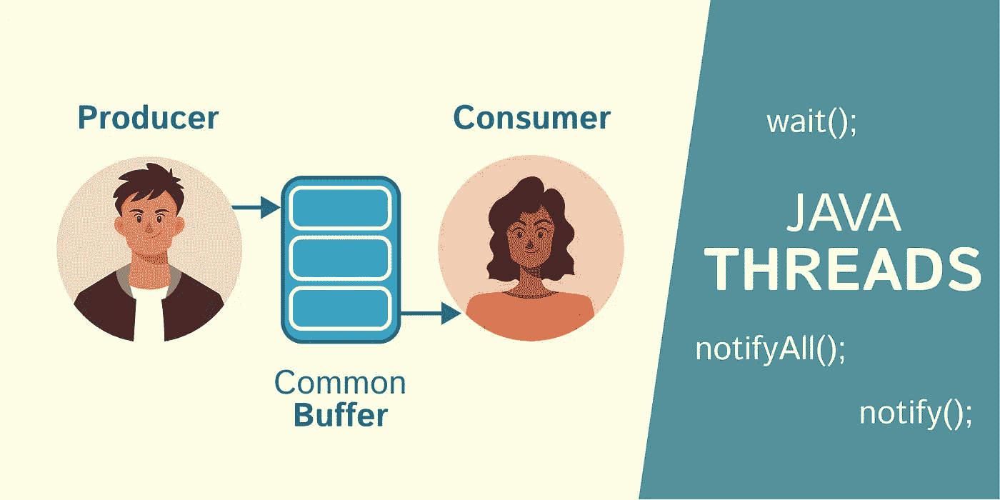
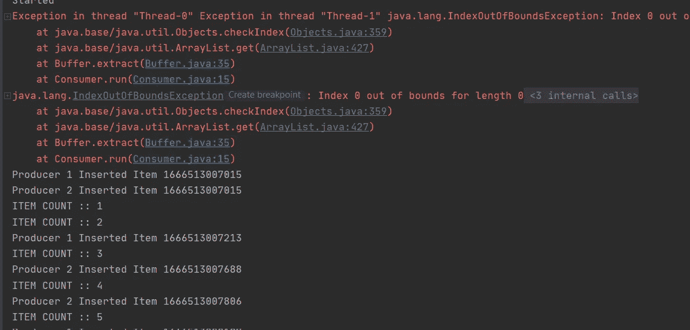
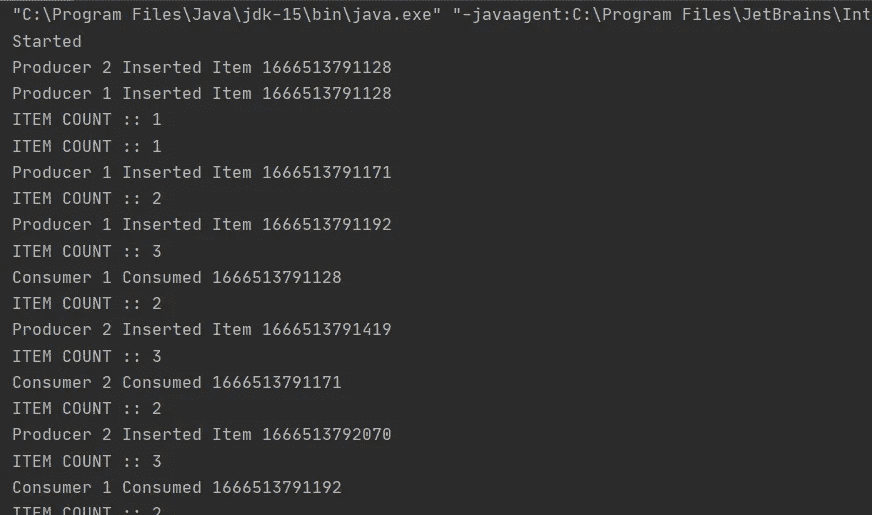
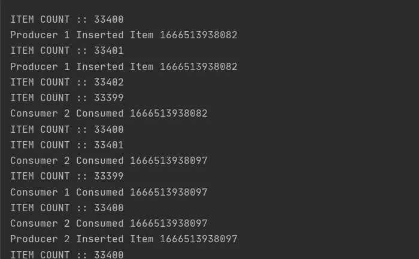
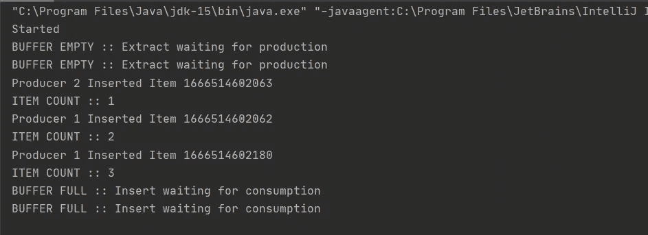
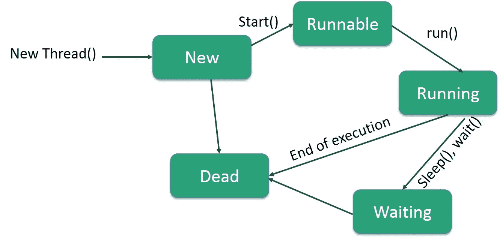
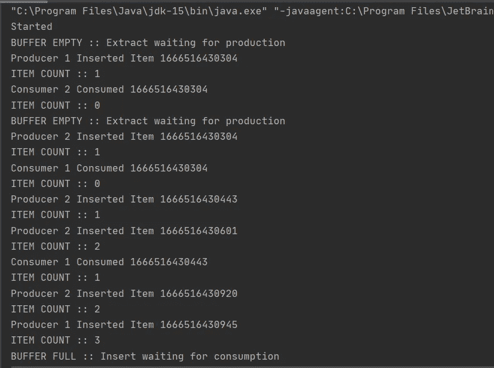

# 线程的生产者-消费者问题(用代码分解解释)

> 原文：<https://blog.devgenius.io/producer-consumer-problem-with-threads-explained-with-code-breakdown-626aaf0c0011?source=collection_archive---------4----------------------->



生产者-消费者问题是学习多线程时要解决的一个非常常见的问题。特别是 Java。我写这篇小文章的原因是因为我注意到很多人对补丁的实现以及`wait();`、`notify();`和`notifyAll();`的作用感到困惑。所以，我们用一种简化的方式来看这个:)

# 什么是生产者——消费者问题？

这无疑是你进入多线程时要解决的第一个问题。

*   我们让“生产者”和“消费者”共享数据的“公共缓冲区”。
*   当从一个**公共/共享**缓冲区插入或提取数据时，所有的生产者和消费者都将在他们各自的线程上运行。
*   缓冲区将有一个最大值。(它可以存储的最大数据量)

为了解决这个问题，我们需要**同步**。我们将使用同步来同步共享资源。在我们的例子中是公共缓冲区。但是现在，让我们先不要考虑同步，看看会发生什么。我们将创建 4 个类。“主要”、“缓冲”、“生产者”和“消费者”。

# 生产者——没有同步或条件的消费者代码

> 缓冲等级

> 生产者阶层

> 消费者阶层

> 主类

好了，现在我们有 2 个生产者和 2 个消费者，缓冲区大小为 3。让我们看看它的输出是什么。



我们这里有两个问题。

*   索引越界错误，因为使用者试图从空缓冲区提取数据。
*   生产者不断添加数据，即使在最大数量之后。(见图中第 5 项)。

解决这个问题很简单。我们需要为提取和插入方法添加条件。

*   仅当缓冲区不为空时提取数据。
*   仅当缓冲区未满时插入数据。

让我们看看如果我们在这些的`extract`和`insert`方法中添加`if`条件会发生什么。



这里的条件已经发挥作用，我们没有任何错误。但是输出都混在一起了，这不是我们想要的。如果我们加一个`while` 而不是`if`会怎么样？这能解决问题吗？让我们看看。



哇哦。。物品数量刚刚破了记录。缓冲区一开始就没有满，而`insert` 方法中的 while 循环不断地向缓冲区添加数据，给我们提供了这个输出。显然不是解决办法。让我们将同步添加到 mix 中，看看我们是否能以这种方式修复它。

# 生产者——带有同步和条件的消费者代码

有两种使用同步的方法。它可以是一个同步函数或同步代码块。**在同步函数或代码块中，我们可以使用几个特殊的关键字**。也就是说，他们将是`wait();`、`notify();`和`notifyAll();`

所以让我们在`extract`和`insert`函数中添加`synchronized` 关键字。然后`wait();`给定前面的条件。



好了，现在我们有进展了。我们有一个部分工作的代码，其输出符合我们的预期。还记得我们开始生产者和消费者线程的顺序吗？

```
Consumer c1 = new Consumer(buffer, 1);
Consumer c2 = new Consumer(buffer, 2);
Producer p1 = new Producer(buffer, 1);
Producer p2 = new Producer(buffer, 2);
```

第一个“缓冲区为空”消息由消费者 1 打印，下一个消息来自消费者 2，因为缓冲区一开始就是空的。在执行`wait();`方法之前，两个消费者线程都打印了该输出。当最后两行的缓冲区已满时，2 个生产者或多或少会发生同样的事情。

如果我们观察 java 线程的生命周期，这是意料之中的。所有线程都从主类**开始**进入“运行”状态。然后根据缓冲区中的项目，生产者和消费者要么完成他们的工作，要么在 while 循环中进入“等待”状态。



现在我们要做的就是让“等待”线程在相同的条件下再次运行。消费者进入“等待”状态，因为缓冲区一开始就是空的。但是一旦缓冲区有了一些数据，它们就应该开始消耗。对于生产者来说，反之亦然。因此..我们需要一种方法将线程的“等待”状态改回“运行”状态。这就是`notify();`和`notifyAll();`的用武之地。

> `notifyAll();`将信号通知所有等待的线程回到运行状态。`notify();`另一方面会发信号让单个等待线程回到它的运行状态。但是哪一个完全取决于操作系统。
> 
> 尝试移除 wait()；并查看输出。它将在 while 循环中无限地打印“缓冲区满”或“缓冲区空”。

# 带有同步`wait` 和 notifyAll 的生产者-消费者代码。



最后。成功。我们期望从代码中得到的输出和功能。使用`wait();`和`notifyAll();`实现同步

# 结论

对于 java 中的生产者-消费者问题，这是一个循序渐进的方法和代码分解。尽管这是一个小的修正，但代码经常会让 java 并发初学者感到困惑。需要记住的 5 件重要事情。

1.  **处理共享资源时使用同步**。例如生产者消费者问题中的共享缓冲区。
2.  `wait();`函数也可以带一个参数，表示它可以等待多长时间(`wait(duration in millis);`)。这在某些不同的问题上很方便。
3.  `notifyAll();`将向所有等待共享对象的线程发出信号，而`notify();`只向被操作系统选中的单个线程发出信号。
4.  如果仔细观察提取和插入逻辑…**notifyAll()；提取函数** **内部的方法用于通知等待的生产者**开始插入，而**则是 notifyAll()；插入函数** **内部的方法用于通知等待的消费者**开始消费。
5.  `wait();`、`notifyAll();`和 `notify();` **都必须从同步函数或同步代码块**中调用。

我希望这消除了你们在这个问题上的大部分困惑或疑虑。干杯，快乐编码🍺。直到下次:)

由，**鹤山威客**