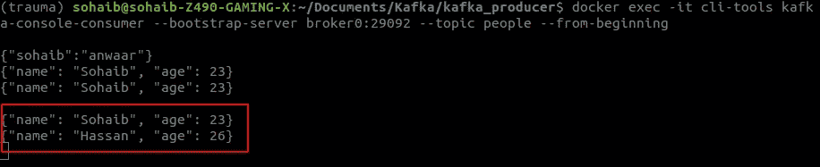
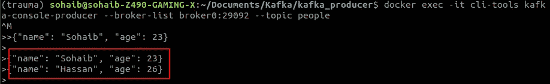
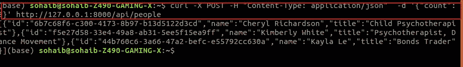
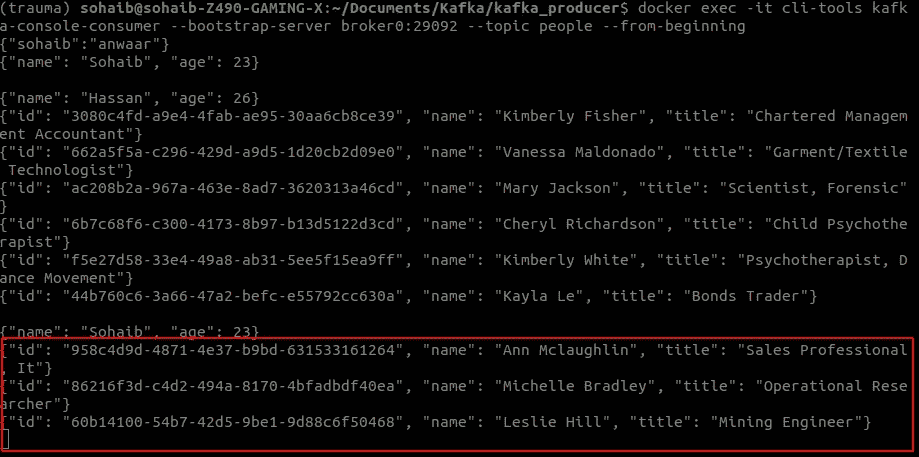

# 使用 CLI 生成给 Kafka 的消息

> 原文：<https://blog.devgenius.io/producing-message-to-kafka-using-cli-6bd22fc51d5c?source=collection_archive---------6----------------------->


# 先决条件

1.  Kafka-installations-and-Kafka-topics:[https://medium . com/dev-genius/Kafka-installations-and-Kafka-topics-f0b7c 81754 D8](https://medium.com/dev-genius/kafka-installtions-and-kafka-topics-f0b7c81754d8)
2.  Kafka-with-python-fast-API:[https://medium . com/dev-genius/Kafka-with-python-fast-API-b 1622 EB 7 F9 d 0](https://medium.com/dev-genius/kafka-with-python-fast-api-b1622eb7f9d0)

# 初始化卡夫卡

```
docker-compose up -d
```

# 创建主题

我们将创建一个名为`people`的主题，包含 2 个分区和 1 个副本

```
docker exec -it cli-tools kafka-console-consumer --bootstrap-server broker0:29092 --topic people --from-beginning
```

# 创建生产者

```
docker exec -it cli-tools kafka-console-producer --broker-list broker0:29092 --topic people
```



# 初始消费者

初始化消费者，以便无论生产者何时产生消息，消费者都会使用该消息

```
docker-compose exec broker kafka-console-consumer --bootstrap-server localhost:9092 --topic test --from-beginning
```

# 生成消息

```
{"name": "Sohaib", "age": 23}
{"name": "Hassan", "age": 26}
```



# 消费信息

```
{"name": "Sohaib", "age": 23}
{"name": "Hassan", "age": 26}
```

因此，当我们使用生成器生成一条消息时，它将很快被消费者消费，并且我们可以在消费者那里看到该消息。

# 现在让我们尝试使用 python 生成一条消息

首先，让我们创建一个 env 文件，它将帮助我们保持 Kafka 服务器设置

# 开始的步骤

1.  创建虚拟环境

```
# I am using conda so
conda create -n kafka python=3.8
```

1.  安装需求

```
# kafka-python==2.0.2
# fastapi[all]== 0.75.1
# python-dotenv==0.20.0
# Faker==13.3.4
pip install -r requirements.txt
```

1.  创建一个`.env`文件

```
BOOTSTRAP_SERVER="localhost:9092,localhost:9093,localhost:9094"
TOPIC_NAME="people"
TOPIC_PARTITION=3
TOPIC_REPLICA=3
```

1.  使`main.py`可执行

```
# Import Libraries
import os
import uuid
from typing import List
```

```
from dotenv import load_dotenv
from fastapi import FastAPI
from faker import Faker
from kafka import KafkaAdminClient
from kafka.admin import NewTopic
from kafka.errors import TopicAlreadyExistsError
from kafka.producer import KafkaProducer
```

创建启动功能

```
# Startup Function
@app.on_event('startup')
async def startup_event():
  """_summary_: Create the topic if it doesn't exist
  """
  # Getting the boot strap servers from the environment
  client = KafkaAdminClient(bootstrap_servers=os.environ['BOOTSTRAP_SERVER'])
  try:
    # Creating the topic
    topic = NewTopic(name=os.environ['TOPIC_NAME'],
                    num_partitions=int(os.environ['TOPIC_PARTITION']),
                    replication_factor=int(os.environ['TOPIC_REPLICA']))
    client.create_topics([topic])
  except TopicAlreadyExistsError as e:
    print(e)
  finally:
    client.close()
```

创建一个函数来生成一条消息

```
def make_producer():
  """_summary_: Create a Kafka producer
  """
  producer = KafkaProducer(bootstrap_servers=os.environ['BOOTSTRAP_SERVER'])
  return producer
```

创建 API 以生成消息

```
@app.post('/api/people', status_code=201, response_model=List[Person])
async def create_people(cmd: CreatePeopleCommand):
  """_summary_: Create a list of people
  """
  people: List[Person] = []
  # Creating the Fake people
  faker = Faker()
  # Creating the producer
  producer = make_producer()
  # Creating the people and sending them to the topic
  for _ in range(cmd.count):
    person = Person(id=str(uuid.uuid4()), name=faker.name(), title=faker.job().title())
    people.append(person)
    producer.send(topic=os.environ['TOPIC_NAME'],
                key=person.title.lower().replace(r's+', '-').encode('utf-8'),
                value=person.json().encode('utf-8'))
  # Closing the producer
  producer.flush()
```

```
 return people
```

完成所有这些后，我们可以使用

```
uvicorn main:app --reload
```

现在我们可以使用 API 生成消息

```
curl -X POST "http://localhost:8000/api/people" -H "accept: application/json" -H "Content-Type: application/json" -d "{\"count\": 3}"
```



现在，我们可以看到消费者传达的信息



# 结论

在这篇博客中，你已经学习了如何在 python 和终端的帮助下创建一个生产者，并使用消费者阅读消息。您还可以使用 API 生成消息，并使用消费者阅读新闻。您也可以在 GitHub repo 中查找代码。

# 参考

1.  [https://kafka.apache.org/quickstart](https://kafka.apache.org/quickstart)
2.  [https://github.com/SohaibAnwaar/Produce-Messages-To-Kafka](https://github.com/SohaibAnwaar/Produce-Messages-To-Kafka)

# 作者

*   索海卜·安瓦尔:[https://www.sohaibanwaar.com](https://www.sohaibanwaar.com/)
*   Gmail:[sohaibanwaar36@gmail.com](mailto:sohaibanwaar36@gmail.com)
*   LinkedIn : [在这里做一些专业的谈话](https://www.linkedin.com/in/sohaib-anwaar-4b7ba1187/)
*   堆栈溢出:[在这里获得我的帮助](https://stackoverflow.com/users/7959545/sohaib-anwaar)
*   在这里查看我的杰作
*   GitHub : [在这里查看我的代码](https://github.com/SohaibAnwaar)