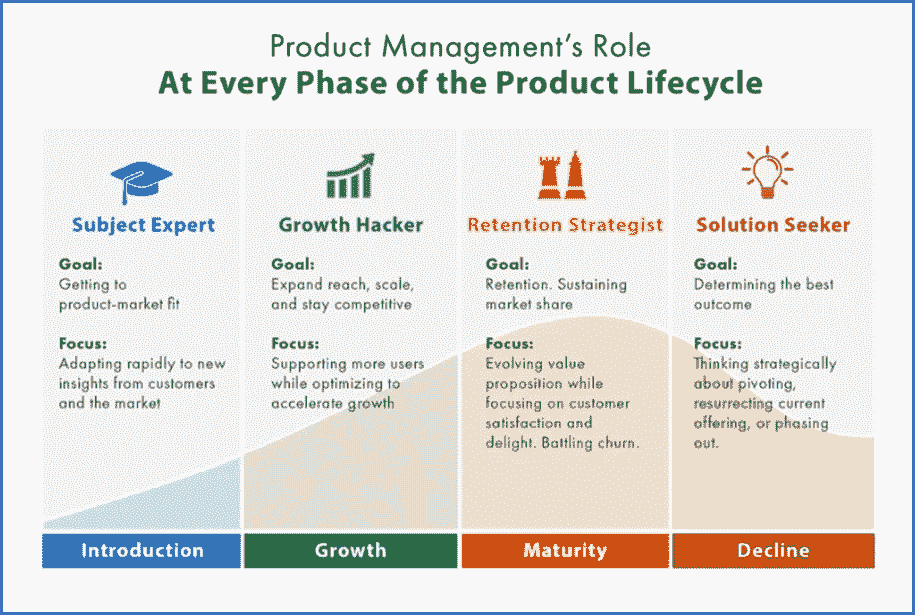
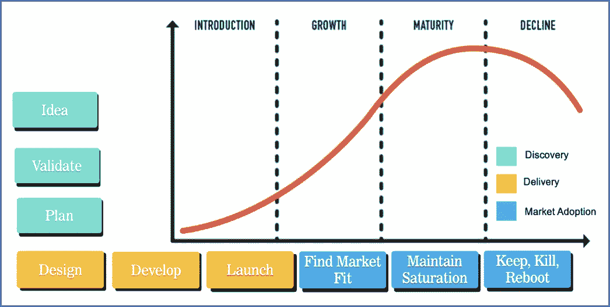
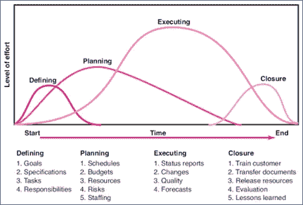

# 产品管理与项目管理:生命周期

> 原文：<https://blog.devgenius.io/product-management-vs-project-management-lifecycle-8b1c42a5b4ee?source=collection_archive---------11----------------------->

产品管理和项目管理是不同的。此外，在生命周期方面。一个生命周期是一系列事件的过程，这些事件使一个新产品出现，并跟随它成长为一个成熟的产品，并最终达到临界质量和衰退。产品生命周期中最常见的步骤包括产品开发、市场引入、成长、成熟和衰退/稳定。为了充分理解产品管理和项目管理之间的生命周期差异，您首先需要理解产品和项目之间的差异。

# **定义**

产品是可以提供给市场以解决问题或满足欲望或需求的东西。该产品的周期由几个阶段组成。产品首先被设计，然后被开发，投放市场，被控制，最后当对产品的需求减少时被丢弃。产品通常由产品团队开发。

因此，产品管理是管理产品生命周期的能力，从最初的概念化到开发，推出，增加接受度，最终停产。没有固定的时间表，因为它是基于产品在市场上的成功。产品经理确保开发出好的产品，满足客户期望和市场需求。

项目管理是一项与产品或服务的实际创建和执行相关的功能。时间表是固定的，并且是一次性工作，因为它将在项目完成并且产品交付给客户时完成。项目的生命周期经历五个阶段:开始、计划、执行、跟踪和控制以及完成。项目经理从始至终监督项目，并确保所有目标都得以实现

# **生命周期**

来源:https://www.productplan.com/

产品生命周期是一个完整的框架，产品企业通过产品生命周期的各个层次来控制产品。PLM 是一种产品控制方式，涵盖了产品的所有因素，包括管理、规划、设计、生产、广告、资源和人员，以及与这些因素相关的软件程序。这是一个总括时期，对不同的组织意味着不同的事情。

来源:[https://productcoalition.com/](https://productcoalition.com/)

**产品生命周期阶段#1:简介**

所有的商品都始于某个地方，不管它们是不是衍生产品，或者是某个著名产品的延伸，或者是某个不知名的初创公司的全新产品。无论其起点如何，一个全新的产品都面临着一系列挑战，其中一些挑战需要产品经理的关注。

**产品生命周期阶段#2:增长**

一旦收入增加，产品有了市场，就进入了第二阶段。这是一个程度，而许多企业只是花钱做广告，因为他们已经认识到哪些信息是有共鸣的，哪些渠道的质量适合获得早期购买的人群。

随着规模经济开始发挥作用，以及(如果适用的话)生产费用随着产量提高和缺陷减少而下降，利润率通常会在整个部门迅速增长。但随着收入的增加，竞争也越来越激烈，因为不同的企业都明白这种产品有一个合法的市场，并推出了自己的产品。

**产品生命周期阶段#3:成熟度**

产品成年期可能听起来像一个很棒的目标，但是对于一个产品来说，它现在不再像通常那样有吸引力，因为繁荣部分。在这一部分，新客户热潮逐渐消退，竞争吞噬市场份额，收入下降，因为更大的企业宣布分一杯羹。

大多数想要为你的班级购买产品的人已经得到了，最新的顾客流入市场的速度减缓为涓涓细流。现在最大的项目是保持尽可能多的客户群，即使是与客户流失做斗争。

**产品生命周期阶段#4:衰落**

最终一切都会走下坡路，你的产品也不会例外。这种下降可能是由于产品的整个市场都在萎缩——既因为替代答案，也因为共同需求的折扣——或者它可能只是因为你的产品独一无二，而竞争已经超过了你的产品的受欢迎程度、价格和/或功能。

而项目生命周期(PLC)承认计划的生命周期是有限的。文学中有一些独特的生命周期时尚。上面证明的 PLC 是一个普通的 PLC。项目尝试开始时进展缓慢，达到顶峰后因为接近尾声而下降。

来源:[https://pressbooks.bccampus.ca/](https://pressbooks.bccampus.ca/)

项目经理和项目团队有一个共同的目标。它是为了实现项目的目标而开展项目的工作。每个项目都有一个开始、一个活动完成项目的中间阶段和一个结束(成功或失败)。一个标准项目通常有四个主要阶段:每个阶段都有自己的任务和问题议程:开始、计划、实施和完成。总的来说，这些步骤代表了项目从开始到结束的路径，通常称为项目生命周期。

**项目生命周期阶段#1:简介**

确定这些第一阶段、开始阶段、项目目标或需求；这可能是一个商业问题或机会。业务案例中记录了对需求的适当响应，以及推荐的可能解决方案。进行可行性研究以确定每个选项是否实现项目目标，并确定最终推荐的解决方案。

推荐的解决方案获得批准后，将启动一个项目来部署获得批准的解决方案，并任命一名项目经理。确定与关键成果相关的工作组，并开始组建项目团队。然后，经项目经理批准，进入详细规划阶段。

**项目生命周期第二阶段:计划**

下一个阶段，即计划阶段，尽可能详细地开发项目解决方案，并计划实现项目目标所需的步骤。在这一步，团队确定所有要做的工作。确定项目任务和资源需求以及创建它们的策略。这也称为范围管理。创建一个项目计划，概述活动、任务、依赖关系和时间表。项目经理通过提供劳动力、设备和材料成本的估算来协调项目预算的制定。预算有助于监控和管理项目的日常成本支出。

**项目生命周期第三阶段:执行**

第三阶段，实施阶段，执行项目计划，执行项目工作。在实施过程中保持控制并根据需要进行沟通非常重要。持续监控进度，进行适当的调整，并记录与原计划的偏差。对于任何一个项目，项目经理大部分时间都花在这一步上。在项目执行期间，人们执行任务，进度信息通过定期的团队会议进行报告。项目经理使用这些信息来保持对项目方向的控制，方法是将进度报告与项目计划进行比较，以衡量项目活动的绩效，并根据需要采取纠正措施。行动的第一步应该是让项目回到正轨(即，回到最初的计划)。如果做不到这一点，团队应该记录原始计划的变化，并记录和发布对计划的修改。

**项目生命周期阶段#4:结束**

在最终关闭或完成阶段，重点是向客户发布最终可交付成果，向业务部门移交项目文档，终止供应商合同，释放项目资源，并向所有利益相关方传达项目的关闭。剩下的最后一步是进行 lessonslearned 研究，检查哪些进展顺利，哪些进展不顺利。通过这种类型的分析，经验的智慧被转移回项目组织，这将帮助未来的项目团队。

来源:

https://www.binaracademy.com

【https://www.productplan.com 

[https://productcoalition.com](https://productcoalition.com/)

[https://press books . BC campus . ca](https://pressbooks.bccampus.ca/)