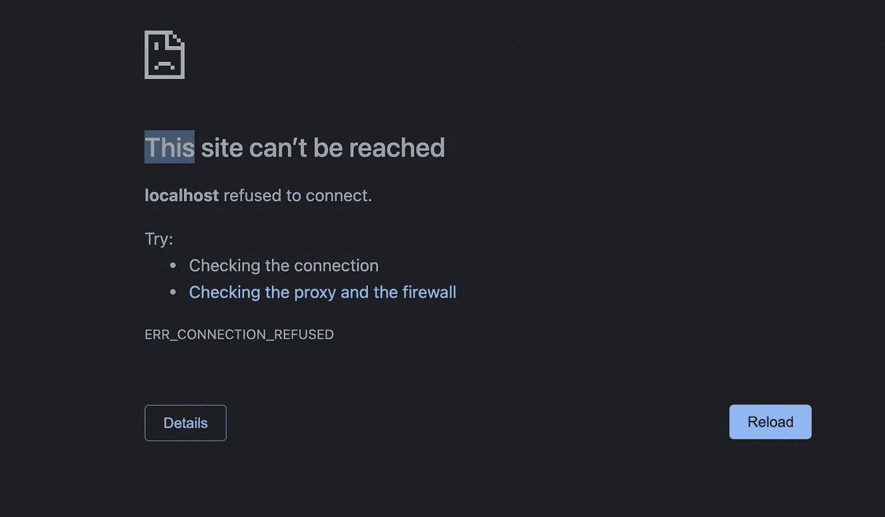
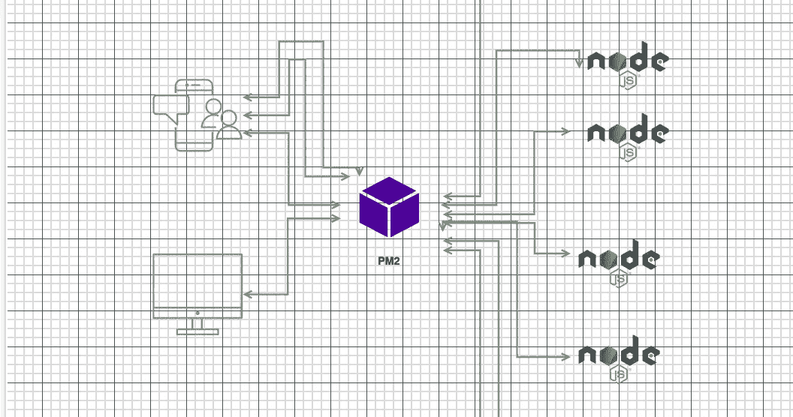
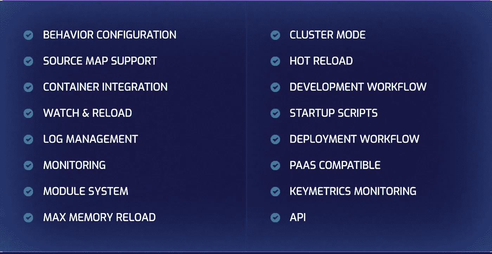
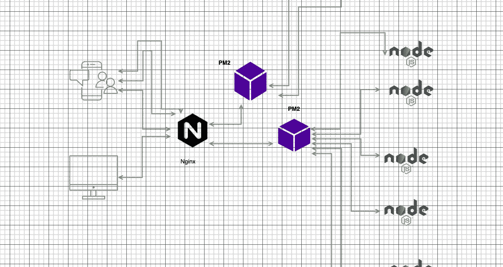

# Node.js 服务器优化和整合

> 原文：<https://blog.devgenius.io/production-grade-node-js-nginx-pm2-and-more-16d8b9fc56a2?source=collection_archive---------2----------------------->


泽维尔·冯·埃拉赫在 [Unsplash](https://unsplash.com?utm_source=medium&utm_medium=referral) 上的照片

想象一下，您刚刚创建了 Node.js 应用程序，现在您必须确保服务器的可用性和健壮性。我们将从一个非常基本的/不推荐的方法开始，来理解我们在部署 Node.js 应用程序时做错了什么，并逐步向上构建，朝着我们的最终目标填充缺失的部分。在本教程中，我们将使用**快递。**

## 快速应用程序

一个很基础的 app，有健康的路线，也有故障的路线。

。包封/包围（动词 envelop 的简写）

## 一级:


> 命令:

```
node index.js
```

运行应用程序的第一种也是最差的方式是，**直接用 node 执行脚本，** Node.js 本来就是单线程的，带有一个事件模型，在生产中不能像预期的那样伸缩。

有些人可能不同意节点是单线程的评论，可能会对“工作线程”、Node.js 使用不同的内部读写过程以及人们为解决问题而做的其他事情有争议，这只会增加项目的复杂性。

试错法入门

当我们使用我们的客户或邮递员给 bad-route 打电话时会发生什么，应用程序不会工作，你的应用程序会瘫痪，你会失去你宝贵的客户和他们的信任。

你对这种方法有什么期望？



如何重现这个错误作出一个 get 请求到你的健康路线你会得到一个“积极”的回应从服务器，打开另一个标签与 bad-route，应用程序将崩溃，直到我们手动启动。

除此之外，你还会有意想不到的结果和障碍。

**有什么解决办法？**

建立一个“自我修复”机制。

> “恢复很难。后悔更难。”—布列塔尼·伯格恩

我们需要在我们的应用程序之上有某种监督/过程管理器，来跟踪我们的应用程序是否运行良好，是否如“预期”的那样

你可以考虑 nodemon， **nodemon** 的核心只是一个开发脚本，为你提供热重装，免去重启服务器的麻烦。它只有很少的监控机制，并不是在生产中管理我们项目的理想人选。

这里最好的赌注是 **PM2，永远，**或类似的东西。

## 第二级:

命令:

```
npm i -g pm2pm2 start index.js --name "Server" -i 0
```



PM2 是迄今为止我的 Node.js 应用程序在规模上最久经考验的进程管理器，它帮助你在服务器上拥有越多的线程/CPU 单元。线程/内核与您可以运行的集群单元成正比。

除了对我们的应用程序进行负载平衡之外，pm2 还提供了流畅的部署，为我们节省了大量时间。除此之外，您还可以存储和管理日志。分离访问日志和错误日志。

全新部署或更改后重新加载应用程序的命令:

```
pm2 reload all
```

命令查看应用程序的日志以尽快部署热修复程序:

```
pm2 logs
```

当您的应用程序被部署到生产环境中时，您会在日常工作中使用这些命令。

您还可以在生产中监控您的应用程序。

```
pm2 monit
```

这将为您提供一个漂亮的老式终端 UI，其中包含审计应用程序性能所需的所有细节

**根据他们的官方文件，这些是你从 pm2 得到的特性:**



现在，我们已经完成了应用程序的**垂直扩展**部分，应用程序将分担负载，并随意优雅地关闭和重启。

尽管 pm2 有这么多出色的功能，但它也有可能失灵。

示例:

您对应用程序进行了全新部署；您没有针对 CI/CD 管道的测试套件，我们在这里都是有罪的。

在新的部署中发生了什么，X 安装了一个新的依赖项，您通过先安装它来重新加载，或者您安装了它，但是您的 package.json 不知何故被遗漏了，或者提交在同行评审中被部分恢复。

现在你重新加载了你的应用程序。

现在，第一次重新加载时，由于缺少依赖项，应用程序会立即崩溃。现在处于恐慌状态，这些都需要迎合。

这里有什么建议:

始终保持稳健的 CI/CD 渠道。对于部署，请始终创建应用程序的版本。决定在一个新的上游块中部署新的应用程序，看看是否一切顺利，然后在主运行应用程序上进行部署。

让这变得更容易的工具是高度可扩展的，并且在 **NGINX 后面有一个活跃的社区。**

## 第三级:



什么是 **NGINX** ？

根据 NGINX 官方文件:

> NGINX 是一款开源软件，用于 web 服务、反向代理、缓存、负载平衡、媒体流等等。它最初是一个为获得最佳性能和稳定性而设计的 web 服务器。除了 HTTP 服务器功能，NGINX 还可以充当电子邮件(IMAP、POP3 和 SMTP)的代理服务器，以及 HTTP、TCP 和 UDP 服务器的反向代理和负载平衡器。

NGINX 是一个高性能的服务器，但我们的用例是创建一个反向代理/负载平衡器。

我们将如何使用 **NGINX** ？

我们可以在两个不同的服务器上托管两个不同版本的应用程序，并在这两个服务器之间创建一个 API 网关。

如果这听起来令人困惑，让我们看一个例子:

正如我们所知，旧服务器是预期拥有并回复大部分流量的服务器，但同时我们也可以使用新服务器。

实际上有两种方法，要么在 old_server 内添加新服务器的上游块，让 NGINX 进行负载平衡，我们可以使用 IP 和端口的任意组合来分配负载，我们可以让一些实例运行在负载平衡 NGINX 的同一个实例上，或者我们可以在实例之间进行分配。

我们在这里所做的是为我们的客户提供的版本，允许新的 API 分发给一些客户，并根据他们的反馈以及稳定性和健壮性方面的经验，我们可以决定微调回滚或将发布提交给所有客户端。

使用 Nginx，我们可以实现**水平扩展**在我们的示例中，对于那些混淆水平和垂直扩展的人，**垂直扩展是为了提升当前的机器规格，水平扩展是为了在混合中附加更多实例并分担负载。**

NGINX 是一个非常强大的工具，他们证明了它不仅对于 API 是健壮的，而且对于以非常高的吞吐量服务于你的静态分发、你的 HTML、CSS 和其他资产也是健壮的。

如果你决定与客户分享，NGINX 会让你的 URL 更加友好。移除端口和丑陋的配置也有助于您摆脱管理噩梦 **CORS** 。

NGINX 还有其他的替代品，包括 APACHE 和 HAPROXY 等等。

希望你已经很好地理解了问题的概念和它们的解决方案，讨论手头问题的解决方案也能让解决方案更加清晰。

# 关键要点:

*在考虑缩放时，请记住它的垂直和水平两个方面。*

*PM2 和 NGINX 为您的 Node.js 应用程序提供了强大的扩展能力。*

## 资源:

[](https://pm2.keymetrics.io/) [## PM2 -家

### 伙计们刚刚在我的实时服务器上安装了 pm2，并连接到 Keymetrics。印象深刻。这一切天衣无缝，棒极了…

pm2.keymetrics.io](https://pm2.keymetrics.io/) [](https://www.nginx.com/resources/glossary/nginx/) [## NGINX 是什么？- NGINX

### NGINX 是用于 web 服务、反向代理、缓存、负载平衡、媒体流等的开源软件。它…

www.nginx.com](https://www.nginx.com/resources/glossary/nginx/) 

快乐编码+缩放

敬请期待更多和平！！！