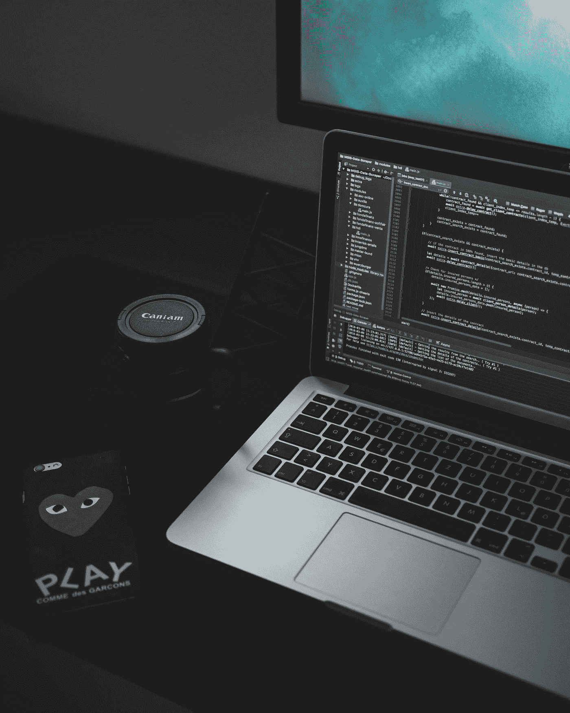

# 来自 60 岁程序员的高效干净的代码技巧

> 原文：<https://blog.devgenius.io/productive-clean-code-tips-from-a-60-years-old-programmer-aa8644301e2?source=collection_archive---------1----------------------->

## 不要再写垃圾代码了



[Unsplash](https://unsplash.com?utm_source=medium&utm_medium=referral) 上 [AltumCode](https://unsplash.com/@altumcode?utm_source=medium&utm_medium=referral) 拍摄的照片

我的公司里有一个顾问，他对自己的代码非常着迷。他热爱编程，他总是激励我们写出高质量的代码

他 60 岁了，仍然对他的代码充满热情。几年前，我有一股代码味，他给了我一些指示，这些指示对我来说很有成效。现在我要分享这些技巧。

## 以下公约的益处

*   干净的代码规则
*   干净代码的维护
*   干净代码提示的质量
*   干净代码的好处

# 童子军规则

> *“总是让你正在编辑的代码比你的好一点儿*
> 
> *找到了”——罗伯特·c·马丁(鲍勃大叔)*

保持你的代码整洁，当你以后检查它时，你会发现它很好，不管是谁把它弄得乱七八糟。

也许你听说过这个规则；“永远让代码比你发现的更好。”1941 年，童子军的创始人罗伯特·斯蒂芬森·史密斯·巴登-鲍威尔说，“试着让这个世界比你发现它的时候好一点。”

## 让我们看看一些规则

*   **把大功能分解成小部分:**保持你的功能小。大型函数会使代码变得复杂。所以做能看懂的小零件。
*   **让变量名有意义:**把有意义的变量名放在你的代码中，这样你可以很容易地找到它们。我觉得变量名应该是一两个字。你可以用大写字母和小写字母来表达。
*   **避免重复:**重复代码可能会很大，如果您创建了重复代码，以后可能无法重用。当你写代码时，你知道你真正需要的是什么，这样就不会有不必要的人员。
*   **避免不必要的条件:**不必要的条件产生代码味。如果你使用了很多条件，你的代码会看起来很复杂。

如果你想知道详细的情况，可以看看这篇文章。

[](/11-clean-code-tips-that-will-assist-you-to-be-a-top-programmer-889cda7d2e40) [## 11 个简洁的代码提示将帮助你成为顶级程序员

### 改进你的编码风格

blog.devgenius.io](/11-clean-code-tips-that-will-assist-you-to-be-a-top-programmer-889cda7d2e40) 

# 长码不是好码

一些开发人员试图使用长代码，但它看起来代码混乱。你写代码，放了很多你实际上不需要的东西，但是把它们放在你的代码里，这会让你的代码变得很大，当你看的时候，你不容易发现错误。所以保持你的代码简单。

有经验的程序员根据需要编写代码。

# 单一责任原则

函数应该很小，并且一个函数不应该使用多个函数。将您的函数分配给一个单独的函数，这样可以使您的代码更加整洁和易于维护。

```
function subtract(x, y) {
    return x - y;
}
```

# 单元测试

“软件从来都不完美，也不会变得完美。但这是制造垃圾的许可证吗？缺少的因素是我们不愿意量化质量。”

*—鲍里斯·贝泽尔*

所以如果程序员写代码认为没有 bug，那他们就错了。没有一个软件没有缺陷。软件开发是一项艰苦的工作。

有时候程序员没有注意到小事情，所以在这一点上，他们避免了 bug，但是在单元测试之后，他们意识到他们错在哪里。

请记住，你是人，所以你会犯错误，你并不完美，所以你需要在代码中对高质量的软件进行单元测试。

很多程序员认为这是浪费时间，但是如果你想写出好的代码，就不要忽略这个过程。此外，它还节省了时间，降低了成本。如果及时发现 bug，也可以清理。以便加速开发，并按时交付产品。

# 练习，练习，练习

*“质量永远不会出事；它总是智慧努力的结果。”*

*—约翰·罗斯金*

你不能指望一天就能写出好的代码。如果你这样认为，那你就错了。大量的练习，练习使人变得完美。你可能听说过。

有许多干净的代码规则，如果你正确地遵循它们，你将是一个好的程序员。所以写代码的时候，多思考，多实践。

# 最后的话

迈出一小步，学习基础知识，你会写出好的代码。你的代码代表你的态度，所以永远不要对你的代码妥协。改变你的习惯，把自己作为一个优秀的程序员展现在世人面前。

谢谢你的时间。

ref:[https://www . stepsize . com/blog/how-to-be-a-effective-boy-girl-scout-engineer](https://www.stepsize.com/blog/how-to-be-an-effective-boy-girl-scout-engineer)

*更多内容尽在*[*blog . dev genius . io*](http://blog.devgenius.io)*。*