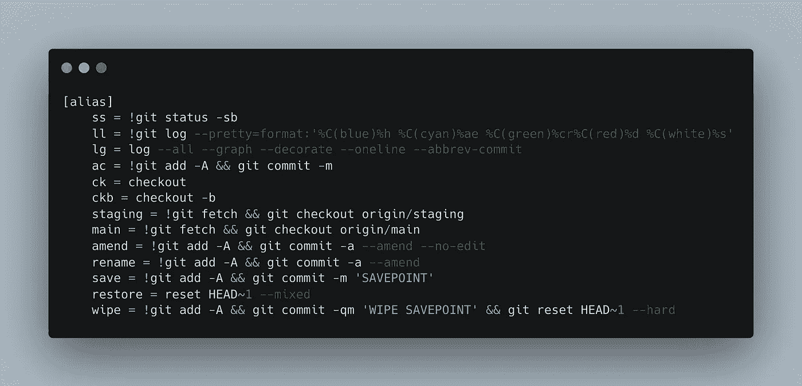

# 使用 Git 别名提高工作效率

> 原文：<https://blog.devgenius.io/productivity-with-git-aliases-4829a118eb2?source=collection_archive---------10----------------------->



从我开始实际工作的那天起已经一年了，这是我需要使用 git 的第一份工作，从这一天起我从未停止使用它，它真是太神奇了。

但是让我非常沮丧的一件事是，在某些情况下，git 命令可能非常长或者不直观。此外，一些命令会显示很多我不想看到的信息。

例如，git status 和 git log 命令会连续显示如下内容:

```
➜ git status
On branch main
Changes to be committed:
  (use "git restore --staged <file>..." to unstage)
 new file:   added_file
 new file:   delete_file
 new file:   renamed_fileChanges not staged for commit:
  (use "git add/rm <file>..." to update what will be committed)
  (use "git restore <file>..." to discard changes in working directory)
 deleted:    delete_file
 deleted:    renamed_fileUntracked files:
  (use "git add <file>..." to include in what will be committed)
 fourth_file
 new_file
  now_renamed_file
```

```
➜ git log
commit 895e76a4e71ecc4cc65de27e4429ffce165cccff (HEAD -> main)
Author: Marco Antonio Bet <[example@example.com](mailto:example@example.com)>
Date:   Fri Jan 7 15:52:36 2022 -0300third filecommit 86deb1bb03edabb56e4cb5d84289fe7ab3025607
Author: Marco Antonio Bet <[example@example.com](mailto:example@example.com)>
Date:   Fri Jan 7 15:52:10 2022 -0300second commitcommit d8fb730fe75482bdcc4cfd923ffdbdec95953a5a
Author: Marco Antonio Bet <[example@example.com](mailto:example@example.com)>
Date:   Fri Jan 7 15:52:02 2022 -0300first commit
```

所以我想知道是否有更好的方式来展示这些信息。

让我们从更简单的开始，即 **git 状态**，但是首先，我们需要了解如何设置 git 别名。

# 设置 git 别名的方法

设置 git 别名有两种方式，一种是通过终端中的命令，另一种是通过编辑 **~/。gitconfig** 文件。

例如，用终端命令设置 **git 状态**改进将是:

```
➜ git config --global alias.ss status -sb
```

但是如果您想用文本编辑器设置 git 别名:

```
➜ git config --global --edit
```

这个命令将打开 git 的默认编辑器。

也可以打开~/。带有`**vim ~/.gitconfig**`、`**code ~/.gitconfig**`或任何其他文本编辑器的 gitconfig 文件。

现在请允许我回到刚才的地方。

```
➜ git config --global alias.ss status -sb
```

那么有了这个新的别名集，我们如何使用它呢？

```
➜ git ss
```

这将显示一个减少的`**git status**`输出。

```
➜  git_alias git:(main) ✗ git ss    
## main
A  added_file
AD delete_file
AD renamed_file
?? fourth_file
?? new_file
?? now_renamed_file
```

您可能会问自己 git status 命令中的`**-sb**`标志是什么。

*   **s** :以短格式给出输出。
*   **b** :显示当前分支

因此，只需对 **git status** 命令做一点点改变，就可以获得更好的输出。

随着 **git log** 的改进，我们将向前推进一点，我将向您展示我目前拥有的两种类型的别名。

# 第一种类型的 git 日志别名

别名:

```
➜ git config --global alias.ll !git log --pretty=format:'%C(blue)%h %C(cyan)%ae %C(green)%cr%C(red)%d %C(white)%s’
```

输出应该是这样的:

```
➜ git ll
895e76a example@example.com 38 minutes ago (HEAD -> main) third file
86deb1b example@example.com 39 minutes ago second commit
d8fb730 example@example.com 39 minutes ago first commit
```

这是我最喜欢的，因为它显示了散列、电子邮件、日期和提交消息。

您可能会问自己在 **git log** 命令中什么是`**--pretty=format:**`标志。基本上，这个命令需要一个可以是占位符的选项，这是我们当前的选项。

每个占位符都以一个 **%** 符号开始。并且 **%C** 占位符代表颜色，如你所见，在括号内总是有一个颜色名称。

此命令中使用的占位符列表:

*   **%C()** :改变文字的颜色。
*   **%h** :显示提交的哈希。
*   **%ae** :显示作者邮箱。
*   **%cr** :显示提交者日期。
*   **%d** :给你看哪个提交是本地和原点的头。
*   **%s** :显示提交消息的主题。

# 第二种类型的 git 日志别名

```
➜ git config --global alias.lg log --all --graph --decorate --oneline --abbrev-commit
```

输出应该是这样的:

```
➜ git lg
* 895e76a (HEAD -> main) third file
* 86deb1b second commit
* d8fb730 first commit
```

这是**不是**我最喜欢的 **git log** 别名，但它是别名的一个很好的例子，因为以前我需要编写完整的命令，现在我只需要编写 **git lg** 。

# 解释我的一些 git 别名

## git 别名中的 Shell 脚本

当 git 别名以**开头时！**这意味着下一个命令是 Bash 或 Shell。有了这个，你就可以创建函数，使用类似 **& &** 和 **||** 的运算符。

```
staging = !git fetch && git checkout origin/staging
main = !git fetch && git checkout origin/main
```

在我工作的地方，我们使用 staging 和 main 作为中心分支，所以每次我需要开始新的工作时，我都需要从一个或另一个分支进行检查，这个命令可以帮助我快速完成这项工作。

```
amend = !git add -A && git commit -a --amend --no-edit
```

这个命令值得注意，因为它是我最常用的命令之一。大多数时候，我提交了一些更改，并认为一切就绪，但突然我发现我忘记了 console.log、comments 等等。

基本上，他所做的是将所有更改添加到最后一次提交，而不更改提交消息。

```
rename = !git add -A && git commit -a --amend
save = !git add -A && git commit -m 'SAVEPOINT'
```

重命名和保存一起工作对我来说，事情是当你有更改时，它们并没有真正保存，当你提交这些更改时，它们现在在一个更安全的地方。工作时，当我要离开一段时间或停止工作时，我使用 save 来存储信息，但我总是返回并重命名上次提交，因为你永远不应该推送提交消息**“保存点”**。

如果我有多次保存，我只需执行一次`**git rebase -i HEAD~N**`并挤压**“保存点”**提交。

```
restore = reset HEAD~1 --mixed
```

Restore 只是取消对更改的提交，但不会丢弃更改。

```
wipe = !git add -A && git commit -qm 'WIPE SAVEPOINT' && git reset HEAD~1 --hard
```

擦我用的不多，但是很有用。擦除会将所有内容添加到带有消息**“擦除保存点”**的提交中，然后重置为擦除前的提交。

如果您运行 **git ll** ，您将看不到提交:

```
895e76a example@example.com 38 minutes ago (HEAD -> main) third file
86deb1b example@example.com 39 minutes ago second commit
d8fb730 example@example.com 39 minutes ago first commit
```

那么，如果不在这里，我在哪里可以找到它？您可以找到键入 **git log — reflog**

```
➜ git log --reflog
commit 06dae1107b534d48d0002e40ccd0a1cf8ac45c6f
Author: Marco Antonio Bet <example@example.com>
Date:   Wed Jan 12 15:58:57 2022 -0300 WIPE SAVEPOINTcommit 895e76a4e71ecc4cc65de27e4429ffce165cccff (HEAD -> main)
Author: Marco Antonio Bet <example@example.com>
Date:   Fri Jan 7 15:52:36 2022 -0300 third filecommit 86deb1bb03edabb56e4cb5d84289fe7ab3025607
Author: Marco Antonio Bet <example@example.com>
Date:   Fri Jan 7 15:52:10 2022 -0300 second commitcommit d8fb730fe75482bdcc4cfd923ffdbdec95953a5a
Author: Marco Antonio Bet <example@example.com>
Date:   Fri Jan 7 15:52:02 2022 -0300 first commit
```

要查看提交内容:

```
➜ git checkout 06dae1107b534d48d0002e40ccd0a1cf8ac45c6f
```

并将提交内容添加到您的工作分支:

```
➜ git cherry-pick 06dae1107b534d48d0002e40ccd0a1cf8ac45c6f
```

正如您所看到的，git alias 对于简化和创建新命令非常有用，上面的命令是我个人使用的别名，但这不应该阻止您改进或创建自己的 git 别名。

我希望我能用 git alias 让你更有效率，更好地理解什么是 git alias，如何使用和编辑它。

非常感谢你，我期待着尽快见到你。😉

如果你喜欢这篇文章，你可以给一个👏。

如果你喜欢关于 Git、Linux、生产力技巧、Typescript 和 Python 的内容，请关注我。

所有命令:

```
[alias]
ss = !git status -sb
ll = !git log --pretty=format:'%C(blue)%h %C(cyan)%ae %C(green)%cr%C(red)%d %C(white)%s'
lg = log --all --graph --decorate --oneline --abbrev-commit
ac = !git add -A && git commit -m
ck = checkout
ckb = checkout -b
staging = !git fetch && git checkout origin/staging
main = !git fetch && git checkout origin/main
amend = !git add -A && git commit -a --amend --no-edit
rename = !git add -A && git commit -a --amend
save = !git add -A && git commit -m 'SAVEPOINT'
restore = reset HEAD~1 --mixed
wipe = !git add -A && git commit -qm 'WIPE SAVEPOINT' && git reset HEAD~1 --hard
```

Github 的完整版本。git config:[https://gist . github . com/its betma/a 350 DCA 5 EB 20 e 07 E4 b 90d 7372 b 64 da 45](https://gist.github.com/itsbetma/a350dca5eb20e07e4b90d7372b64da45)

要了解更多信息:

*   【https://git-scm.com/book/en/v2/Git-Basics-Git-Aliases 
*   [https://git-scm.com/docs/git-status](https://git-scm.com/docs/git-status)
*   [https://git-scm.com/docs/pretty-formats](https://git-scm.com/docs/pretty-formats)
*   [https://git-scm.com/docs/git-log](https://git-scm.com/docs/git-log)