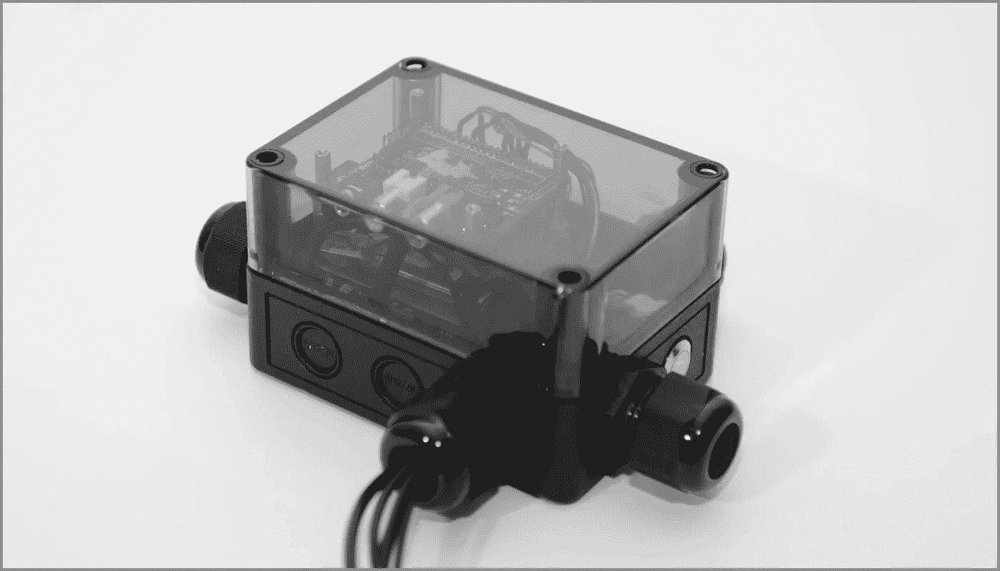
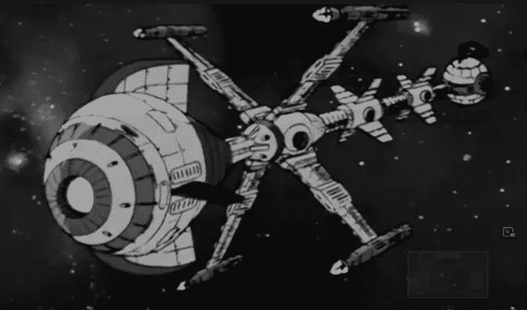
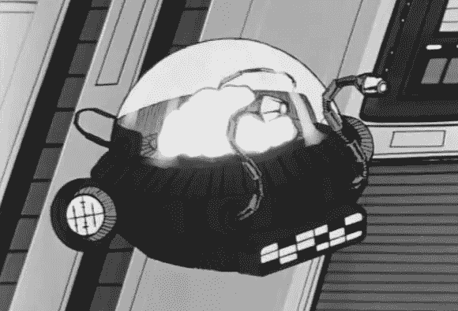
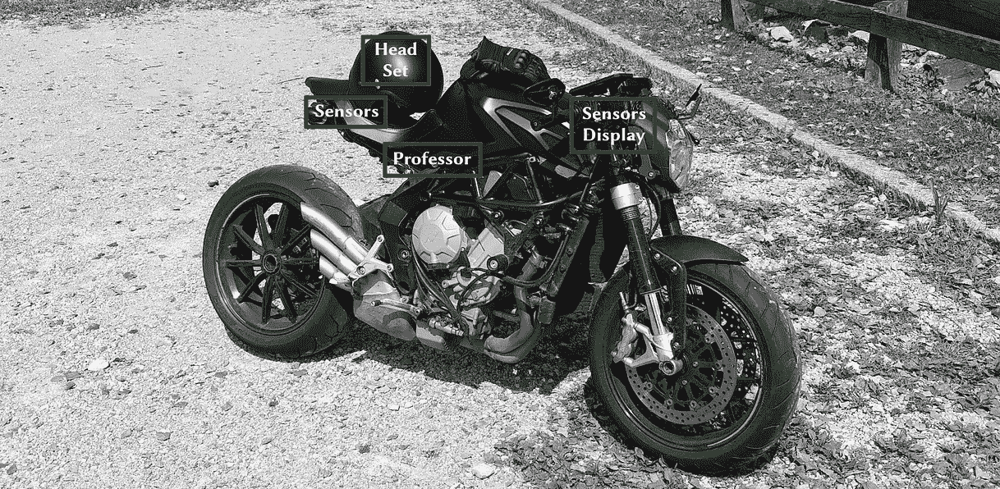
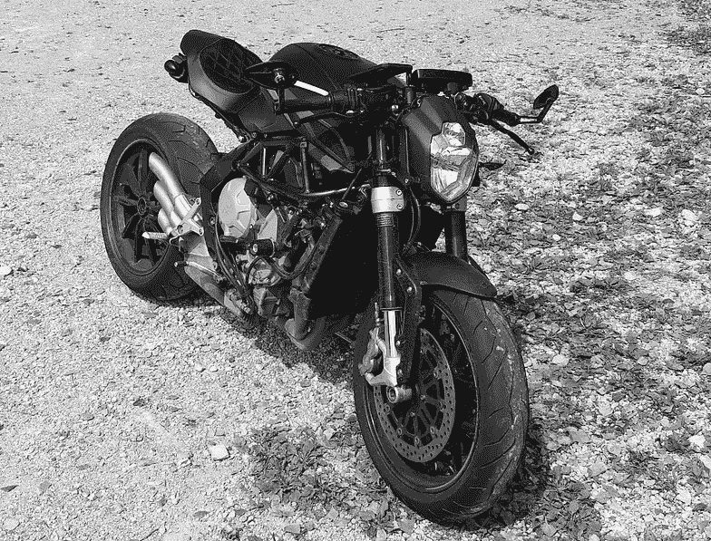
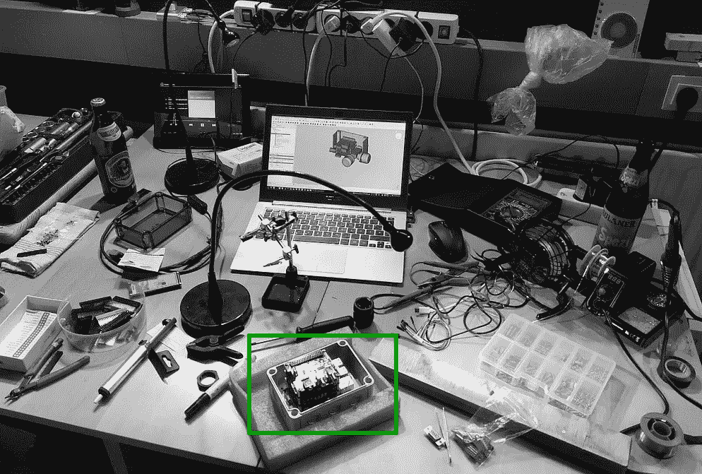
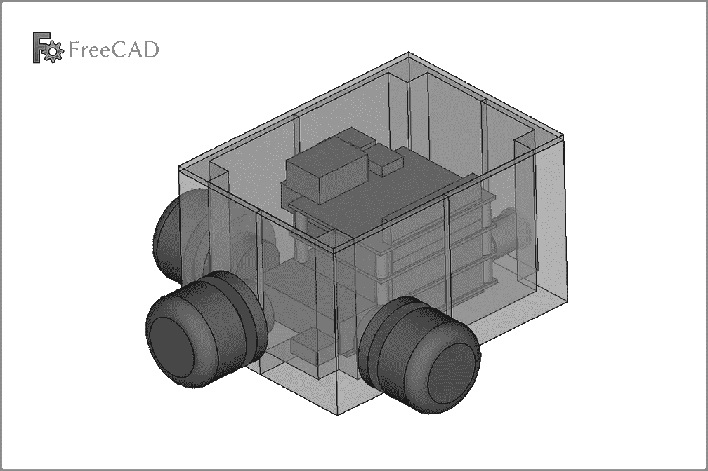
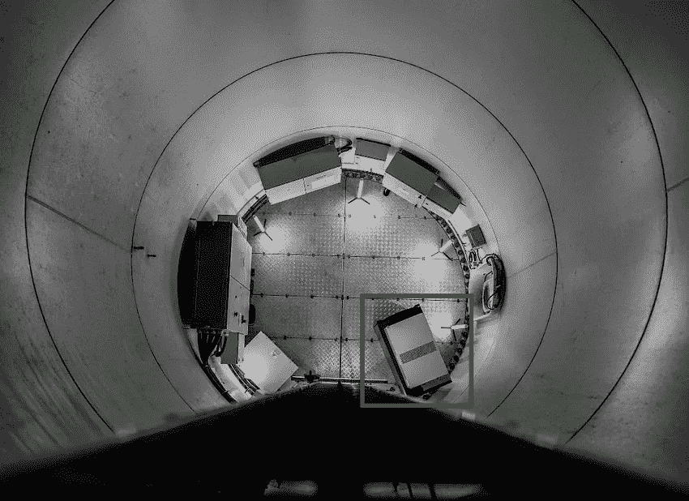
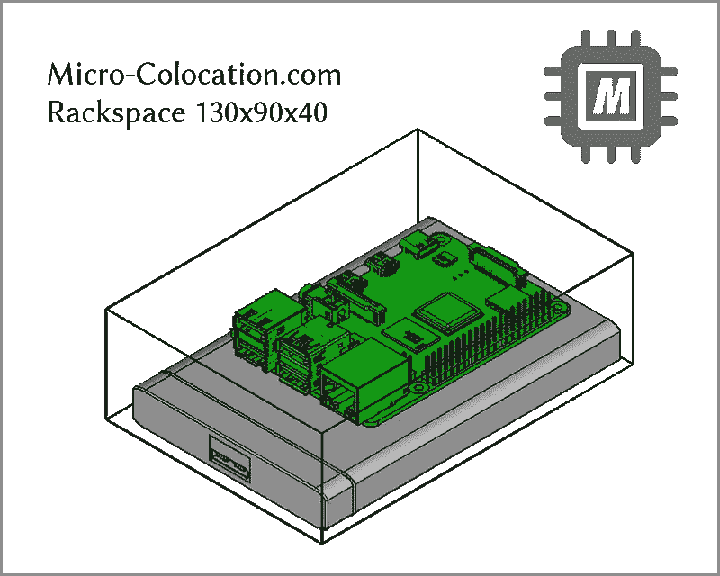
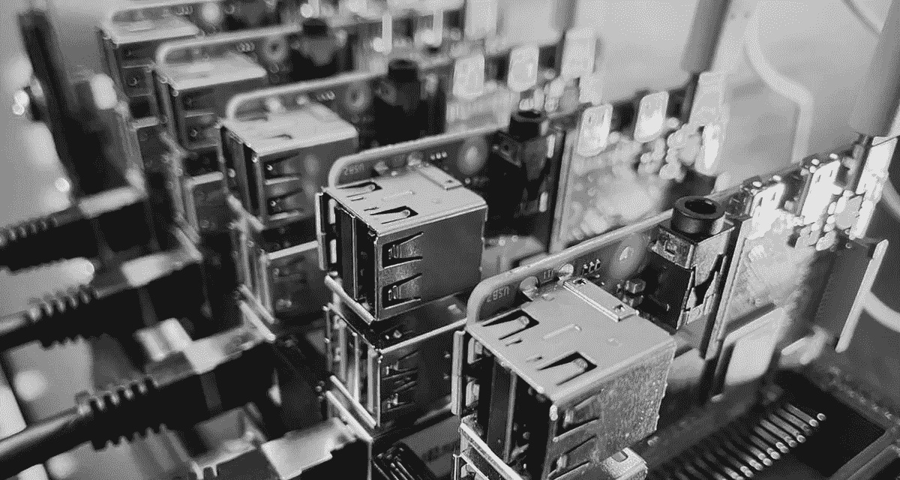

# 西蒙·赖特教授

> 原文：<https://blog.devgenius.io/professor-simon-wright-726a7003b226?source=collection_archive---------4----------------------->

## 版本 2022——树莓派内部

飞行大脑西蒙·赖特，银河英雄未来船长的朋友和导师——被移植到树莓派。

[德意志原始版本](https://dck-one.medium.com/professor-simon-wright-bbb7ee099142)

西蒙·赖特教授 2022

# 故事 2200

[**未来渣渣**](https://en.wikipedia.org/wiki/Captain_Future) 队长:是一位[渣渣](https://en.wikipedia.org/wiki/Pulp_magazine)科幻英雄，最初发表在 1940 年至 1944 年以他的名字命名的渣渣杂志上。大多数故事是由埃德蒙·汉密尔顿创作的。意义重大的是一部 1978-79 年的日本动画，它被翻译成多种语言，在德国很受欢迎，这也是因为其传奇的配乐。在第一集中，提到了船长未来故事开始于 2200 年。

[**未来船长故事**](https://en.wikipedia.org/wiki/Captain_Future#Story_overview) :该系列开始于天才科学家罗杰·牛顿、他的妻子伊莱恩和他的科学家同事**西蒙·赖特教授**飞往月球，以逃避犯罪政客维克多·科尔沃的掠夺。科学家们一起工作，创造了一个名为 Grag 的智能机器人和一个名为 Otho 的机器人。一天，科尔沃到达**月球站**并谋杀了牛顿一家。牛顿一家的死让他们的儿子柯蒂斯由奥索、格拉格和西蒙·赖特三人组抚养。他带着强烈的责任感长大，希望用自己的科学技能去帮助人们。怀着这个目标，他称自己为未来船长。他的宇宙飞船**彗星**是他自己建造的，并且【当然】优于太阳系中所有其他的宇宙飞船。

[他是未来船长的导师和科学事务的首席顾问。](https://en.wikipedia.org/wiki/Captain_Future#Characters)

船长未来的船员，宇宙飞船彗星和人脑教授西蒙在它的幽灵壳

# 彗星 2022

没有外太空。但是彗星 2022 沿着欧洲高山道路行进。

彗星 2022

# 西蒙教授 2022

西蒙教授 2022 是高度模块化和相对便宜的，所有元素都来自树莓 Pi 宇宙和一个分类良好的实验箱。

大脑:[树莓派 3](https://www.raspberrypi.com/products/raspberry-pi-3-model-b/)
能量:[Strom-Pi](https://joy-it.net/en/products/rb-strompi3)感官:[HiFiBerry](https://www.hifiberry.com/)|[GPS-Dongle](https://smile.amazon.de/gp/product/B07MY2VD3H)|[(Endoskop)Kamera](https://smile.amazon.de/gp/product/B076QBGYB8)
输入/输出: [E-Ink](https://www.waveshare.com/2.9inch-e-paper-module.htm) 显示屏| [按键](https://www.voelkner.de/products/73350/TRU-Components-GQ16F-10-J-N-Vandalismusgeschuetzter-Drucktaster-48-V-DC-2A-1-x-Aus-Ein-tastend-IP65-1St..html) |蓝牙耳机

由于彗星 2022 不能保护他免受恶劣旅行天气的影响，他的[幽灵外壳](https://en.wikipedia.org/wiki/Ghost_in_the_Shell)包括[电缆接口](https://en.wikipedia.org/wiki/Cable_gland)是 IP66 屏蔽的。移植需要仔细的计划和无菌的实验室环境:

创世纪教授和他的 3D 模型

# 月球站 2022

2022 年，西蒙教授的基站不在月球上，而是在分布在整个大陆的[绿色 SBC 微区](https://micro-colocation.com/)。高频[电磁场](https://en.wikipedia.org/wiki/Cellular_network)使他能够同步数据并可靠地记录他在旅行中的经历。

西蒙教授的基站:树莓派包括 Micro-Colocation.com 数据中心的硬盘

# 2022 年实施

这只是开始。硬件、软件、网络、存储… **即将推出**。敬请关注:

**订阅** : [邮箱](https://dck-one.medium.com/subscribe) | [RSS](https://medium.com/feed/@dck-one)

# 关于

作者是 IT | Raspberry Pi |机械工程|摩托车爱好者和联合创始人，也是[Micro-Colocation.com](https://micro-colocation.com/)的首席工程师，为 Raspberry、Odroid、NVIDIA Jetson Nano 和类似的[单板计算机](https://en.wikipedia.org/wiki/Single-board_computer)提供灵活的托管服务。