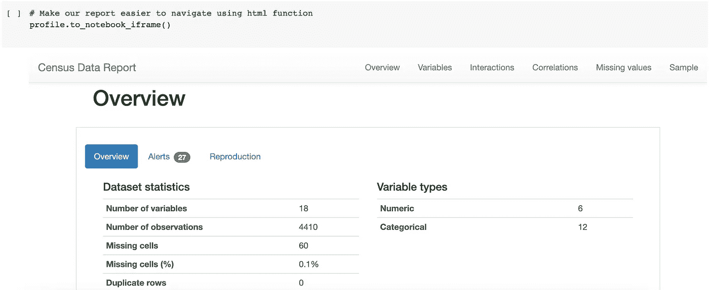
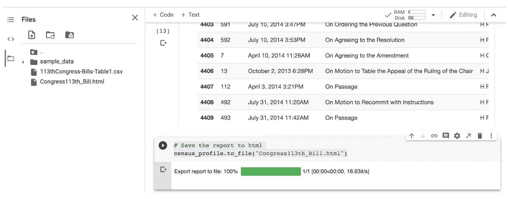

# 在处理数据之前进行配置

> 原文：<https://blog.devgenius.io/profile-before-you-process-your-data-830263740ec5?source=collection_archive---------1----------------------->

## 谷歌合作实验室熊猫简介快速教程

消息传出去了——数据是主观的。因此，当我们摘下玫瑰色的眼镜时，我们正拿起放大镜来更仔细地筛选数据和数据集、数据处理和数据洞察力。


埃米利亚诺·维托里奥西在 [Unsplash](https://unsplash.com?utm_source=medium&utm_medium=referral) 上拍摄的照片

下一个障碍是*如何*评估你的数据和数据集的质量。简而言之:这是一个多步骤的、基于人类认知和算法的过程集，在合理的时间框架内是可以实现的，但可能不会引导你得出你期望的结论。冗长的回答:你需要依靠他人对数据和数据集的观点，对不舒服的事情感到舒服。然后，你可能不得不放弃执行一些你的“标准”数据处理方法，因为你会发现并不是所有的方法都能带来有价值的见解。最后，你可能会意识到高质量的数据是多么难以捉摸，所以你会变得更加敏捷，更加宽容。当你更了解你的数据和数据集时，你会做得更好。

数据集文档恰好是数据质量筛选过程中的一个有用实践。我正在分享一个有用的 Python 函数， **pandas-profiling。它会给你一个数据集的概览。Python 语句的数量很少，而且您可以将输出保存为 HTML 文件。我正在谷歌协作实验室上浏览这个快速教程，这样如果你想自己完成这些步骤，你就可以轻松完成。哦，这个教程应该需要大约 10 分钟才能完成。**

**预备步骤 1:** 使用 Google Colaboratory 打开一个新的 Jupyter 笔记本文件。提醒:您可以通过打开您的 Google Drive，单击 New，然后单击 More 来进入您的 Google 协作环境，您应该会在下拉菜单中看到 Google 协作环境。点击它，一个新的无标题 Jupyter 笔记本就会打开。

**前步骤 2:** 要准备您的 Google 协作环境，您需要检查您是否有权访问配置文件包。创建一个代码单元格，并粘贴以下注释和代码。

```
# Install a fresh version of the profiling package! pip install pandas-profiling
```

运行代码单元。当包组件被加载到 Google 协作环境中时，您将看到输出。事实上，您应该看到概要分析包已经加载到您的云环境中了。不过检查一下也无妨。

现在，我们已经准备好探索分析包了。将一个干净的数据集带入这个环境是很重要的。样本数据集可在 public Tableau 的网站上获得:[https://public.tableau.com/app/resources/sample-data](https://public.tableau.com/app/resources/sample-data)。我选择第 113 届国会数据集。因为它有两个表，所以我将账单表保存为 csv 格式，并将文件重命名为‘Bills-table 1 . CSV’。

1.  **创建一个新的代码单元格**并粘贴以下语句:

```
# if dataset is on your local machine, you can select and load the file directlyfrom google.colab import filesuploaded = files.upload()
```

运行代码单元。从本地机器中选择“Bills-Table1.csv”文件。加载大约需要 10-15 秒(1388057 字节)。百分比将增加，直到达到 100%。

**2。创建一个新的代码单元格**并粘贴以下语句:

```
# load the dataset into a dataframeimport ioimport pandas as pdcensus = pd.read_csv(‘Bills-Table1.csv’) # preview the dataframe ‘census’ contentcensus.head(10)
```

运行代码单元。您将看到数据帧的前 10 行。你不必预览数据帧，但我喜欢看到输出，以确保我认为计算机应该做的是正在执行的。

**3。创建一个新的代码单元格**并粘贴以下语句:

```
# Create a profile report with a user-defined label# Profile report deeper dive: showcasing features for text (length distribution, unicode information),files (file size, creation time) and images (dimensions, exif information)profile = ProfileReport(census, title='Census Data Report')
```

运行代码单元。您不会看到任何输出，因为结果存储在配置文件变量中，因为您没有告诉系统显示输出。通过使用下面的语句创建一个新的代码单元格，可以很容易地纠正这种情况:

```
profile
```

您将能够看到所有的输出，但您将不得不做大量的滚动。坦率地说，这很难消化和解释。但是，还有另一种方法可以访问 dataframe 配置文件。

**4。创建一个新的代码单元格**并粘贴以下语句:

```
# Make our report easier to navigate using html functionprofile.to_notebook_iframe()
```

运行此代码单元。您将看到如下所示的概要文件报告。输出将会很长，包含数据集统计、变量细节、交互、相关性、第一行、最后一行等等。



由 pandas profiling 软件包生成的普查数据报告的屏幕截图。它显示了数据集统计数据和变量类型的概述。

**5。但是如果我们可以共享它，而不需要所有其他 Python 语句，那么看到这个细节会更好。**我们可以做到！创建一个代码单元格并粘贴以下语句:

```
# Save the report to htmlprofile.to_file("Congress113th_Bill.html")
```

运行代码单元。您将看到文件导出到文件。它存储在谷歌合作实验室环境中。你可以通过点击左边的三个灰色条(又名汉堡)来访问它，然后点击文件夹图标来显示文件。您将看到如下所示的 html 文件。



滚动文件，直到你看到三个点。点击下载。然后，html 文件将被下载到本地机器上的下载文件夹中。现在，您(和您的团队)可以调查数据的值分布、稀疏度或密度以及其他重要指标，为您的数据处理后续步骤提供信息。

如果你想自己完成这个快速教程，可以在[这个共享文件夹](https://drive.google.com/drive/folders/1G6B_aZDbG6XIUPhfri-vRBpk4HErLXxm?usp=sharing)中下载 MS Excel 电子表格、重新格式化的 csv 文件、Jupyter 笔记本文件和 HTML 文件。

开心快乐！