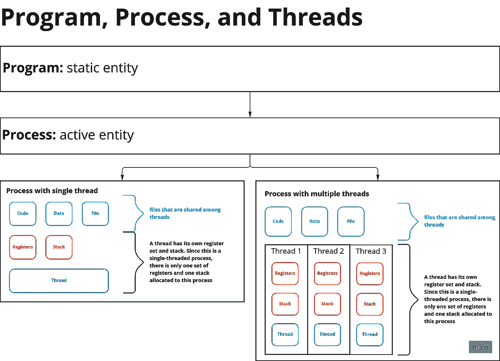
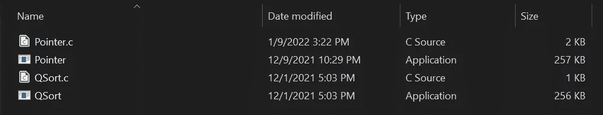

# 一分钟解释程序、流程和线程

> 原文：<https://blog.devgenius.io/program-process-and-thread-explained-in-one-minute-6016e4fdf4de?source=collection_archive---------11----------------------->

## 查看我在[我的技术文章](https://yumingchang1991.medium.com/technical-article-structure-on-medium-954850e1ef4d)中的所有其他帖子

此图表显示了程序、进程和线程之间的层次结构

这是一篇介绍操作系统核心术语的文章:程序、进程和线程。你将对他们是什么以及他们如何在高水平上一起工作有一个大致的了解。

换句话说，它不会是一篇核心的技术论文，而只是一篇友好的介绍。如果你在寻找更深入的探索，你可以跳到最后一节，在那里我放了我写这篇文章时用到的所有参考资料。

# 程序

程序是存储在磁盘中的静态或被动的实体。它是一个包含二进制形式指令的文件。

如果高级编程语言是在运行时编译的，则程序可以直接存储该语言。这种程序被称为解释程序。

例如，我们开发人员用 C 之类的高级编程语言编写代码。计算机不能直接读取 C，因此需要一个编译器将 C 翻译成可执行文件，即`exe`文件。这个可执行文件就是程序。

这是一个截图，显示了一个原始的 C 文件，以及一个编译后的可执行文件

另一方面，JavaScript 和 Python 是解释程序，所以我们不必先编译它。

# 过程

过程就像一个程序的实例。当一个程序被加载到内存中时，它就变成了进程，现在被认为是一个活动的实体。

与程序相比，进程需要更多的资源，因为当它运行时，它需要内存和 CPU 来进行获取和计算。

一个程序可能与多个进程相关联，一个进程可能包含多个线程。

# 线

线程是进程中可执行代码的基本单位。它有自己的一套寄存器和堆栈。

单线程进程意味着一个进程一次只能执行一项任务。还有多线程进程，这意味着它可以同时运行多个任务。

当然多线程更有效，但它也带来了一些单线程不会遇到的副作用，如死锁和并发。([这里是我的文章谈一般编程中的并发](https://yumingchang1991.medium.com/concurrency-in-a-nutshell-8cdde43ce225)

# JavaScript 是单线程的

在之前关于 JavaScript 中[事件循环的文章中，我提到 JavaScript 是一种**单线程**同步和阻塞语言。它使用事件循环来实现类似异步的特性，但它是单线程的。](https://yumingchang1991.medium.com/javascript-event-loop-in-a-nutshell-1717dc381d72)

如果你感兴趣，Golang 是一种多线程语言。

# 参考

*   **文章:** [*线程 vs 流程*](https://www.backblaze.com/blog/whats-the-diff-programs-processes-and-threads/) 作者罗德里克·鲍尔，2017
*   **文章:** [*流程与流程管理*](https://medium.com/@akhandmishra/operating-system-process-and-process-management-108d83e8ce60) 作者 Akhand Mishra，2018
*   **文章:** [*线程与并发*](https://medium.com/@akhandmishra/operating-system-threads-and-concurrency-aec2036b90f8) 作者 Akhand Mishra，2018
*   **YouTube:** [*过程管理*](https://www.youtube.com/watch?v=OrM7nZcxXZU)Neso Academy，2018
*   **YouTube:**[*Neso Academy 2019 年线程介绍*](https://www.youtube.com/watch?v=LOfGJcVnvAk)