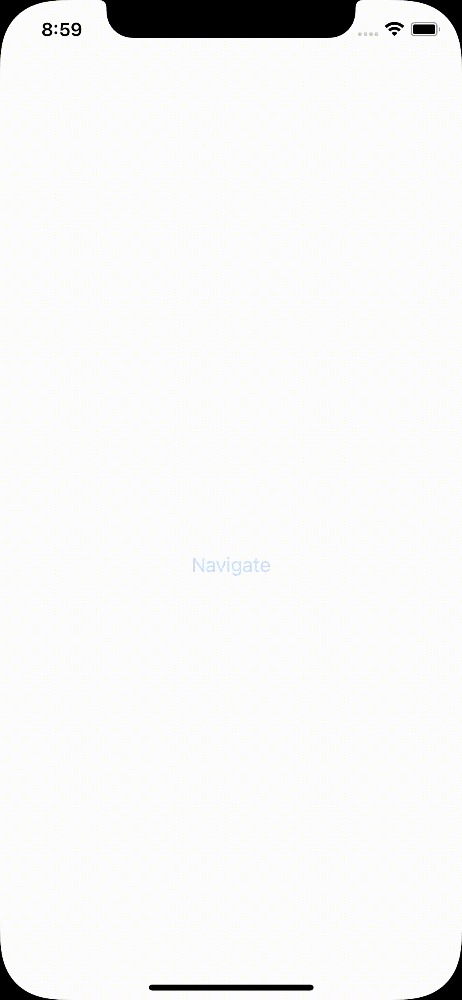

# SwiftUI 中的程序化路由

> 原文：<https://blog.devgenius.io/programmatic-routing-in-swiftui-670524b1946c?source=collection_archive---------0----------------------->

Denys Nevozhai 在 [Unsplash](https://unsplash.com?utm_source=medium&utm_medium=referral) 上拍摄的照片

# 背景

我确信任何 iOS 开发者现在都知道，iOS 应用开发的未来是 [SwiftUI](https://developer.apple.com/xcode/swiftui/) 。苹果新的 UI 开发语言现在已经发布了第二个主要版本。而我个人的感觉是，这个框架还没有准备好迎接黄金时代(就像 Swift 刚来的时候一样。它缺少一些相当关键的功能)，我们可能还有一个或两个版本可以用来构建一个完整的应用程序。不可否认，这是未来的趋势，当它运行良好时，构建 UI 会变得容易得多。

如果您使用的是高级 iOS 架构 VIPER、MVVM 等，那么很可能您已经将路由或视图控制器的创建抽象为架构的一个单独部分。例如，当您需要导航或处理一个深度链接时，您将有希望拥有类似依赖注入框架或工厂的东西来创建您的视图控制器。这然后被推到导航栈上或者由视图控制器呈现，这取决于你试图做什么。

这在 UIKit 中是相当直接的，并且很有意义。在本文中，我们将讨论 SwiftUI 的工作方式，以及这种方式是如何不再可行的。

# 例子

这是一个相当简单的 SwiftUI 示例，但是让我们来讨论一下。

1.  首先我们有一个 ContentView，它包含一个 [NavigationView](https://developer.apple.com/documentation/swiftui/navigationview) ，有点类似于 UIKit 中的 UINavigationController，但是它有更多的限制。我们有一个导航链接，允许用户点击文本视图，并将详细视图“推”到堆栈上。
2.  其次，我们的详细视图只显示一些文本。

如果我们运行代码并点击链接，我们应该会得到这样的结果:

看起来像预期的那样工作，对吗？这种方法有什么问题？

1.  ContentView 和 DetailView 之间有一个紧密的耦合，如果我们想改变导航目的地呢？
2.  如果我们想在另一个不包含 DetailView 但包含其他内容的应用程序中使用 ContentView，该怎么办？
3.  如果 DetailView 有我们需要在创建时注入的依赖项，该怎么办？ContentView 如何知道如何创建 DetailView？
4.  如果我们希望在移动到下一个视图之前执行一个事件，比如触发一个分析事件，该怎么办？
5.  如果我们希望以模态的方式呈现视图，而不是将其推送到导航栈，该怎么办？

许多更高级的架构和框架已经使用路由器/协调器模式解决了这些问题。它们负责处理任何导航逻辑，并经常与依赖注入模块对话，以便创建目的地视图，并将其推送到导航堆栈上或呈现出来。

# 分离视图

我们可以尝试做的第一件事是抽象出细节视图的创建。这至少给了我们在不知道内容视图的情况下改变目的地的机会。

让我们来看看我们在做什么:

1.  首先，我们试图将目标视图的创建分离到另一个对象中。理想情况下，我们可以将它放入一个协议中，但是为了简单起见，我们只使用了一个对象。
2.  我们现在将 presenter 注入到 ContentView 中，您还会注意到，在 NavigationLink 中，我们现在调用 presenter 上的一个方法来获取目的地。

这给了我们什么前一个例子没有的东西？

1.  ContentView 和 DetailView 之间不再紧密耦合。目的地不再是硬编码的。如果我们让演示者使用一个协议。我们可以注入不同的呈现者，有不同的归宿。
2.  如果 detailview 有自己的依赖项需要注入，那么演示者也可以处理这些依赖项，而不必在这里编写代码。

然而，它不全是茶和饼干！仍然有一些之前强调的问题是该解决方案没有解决的:

1.  我们仍然无法从导航触发器的背面触发任何分析事件或任何其他应用程序行为。例如，阻止用户在登录之前进行导航。
2.  我们不能改变或配置导航是如何发生的，例如显示一个登录和实际执行导航。
3.  我们还向视图展示导航，演示者通常不需要向视图展示导航功能。它将处理点击事件，然后将导航逻辑移交给路由器。在这里，我们必须向视图本身公开该功能。

# 目前，使用 UIKit 进行导航

我个人的感觉是 SwiftUI 中的导航可以做更多的工作。视图本身不应该知道或关心它们要导航到哪里以及如何导航。它们应该是状态的可视化表示。当然，导航也可以是状态的呈现，但是在 NavigationView 文档中的快速峰值显示根本不能访问任何形式的状态。导航视图控制自己的状态，对象之外的任何东西都无法修改该状态。

除此之外，我们期望从 UINavigationController 得到的许多方法在这里根本不可用。是不够成熟，还是有点迷茫的做法我不知道。我现在的建议是暂时使用 UINavigationControllers 和 [UIHostingController](https://developer.apple.com/documentation/swiftui/uihostingcontroller) 来执行导航，至少在 SwiftUI 中添加了更好的管理和操作导航状态的方法之前。

让我们快速看一下这是如何改变事情的。首先，我们需要创建一个托管控制器并注入我们的 SwiftUI 视图:

因此，这里我们像以前一样创建我们的演示者和视图，但是将它们添加到 UIHostingViewController 和导航控制器中。UIHostingViewController 允许我们将 SwiftUI 视图放入本质上是 UIViewController 的东西中，并在 UIKit 应用程序中使用它。

我们还将导航控制器的引用传递给了演示者。现在让我们来看看更新后的 SwiftUI 代码，我们已经将其重构为 UIHostingController。

这里有什么变化:

1.  首先，我们的演示者用一个更通用的按钮点击功能替换了我们的 getDetailView。在最终导航之前，这个函数可以做我们需要它做的任何事情。在这里，您可以看到我们正在使用对导航控制器的引用来推动新的视图控制器。
2.  在我们的 SwiftUI 视图中，您将看到我们不再有 NavigationView 或 NavigationLink。我们的视图变得更加通用，不包含导航特定的逻辑。您还会看到，我们有一个按钮，它有一个由演示者指定的点击动作。这允许我们让按钮做任何事情，而不仅仅是触发导航。

希望您在 SwiftUI 中探索导航选项时发现这很有帮助。你可以在 github 上找到 [SwiftUI 样例](https://github.com/pyartez/swiftUI-router)和 [UIHostingController](https://github.com/pyartez/swiftui-uihostingviewcontroller) 样例。

*原载于 2021 年 2 月 23 日*[*https://pyartez . github . io*](https://pyartez.github.io/swiftui/programmatic-routing-swiftui.html)*。*