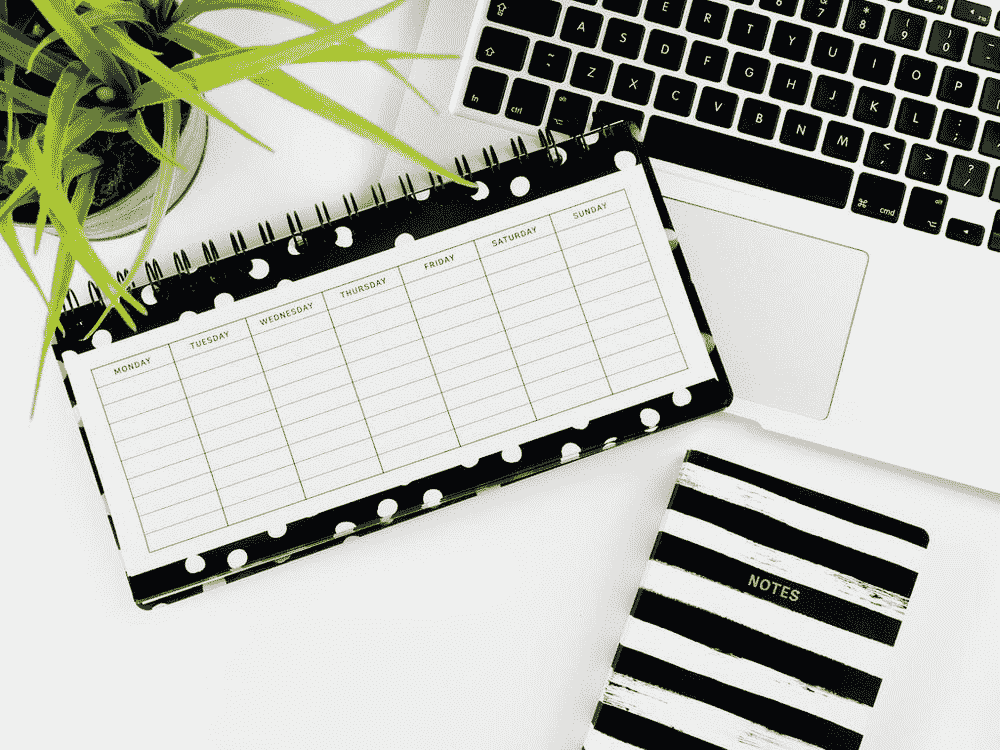
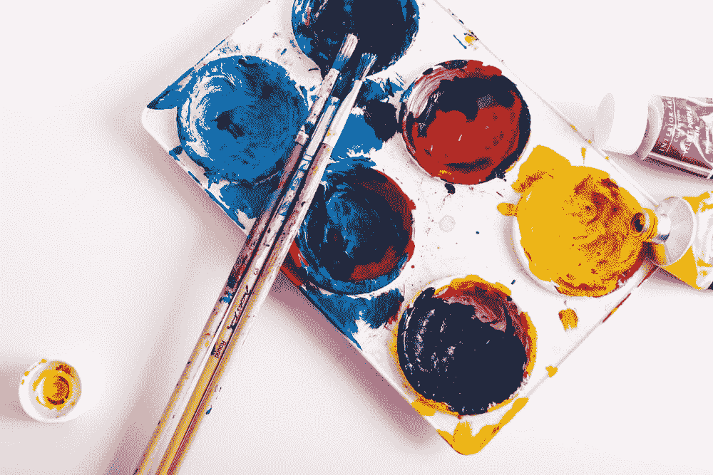

# 程序员/企业家精疲力尽——你并不孤单！

> 原文：<https://blog.devgenius.io/programmer-entrepreneur-burnout-youre-not-alone-4f64ec0a6517?source=collection_archive---------11----------------------->

贾斯汀·维内玛在 [Unsplash](https://unsplash.com/) 上的照片

> 许多人倾向于关注他们的身体健康。他们可能会专注于去健身房，做运动，等等，但是在我看来，建立你的精神力量通常是被忽视的。

# 我认为比以前有了更多的意识…所以越来越好了！

也就是说，当你因写代码或工作(无论你是音乐家、企业家、运动员还是人类)而感到精疲力竭时，你可能会觉得这只是发生在你身上，或者很难获得一些支持和安慰。如果你的老板要求你在很紧的期限内完成工作，或者如果你承担了更多的工作或试图实现某些目标，这种情况可能尤其如此。更容易相信你做得很好，并继续做你正在做的事情。如果你有这种感觉，那么这个中等的故事可能适合你！

一些对我有帮助的策略如下:

# 1.安排(或通常确保)一天中有专门的休息时间

照片由[艾玛·马修斯数字内容制作](https://unsplash.com/@emmamatthews)在 [Unsplash](https://unsplash.com/) 上拍摄

当你感到有压力时，挺过去真的很容易或很诱人，尤其是当你有很多工作要完成或事情要做的时候。有时这是可以的，因为当事情变得困难时，你必须坚持下去。然而**我认为这是关于了解你自己**(自我分析、反思或不管它叫什么)因为**每个人都有不同的工作方式**。

如果你感觉压力持续了一段时间(如果你一直在做一个长期项目或日常生活的事情)，花一些时间通过一天中多休息来平衡压力可能会有所帮助。

不要用过度工作来惩罚自己，尤其是当你感到精神疲惫的时候。你可以试着和你的老板谈谈，把你那部分工作的最后期限推后，或者想办法让它变得更容易管理。

对于程序员来说，一个场景可能是修复那个 bug，或者添加并测试那个新特性，以便最终在一天结束之前将更改部署到生产中。

# 2.培养一种爱好或者花时间在现有爱好上

[斯蒂夫·约翰森](https://unsplash.com/@steve_j)在 [Unsplash](https://unsplash.com/) 上拍照

俗话说得好:

> “你怎么知道你不喜欢某样东西，直到你尝试过它？”

差不多就是这样。尝试新的东西可能一开始会令人畏缩，然而，如果你感到有压力，改变你的习惯和常规可以帮助你转变观点。想象一下尝试一项新爱好的最坏情况…至少你知道你不是特别喜欢它，所以不必再做一次。

另一方面，也许你在想“我有几个爱好，但没时间去做”。这是你应该看看你一天中花在事情上的时间的地方。如果像工作这样的事情占用了你太多的时间，**如果你因为长时间长时间工作而感到筋疲力尽，那么你对你的雇主没有任何好处。他们不会从你那里得到最好的工作。**

如果你有一个特别忙碌的时间表，从一天中找出 1-2 个小时花在你真正喜欢的爱好上开始。当你感到压力或精神疲惫时，很容易把喜欢的事情推迟。尝试一个与你的工作相反的爱好，(例如，对于程序员/办公室工作人员来说，做一项锻炼或运动)，并且可能是一个不会让你精神紧张的爱好。

# 3.学习或从事新的工作

马库斯·斯皮斯克在 [Unsplash](https://unsplash.com/) 上拍摄的照片

对于程序员和其他人来说，这可能是一个新项目。如果你现在对你的工作不感兴趣，也许试着做一些你自己的事情。对于一个程序员来说，这可能是一个兼职项目，比如学习一门新的语言或框架，或者构建你的新想法。

学习新的东西有助于在精神上改变现状。我认为这在某种程度上有助于打破只露面和做工作的习惯。你必须从不同的角度思考另一个项目。当它是你自己的东西时，这特别有帮助，因为当你建立它时，你会获得更多的信心，知道你创造了它，你的想法不会因为 100 个不必要的商务会议而停止或延迟(我知道，有些会议实际上是有用的……)

# 4.与人交谈……花点时间社交一下(你的方式)

照片由[将](https://unsplash.com/@elevatebeer)提升到[去飞溅](https://unsplash.com/)

好吧，所以不是每个人都以同样的方式社交。一些人可能更喜欢在游戏中聊天，而另一些人可能想出去喝杯啤酒。

与他人谈论工作压力等会有所帮助，尤其是如果你真的重视他们和他们的观点。

讽刺的是，谈论你感到压力的时候会让你感到更大的压力！

如果你有压力，首先发生的是你可以停止交流，试着用自己的头脑处理事情。这并不总是有效的。有时候，最好和家人、朋友、同事等有着相同感受的人谈谈。这取决于许多因素，例如，如果你和一个更高级的同事谈论一些不同的编程问题，作为一个团队感到压力，讨论一般的压力。

你可能会发现，在与某人交谈后，这可能会帮助他们更多地了解你，让你对自己感觉更好。

# 5.锻炼

照片由[珍妮·希尔](https://unsplash.com/@jennyhill)在 [Unsplash](https://unsplash.com/) 上拍摄

保持身体健康对保持心理健康至关重要。

尝试做一些你喜欢的运动。人们可能会经常谈论健身房，但是如果你发现与健身房相关的锻炼有时有点无聊，尝试一项运动或者只是去散步。

这部分就到这里了…不像其他部分那样充满了文章😀

> 虽然如果你面临程序员或一般的倦怠，很容易说你不是一个人，但其他人很可能在某个时候经历过同样的压力。

# 关键是，我们都是人。

***如果你喜欢这个内容，请随时加入我的邮件列表:***[https://www.subscribepage.com/x9b5l0](https://www.subscribepage.com/x9b5l0)

# 跟着我看 https://www.tiktok.com/@theinspiringprogrammer?抖音 lang=en⏰

# 如果你发现这很有用，像往常一样，请随意在 Medium 上“鼓掌并跟随”!

为了更开心/有趣/更放松，这里有一张长颈鹿的照片，它只是在放松:

詹姆斯·温斯科特在 [Unsplash](https://unsplash.com/) 上拍摄的照片