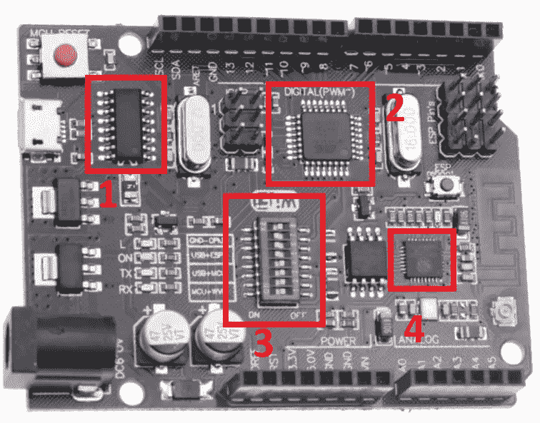
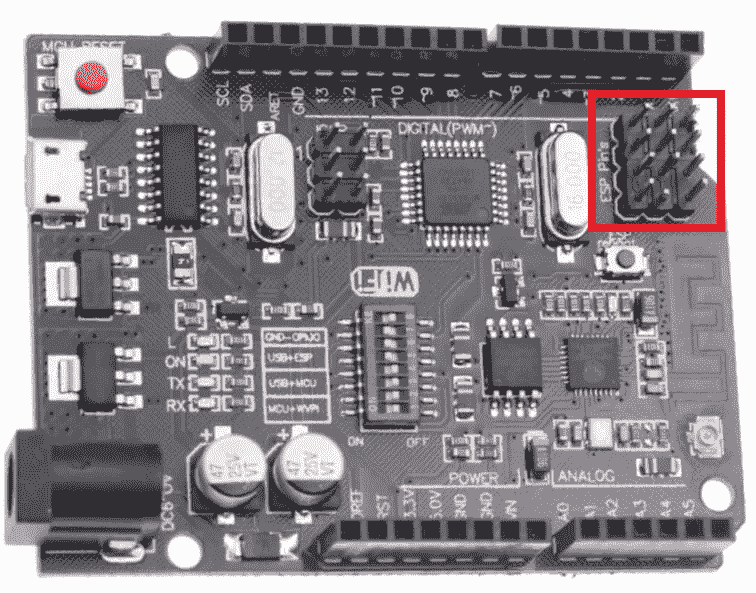

# 使用内置 WiFi 模块 UNO R3 + WiFi ATmega328P+ESP8266 对 Arduino UNO 克隆进行编程

> 原文：<https://blog.devgenius.io/programming-arduino-uno-clone-with-built-in-wifi-module-uno-r3-wifi-atmega328p-esp8266-9494d9a90cfa?source=collection_archive---------1----------------------->

或者 UNO R3+WiFi ATmega328P+ESP8266

市面上有一些非官方的带 WiFi 的 Arduino UNO 克隆板。对于许多项目来说，这些板通常看起来很有趣，很有前途，因为具有 WiFi 功能的 Arduino UNO 并不常见。

可悲的是，通常这些板缺乏任何文档，所以在尝试之后，许多人认为他们得到了一些不起作用的东西，只是因为这些板很棘手，你必须知道如何使用它们。

在这个故事中，我总结了我使用这些板的经验，因为我发现缺乏一个好的文档来总结所有的信息，所以如果你有一个这样的板，但不知道它是如何工作的，那么这篇文章就是为你准备的。

了解该板上的芯片

首先，让我们仔细看看棋盘。事实上，这些板有时可能看起来不同，有一些变化，所以上面的图片显示的只是最流行的变体，但即使有差异，总的来说，它将是类似的东西。

标有数字 **one** 的芯片是 CH340 USB 转串行适配器，所以你必须安装相应的驱动程序，如果你的电脑不能识别这个板，当你通过 USB 插入它时。如果不确定什么是 CH340 以及如何安装它的驱动程序，那么我会在[这篇](https://medium.com/dev-genius/using-arduino-ide-with-unofficial-arduino-clones-bearing-ch340-chip-752d1b90810d)文章中为你介绍。

标有数字**二**的是 atmega 328 p——Arduino 的核心和大脑，它运行你所有的草图。这种芯片在不同的主板上可能会有不同的外观——有时它很大，就像最初的 Arduino UNO，有时会更小，但它仍然是同一芯片，只是包装在不同的外壳中。

标有数字**的三个**是 dip 开关，这些开关对于理解如何使用该板非常重要，因此我们稍后将详细了解它们，现在只需记住它们的重要性。

编号**四个**是 ESP8266——带有 WiFi 模块的芯片。

## ESP8266

ESP8266 不仅仅是一个 WiFi 芯片，而且实际上是一个强大的微控制器，拥有自己的 IO 引脚、CPU 内核和内存。事实上，ESP8266 比 Arduino 的 ATmega328P 更强大，像这样的主板被宣传为*“内置 WiFI 的 Arduino”*而不是*“内置 Arduino 的 ESP8266”*的唯一原因是因为 Arduino 更为普通观众所知，尤其是刚开始接触微控制器的人。Arduino 是一个众所周知的名字，毕竟，Arduino 不仅仅是一个微控制器，它更多的是关于形状因素，关于能够将 shield 插入电路板。由于这块板遵循 Arduino 板规范，我们称之为配备 WiFi 的 Arduino，尽管从另一个角度来看**这块板上没有所谓的“主”芯片**，ATmega328P 完全独立于 esp 8266**工作，正如我们稍后将看到的那样。**

ESP8266 引脚

所以没有什么可以阻止你完全忽略 Arduino 的 ATmega328P，只与 ESP8266 一起工作。在这种情况下，您不能使用标准 Arduino 引脚，但另一方面，您可以在这张图片上看到，该板上有几个用于 ESP8266 的引脚。您会在电路板背面找到 ESP 引脚标记。

这一点非常重要，我将在此强调:

> 这个主板上没有主芯片。两个芯片都可以独立工作。你可以只使用 ATmega328P，或者只使用 ESP8266，完全忽略另一个芯片。或者你可以使用两个芯片，通过运行在另一个芯片上的程序来控制其中一个。如何设计解决方案以及选择哪种方式取决于您。下面我们将看看几个模式。

## 开关

但是，如果板上有两个芯片，那么哪个芯片连接到 USB 端口，你如何选择哪个芯片来闪存？这就是电路板上有 DIP 开关的原因——通过打开或关闭它们，您可以选择哪个芯片当前连接到 CH340，这意味着——您可以闪存或连接到哪个芯片。请参考下表了解正确的开关设置。请注意，没有使用开关 8，所以我在下表中跳过了它。

> 请耐心等待**暂时不要在 ESP8266 上闪现任何草图**，先完成这篇文章就好。原因是——可能已经有 AT 固件闪存在那里，您可能希望保留它。也可能不是。你会在这篇文章结束时自己决定。

DIP 开关配置

换句话说:

*   要通过 USB 将您的计算机连接到 ESP8266，请打开开关 5、6 并关闭所有其他开关，但开关 7 除外，它在这里有特殊的意义，因为它连接到 ESP8266 的 IO 端口 0:关闭时，它会将 ESP8266 切换到串行连接模式，打开时，它会以闪存模式启动 ESP8266。
*   要通过 USB 建立计算机与 ATmega328 之间的串行连接，请将开关 3 和 4 设置为 on，并将所有其他开关设置为 OFF
*   要将 ESP8266 和 ATmega328 连接在一起，而不连接到 CH340(这意味着您将无法通过 USB 连接到芯片),请打开开关 1 和 2，关闭所有其他开关
*   最后，如果出于某种原因，你根本不希望芯片连接在一起，而是希望它们都独立工作——只要把所有东西都关掉就行了

## 编程 ATmega328P

这里真的没有太多要说的，只是相应地设置您的开关，如上表所示，并像使用任何其他 Arduino 一样使用此板，因为当您设置开关时，它将变得一无所有，然后只是另一个 Arduino 克隆。

由于本文的主题是向您展示如何使用这种类型的电路板，而不是教您 Arduino 编程的基础知识，我将在这里跳过它，因为有大量关于 Arduino 编程的好文章，只需在谷歌上搜索一下。

如果你需要帮助使用这个 Arduino 克隆轴承 CH340 芯片，请参见我的文章[这里](/using-arduino-ide-with-unofficial-arduino-clones-bearing-ch340-chip-752d1b90810d)。

## 编程 ESP8266

> 请耐心等待，**暂时不要在 ESP8266 上闪现任何草图**，先完成这篇文章。原因是——可能已经有一些固件在那里刷新了，你可能想保留它。也可能不是。你会自己决定，到这篇文章的结尾。

等等，开关，别忘了换开关。不要忘记重新启动电路板，因为选择 flash 或 com 模式的 ESP8266 引脚 7 仅在 ESP8266 启动期间有效。

## 该主板的解决方案设计模式

这种板的架构承载独立的芯片，可以以不同的配置连接在一起，允许我们为我们的解决方案应用不同的模式。

## 模式 1:仅 Arduino

最简单的事情之一就是——像使用其他 Arduino 一样使用它，并简单地忽略 ESP8266。毕竟，这些主板很便宜，所以如果出于某种原因你不能得到任何其他 Arduino 克隆，为什么不使用这个呢？虽然这看起来像是浪费电路板的潜能，但这种方法在我们周围的许多应用中都有使用。

## 模式 2:仅限 ESP8266

反之亦然——如果您有 ESP8266 的草图，为什么不在此板上运行它，而忽略 ATmega 芯片呢？或者，如果您的目标是为 ESP8266 开发新的草图，那么该板可以用作开发板，您也可以使用 CH340 进行调试或通信。毕竟，ESP8266 比 Arduino 的 ATmega 更强大，所以选择 ESP8266 而不是 ATmega328p 可能是有意义的。

## 模式三:内置 WiFi 的 Arduino，带 AT 固件

假设您希望轻松地将 WiFi 功能添加到您的 Arduino 项目中，这些主板中的许多都被宣传为“带 WiFi 的 Arduino”。为了做到这一点，这些板中的许多都带有预装在 ESP8266 上的 AT 固件，使其与 [AT 命令集](https://en.wikipedia.org/wiki/Hayes_command_set)兼容。因此，您可以通过从 Arduino 芯片发送 AT 命令来轻松控制 ESP8266。

这是将 WiFi 添加到 Arduino 解决方案的非常简单和容易的方法，只有一个缺点:你将更强大的 ESP8266 奉献给仅仅是 WiFi 调制解调器，这可以让完美主义者的心流血。

## 模式 Arduino 和 ESP8266 组合解决方案

您可以应用的最后一种模式是，使用电路板上的两个芯片运行两个独立的草图。这样它将是[异构多处理](https://en.wikipedia.org/wiki/Heterogeneous_computing)板，允许你同时在不同的 CPU 核心上运行不同的草图。一些任务可能在一个芯片上运行，而其他任务可能在另一个芯片上运行，这取决于您如何对它进行编程。

这可能有点棘手，但另一方面，这将是非常有趣的旅程。挑战在于，这些芯片具有不同的架构，因此在使用它们时，你必须记住这一点。

请记住，不可能一次在两个芯片上上传草图，您必须首先为一个芯片编程更改开关，然后上传第一个草图，然后为第二个芯片更改开关，再上传第二个草图，然后可能更改开关以将芯片连接在一起，因为您的解决方案可能需要草图之间的一些通信。很多讨厌的开关，不是吗？

为了最大限度地减少交换机配置，最好分阶段开发解决方案:先开发一个草图，然后开发另一个草图，但是如果两个草图确实紧密耦合，并且需要大量的相互通信，您可能希望从一个芯片的虚拟模拟草图开始，它将模拟它的功能，允许您继续开发另一个芯片的草图，然后返回第一个芯片，用真实的东西替换您的模拟。

## 排除故障

使用 LCD