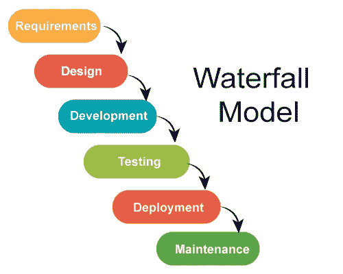

# 作为理论构建的编程

> 原文：<https://blog.devgenius.io/programming-as-theory-building-9e8cb6f2cd73?source=collection_archive---------5----------------------->

在软件中构建模型和解决方案不仅仅是编程。我们将回顾彼得·诺尔的经典论文。

*这篇 1985 年的经典文章预见了当今行业中普遍使用的许多概念。这篇论文中还有其他有趣的启发性想法，我们还没有加以利用。*

# 历史背景

彼得·诺尔 1985 年的[论文](https://gist.github.com/dpritchett/fd7115b6f556e40103ef)带给我们至今仍未被注意的概念。

书面文件是要遵循的模式。

[级联生命周期](https://en.wikipedia.org/wiki/Waterfall_model)至高无上，是行业标准。彼得·诺尔让我们反思我们的职业，并带给我们 25 年后仍然非常相关的概念。

彼得·诺尔是丹麦科学家，图灵奖(相当于计算机领域的诺贝尔奖)的获得者。他参与了 Algol 60 的开发，并帮助创建了所有编程语言用来定义语法的语法模型。

到 1985 年，诺尔发现了计算机专业教育的困难及其与其他工程学科的根本区别。

他的协作和人类概念总是与泰勒的软件开发概念形成对比，泰勒认为活动是水密的隔间，人类是可互换的部分。

他的认识论方法基于增量迭代学习，与 Dijkstra 的形式思想所代表的数学形成对比。

# 理论建设

该论文提出了当时的新观点，然后被[敏捷宣言](https://agilemanifesto.org/)采纳，将知识获取的人文价值置于软件构建的泰勒观点之上。

这一理论是通过像在科学程序中那样观察现实而建立起来的。个体共同汇集所述观察的涌现知识。在这种知识中，正如亚里士多德正确预测的那样，整体大于部分之和。

编程阶段对应于所述理论在机器中的实施阶段。

这种想法与诸如 [TDD](https://en.wikipedia.org/wiki/Test-driven_development) 之类的技术部分矛盾，在这些技术中，在实施解决方案的同时鼓励知识培训。

# 调查结果的记录

根据 Naur 的说法，开发的软件和附带的文档不足以表达理论上开发的设计思想。

思想只存在于提出它们的个人之中。

因此，**的任何成员的丧失，**的碎片共同产生了知识。

照片由[马特·阿特兹](https://unsplash.com/@mattartz?utm_source=unsplash&utm_medium=referral&utm_content=creditCopyText)在 [Unsplash](https://unsplash.com/s/photos/broken?utm_source=unsplash&utm_medium=referral&utm_content=creditCopyText) 上拍摄

# 超前敏捷

敏捷宣言[基于四大支柱:](https://agilemanifesto.org/)

1 **流程和工具上的个人和交互**

*这符合诺尔关于塑造知识的人的重要性的观点。*

2 **工作软件**综合文档

*正如我们之前看到的，文档是不相关的，并且不是进一步软件开发的良好起点。*

3 **客户协作**合同谈判

在软件开发人员和领域专家之间建立理论的沟通，对于理论和有用的解决方案的对应是必不可少的。作为一个必然结果，只有双方之间的正式沟通是适得其反的。

4 **响应计划变更**

理论的发展是一个没有初始计划和最终目标的过程。这是一个递增的螺旋，当理论从现实世界中学习时，它会根据需要进行调整。

# 公理不重要

彼得·诺尔的理论不是基于带有公设、定理推导或推论的形式公理。相反，寻找一个声明性的模型来解释我们正在模拟的业务。

这种研究科学的方式是基于赖尔，而赖尔又是基于维特根斯坦关于语言的建构主义思想。

构建软件就是获取知识。试图在没有构建任何实例的情况下定义一个类的行为是错误的。

 [## 名字到底是什么？第二部分:康复

### 我们都同意:好名声永远是最重要的。让我们找到他们。

medium.com](https://medium.com/dev-genius/what-exactly-is-a-name-part-ii-rehab-fc5058b3ff1) 

为了以探索的方式建立理论，原型语言是比分类语言更有用的工具。

诺尔认为没有单一的科学方法，而是有多种方法。根据费耶阿本德的想法。

> 这一理论被理解为一个人必须具备的知识，不仅是为了根据一定的标准聪明地做好事情，而且是为了能够解释、回答问题、论证或证明所关心的活动。

# 人类是中心

构建的理论无法在开发的程序中表达。它只能由参与其建设的人来阐述。

> 软件是这些想法的产物。

在人类发生[变化](https://www.teldat.com/blog/en/software-as-a-product-of-intellectual-activity-reflections-on-software-development)之前，一个类似的理论可以从人工制品中重建出来。这个理论将是不完整的，并且与原作者阐述的理论不同。

> 软件公司的资产并不是那些只反映显性知识的具有知识产权的源代码行。开发该理论和构建该软件的人拥有不可替代的、因而有价值的隐性知识。

理论的构建者是基于某种范式的，正如 T4·库恩所建立的那样。这篇论文提到，要了解牛顿的理论，仅仅阅读物理公式是不够的。

> 拥有这一理论的人必须理解中心法则应用于现实的某些方面的方式，以便能够认识到并将这一理论应用于其他类似的方面。因此，一个拥有牛顿力学理论的人必须理解它如何应用于钟摆和行星的运动，并且必须能够识别世界上类似的现象，以便能够正确地使用理论的数学表达规则。

# 如果模型不存在，结果永远不会像预期的那样

Naur 在文章开始时对程序和处理程序的程序员团队的真实情况进行了观察，特别是在软件意外和错误的执行或反应的情况下。

> 在编程的产品视图中容纳这样的观察的困难表明这种视图是误导的。理论建设的观点是作为一种选择。

建立足够的自我防御模型并不容易。这需要一个漫长的掌握学习的过程。它的成果使我们能够降低风险，并能够维护现有的软件。

 [## 快速失败

### 失败是时尚。制造比思考容易得多，失败不是耻辱，让我们把这个想法带到我们的…

codeburst.io](https://codeburst.io/fail-fast-3f3f036032b0) 

# 没有灵丹妙药

Naur 拒绝单一方法开发软件的想法。

一个开发方法，比如已经提到的 [TDD](https://en.wikipedia.org/wiki/Test-driven_development) ，必须用其他实践来补充。

缺少渴望已久的[银弹](https://en.wikipedia.org/wiki/No_Silver_Bullet)是一个可悲的现实，即使是在这些日子里。

# 语言是偶然的

根据诺尔的说法，用来表达这一理论的符号是偶然的。

今天我们知道语言是它所能表达的不可分割的一部分。

用声明性语言和低级语言写算法是不一样的。

我们也不能用 C 或 GoLang 这样的非声明性语言来表达好的商业模型。

就像我们不应该用自然语言描述化学或物理方程一样，我们也不应该用低级语言表达我们的理论。

软件不应该被视为可以上传到知识库的文本，而应该被视为支持它的理论。

照片由[罗马法师](https://unsplash.com/@roman_lazygeek)在 [Unsplash](https://unsplash.com/s/photos/equation) 上拍摄

# 错误的决定

在整个理论构建过程中，相关人员会做出决策，以使模型符合[对现实世界的双投影](https://codeburst.io/the-one-and-only-software-design-principle-5328420712af)。这些决定没有明确的文件记录。

观察结果却不知道为什么要做出设计决策是另一个理论可以解释但构建的软件不能解释的限制。

在遗留系统中，经常看到个人出于习惯而行动，却不知道是什么原因导致他们做出决策。

# 模型在哪里？

根据 Naur 的观点，这个模型应该仅仅作为参与者之间的理论。然而，如果我们坚持双射并使用[映射器](https://medium.com/@mcsee/what-is-software-9a78c1172cf9?sk=f44a595746e6a3df0aa421c72030bbc3)创建一个模型，这个模型将会和在其中开发的理论一样好。

 [## 唯一的软件设计原则

### 如果我们在一个单一的规则上建立我们的整个范式，我们可以保持它的简单并做出优秀的模型。

codeburst.io](https://codeburst.io/the-one-and-only-software-design-principle-5328420712af) 

GPT3 和其他[变形金刚](https://en.wikipedia.org/wiki/Transformer_(machine_learning_model)都是拐弯抹角的程序员，他们在不理解底层理论的情况下编写代码。我们还有时间避免它。

# 结论

构建软件是一项人类活动。

理论建设是一个脑力活动，需要一个学习和讨论的过程，直到达成共识。

这一系列文章的部分目标是为软件设计的辩论和讨论提供空间。我们期待着对这篇文章的评论和建议。

 [## 目标设计清单

### 这是已经发表的软件设计文章的索引。

medium.com](https://medium.com/@mcsee/object-design-checklist-47c63d351352) 

本文还有西班牙语版本[点击这里](https://medium.com/dise%C3%B1o-de-software/programar-es-construir-teor%C3%ADa-2e9eeefce20)。

你可以在推特上联系我。