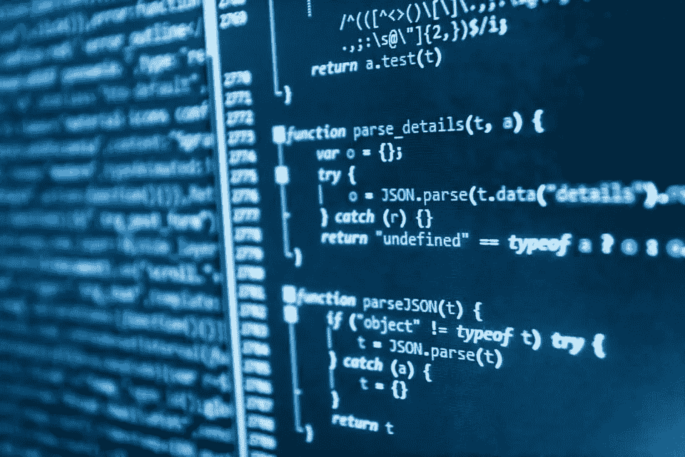

# 面向初学者的编程:开始编程之前需要知道什么

> 原文：<https://blog.devgenius.io/programming-for-beginners-what-to-know-before-you-start-programming-85556ef2bc67?source=collection_archive---------9----------------------->

***真希望在开始学编程之前就认识他们。***

我花了一年时间去理解刻板印象和现实。现在，我来告诉你在开始学习编程之前需要知道些什么。

## 1-如果你学习数学相关的学科，你必须学会编程

因为大量的数据无法手工处理，所以学习某些与数学相关的编程语言和应用程序变得至关重要。即使你不做繁重的工作，如果你想让其他人知道你在大多数领域的研究生学习，你也需要一些知识。

## 2-你很有可能不会成为高管

运气好了才能成为 CTO 或者 CIO。除此之外，你可能最终会成为一名高级开发人员或项目经理，不得不对高层负责。你工作的价值可能会变成六位数的薪水，而不是良好的声誉和大量的补偿。

## 3-你必须学习算法

这不仅对成为一名程序员有用，而且对理解现代技术也很有必要。并且在决策过程中可能需要。因为编程的整个概念在于算法，所以在创建主要程序之前了解它的含义对于创建功能良好的程序至关重要。

## 4-你可以把它作为一种爱好来做

像在其他领域一样，它不一定是一个全职的职业。相反，你可以创建程序来创建你自己的事业，或者只是把它作为一种爱好来和你的伙伴们一起度过时光。如果完成了，这是一个很好的休闲活动，其中有许多有趣的时刻和良好的同志情谊。所以，这是和你的工程师朋友们一起做的很棒的休闲活动。

## 5-你可以创建自己的企业

如果你充分意识到机遇，并且有一对可以这样做的好朋友。推出新产品变得很容易。但是，这并不是要让你的产品保持一个很好的位置，因为竞争太激烈了，你必须不断地和你的团队在营销和软件开发方面工作。或者，你可以成为社交媒体的影响者，在 YouTube 和 Medium 上讲述你的经历。我一发现这个领域利润丰厚，就决定要实现这个梦想，成为整个领域的小个子。

*开始学习编程前需要知道的事情有哪些？在下面的评论区分享你的想法和经历。*