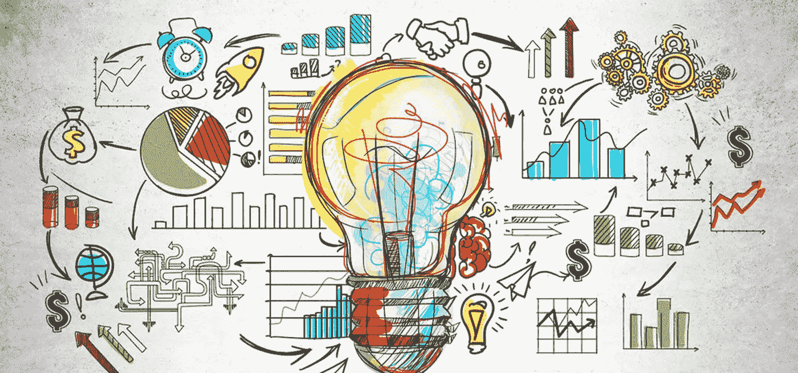
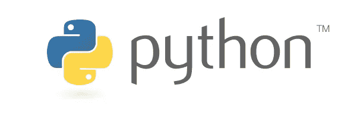
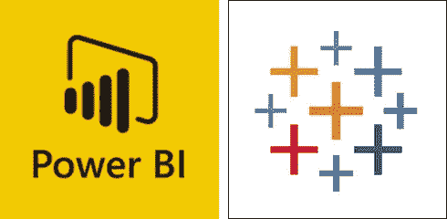
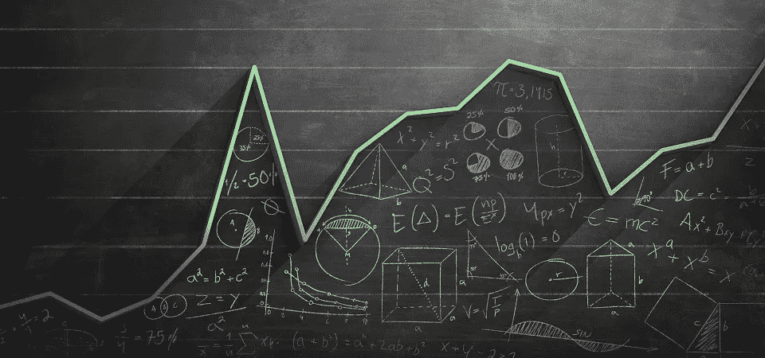

# 面向经济学本科生的编程语言及其用例

> 原文：<https://blog.devgenius.io/programming-languages-and-their-use-cases-for-economics-undergrads-e8cc9efcafd3?source=collection_archive---------35----------------------->

***计算、实时数据、近期技术趋势。一切都从理论的学术基础被带到实时测试*** 。现在，这里有一些应用你在课程中学到的编程语言和它们的使用领域。

在我们进一步深入细节之前；每种语言都有自己的特点。这里有一些经济学最常用的编程语言。

## 计算机编程语言

Python 是初学者的编程语言选择，具有用户友好的特性和文本编辑器 Spyder。与其他语言不同， **Python 可以用于各种目的，从 web 开发到创建自己的区块链**。但是，大量的数据和大多数平台带来的大部分不便促使新一代人选择 Python 作为他们的主要编程语言。

## 稀有

**R 是专门用于统计分析和定量方法的语言。与 Python 类似，R 允许用很少的代码来整理大量的数据和模型，以节省您的时间和精力来概述您的研究的重要细节。更重要的是，它的库比 Python 可靠得多，并且有丰富的资源来获得您想要的特定函数的结果。**

## Tableau 和 Power BI

平台和编程语言的最新发展开辟了新的方式来可视化相同数量的数据，比单独使用 Excel 和 SPSS 更有效。因为大部分数据已经产生于 2019 年；用 Excel 对它们进行评估是一个缓慢而痛苦的过程，需要多名人员参与，而且会造成巨大的资源浪费。现在有了技术，Tableau 可以在短时间内可视化我们需要的一切。

我们已经讨论了编程语言。现在来看看我们领域的用例。

## 统计分析

我们处理数据，无论何时我们处理数据；我们有统计数据。随着岁月的流逝；越来越多的数据以前所未有的方式呈现在我们眼前。在编程语言被引入之前；我们不得不使用 Excel 对多行数据进行冗长而繁琐的分析。更糟糕的是，当我们需要从网上导入实时数据时，Excel 有数千列需要我们手动搜索。由于统计分析的最新进展；所有数据都可以用不同程序中简单的代码行进行分析。我们不知道未来会发生什么，但我们肯定会有更强大的平台来满足我们的需求。

## 计量经济学

计量经济学使用统计和数学模型来检验经济学中的假设，并根据历史数据预测未来趋势。现在，我们有大量的历史数据等待我们用经济手段分析。可惜的是，数据无法通过在一张纸上手工解决考试问题来进行分析。因此，各种平台使我们能够分析前所未有的数据。

*你怎么看待经济学中的编程？在下面的评论区分享你的想法。*