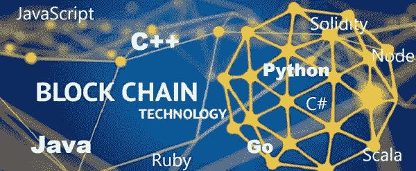

# 区块链开发的编程语言

> 原文：<https://blog.devgenius.io/programming-languages-for-blockchain-development-9b02a387d55b?source=collection_archive---------10----------------------->

许多语言和平台。但是大多数通过某些编程语言。以下是细节。

## 计算机编程语言

学习编程(尤其是面向对象编程(OOP))是一门很好的编程语言。就此而言，大多数语言都要经历 python 的结构。

## Java Script 语言

第一种与 web 交互的动态编程语言。因为区块链确实与互联网互动；大多数平台使用 JavaScript 或基于自身的语言。尤其是以太坊和 Hyperledger 都在用 JavaScript 和实现；在进行任何形式的互动之前，学习它们对你有好处。

## NodeJS

hyperledger 需要的编程语言之一。如果你以前学过 JavaScript，没问题。与以太坊节点交互，创建开发环境；节点应该安装在您的计算机上。

## Java 语言(一种计算机语言，尤用于创建网站)

大多数系统都是建立在这种古老而可靠的语言之上的。在区块链上没有什么不同，尤其是 Corda 支持 JVM (Java 虚拟机),可以用来开发 hyperledger。

## 科特林

可能对科达有帮助。尽管有些线索在使用 Corda 平台开发时很有帮助。但是，与用于区块链开发的其他语言相比，您不需要了解这种语言。

## 去

Go 用于与 tendermint、以太坊(由 geth)和 hyperledger 一起开发。如果已知，它可以用于与多个平台进行交互。但是，不建议使用它，因为该节点需要大量存储。

我们已经完成了主流编程语言。我们为平台创建的基于平台的语言提供了什么？

## 固态

最受欢迎的区块链编程语言，因为与其他平台相比，它具有用户友好的特性。问题是创建与以太网交互所需的开发环境。

## Vyper

不同的基于以太坊的智能契约语言不如 solidity 使用的频繁。创建以太坊所需开发环境的同样问题；剩下的取决于您对这两种编程语言的选择。

你对区块链开发的编程语言有什么看法？在下面的评论区分享你的想法。