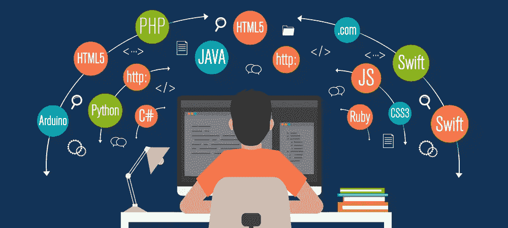
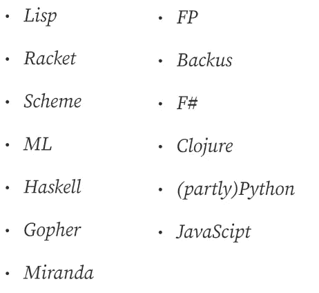
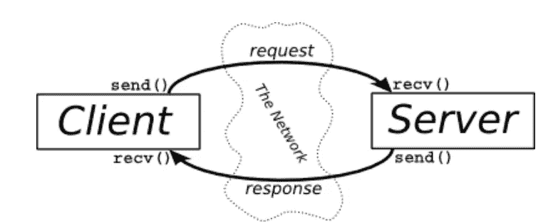
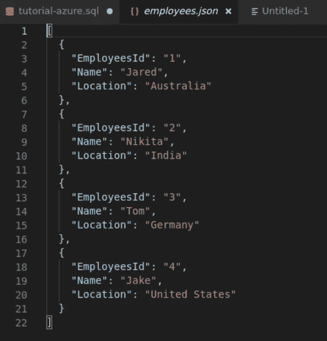
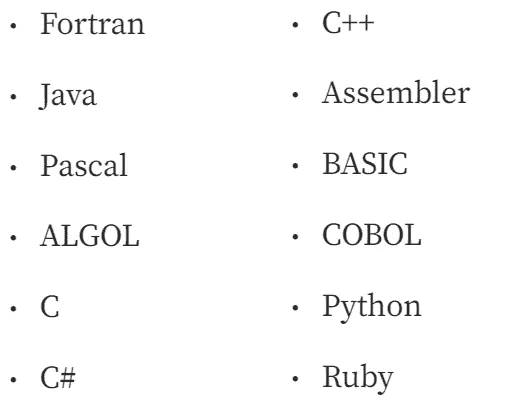
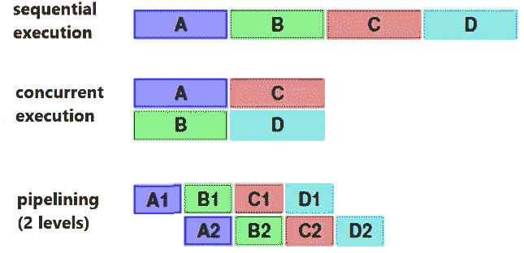

# 编程范例—简介

> 原文：<https://blog.devgenius.io/programming-paradigms-a-very-short-brief-5324908640bd?source=collection_archive---------8----------------------->

编程范例——那是什么意思？编程范例描述了程序设计的基本风格。它规定了应用哪些原则和使用哪些方法。

[https://www.seobility.net/de/blog/javascript-crawling/](https://www.seobility.net/de/blog/javascript-crawling/)

*向我的兄弟和导师*[***Tobias Streng***](https://medium.com/@tobias.streng)*—*
*如果你喜欢这篇文章，并想在。* ***网*** *和* ***角*** *，请关注我们:P*

作为一名 C#开发人员，我非常感兴趣的是发现一些除了面向对象或数据库编程之外的其他概念。所以我决定写一个关于不同编程概念的小总结。

## 在本文中，我将讨论以下主题:

*   **面向功能的编程**
*   **客户端—服务器—编程**
*   **数据库编程**
*   **面向对象编程**
*   **命令式编程**
*   **并行编程**
*   **基于逻辑的编程**

# 面向功能的编程:

理解这些语言没有赋值是很重要的。最重要的理论基础是**Lambda-Calcul**
——函数式和面向函数语言的典型代表有:

函数式编程是使用纯函数创建软件**。**纯函数是完全正常的程序函数，只有两个特殊属性:

*   **相同的返回值总是提供给相同的输入参数。**
*   没有副作用。

这两个特征使得一个纯函数可以与一个简单的数学函数 **y = f(x)相媲美，它总是为相同的 x 值确定相同的 y 值。**

实际上，这意味着函数的**整个程序逻辑只处理来自输入参数的数据，结果正好是一个返回值。**函数调用过程中没有副作用，比如改变函数或输入参数外的变量状态，写入数据库或文件，或者调用其他本身有副作用的函数。

# 客户端-服务器编程:

客户机-服务器模型是在网络中分配任务和服务的一种方式。任务被传递给程序，然后由程序完成。这些程序是客户端和服务器。

[https://the right tutorial . WordPress . com/2014/06/09/multi-client-server-chat-application-using-socket-programming-TCP/](https://therighttutorial.wordpress.com/2014/06/09/multi-client-server-chat-application-using-socket-programming-tcp/)

## 客户:

客户端是一台与服务器(中央计算机)通信的计算机或软件，它使用服务器上的数据和特殊服务。
客户端的任务是将请求传输到服务器，并准备好数据，以便用户可以在自己的终端设备上阅读。客户端本身并不完成任何服务器任务，只是作为用户的接口。例如，典型的客户端是网络浏览器。为了显示一个网站，网络浏览器必须联系网络服务器，然后网络服务器发送所需的主页。现在浏览器才可以显示网站。许多客户端作为系统服务在后台运行，例如 DNS 客户端。

## 服务器:

服务器通常是一台计算机，它的名字来源于“服务”。服务器既可以只在封闭的(公司)网络中工作，也可以通过互联网访问。它是网络或互联网中的一种接触点，必须接受、转发和回答许多请求。为了能够应付这种情况，它配备了适合其任务的高性能硬件。

# 数据库编程:

要处理的数据或多或少以数据库形式存储。实际的结果计算是由数据库查询完成的。
为此，使用通用查询语言。最著名的是 SQL(结构化查询语言)和 XQuery (XML 查询语言)，它们和其他范式的算法编程语言一样强大。

数据库，简而言之:DB，是一个结构良好的“相关”数据集合。从技术角度来看，DB 可以被认为是一个(大)文件。关于数据结构，分为三类:

*   平面层次结构:二维表形式的数据表示，必要时引用其他表的内容
*   强层次结构:结构的深层嵌套
*   结构简单:键值对，类似于字典

下面是一个 json 文件的例子:

[https://learn . Microsoft . com/de-de/SQL/tools/visual-studio-code/SQL-server-develop-use-vs code？view=sql-server-ver16](https://learn.microsoft.com/de-de/sql/tools/visual-studio-code/sql-server-develop-use-vscode?view=sql-server-ver16)

# 面向对象编程:

如果你想了解更多关于面向对象编程的知识，可以看看我的文章 [**C# —面向对象编程(OOP)**](https://medium.com/@sebastianstreng96/c-object-oriented-programming-oop-2d92a5cd336f) **。**

## 对象:

人们认为面向对象。他们用桌子、椅子、人等物体来思考。**面向对象的编程语言模仿人类思维，包含对对象的抽象。因此，面向对象描述了一种更好地想象编写源代码的方式。它是软件开发中的一个视角，使用对象描述复杂的系统，并为此使用类和方法。**所以类的实例就是对象。**为了更精确地说明一个类的这个原理，这个人充当了一个例子。所有人都有某些特征，比如名字或出生日期。每个特别的人都是一件物品。**

如果属性现在被分配给人的类，如姓名，年龄，身高和性别，一个人的表面形象逐渐浮现。当创建类时，指定的**属性还没有任何值**，因为这里 i **t 仅通过指定相应属性所源自的数据类型来确定后面的对象应该具有哪些属性**。这里用一种**的蓝图**来定义一个人是什么。

如果需要单个对象，您可以使用 **new()** 命令**来创建 Person-class 的一个实例。**构造函数被调用，开发者有机会赋值。例如，这里我们可以创建名为 Peter 的人，年龄 41 岁，身高 1.82，性别男。彼得是 Person-class 的实例/有形体。一个对象也可以包含方法。

## 方法:

方法可以理解为一种“子程序”,其中可以组合程序的某些功能。
定义方法有不同的方式。使用 **public 和 private 关键字**，方法可以对项目中的其他全局类可见或不可见。也可以定义一个**返回数据类型**，例如，当方法被调用时，它可以被赋值为一个变量。这在方法体中用关键字 return**返回，并在方法头中作为各自的数据类型**提供，例如 integer。如果这不是必需的，关键字 **void** 被写在方法头的相同位置。此外，方法**可以包含和使用参数**。
通过**不被定义为静态**并且在定义对象蓝图的类中被创建，方法可以被**绑定到对象**。例如，在前面的 Person 示例中，您可以添加 go()方法。如果该方法不是静态的，则只有在使用类实例(即对象)后面的点标记进行调用时，才能调用该方法。
然而，如果该方法要被调用而不被绑定到一个对象，它可以用关键字 **static 定义为 static。**

# 命令式编程:

命令式编程是最古老的编程范式。根据这种范式，程序由一系列明确定义的计算机指令组成。

因此，命令式语言的源代码将命令串在一起，决定计算机必须做什么以及何时达到预期的结果。程序运行时，变量中使用的值会发生变化。为了控制命令，诸如循环或分支之类的控制结构被集成到代码中。

命令式编程语言非常具体，并且接近系统工作。一方面，代码易于理解，另一方面，需要许多行源代码来描述在声明式编程语言中使用一小部分命令可以实现什么。

命令式语言可以分为 3 个部分:

*   **结构化程序设计:** 用具体的控制结构序列、选择(selection)和迭代(repetition)扩展了命令式的基本原理
*   **过程化编程:**
    将一个程序应该承担的任务分成更小的子任务，这些子任务在代码中被单独描述。这就是如何创建也可以在其他程序中使用的编程块。
*   **模块化编程:**
    单个程序组件的设计、开发和测试完全相互独立。只有最后，单个模块才能组合成实际的软件

# 并行编程:

总之，并行编程是并发性的一个特例，在这种情况下，独立的实体一起工作以实现(通常)高性能和高吞吐量。

并行编程有两种类型:

*   **隐式并发:**
    ——对程序员来说非常容易
    ——程序员只制定顺序算法，不关心并行处理的组织
    ——对编译器要求非常高
*   显式并发性
    -必须由程序员在程序中显式制定
    -降低编译器要求

**并发性**意味着同时执行几个类型相当的任务(程序、进程、线程、单个命令、单个操作符),因为在结构层中有几个适合执行的资源

## 异步！=平行

异步运行意味着它不会被阻塞。你不用等它完成就可以运行它，然后继续做其他的事情。并发意味着同时并行运行多件事情。当您可以将任务分解成独立的工作时，并发性工作得很好。

以渲染 3D 动画帧为例。渲染动画需要很长时间。当您开始在动画编辑软件中渲染时，请确保它异步运行，以便您的 UI 不会被阻塞，并且您可以执行其他任务。现在，该动画的每一帧也可以被视为一个单独的任务。如果有多个 CPUs 内核或多台计算机可用，我们可以并行渲染多个帧，以提高整体利用率。

大多数编程语言都提供了并行化进程的选项。然而，有些语言是为并行编程而从头开始设计的，或者天生就有这种能力:

*   新闻周刊
*   奥卡姆语言
*   擦
*   X10
*   占线小时
*   殡仪馆
*   统一并行 C
*   锈
*   去

在我看来，并行编程有很大的潜力，但也有很大的风险。错误的应用程序会产生非常高的错误率，并损失大量性能。一个有经验的开发人员必须决定在哪里进行并行化以及并行化的程度。如果你做出正确的决定，你可以节省大量的时间和效率。

# 基于逻辑的编程

基于逻辑的编程是一种基于数理逻辑的编程范式。与命令式编程不同，逻辑程序不是由一系列指令组成，而是由一组公理组成(axiom =
公认为绝对正确的原则；不需要证明的有效真理)，在这里应该理解为仅仅是事实或假设的集合。如果一个逻辑程序的用户提出了一个查询，解释器试图仅从公理中计算出解决方案。

这个例子是用自然语言写的，用来说明这个原则:

> 事实:
> 
> 露西娅是米娜的母亲。露西娅是克劳斯的母亲。明娜是纳丁的母亲。
> 规则:
> 
> 如果 X 是 Y 的妈妈，Y 是 Z 的妈妈，那么 X 就是 Z 的奶奶。
> 问题/目标:
> 
> 纳丁的祖母是谁？
> 计算机反应，从事实和规则中推导:
> 
> Lucy
> 这个不起眼的例子很容易扩展到其他家庭关系。

## 应用领域:

*   人工智能
*   数据库
*   专家系统
*   模拟器
*   发电机
*   数学
*   CAD/CAM 系统

# 请查看我的其他文章:

*   [LINQ——如何避免 C#中的嵌套循环](https://medium.com/codex/linq-how-to-avoid-nested-loops-in-c-ed4ae19886e4)
*   [。Net C# —干净的架构&依赖-反转-原则](https://medium.com/dev-genius/net-c-clean-architecture-dependency-inversion-principle-7ea64f586c58)
*   [C# —面向对象编程](https://medium.com/codex/c-object-oriented-programming-oop-2d92a5cd336f)
*   [C# —简单解释的单一责任](https://medium.com/@sebastianstreng96/c-single-responsibility-easily-explained-e3fabbf0d877)
*   [OCP——真正重要的是什么](https://medium.com/@sebastianstreng96/ocp-what-really-matters-610159d600dc)
*   [提高程序员积极性的 8 大技巧](https://medium.com/@sebastianstreng96/top-8-tips-to-improve-your-motivation-as-programmer-be63b2baaf7e)
*   [对网络的简要了解](https://medium.com/codex/a-brief-insight-into-networks-2171f1e9aea1)
*   [发送&接收—7 层 OSI 模型](https://medium.com/codex/send-receive-the-7-layer-osi-model-e475829b999)
*   [七层网络协议浅显易懂](https://medium.com/@sebastianstreng96/7-layer-network-protocols-easily-explained-e11e3e09f34d)

## 来源:

 [## 编程范例-软件实验室-斯图加特大学计算机科学系

### 本课程介绍了编程语言的概念。从如何描述一门语言的语法开始…

software-lab.org](https://software-lab.org/teaching/winter2019/pp/)  [## 编程范例:所有程序员都必须知道的

### 范式是一种思想或模型的流派，它具有独特的特征、框架、模式和风格，可以帮助您…

hackr.io](https://hackr.io/blog/programming-paradigms) 

[https://www . freecodecamp . org/news/an-introduction-to-programming-paradigms/#:~:text = What % 20 is % 20a % 20 programming % 20 paradigm % 3F，programming % 20 problems % 20 should % 20 be % 20 stacked](https://www.freecodecamp.org/news/an-introduction-to-programming-paradigms/#:~:text=What%20is%20a%20Programming%20Paradigm%3F,programming%20problems%20should%20be%20tackled)。

 [## funktionorientierte Programmierung-PDF kostenfrier 下载

### 1 functionsonorientierte programm eriung Christian Wagenknecht 教授

docplayer.org](https://docplayer.org/31401057-Funktionsorientierte-programmierung.html) 

基督教 Wagenknecht

 [## 迫切需要的方案:这是一个短期方案

### 命令式编程是软件开发中的两大编程范式之一。画什么...

www.ionos.de](https://www.ionos.de/digitalguide/websites/web-entwicklung/imperative-programmierung/)  [## 并行编程 - Wikipedia

### 并行编程是一种编程范式。它包括一个方法,一个计算机程序在个别...

de.wikipedia.org](https://de.wikipedia.org/wiki/Parallele_Programmierung)  [## 逻辑规划

### 逻辑编程(预测性编程)是一种基于数学逻辑的编程范式。

de-academic.com](https://de-academic.com/dic.nsf/dewiki/874656#Besonderheiten_logischer_Programmiersprachen)