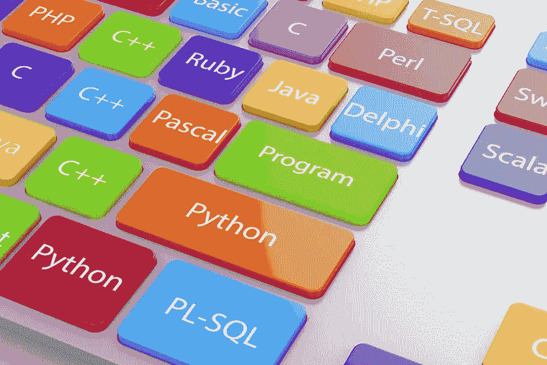
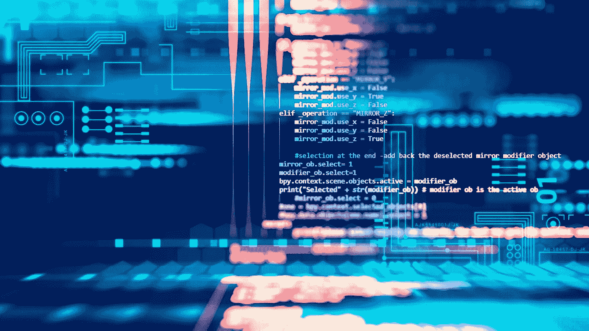
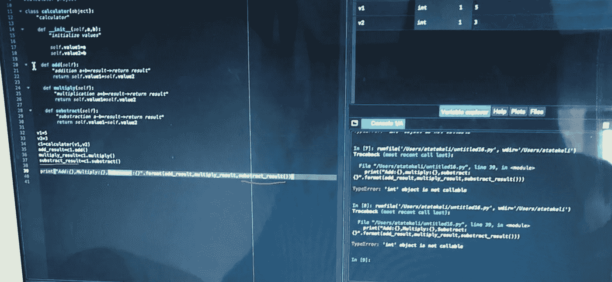
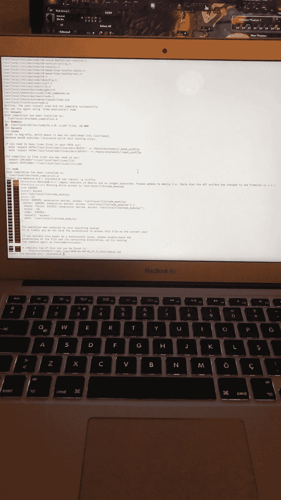

# 编程:好的、坏的、丑陋的、伟大的

> 原文：<https://blog.devgenius.io/programming-the-good-the-bad-the-ugly-the-great-3c4f0d50d384?source=collection_archive---------46----------------------->

并非所有的经历都是美好的。你也有心碎和愤怒的时刻。现在让我们为一个初级程序员深入研究所有的细节。

## 好人

**当我们写了一段代码或程序，能够完美地工作而不出错。或者，你在没有得到任何帮助的情况下观察时意识到了自己的错误**。尽管如此，当你知道自己想成为一名电脑玩家时，你会在电脑前感到快乐。

## 坏事

**运转不良的代码、错误、心碎和愤怒。所有的设计都是为了教授、测试和让你忠于你学习语言的目的。**

这是编程中最困难的阶段，你需要朋友的帮助来教你。这完全取决于你的开放性，合作，以及与远方朋友的团队合作。它教你很多你想要的技能；注意细节、耐心、深入了解、识别错误，并通过学习所有功能立即解决问题。

## 丑陋的

你经历了某个阶段。包下载，终端，设置，以及更多的愤怒来加强你的友谊和技能。

烦恼，爆发，和困难中加强的友谊。一切都是从不好的部分开始的，最丑陋的部分在这里可以帮助你更多。

这是你必须使用终端的地方，下载软件包，并通过终端检查它们的有效性。如果你有一些经验，你可以通过终端下载大部分的包，但是你需要帮助来整理这些东西。你尝试的越多，得到的好处和知识就越多。尽管帮助会让你的朋友发疯，也不要犹豫。

## 伟大的

当我们超越最丑陋的部分。尽管如此，一些不好的仍然存在。但远不如。友谊巩固了，所有的缺点都知道了，一切都按照它应该的那样运行。现在，忠于你学习编程语言的目标，不要放弃。

你对编程的现实有什么看法？请在下面的评论区分享你的经历。