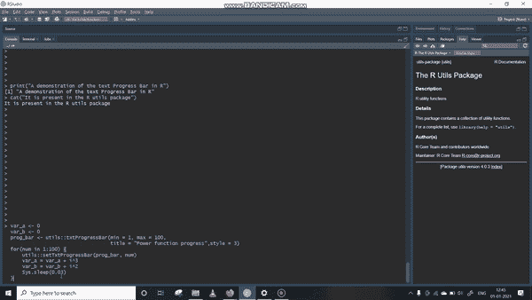
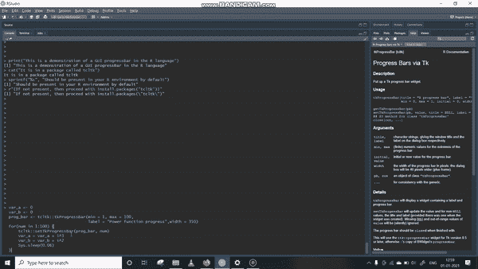

# R 语言的进度条

> 原文：<https://blog.devgenius.io/progress-bars-in-r-language-74b50935ed3d?source=collection_archive---------5----------------------->

迈克·范·登博斯在 [Unsplash](https://unsplash.com?utm_source=medium&utm_medium=referral) 上的照片

可以理解的是，当我们不知道一个进程要花多少时间时，我们会有点不耐烦，例如，一个 for 循环、一个文件下载或一个应用程序启动。因此，为了迎合人类查看和量化进度的基本欲望，我们可以在 R 脚本中使用一些进度条。

## 选项 1:基于文本的进度条

为了分散我们对等待的注意力，我们可以选择使用内置 *R utils* 包中的 *txtProgressBar* 。让我们以一个有一点睡眠时间的 FOR 循环为例，这样我们可以实际观察到*进度条*的运行。以下面的代码为例:

执行上述代码后，我们应该会得到类似如下的结果:

基于文本的进度条

**选项 2:基于 GUI 的进度条**

另一个选择是，我们有一个基于图形用户界面的进度条。这可以在 *tcltk* 包中找到。 *tcltk* 包应该在您的 R 安装中可用，但是如果不是，那么首先从安装和加载库开始。键入* *可找到所用函数中可用参数的更多信息。控制台中不带星号的 tkProgressBar* *。

考虑下面的代码片段作为使用基于 GUI 的进度条的例子。我们将使用我们在文本进度条中使用的相同功能。

代码的成功执行应该会产生如下结果:

基于 GUI 的 tk 进度条

## 结论:

就是这样。在 R 语言中，这就是你如何在循环、函数或任何其他需要花费大量时间的代码段中引入进度条的方法。如果您想在处理文件、训练模型等时让您自己的 R 包看起来更专业，这个特性尤其有用。现在出去写一些牛逼的 R 脚本吧。

谢谢你&祝你成功。