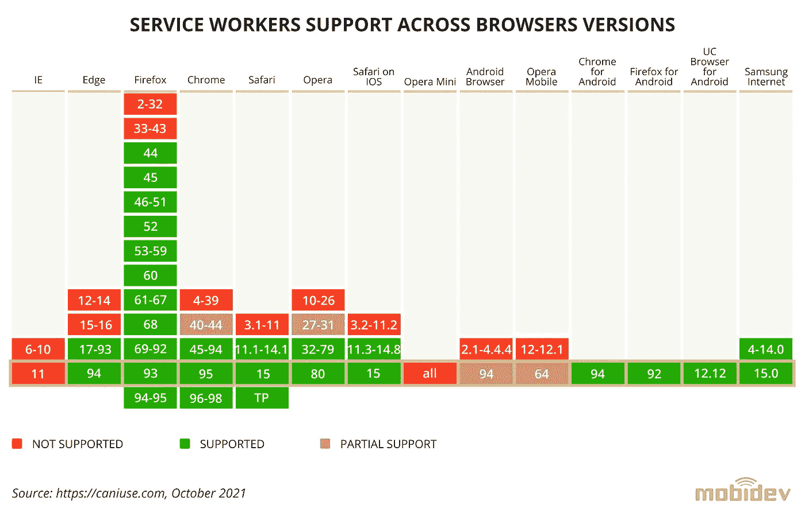
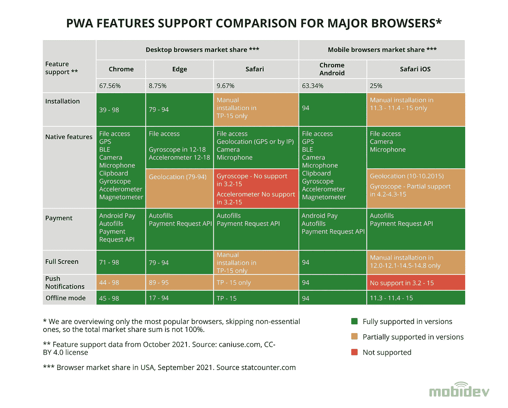
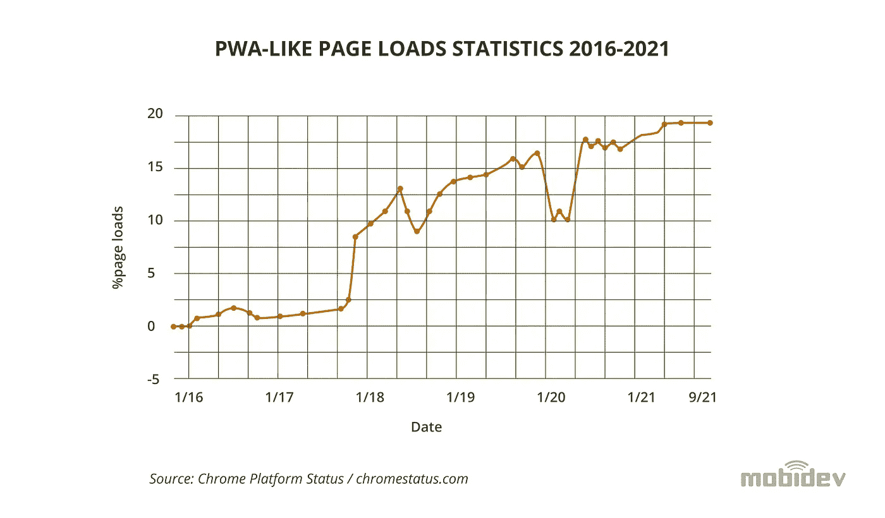
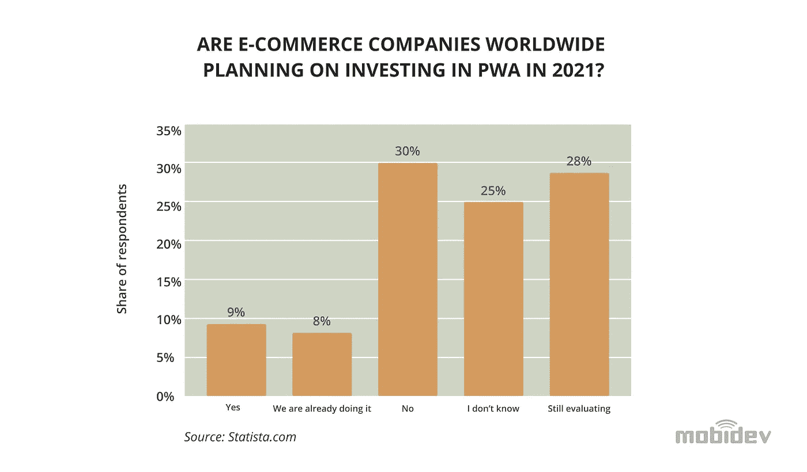

# 渐进式网络应用开发:2022 年如何烹饪 PWA

> 原文：<https://blog.devgenius.io/progressive-web-app-development-how-to-cook-pwa-in-2022-b83f8d5c2814?source=collection_archive---------3----------------------->

当谈到 web 开发时，渐进式 Web 应用程序已经流行了一段时间。但是你的公司会从 PWA 的道路上受益吗？阅读现在和 2022 年你应该如何以及何时使用和不应该使用这项技术。

# PWA 简介

渐进式 web 应用程序(PWAs)是 Web 和移动应用程序开发中一个相当新的趋势。该术语由谷歌工程师亚历克斯·罗素在 2015 年创造，指的是使用“渐进式”设计方法的网络应用程序，其行为和功能类似于原生应用程序。这具体意味着什么可能并不十分清楚，因为对于什么是或不是渐进式 web 应用程序没有精确的定义。

但是，PWA 设计模式有一些明确的特征。其中包括使用 ServiceWorkers(在浏览器中运行的后台脚本，以提供推送通知等功能)和应用清单(指导平台如何安装和管理应用的标准化 JSON 文件)。还有几个常见的设计主题通常被认为是 PWA 所独有的。

# PWA 的优点和缺点

在应用程序开发中使用渐进式 web app 技术有很多好处，尽管也有一些缺点需要考虑。PWA 设计的主要好处是它基本上是独立于平台的。这意味着一个应用程序可以使用单一代码库开发，并部署在几个不同的平台上。

以这种方式简化开发减少了将应用推向市场所需的时间和资源。平台独立性与 pwa 固有的可安装性相结合，使得应用程序在多个平台上的部署变得非常容易。用户可以下载和安装 PWAs，就像他们可以使用任何本机应用程序一样，而不是依赖浏览器来访问它们，从而使用户体验无缝而直观。

PWAs 也享受着现代网站设计的好处，因为它们反应灵敏，重量轻。现代 web 浏览器允许开发人员利用设计选项来应对不断变化的平台和屏幕尺寸，从而为用户提供一致的体验。这些现代化应用的代码库更小，并且它们在浏览器中运行(而不是作为原生应用)的能力使它们变得轻量级。PWAs 作为独特的 web 应用程序的一个额外好处是，它们可以被搜索引擎索引发现。

然而，PWA 设计的主要缺点是对平台和硬件支持有一些限制。由于 pwa 在浏览器中运行，它们无法直接访问使用平台 SDK 构建的本地应用程序可以访问的平台的所有功能。一些平台对这些应用的支持也有限制，尽管支持和功能在不断发展。

# 为什么要用 PWA？

最终，在应用程序中使用 PWA 设计是为了那些希望快速、经济地将应用程序交到用户手中的人。这种设计非常适合资金有限的早期创业公司，他们希望尽快将 MVP 应用程序推向市场。但是，任何希望利用现代应用开发发展趋势的公司也将从 PWA 中看到类似的好处。

# 使用 PWA 的大品牌

pwa 不仅仅是为小公司和资金紧张的创业公司准备的。相反，许多全球性公司看到了为了用户利益而转向 PWA 策略的巨大成果。通过这样做引起了很多关注的一个主要品牌是 Twitter，它在设计 Twitter Lite 应用时考虑到了 PWA。随着 Twitter Lite 的推出，Twitter 上的推文[增加了 75%](https://developers.google.com/web/showcase/2017/twitter)，每次会话的页面增加了 65%,跳出率下降了 20%。

福布斯和 Pinterest 也为他们的业务设计了 PWAs，福布斯看到了 43%的会议增长和 100%的参与增长[。Pinterest 的 PWA 带来了用户驱动广告收入 44%的增长。这些只是在应用中采用 PWA 设计的公司的几个例子，其他知名品牌如](https://developers.google.com/web/showcase/2017/forbes)[优步](https://eng.uber.com/m-uber/)和[全球速卖通](https://developers.google.com/web/showcase/2016/aliexpress)也采取了同样的做法。

# PWA 与其他技术相比

pwa 最容易与本地应用或网络应用相比较，介于两者之间。但是在 web 和 native 之间有一个很长的特定技术列表，也可以与 PWA 进行比较。

# PWA 与本机应用程序

将 PWA 与原生应用的一般定义进行直接比较，会发现一些差异。也就是说，pwa 是用更轻、更简单的代码库构建的(只需要 web 语言，而不需要特定于平台的 SDK 框架)。

# PWA 与跨平台应用

与 React Native、PhoneGap 或 Flutter 等更为混合的技术相比，跨平台应用有一些细节需要强调。例如，React Native 是为构建跨平台的原生应用程序而设计的，只需一个代码库就能实现，但通常需要开发团队具备更广泛的技能，因为他们必须处理各种原生控件和插件，这些控件和插件是用不同的语言编写的，如 Java 或 Objective-C(取决于平台)。

PhoneGap 应用程序也有些类似。这些只是包装在本地容器中的 web 应用程序，该容器可以通过一组本地插件访问各种平台 API。尽管有大量的可用插件，你可能需要一些定制的东西，你必须自己实现它，再次得到 Android 和 iOS 开发者的帮助。

从这个意义上来说，pwa 要简单得多，通常只用 JavaScript 构建，利用 React、Angular 和 Vue 等现代框架。

总而言之，pwa 与使用其他跨平台技术构建的混合应用最为相似。PWAs 很可能在开发和未来支持方面更便宜，因为您可能需要一个没有任何特定或独特技能的小型团队。pwa 的缺点是它们受到浏览器功能的限制，可能对应用程序所需的一些核心功能支持不佳。

# PWA 与 WEB 应用程序

与纯 web 应用程序相比，PWAs 有几个优点。这是因为 web 应用程序受到浏览器功能的严格限制。这也意味着网络应用程序不能提供让 PWA 对用户如此方便的可安装性。虽然它们可以提供类似的好处，如在许多单页应用程序(SPA)中看到的响应性和轻量级设计，但关键的区别在于 PWA 模拟本机体验的标准化方法。

PWA 也可以比作应用程序框架，如 Electron 和 Flutter。严格来说，electronic 是一个 web app 框架，它在应用程序大小和安全性方面存在缺点，这使得它通常不适合 PWA 开发。但是颤振更类似于 PWA。PWA 和 Flutter 都强调在具有跨平台原生功能的单一代码库中进行开发。然而，Flutter 只使用新的 Dart web 语言，而 PWA 可以用任何语言编写，许多旧语言提供了更多的支持。

# 来自主要平台的 PWA 支持

评价 PWA 最重要的一点就是主要平台提供什么样的支持。虽然 PWA 通常允许开发完全能够在任何平台上运行的应用程序，但是对于不同平台所支持的内容有一些限制。

*数据来自***，CC-BY 4.0 许可**

# *IOS 上的 PWA 支持*

*对于 iOS 设备来说，PWA 支持有些有限。尽管术语“渐进式网络应用程序”是最近才由谷歌创造的，但 PWA 的起源实际上可以追溯到第一代 iPhone。在苹果为 iOS 设备提供 SDK 之前，iPhone 上唯一可用的应用程序是 web 应用程序。这是史蒂夫·乔布斯本人非常坚持的决定。*

*当然，由于开发人员要求更一致的工作流程，苹果最终发布了他们的 SDK 和 App Store。这种演变伴随着苹果对开发者在用户体验和应用商店中可用应用的安全性方面的严格规定。不幸的是，这些规定严重限制了开发者为 iOS 提供 PWAs 的能力。*

*然而，从 iOS 11.3 开始，苹果平台支持 pwa。然而，它们仍然必须包装在本机代码中，并通过应用商店分发。这限制了 PWAs 的一些优势，如简化的代码库和易于安装。*

# *ANDROID 上的 PWA 支持*

*Android 有更全面的 PWA 支持。这主要归功于 Android 的开源方法，这种方法给了开发者自由和灵活性，让他们可以随心所欲地编写和分发应用。Android 还为 PWAs 提供了一些原生平台功能，如推送通知，使开发人员能够在其应用程序中提供更加无缝的原生体验。*

# *浏览器 PWA 支持*

*虽然现在大部分流行的浏览器都支持 PWAs，但是没有 100%的兼容性。*

**

**数据来自***，CC-BY 4.0 许可***

**选择不支持 PWAs 的浏览器有:**

*   **[桌面火狐](https://bugzilla.mozilla.org/show_bug.cgi?id=1682593)**
*   **微软公司出品的 web 浏览器**
*   **脸书手机浏览器**

**此外，Safari 还有一个注意事项。虽然它提供了对 PWAs 的基本支持，但并没有包括所有的功能。Safari 不支持推送通知，因此用户应该手动安装该应用程序，以便将其添加到主屏幕。**

**除此之外，在 2020 年，WebKit，Safari 的引擎[宣布](https://webkit.org/tracking-prevention/)他们将不支持许多提供本地功能访问的 API。这种不支持的特征的例子是网络蓝牙、网络 MIDI API、磁力计 API、网络 NFC API 等等。他们说是出于隐私考虑，但这阻碍了 iOS 上 PWAs 的进化。**

**然而，新的 Windows 10X 计划很快全面支持 PWAs。**

# **2021 年公共工程项目的现状**

**渐进式网络应用本质上是一种发展趋势。因此，主要平台的新发展和额外支持不断促进 pwa 的增长。虽然 PWA 的不精确定义使得跟踪准确的市场份额变得困难，但根据 Chrome web 统计数据的估计，当前类似 PWA 的页面加载量约为 19%。**

****

**一项针对电子商务决策者的调查[显示](https://www.statista.com/statistics/1174534/investing-pwa-ecommerce-companies-worldwide/)9%的电子商务公司计划在 2021 年投资渐进式网络应用(PWA)。此外，8%的电子商务公司报告说他们已经在这样做，28%的公司没有在 2021 年投资 PWA 的计划。**

****

**研究[指出](https://www.globenewswire.com/news-release/2021/02/08/2171664/0/en/Progressive-Web-Application-Market-Size-to-Reach-USD-10-44-Billion-by-2027-Global-Analysis-Statistics-Revenue-Industry-Demand-and-Trend-Analysis-Research-Report-by-Emergen-Research.html)到 2027 年，渐进式网络应用市场的财务价值将达到 107.7 亿美元，代表着从现在到那时的年增长率超过 30%。**

**当前对 PWAs 的支持相当好，尽管有一些限制。现在，包括 iOS、Mac、Android 和 PC 在内的所有主流平台都提供了某种程度的 PWA 支持。Android 提供的支持最好，iOS 和 Mac 最受限制。苹果对其平台上可用应用的严格控制是 PWA 在 iOS 上采用的最大障碍。**

**在自己的应用程序中考虑 PWA 的开发人员和项目所有者应该考虑这些限制。随着平台支持的发展，PWA 市场正在稳步增长，因此早期采用者可能会发现自己领先于竞争对手。但是很难说这种增长会持续多久。**

**有趣的是，今年早些时候，Instagram Lite 从 PWA 重建为原生 Android 应用。这种转变的原因尚不清楚，但有一些猜测认为脸书这样做是为了测试他们的内部框架。**

# **对 2022 年的 PWAs 有什么期待？**

**好的一面是，PWA 市场有了一些重大改善。PWAs 最近的一个积极进展是微软和谷歌的合作。微软[最近宣布【PWABuilder 将使用谷歌的 Bubblewrap 技术。PWABuilder 是微软的开发工具，它使编写 pwa 变得更容易，Bubblewrap 帮助开发人员打包他们的应用程序，以便在 Google Play 应用程序商店上分发。](https://medium.com/pwabuilder/microsoft-and-google-team-up-to-make-pwas-better-in-the-play-store-b59710e487)**

**这一声明伴随着对新功能的支持，包括原生应用程序快捷方式和高级 Android 功能，现在可以通过 PWABuilder 获得。像谷歌和微软这样的科技巨头的合作努力对于 PWA 的未来是非常有希望的。**

# **2022 年及以后该不该用 PWA？**

**答案是肯定的，如果你的产品策略需要快速进入市场，并且用一个代码库覆盖多个平台。渐进式网络应用程序允许初创公司快速轻松地开发和分发渐进式网络应用程序，并在资源有限的情况下，从推出应用程序所需的最少时间和资金中受益。鼓励首次用户重新访问应用程序，并借助推送通知和应用内横幅让他们参与进来，使 PWAs 成为营销战略实施的强大工具。**

**较大的公司也可以从为其用户提供价值中受益，这些用户对高性能平台的访问受到限制，或者更喜欢更简化、轻量级的体验。PWA 可以是一个企业软件开发的选择，该企业软件依赖于一个选定的单一平台，以受益于该平台所支持的重要的本地特性。**

**PWA 的其他常见用例是当您的应用程序需要支持离线模式时，或者您需要将您的传统 web 应用程序(例如，用 React 制作的应用程序)重新制作成 PWA，与从头构建新应用程序(例如，在 Flutter for Web 中)相比，所用的时间最少。**

# **何时不应使用 PWA**

**虽然 PWAs 有一些缺点，但这些缺点是很小的，并且大部分被它们的好处所抵消。pwa 的最大限制是对 iOS 的支持有限，而 iOS 显然占据了移动应用市场份额的很大一部分。然而，还是有一些支持的，苹果公司在过去对 PWA 立场的改变表明他们愿意与它一起发展。**

**另一个可能阻止你使用 PWA 的限制是，你的应用程序不能在 AppStore 中发布，但是很容易[将其列在 Google Play](https://chromeos.dev/en/publish/pwa-in-play) 上，并且已经可以[使其在微软商店](https://developer.microsoft.com/en-us/microsoft-store/pwa/)中运行。**

# **PWA 开发的 8 项建议**

1.  **PWA 应该感觉像一个本机应用程序-在应用程序启动时显示闪屏是一个好习惯，应用程序应该有一组不同大小的图标，这些图标将在主屏幕上用作应用程序徽标和正确配置的主题。**
2.  **一些浏览器仍然不完全支持 manifest.json，因此您必须回退到 meta 标签，例如在 Safari 或 Microsoft Edge 中指定主题或磁贴颜色。**
3.  **确保始终[推动应用安装](https://web.dev/customize-install/)。应用程序安装或“添加到主屏幕”功能以及推送通知是显著提高转化率和用户再参与度的杀手级功能。**
4.  **如果您的应用程序需要离线模式支持，或者您只是想使用增强的缓存策略来减少网络流量和页面加载时间，我们建议您查看谷歌官方的[库集](https://developers.google.com/web/tools/workbox)，它专门用于解决这些问题并简化 PWA 开发。**
5.  **每当 PWA 应用程序的新版本上线，我们必须让用户知道可用的更新。我们可以通过显示定制的应用内横幅或通知，提示用户更新应用来实现这一点。请注意，在使用先前版本的所有应用程序窗口或选项卡关闭之前，ServiceWorker 不会自动更新。如果我们不显示横幅，用户可能在很长一段时间内都不知道更新。**
6.  **正如我们所说，一些用户可能不会立即更新应用程序，而会使用旧版本。在这种情况下，在服务器上拥有向后兼容的 API 是绝对重要的。**
7.  **一定要彻底测试代码，尤其是 app 初始化逻辑。如果应用程序在初始化期间崩溃，并且它尚未为传入的 ServiceWorker 更新建立订阅，用户的设备可能会一直使用有问题的应用程序版本，直到手动重新安装。建议总是创建一些回退，以便在出现未处理的应用程序错误时自动注销活动的 ServiceWorker，在这种情况下，您将能够快速向最终用户提供修复。**
8.  **PWAs 应该很快。您可以使用 [Lighthouse](https://developers.google.com/web/tools/lighthouse/) 和其他 [Chrome DevTools](https://developer.chrome.com/docs/devtools/) 来测试和调试性能。**

**当然，我们遵循适用于常规 web 应用程序开发的所有其他最佳实践:**

*   **创建响应迅速、适应性强的 web 应用程序，无论是移动设备、平板电脑还是台式机，都能在所有平台上正常运行。**
*   **遵循团队中已建立的代码风格，或者通过配置预提交 git 挂钩来建立自己的风格，该挂钩将调用代码 linters 和 formatters。**
*   **如果可能，编写严格类型化的代码(例如，使用 TypeScript)。**
*   **设计基于组件的应用程序。分离 UI 和业务逻辑。创建简单且可重用的组件，这些组件很容易组合成复杂的 UI。**
*   **当然还有执行代码审查和互相帮助！**

**由 [MobiDev](https://mobidev.biz/services/web-application-development) 的 JavaScript 团队负责人谢尔盖·里科夫撰写。**

***全文原载于*[*https://mobidev . biz*](https://mobidev.biz/blog/why-when-use-progressive-web-app-pwa-development)*，基于 mobi dev 技术研究。***