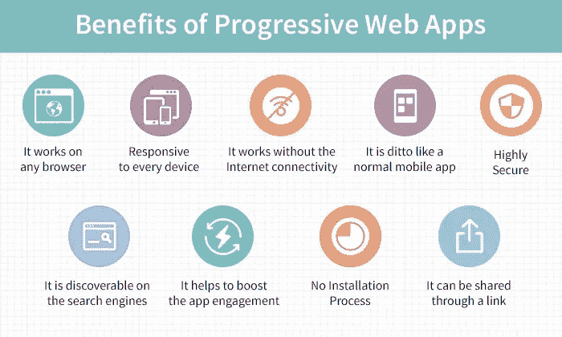
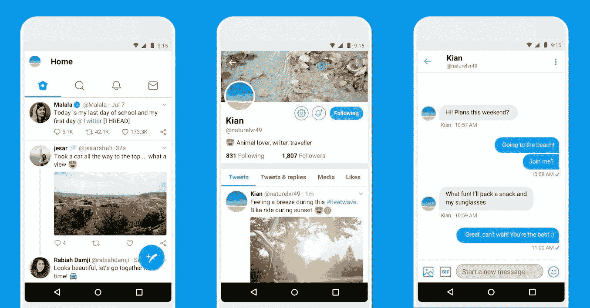
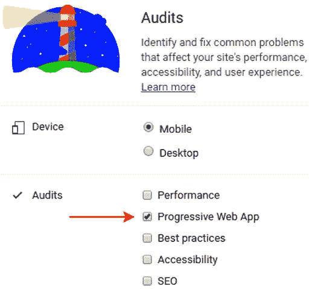

# 渐进式 Web 应用程序教程—示例和优势

> 原文：<https://blog.devgenius.io/progressive-web-app-tutorial-examples-benefits-6ddef9b1fe87?source=collection_archive---------11----------------------->

根据数据报告，全球互联网用户的数量已经超过 45 亿美元。而移动设备占了一半以上的流量。然而，尽管供应量很大，传统应用正在失去市场份额。全球速卖通、推特、日经、兰蔻和福布斯等巨头都在积极投资渐进式网络应用开发。今天，对于大多数用户来说，最理想的解决方案是页面加载速度不逊于移动应用的移动网站。如果你想最大化你的用户受众范围，查看来自 [Deventor](https://deventor.io/services/dedicated-teams/) 的渐进式网络应用教程。您将了解 PWA 技术可以做什么，以及如何在它的帮助下建立一个具有无限可能性的网站。

# 什么是渐进式网络应用？

简单来说，渐进式 web 应用程序是一个网站变成了一个应用程序。这是一个具有附加功能的浏览器应用程序:离线性能、支持推送通知、方便的用户友好界面、不低于本地应用程序的响应速度等。有了这些，pwa 更便宜，更容易开发和维护，但是它们最大的优点是跨平台的特性。它们也不需要在应用市场(谷歌 Play 商店和应用商店)上发布，因为它们直接在浏览器上工作，看起来就像成熟的应用程序，浏览器中没有地址栏。

# 使用渐进式 Web 应用程序的优势

pwa 基于标准 web 技术，并增加了 Javascript 功能。使用这种组合，您可以创建超快的网页。它们还在响应式网页和移动应用之间架起了一座桥梁。技术增强了网页的功能。PWAs 可以很容易地保存在桌面、iOS 和 Android 设备上。

# PWA 的主要优势:

1.  **低数据使用率**。pwa 更加“轻量级”,因为它们只使用一小部分数据。它们不需要大量的内存，因此可以在移动设备上获得最佳性能。
2.  **不需要更新**。原生应用需要手动更新或持续 Wi-Fi 连接才能自动更新。PWA 既不需要在发布前进行背景更新，也不需要 Play Store 的批准。
3.  **低成本**。pwa 的功能与移动应用一样，但开发成本要低得多。因此，这是获得巨大投资回报的最佳选择。说服用户安装应用程序比邀请他们访问网站更难。
4.  **伟大的 SEO 整合**。不仅因为数据量少，还因为存储和成本。PWAs 加载和索引速度很快，这提供了很好的用户体验。实施 PWA 有助于推动现有的在线营销计划。
5.  **更多的 URL 可能性**。你可以直接在网站上分享链接，这在手机应用中是做不到的。
6.  **强劲的经营业绩**。低数据使用量和快速下载确保了无忧体验。转化率可以显著提高。最终，当用户在专用解决方案上花费更多时间和金钱时，企业会变得更加成功和有利可图。

渐进式 web 应用程序在不消耗硬件资源的情况下提供广泛的功能。现代网站需要这一点来提供与本地用户体验相匹配的界面。



# 有哪些技术可以用于开发？

PWAs 永远改变了我们对网站的看法。多亏了 Ruby on Rails、Angular5、VueJS 和 React 等进步的 web 应用框架，web 开发不再那么困难。为了创建 PWAs，网站使用相同的工具— HTML5、CSS、JavaScript。这个技术堆栈允许您构建一个跨平台的应用程序，这消除了为每个单独的平台开发多个应用程序的需要。最重要的是，你可以使用定制的插件和模块，也可以添加 HTML、JavaScript 和样式到模板中(比如 ASP.NET 核心、Blazor 和 WebAssembly)。

# 流行的 PWA 示例

越来越多的公司正在考虑使用 pwa 来利用它们。对于还没有应用程序，但需要改善与客户互动方式的初创公司和小型企业来说，尤其如此。Chrome 和 Firefox 是公认的释放 PWAs 潜力的最佳移动浏览器，但 iOS 11.3 中的 Safari 也一样好。以下是一些最著名的 PWA 例子:

*   Twitter 推出了*mobile.twitter.com*作为用 React 和 Node.js 创建的 PWA
*   阿里巴巴、福布斯、天气频道、MakeMyTrip 等等。

这个列表可以是无穷无尽的，你一定会惊讶地发现我们日常使用的服务中有多少是渐进式 web 应用程序。Pinterest 最近宣布推出 Pinterest Lite 的轻量级版本，以改善低带宽地区的用户体验。新的 PWA 提供了显著的存储空间节省和更快的加载时间。



# 如何制作一个进步的 Web App？

建立一个 PWA 不需要很长时间。你可以使用[progressive web app builder](https://www.pwabuilder.com/)——这是一款来自微软的构建 pwa 的便捷工具。它将允许您创建一个基本的 web 应用程序，并通过添加三个要求将其扩展到 PWA:HTTPS(您可以从您的域注册商处购买 SSL 证书，然后通过托管服务对其进行配置)、web 应用程序清单和服务工作者。

# 设置和配置服务人员

SW 是一个 JavaScript 文件，在 web 应用程序和网络之间起中介作用。它提供离线支持、高级缓存、后台任务，因此是项目的关键部分。软件分两个阶段设置:

1.  在网站代码中创建链接；
2.  创建服务人员文件。

需要通知浏览器服务人员已经到位并准备就绪。为此，将一段简单的代码注入到页面模板中。

这个代码树应该添加到一个单独的文件中:

PWAbuilder 工具中有几个选项可用。在决定如何准确创建 PWA 时，选择最适合您的一个。对于 java 脚本，缩小是明智的。

# 添加推送通知

SW 允许通过 Web 推送 API 发送推送通知。如果你是从零开始启动一个应用程序，谷歌 Firebase 服务附带 Firebase 云消息。下面的代码显示了如何注册接收推送通知。

# 正在配置清单

要安装 PWA，您需要在应用程序根目录中包含 *manifest.json* 。这是对你的应用程序的描述，包括图标，闪屏，名字。您可以在这里设置从主屏幕启动时的显示配置:地址栏、状态栏颜色等等。请注意，正确的 *manifest.json* 必须包括不同设备的全部图标尺寸。这里有一个例子:

```
{ "name": "Progressive Selfies", "short_name": "PWA Selfies", "icons": [ { "src": "/src/images/icons/app-icon-192x192.png", "type": "image/png", "sizes": "192x192" }, { "src": "/src/images/icons/app-icon-512x512.png", "type": "image/png", "sizes": "512x512" } ], "start_url": "/index.html", "scope": ".", "display": "standalone", "background_color": "#fff", "theme_color": "#3f51b5" }
```

# 错误修复和测试

构建一个 PWA，所有的 app 迭代不仅需要在最后进行测试，还需要在过程中进行测试。你可以使用谷歌灯塔。它的数据会告诉你错误的存在和修复它们的方法。



如果你按照我们简短的 web 应用教程做了所有的事情，那么恭喜你！现在你有自己的 PWA 了！

# 结论

PWA 是一个完全集成的解决方案，为企业提供了很多。它不需要基础费或安装费，其可靠性、快速下载和离线能力改善了用户体验并提高了转化率。因此，我们可以有把握地说，通过了解如何开发 PWA，您就拥有了提高企业盈利能力的良方。然而，这个 PWA 教程需要一个体验式的方法。

*原载于 2021 年 1 月 21 日*[*https://deventor . io*](https://deventor.io/blog/progressive-web-app-tutorial/)*。*