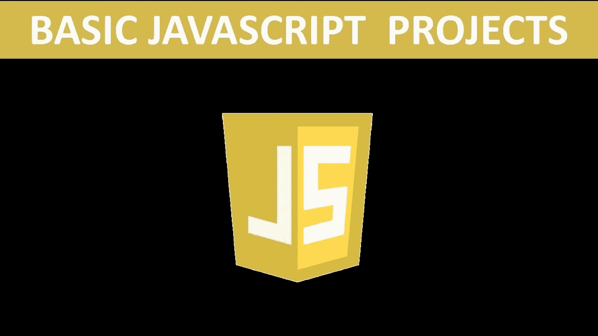

# JavaScript 的项目理念

> 原文：<https://blog.devgenius.io/project-ideas-for-javascript-f0d249f9ed27?source=collection_archive---------3----------------------->

***实际上，JavaScript 并不只是被用于 web 开发。***

当 JavaScript 推出时，它的最初用途是用于动态 web 开发。随着时间的推移，在线游戏和区块链成为了 JavaScript 的目标。在这里，我们将讨论 JavaScript 的一些项目想法。

## 建立一个网站

网站是 JavaScript 项目最基本的概念。因为 JavaScript 最初是用来让静态网站动态化的。这导致了 Web 2.0，在 Web 2.0 中，网站将变得比 90 年代的网站更有吸引力和活力。

## 构建基于网络的游戏

一旦你建立了自己的网站，游戏就可以在网站下创建。你只需要创建一个网站，并在你的网站上整合网页游戏。一旦所有的程序都完成了，你就可以打开你的新游戏网站了。

## 区块链发展

JavaScript 被频繁地用于区块链开发可能会令人惊讶。尤其是 nodeJS 和 reactJS 是最常用的 JavaScript 应用程序，而其他版本的 JavaScript 使用频率不如它们的对应版本。如果你不喜欢

## 以太坊开发和测试

当以太坊为其加密货币建立了一个平台时，Solidity 可以直接用于在以太坊上创建应用程序。随着时间的推移，它的开源特性允许在 JavaScript 上构建更多的扩展。此外，nodeJS 和 reactJS 允许以太坊应用程序比 Solidity 更容易创建。在 DAO 攻击之后，测试对于防止以前发生的攻击变得更加重要。因此，以太坊成为了一个抵御各种网络攻击的更安全的环境。

## 超分类帐开发

自从 hyperledger 项目启动以来，随着越来越多的应用程序在 web 支持下构建，JavaScript 在区块链开发中变得更加突出。

*哪些项目想法非常适合 JavaScript？你做过 JavaScript 项目吗？如果你有，请在下面的评论区分享你的想法和经历。*