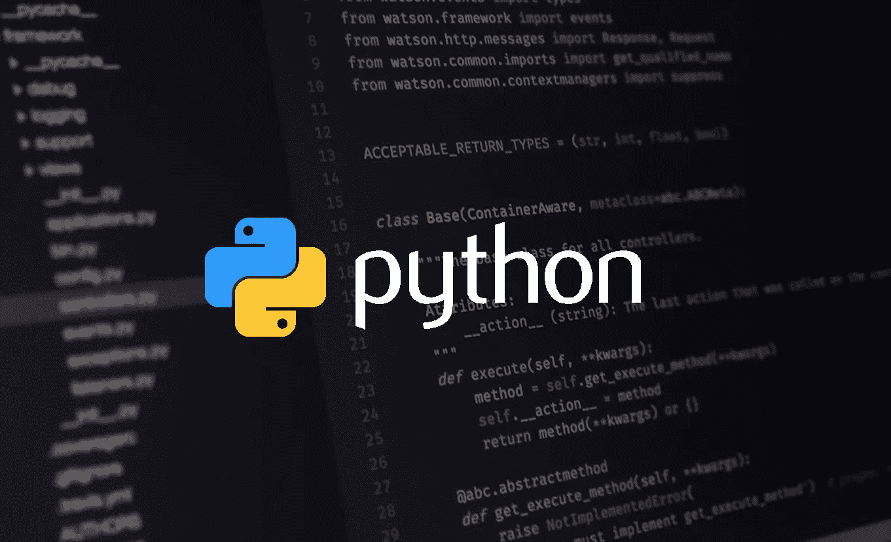

# Python 的项目理念

> 原文：<https://blog.devgenius.io/project-ideas-for-python-be8c16b144f3?source=collection_archive---------9----------------------->

对于一种编程语言来说，有太多的项目想法。

自从 python 在 20 世纪 90 年代成立以来，它的开源环境允许 python 发展成为一种开发任何东西的编程语言。在这里，我们将讨论 python 的项目理念。

## python 有哪些项目思路？

**人工智能和数据科学**

说到 python，数据科学和人工智能是这种编程语言最知名的应用。因为它在这个领域很受欢迎，如果你想从事人工智能和数据科学的工作，许多专家都需要 python 知识。

**统计数据**

Python 是统计研究中最流行的语言，直到 R 取代了它。尽管如此，大多数人还是使用 python 进行统计，因为使用它的专用文本编辑器进行统计计算和获取结果更加容易和方便。

**在线应用**

也许在这个领域它不是一种流行的编程语言，但是你实际上可以通过使用 python 创建一个在线应用程序。尤其是当您可以使用由其他人生成的大量库时。如果您愿意，也可以用这种编程语言创建自己的库。

**网页开发**

另一种不受欢迎的 web 开发编程语言。但是通过使用 Django 和 flask 以及一些 HTML、CSS 和 JavaScript 来创建你的网站实际上是可能的。最终结果是生成一个用户可以轻松使用的网站。

**自动化**

自动化是一切事物的一个受欢迎的方面，python 被用来创建大多数自动化软件。什么将被自动化并不重要，python 和 Java 一起被用作流行的工具。因为 python 用于自动化行业，所以大多数自动化软件都需要 python 来确保机器正常工作。

**自然科学**

像在许多领域一样，自然科学在计算方面受益。无论他们做统计分析或其他种类的计算。而且，Python 可以用来开发计算软件，让计算变得更容易。

**数学**

python 最受欢迎的领域之一是数学。当你必须用手或其他复杂的软件进行所有这些计算时，它变得更加有用。因此，大多数数学家求助于 python 进行计算。

**游戏**

另一个冷门领域，但是 PyGmes 库可以用来创建一个交互式游戏。与通用编程语言的其他应用程序相比，它在构建自己的游戏方面有很好的用途和便利性。

*根据你的说法，什么样的项目思路可以融入 python 项目？你做过 python 项目吗？如果你有，请在下面的评论区分享你的想法和经历。*