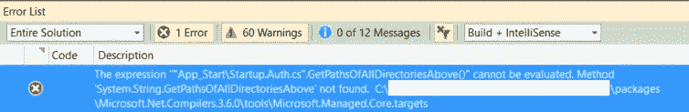
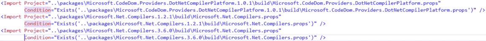
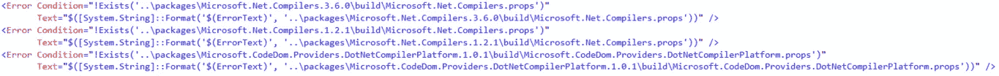

# 项目更新到。NET 编译器平台(Roslyn):迟做总比不做好

> 原文：<https://blog.devgenius.io/project-update-to-net-compiler-platform-roslyn-better-late-than-never-3d4c8d302016?source=collection_archive---------13----------------------->


来自[的照片](https://freeimages.com/)

【http://www.thebeet21.com】此文最初发布于[](http://www.thebeet21.com)

*因此，由于计划搬迁到，我的客户要求我更新我们所有的项目。净 4.8。有传言称 Azure 将最终推出 said。我被要求在 7 月 14 日之前更新所有的项目。考虑到我一个人要处理大约五个独立的项目，这的确很费力。相信我，我都不知道我怎么能承受那么多。但这不是重点。*

*所以是的，更新。因为我喜欢看到东西着火，我非常想伤害自己，所以我从最难维持的项目开始。*

*我只是做了你在更新时会做的事情。您更改目标框架版本，重新加载 NuGet 包以查看在切换后是否有任何东西损坏，并修复您发现的依赖问题。*

*我期待一个费力但简单的更新。毕竟入了。NET 4.6.1。它不是很旧。应该很简单，对吧？嗯……不尽然。*

*当我修复依赖问题时，我遇到了一个奇怪的问题。每当我试图更新所有的包，我得到这个错误:*

**

*我想也许我只是漏掉了某些参考文献，或者也许我不得不一点一点来。我认为这不是一个坏主意，因为在我更新它们之后，某些包开始需要其他库。我照做了。*

*在修复引用并逐批更新包之后，我仍然得到同样的错误。我不知道发生了什么。任何有自尊心的开发人员都会告诉你，现在是检查 StackOverflow 的时候了。果然已经有人遇到了，分享了自己的解决方案。根据[vendetamit](https://stackoverflow.com/users/881798/vendettamit)的说法，该问题是由于旧版本的更新造成的。NET 版本到。NET 4.8，这涉及到从 MSBuild 到 Roslyn 的切换。*

*罗斯林到底是什么？Roslyn 是 C#和 VB.NET 的. NET 编译器。关于它可以说很多事情，我甚至不确定我是否能恰当地解释它。但是它最值得注意的一点(无论如何我是这么认为的)是它如何推动了 Visual Studio 和。网络发展总体上更上一层楼。Roslyn 提供了一套广泛的工具，可以直接与编译器交互，提供有关代码的重要信息，这些信息是开发人员以前无法获得的。作为[。NET 编译器平台 SDK 文档](https://docs.microsoft.com/en-us/dotnet/csharp/roslyn-sdk/)解释道，“打开黑匣子，让工具和最终用户共享编译器拥有的关于我们代码的丰富信息”。*

*Roslyn 通过提供更复杂的代码分析功能的特殊 API，让开发人员对他们的编码方式有了更多的控制，这有助于改进开发人员拥有的代码分析工具。更棒的是，Roslyn 实现是开源的，所以你可以查看编译器是如何实现的，前提是你有大量的时间查看编译器代码。*

*回到手头的问题，到底发生了什么？如果您查看项目文件(带有。csproj 扩展)，您可能会看到两个导入。*

```
*Microsoft.Net.Compilers*
```

*和*

```
*Microsoft.CodeDom.Providers.DotNetCompilerPlatform*
```

*我的情况是这样的:*

**

*还有这个:*

**

*为了解决这个问题，我听从了 vendettamit 的建议，删除了所有提到 Microsoft.Net.Compilers 的行。手工创建 csproj 文件。如您所见，在导入和错误标签上都提到了这个包。所以我删除了它们，保存了更改，并重新加载了项目。*

*重新加载项目后，我再次尝试更新包，效果非常好。包正常加载，项目构建，好像什么都没发生。我甚至试着部署了整个系统，它确实工作了。*

*StackOverflow 的回答很好，为我解决了问题。但我还是想知道这里发生了什么。我看了一点就找到了答案。*

*如果你看看微软的 NuGet 页面。Net.Compilers，你会看到整个东西都被弃用了，取而代之的是**微软。Net .编译器.工具集**。根据软件包的描述，它支持。NET 4.7.2+。所以我估计只要我升级到 4.7.2 及以上版本，无论版本如何都会是一样的情况。*

*这次经历让我意识到有多远。自从我成为一名开发人员后，NET 就消失了。那时候很好，现在仍在变得更好。*

*感谢你阅读这篇文章。*

*如果你觉得这篇文章有趣，点击👏按钮，并分享这篇文章。*

*我的文章发布在[媒体](https://medium.com/@bien.baldonado)和我的网站【www.thebeet21.com 上*